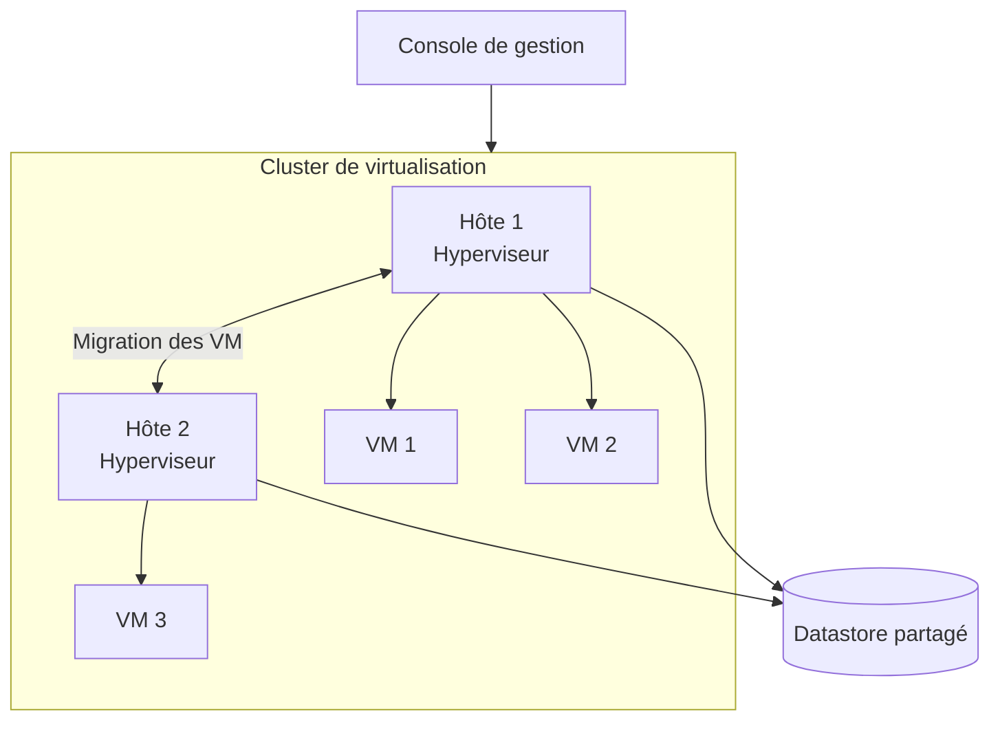

# Qu'est-ce que la virtualisation ?

## Objectif

Comprendre le principe de la virtualisation et son rôle dans la modernisation d'une infrastructure informatique.

!!! question "Problématique"
    Comment réduire le nombre de serveurs physiques tout en continuant à héberger l'ensemble des services de l'entreprise ?

## Définition

La **virtualisation** permet d'exécuter plusieurs environnements informatiques indépendants sur une même machine physique. Le serveur physique, appelé **hôte**, fournit ses ressources matérielles à un **hyperviseur**, qui les répartit entre plusieurs **machines virtuelles** (VM).

Chaque VM possède ses propres ressources virtuelles :

- un ou plusieurs processeurs virtuels (**vCPU**) ;
- de la mémoire vive virtuelle (**vRAM**) ;
- un ou plusieurs disques virtuels ;
- une ou plusieurs cartes réseau virtuelles ;
- son propre système d'exploitation et ses applications.

La virtualisation permet donc de remplacer plusieurs serveurs physiques dédiés par plusieurs serveurs virtuels hébergés sur un nombre réduit de machines physiques.

## Avantages et limites

### Avantages

- meilleure utilisation des ressources matérielles ;
- mutualisation du processeur, de la mémoire, du stockage et du réseau ;
- réduction du nombre de serveurs physiques ;
- diminution de la consommation électrique, de la climatisation et de l'espace occupé ;
- déploiement plus rapide de nouveaux serveurs ;
- infrastructure plus flexible ;
- sauvegarde, restauration, clonage et migration des VM facilités ;
- économies à long terme.

### Limites

- investissement initial dans le matériel, les licences et le stockage ;
- légère surcharge de traitement liée à l'hyperviseur, appelée **overhead** ;
- partage des ressources pouvant dégrader les performances en cas de mauvais dimensionnement ;
- concentration de plusieurs services sur un même hôte physique ;
- besoin de compétences, de supervision et de sauvegardes adaptées ;
- risque de dépendance envers une technologie ou un éditeur.

!!! warning "Point de vigilance"
    La panne d'un hôte peut rendre toutes ses VM indisponibles. Pour les services critiques, il faut prévoir plusieurs hôtes en cluster, de la redondance et des sauvegardes indépendantes.

## Les principaux types de virtualisation

| Besoin | Type de virtualisation |
| --- | --- |
| Héberger plusieurs serveurs | Virtualisation de serveurs |
| Mutualiser un espace de stockage | Virtualisation du stockage |
| Isoler des applications | Virtualisation d'applications ou conteneurisation |
| Virtualiser un poste utilisateur | Virtualisation des postes de travail, ou VDI |
| Virtualiser un réseau | Virtualisation réseau |
| Présenter des composants simulés à un OS | Virtualisation matérielle |

## Les hyperviseurs

L'**hyperviseur** est la couche logicielle qui crée, exécute, isole et administre les machines virtuelles. Il contrôle l'accès au matériel réel et répartit les ressources physiques entre les VM.

### Hyperviseur de type 1

Un hyperviseur de **type 1**, ou *bare metal*, s'exécute directement sur le matériel du serveur. Il est particulièrement adapté aux infrastructures d'entreprise et aux environnements de production.

Ses principaux avantages sont :

- de meilleures performances ;
- une isolation renforcée ;
- une administration centralisée ;
- des fonctions de cluster, de migration et de haute disponibilité ;
- une meilleure capacité à héberger de nombreuses VM.

### Hyperviseur de type 2

Un hyperviseur de **type 2** est une application installée sur un système d'exploitation hôte, comme Windows, Linux ou macOS.

Il est principalement utilisé pour :

- la formation et les travaux pratiques ;
- le développement et les tests ;
- l'exécution ponctuelle d'un autre système d'exploitation ;
- les petits laboratoires sur un poste personnel.

Il est facile à installer et généralement peu coûteux, mais ses performances et ses fonctions sont plus limitées. Son fonctionnement dépend également du système d'exploitation hôte.

| Hyperviseur | Type 1 | Type 2 |
| --- | :---: | :---: |
| Hyper-V | ✓ | — |
| VMware ESXi | ✓ | — |
| Proxmox VE | ✓ | — |
| KVM | ✓ | — |
| VirtualBox | — | ✓ |
| VMware Workstation | — | ✓ |
| Parallels Desktop | — | ✓ |

!!! note "À propos d'Hyper-V"
    Hyper-V est généralement classé comme hyperviseur de type 1 : une fois activé, sa couche d'hypervision s'exécute directement sur le matériel, même lorsqu'il est administré depuis Windows.

## Le cluster d'hyperviseurs

Un **cluster** est un regroupement de plusieurs hôtes, appelés **nœuds**, qui travaillent ensemble. Il améliore la disponibilité et facilite la répartition des charges.

Un cluster peut fournir :

- le **failover** : basculement ou redémarrage d'un service sur un autre nœud en cas de panne ;
- le **load balancing** : répartition de la charge entre les nœuds ;
- la migration à froid d'une VM arrêtée ;
- la migration à chaud d'une VM en fonctionnement ;
- la migration des disques virtuels vers un autre datastore ;
- la **haute disponibilité** (**HA**) des services.

## Concepts d'optimisation

| Concept | Définition |
| --- | --- |
| Concentration | Regroupement d'un grand nombre d'équipements dans un espace physique réduit. |
| Consolidation | Regroupement de plusieurs charges sur moins de serveurs afin d'améliorer leur taux d'utilisation. |
| Rationalisation | Suppression des équipements ou ressources devenus inutiles ou redondants. |
| Hyperconvergence | Regroupement du calcul, du stockage, du réseau et de la virtualisation dans une même architecture administrée comme un ensemble. |

## Critères de choix

Avant de choisir une solution de virtualisation, il faut :

1. identifier les services, leurs dépendances et leur criticité ;
2. mesurer les besoins en CPU, RAM, stockage et réseau ;
3. anticiper l'évolution de l'infrastructure ;
4. comparer les fonctions d'administration, de supervision et de sauvegarde ;
5. étudier le coût du matériel, des licences et du support ;
6. prévoir la disponibilité et le plan de reprise ;
7. limiter la dépendance à un fournisseur ou à un format propriétaire.

## Activité 3 — Synthèse rédigée

La virtualisation consiste à partager les ressources d'un serveur physique entre plusieurs machines virtuelles isolées. Un hyperviseur attribue à chaque VM du processeur, de la mémoire, du stockage et des interfaces réseau virtuelles. Cette technologie permet de réduire le nombre de serveurs physiques, de mieux utiliser le matériel et de déployer plus rapidement de nouveaux services. Elle facilite également les sauvegardes, les restaurations et les migrations. Elle demande cependant un dimensionnement précis, car les VM d'un même hôte se partagent ses ressources. Un hyperviseur de type 1 s'exécute directement sur le matériel : il offre de bonnes performances et convient à la production. Un hyperviseur de type 2 fonctionne sur un système d'exploitation existant : il est plus simple à installer, mais moins performant. Je recommande donc le type 1 pour les serveurs d'entreprise et le type 2 pour la formation, les tests et les laboratoires personnels.

## Glossaire associé

→ [Consulter le glossaire Virtualisation — Itération 1](../../pense-bete/glossaire/admin-systemes-virtualisation/it-1.md)
