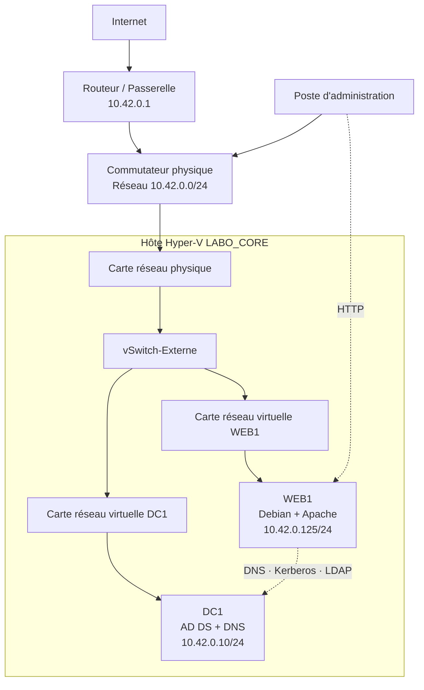
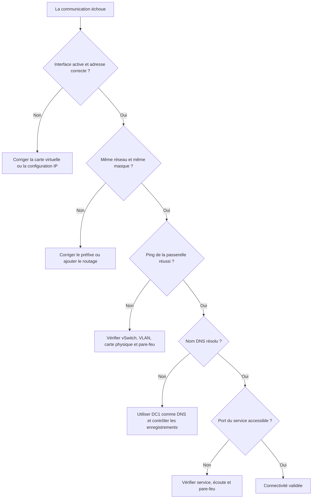
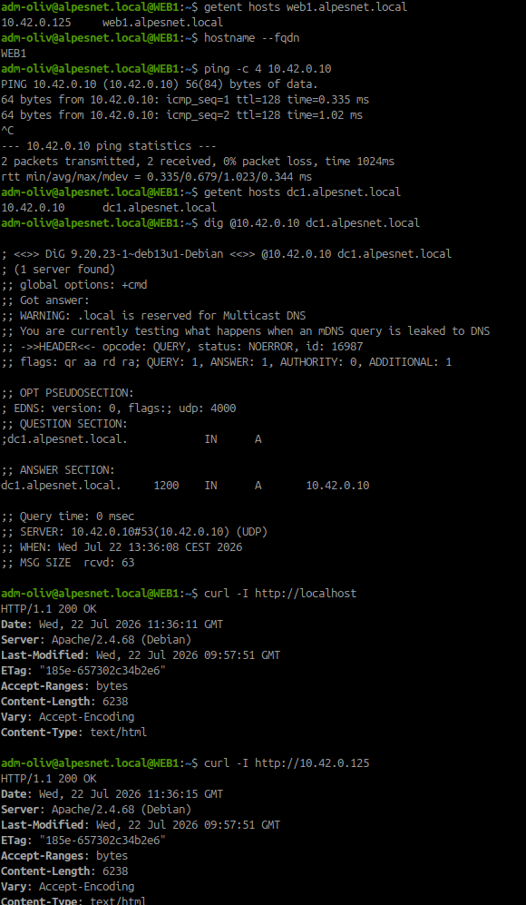
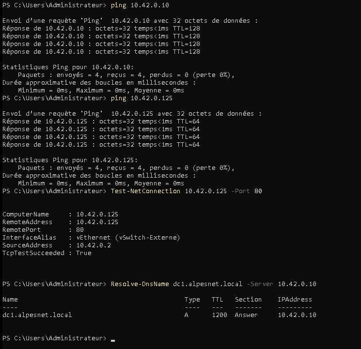
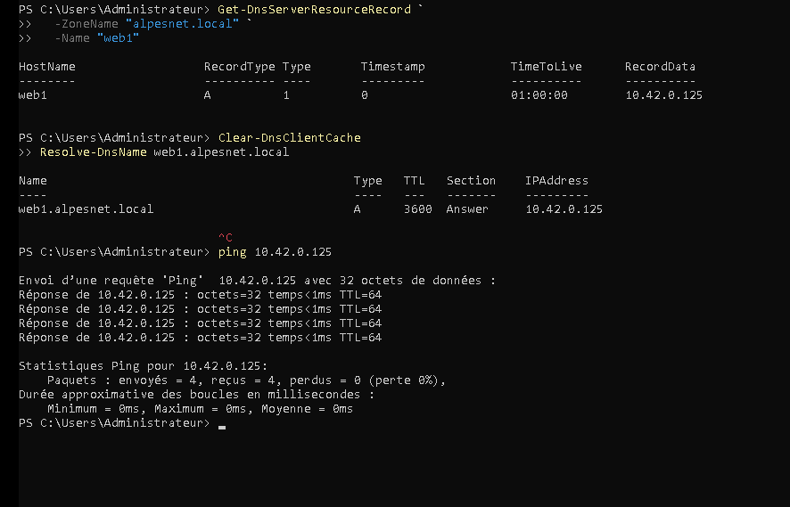
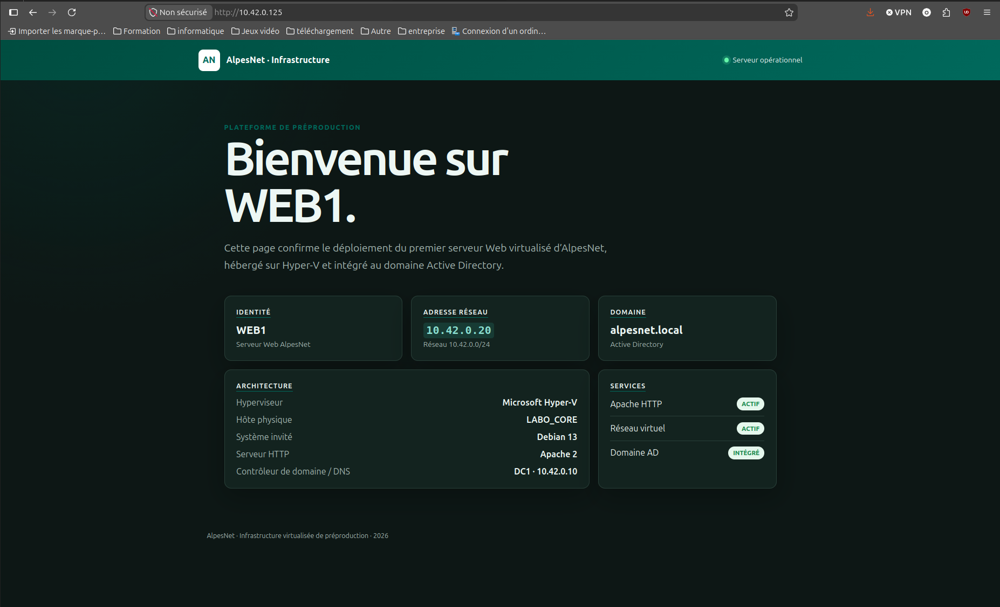

# Comment permettre aux machines virtuelles de communiquer ?

## Objectif

Concevoir, configurer et tester un réseau virtuel permettant aux machines virtuelles `DC1` et `WEB1` de communiquer avec le réseau AlpesNet.

!!! question "Problématique"
    Comment relier plusieurs machines virtuelles entre elles et au réseau physique tout en leur attribuant une configuration IP cohérente ?

    Les cartes réseau virtuelles des VM doivent être connectées au même commutateur Hyper-V externe et recevoir des paramètres compatibles avec le réseau `10.42.0.0/24`.

## Activité 1 — Concevoir le réseau virtuel

## Types de commutateurs Hyper-V

| Type | Communications autorisées | Usage principal |
|---|---|---|
| **Externe** | VM ↔ VM, VM ↔ hôte et VM ↔ réseau physique | Serveurs devant accéder au LAN, à Internet ou aux autres équipements |
| **Interne** | VM ↔ VM et VM ↔ système hôte | Laboratoire isolé restant accessible depuis l'hôte |
| **Privé** | VM ↔ VM uniquement | Réseau totalement isolé, sans accès à l'hôte ni au LAN |

Un commutateur virtuel Hyper-V est un commutateur Ethernet logiciel de couche 2. Il relie les interfaces virtuelles des VM et applique les règles de connexion ou d'isolation définies par l'administrateur.

### Choix pour AlpesNet

Le commutateur **externe** `vSwitch-Externe` répond au besoin actuel, car :

- `DC1` et `WEB1` doivent communiquer entre eux ;
- `WEB1` doit interroger le DNS et Active Directory de `DC1` ;
- les postes du LAN doivent accéder à la page Apache ;
- l'administrateur doit gérer les serveurs depuis le réseau physique ;
- les VM ont besoin d'un accès aux dépôts de mises à jour.

!!! note "Évolution possible"
    Pour une future production, le serveur Web pourrait être placé dans un VLAN ou une DMZ distincte. Les flux vers DC1 seraient alors limités aux protocoles réellement nécessaires par le pare-feu.

## Plan d'adressage

| Équipement | Interface | Adresse | Masque | Passerelle | DNS | Mode |
|---|---|---|---|---|---|---|
| Routeur | Interface LAN | `10.42.0.1` | `/24` | — | — | Fixe |
| `DC1` | Carte virtuelle Ethernet | `10.42.0.10` | `/24` | `10.42.0.1` | `10.42.0.10` | Fixe |
| `WEB1` | `eth0` | `10.42.0.125` | `/24` | `10.42.0.1` | `10.42.0.10` | Bail DHCP à réserver |
| Hôte `LABO_CORE` | `vEthernet (vSwitch-Externe)` | Adresse de gestion existante | `/24` | `10.42.0.1` | Selon le plan | À relever |

Le réseau `10.42.0.0/24` utilise le masque `255.255.255.0`. Les adresses utilisables vont de `10.42.0.1` à `10.42.0.254`, avec `10.42.0.255` comme adresse de diffusion.

!!! warning "Adresse de WEB1"
    `WEB1` utilise actuellement l'adresse DHCP `10.42.0.125`. Il faut créer une réservation associée à sa carte réseau virtuelle ou lui attribuer une configuration statique afin que l'adresse du serveur Web ne change pas.

## Schéma du réseau



## Activité 2 — Configurer le réseau

## Contrôler le commutateur Hyper-V

Sur `LABO_CORE`, dans PowerShell administrateur :

```powershell
Get-VMSwitch |
  Select-Object Name, SwitchType, NetAdapterInterfaceDescription

Get-VMNetworkAdapter -VMName "DC1","WEB1" |
  Select-Object VMName, Name, SwitchName, Status, MacAddress, IPAddresses
```

Les deux VM doivent utiliser `vSwitch-Externe`.

Si une VM est déconnectée ou reliée au mauvais commutateur :

```powershell
Connect-VMNetworkAdapter `
  -VMName "DC1" `
  -SwitchName "vSwitch-Externe"

Connect-VMNetworkAdapter `
  -VMName "WEB1" `
  -SwitchName "vSwitch-Externe"
```

### Vérifier le VLAN

Si le réseau n'utilise pas de VLAN sur les ports des VM, conserver les interfaces non marquées :

```powershell
Set-VMNetworkAdapterVlan -VMName "DC1" -Untagged
Set-VMNetworkAdapterVlan -VMName "WEB1" -Untagged

Get-VMNetworkAdapterVlan -VMName "DC1","WEB1"
```

Ne définir un identifiant VLAN que s'il est prévu dans le plan réseau et autorisé sur le port physique du commutateur.

## Configurer DC1

Sur DC1, relever d'abord l'interface :

```powershell
Get-NetAdapter
Get-NetIPConfiguration
```

La configuration attendue est :

```text
Adresse     : 10.42.0.10
Préfixe     : /24
Passerelle  : 10.42.0.1
DNS         : 10.42.0.10
```

Contrôle :

```powershell
ipconfig /all
Get-DnsClientServerAddress -AddressFamily IPv4
```

Comme DC1 héberge DNS, son client DNS doit pointer vers lui-même. Un éventuel redirecteur vers un DNS externe se configure dans le service DNS, et non directement sur la carte de DC1.

## Configurer WEB1

La configuration constatée est :

```text
Interface   : eth0
Adresse     : 10.42.0.125
Préfixe     : /24
Passerelle  : 10.42.0.1
DNS         : 10.42.0.10
Domaine     : alpesnet.local
```

Contrôle sous Debian :

```bash
ip -br address
ip route
cat /etc/resolv.conf
```

Résultats essentiels attendus :

```text
eth0    UP    10.42.0.125/24
default via 10.42.0.1 dev eth0
nameserver 10.42.0.10
search alpesnet.local
```

## Activité 3 — Vérifier la connectivité

## Tests depuis DC1

```powershell
ping 10.42.0.125
Test-NetConnection 10.42.0.125 -Port 80
Resolve-DnsName web1.alpesnet.local
```

Résultats attendus :

- `WEB1` répond au réseau, sous réserve que son pare-feu autorise ICMP ;
- `TcpTestSucceeded` vaut `True` pour le port 80 ;
- le DNS retourne `10.42.0.125` pour `web1.alpesnet.local`.

## Tests depuis WEB1

```bash
ping -c 4 10.42.0.10
getent hosts dc1.alpesnet.local
dig @10.42.0.10 dc1.alpesnet.local
curl -I http://localhost
curl -I http://10.42.0.125
```

Tests des services Active Directory :

```bash
realm list
kinit Administrateur@ALPESNET.LOCAL
klist
```

## Tests depuis le poste d'administration

```powershell
ping 10.42.0.10
ping 10.42.0.125
Test-NetConnection 10.42.0.125 -Port 80
Resolve-DnsName dc1.alpesnet.local -Server 10.42.0.10
```

Dans un navigateur :

```text
http://10.42.0.125
```

## Méthode de diagnostic



| Symptôme | Vérification | Correction possible |
|---|---|---|
| Aucune adresse sur la VM | `ip -br address` ou `ipconfig` | Reconnecter la carte au vSwitch et corriger DHCP/statique |
| Adresse `169.254.x.x` | Absence de réponse DHCP | Vérifier le réseau, le VLAN et le serveur DHCP |
| VM injoignable depuis le LAN | Type du vSwitch | Utiliser le commutateur externe |
| IP joignable, nom introuvable | DNS configuré sur la VM | Utiliser `10.42.0.10` et corriger la zone DNS |
| Deux adresses pour DC1 | `dig dc1.alpesnet.local` | Supprimer l'ancien enregistrement `10.40.0.10` |
| Ping refusé mais service accessible | Pare-feu ICMP | Tester directement le port utile avant de conclure à une panne |
| Apache local uniquement | `ss -lntp`, pare-feu et test du port 80 | Vérifier l'écoute sur toutes les interfaces et autoriser TCP/80 |
| Kerberos échoue | DNS et heure | Corriger le DNS, la résolution de DC1 et la synchronisation horaire |

## Tableau des résultats

| Source | Destination | Outil | Résultat attendu | Résultat constaté | Statut |
|---|---|---|---|---|---|
| `DC1` | `WEB1` | `ping` | Réponse reçue | 4 réponses, 0 % de perte | ☑ |
| `DC1` | `WEB1:80` | `Test-NetConnection` | TCP réussi | À compléter | ☐ |
| `WEB1` | `DC1` | `ping` | Réponse reçue | Réponses reçues, 0 % de perte | ☑ |
| `WEB1` | DNS de DC1 | `dig` | `10.42.0.10` | Adresse correcte retournée | ☑ |
| Poste admin | `WEB1:80` | Navigateur | Page AlpesNet affichée | Validé | ☑ |

## Preuves de fonctionnement

### Tests depuis WEB1



Depuis `WEB1`, les résultats confirment :

- la résolution de `web1.alpesnet.local` vers `10.42.0.125` ;
- la communication avec `DC1` à l'adresse `10.42.0.10` sans perte ;
- la résolution DNS de `dc1.alpesnet.local` ;
- une réponse HTTP `200 OK` en local et sur l'adresse réseau de WEB1.

### Tests depuis l'hôte Hyper-V



L'hôte `LABO_CORE`, à l'adresse `10.42.0.2`, communique avec `DC1` et `WEB1`. Le test TCP vers le port 80 de `WEB1` réussit et la résolution de `dc1.alpesnet.local` retourne la bonne adresse.

### Tests depuis DC1



DC1 possède l'enregistrement DNS `web1.alpesnet.local → 10.42.0.125`, le résout correctement et reçoit les quatre réponses ICMP de WEB1 sans perte.

### Validation depuis le navigateur



La page affichée depuis `http://10.42.0.125` complète les tests précédents. L'ensemble des captures prouve que l'hôte Hyper-V, DC1 et WEB1 communiquent sur le réseau virtuel et que le service Apache est accessible depuis le LAN.

## Documentation officielle

- [Microsoft Learn — Commutateur virtuel Hyper-V](https://learn.microsoft.com/fr-fr/windows-server/virtualization/hyper-v/virtual-switch)
- [Microsoft Learn — Créer et configurer un commutateur virtuel](https://learn.microsoft.com/fr-fr/windows-server/virtualization/hyper-v/get-started/create-a-virtual-switch-for-hyper-v-virtual-machines)
- [Microsoft Learn — Configurer un VLAN sur une carte virtuelle](https://learn.microsoft.com/powershell/module/hyper-v/set-vmnetworkadaptervlan?view=windowsserver2025-ps)
