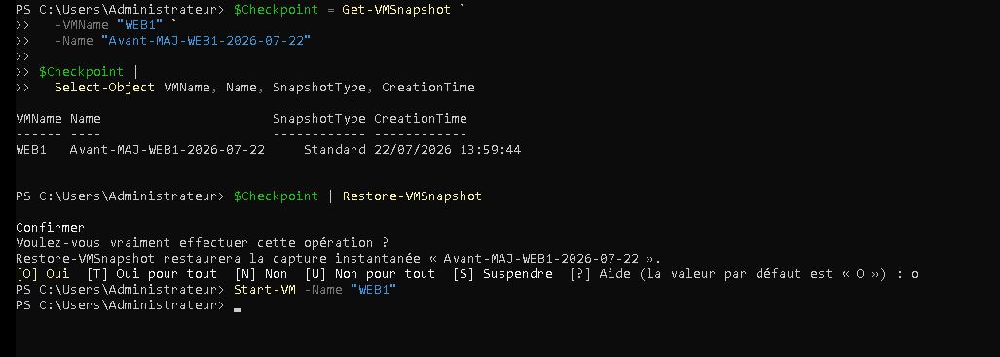
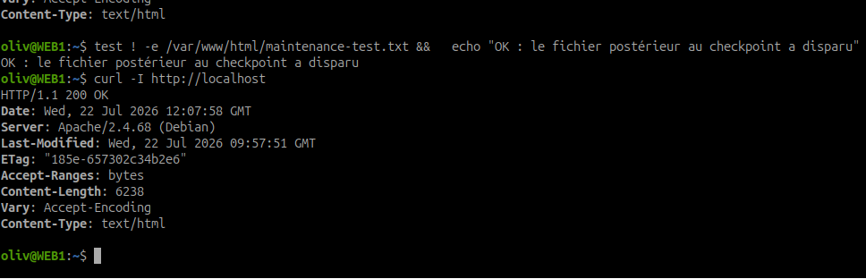

# Comment sécuriser une opération d'administration ?

## Contexte

Les équipes de développement doivent installer une nouvelle version de l'application métier sur `WEB1`. Avant l'intervention, la VM doit être placée dans un état permettant un retour arrière rapide si la mise à jour échoue.

!!! question "Problématique"
    Comment sécuriser une modification sur une machine virtuelle tout en conservant la possibilité de revenir rapidement à un état fonctionnel ?

    Un **point de contrôle de production** peut être créé juste avant l'intervention. Il facilite le retour arrière, mais reste temporaire et ne remplace pas une sauvegarde indépendante.

## Activité 1 — Sécuriser l'intervention

## Risques liés au déploiement

- incompatibilité entre la nouvelle application et le système ;
- erreur de configuration d'Apache ou de l'application ;
- suppression ou remplacement accidentel de fichiers ;
- modification incorrecte des droits et propriétaires ;
- indisponibilité du service Web ;
- corruption de données pendant la mise à jour ;
- changement du réseau, du pare-feu ou des dépendances ;
- impossibilité de réinstaller rapidement l'ancienne version.

Un point de contrôle est recommandé, car il permet de ramener rapidement les disques et la configuration de la VM à l'état enregistré avant l'intervention. Il réduit donc la durée d'indisponibilité lorsque la modification échoue.

## Fonctionnement d'un point de contrôle Hyper-V

Lors de sa création, Hyper-V conserve l'état du disque virtuel parent et écrit les nouvelles modifications dans un **disque différentiel** au format `.avhdx`. La configuration de la VM est également associée au point de contrôle.

| Type | Éléments enregistrés | Usage |
| --- | --- | --- |
| Point de contrôle de production | Disques et configuration dans un état cohérent ; utilise VSS sous Windows ou le gel du système de fichiers sous Linux | Modification d'une charge de production compatible |
| Point de contrôle standard | Disques, configuration, état des périphériques et mémoire de la VM | Laboratoire et tests uniquement |

Un point de production ne conserve pas l'état de la mémoire vive. Après restauration, le système redémarre comme après une remise sous tension cohérente.

### Limites

- il dépend des fichiers de la VM et du même espace de stockage ;
- il ne protège pas contre la panne ou la destruction du datastore ;
- les modifications postérieures au point sont perdues lors du retour arrière ;
- les disques différentiels consomment progressivement de l'espace ;
- une longue chaîne de checkpoints complique l'exploitation et augmente les risques ;
- certains disques partagés ou attachés directement ne sont pas compatibles ;
- un retour arrière peut perturber les applications distribuées ou les identités de machine ;
- ce mécanisme ne remplace jamais une sauvegarde indépendante.

!!! warning "WEB1 et le domaine"
    Le checkpoint doit être créé **après** l'intégration réussie de WEB1 au domaine. Restaurer un état trop ancien pourrait réintroduire une configuration DNS, Kerberos ou SSSD obsolète.

## Préparer l'intervention

Avant le checkpoint :

- confirmer que la page Apache fonctionne ;
- vérifier l'état de la VM et l'espace libre sur l'hôte ;
- noter la date, la version actuelle et le motif de l'intervention ;
- vérifier que la sauvegarde prévue par la politique d'exploitation existe ;
- prévenir les utilisateurs de l'intervention ;
- définir les critères de réussite et la procédure de retour arrière.

Sur `LABO_CORE` :

```powershell
Get-VM -Name "WEB1" |
  Select-Object Name, State, Status, Uptime

Get-Volume -DriveLetter C |
  Select-Object DriveLetter, Size, SizeRemaining

Get-VMSnapshot -VMName "WEB1"
```

## Créer le point de contrôle

Forcer l'utilisation d'un checkpoint de production sans repli automatique vers un checkpoint standard :

```powershell
Set-VM -Name "WEB1" -CheckpointType ProductionOnly
```

Créer le point :

```powershell
$CheckpointName = "Avant-MAJ-WEB1-2026-07-22"

Checkpoint-VM `
  -Name "WEB1" `
  -SnapshotName $CheckpointName
```

Vérifier sa création :

```powershell
Get-VMSnapshot `
  -VMName "WEB1" `
  -Name $CheckpointName |
  Select-Object VMName, Name, SnapshotType, CreationTime
```

Contrôler la présence du disque différentiel :

```powershell
Get-ChildItem "C:\Hyper-V\VHDX" -Filter "WEB1*.avhdx" |
  Select-Object Name, Length, CreationTime
```

### Informations à consigner

| Information | Valeur |
| --- | --- |
| VM protégée | `WEB1` |
| Type | Production uniquement |
| Nom | `Avant-MAJ-WEB1-2026-07-22` |
| Motif | Déploiement d'une nouvelle version de l'application |
| Date et heure | À relever dans `CreationTime` |
| État initial | Apache et intégration au domaine fonctionnels |
| Responsable | À compléter |

## Activité 2 — Tester une restauration

La manipulation utilise un fichier témoin sans modifier le réseau ni supprimer un composant nécessaire.

## 1. Créer une modification volontaire

Sur `WEB1`, après la création du checkpoint :

```bash
echo "Modification créée après le checkpoint" |
  sudo tee /var/www/html/maintenance-test.txt
```

Vérifier localement :

```bash
cat /var/www/html/maintenance-test.txt
curl http://localhost/maintenance-test.txt
```

Depuis l'hôte ou un poste du réseau :

```powershell
Invoke-WebRequest `
  -Uri "http://10.42.0.125/maintenance-test.txt" `
  -UseBasicParsing |
  Select-Object StatusCode, Content
```

Le code HTTP doit être `200` et le texte doit apparaître.

## 2. Restaurer le point de contrôle

!!! danger "Retour arrière réel"
    La restauration abandonne les changements réalisés après le checkpoint. Vérifier le nom de la VM et du point avant de confirmer. Cette procédure cible uniquement `WEB1` et le fichier témoin du laboratoire.

Sur `LABO_CORE`, vérifier une dernière fois la cible :

```powershell
$Checkpoint = Get-VMSnapshot `
  -VMName "WEB1" `
  -Name "Avant-MAJ-WEB1-2026-07-22"

$Checkpoint |
  Select-Object VMName, Name, SnapshotType, CreationTime
```

Restaurer le point :

```powershell
$Checkpoint | Restore-VMSnapshot
```

Confirmer uniquement si les informations affichées correspondent à `WEB1`. Un checkpoint de production restauré laisse normalement la VM arrêtée. La redémarrer :

```powershell
Start-VM -Name "WEB1"
```

## 3. Vérifier le retour arrière

Sur `WEB1` :

```bash
test ! -e /var/www/html/maintenance-test.txt &&
  echo "OK : le fichier postérieur au checkpoint a disparu"

systemctl status apache2 --no-pager
realm list
curl -I http://localhost
```

Depuis `LABO_CORE` :

```powershell
ping 10.42.0.125
Test-NetConnection 10.42.0.125 -Port 80
Resolve-DnsName web1.alpesnet.local
```

La restauration est validée lorsque :

- le fichier témoin créé après le checkpoint n'existe plus ;
- `WEB1` démarre correctement ;
- Apache retourne `HTTP 200` ;
- le domaine et le DNS restent opérationnels ;
- la page principale est accessible depuis le réseau.

## 4. Nettoyer après validation

Une fois le test terminé et l'état de WEB1 validé, supprimer le checkpoint devenu inutile :

```powershell
Remove-VMSnapshot `
  -VMName "WEB1" `
  -Name "Avant-MAJ-WEB1-2026-07-22"
```

Hyper-V fusionne alors le disque différentiel avec la chaîne de disques. Ne pas supprimer manuellement un fichier `.avhdx`.

Vérifier la disparition du checkpoint :

```powershell
Get-VMSnapshot -VMName "WEB1"
```

## Activité 3 — Point de contrôle ou sauvegarde ?

| Critère | Point de contrôle | Sauvegarde |
|---|---|---|
| Objectif | Retour arrière rapide après une modification | Restaurer après une perte, une panne ou un sinistre |
| Emplacement | Dépend généralement du stockage de la VM | Support ou dépôt indépendant |
| Contenu | État des disques et configuration à un instant donné | VM complète ou données selon la stratégie |
| Durée | Temporaire | Conservation définie par une politique de rétention |
| Rapidité du retour | Très rapide | Variable selon le volume et le support |
| Panne du datastore | Aucune protection | Protection si la copie est externalisée |
| Suppression de la VM | Peut être perdu avec elle | Permet la restauration si la copie est indépendante |
| Impact sur le stockage | Croissance des fichiers `.avhdx` | Espace consommé sur le dépôt de sauvegarde |
| Test nécessaire | Vérifier le retour arrière | Tester régulièrement une restauration complète |

## Choix selon l'opération

| Opération | Meilleure protection | Justification |
|---|---|---|
| Installation d'une mise à jour système | Checkpoint temporaire **et** sauvegarde récente | Retour rapide, avec protection indépendante en cas d'incident grave |
| Migration vers un nouvel hôte | Migration planifiée et sauvegarde vérifiée | Un checkpoint n'assure ni le transfert ni la protection contre la perte |
| Déploiement d'une application | Checkpoint de production temporaire et sauvegarde des données | Retour rapide sur la configuration et protection des données persistantes |
| Panne du stockage | Sauvegarde externalisée | Le checkpoint est perdu avec le datastore |
| Suppression accidentelle d'une VM | Sauvegarde indépendante | Le checkpoint associé peut être supprimé avec la VM |

## Synthèse pour le dossier d'exploitation

Avant le déploiement de la nouvelle version sur WEB1, un point de contrôle de production est créé afin de conserver un état cohérent des disques et de la configuration de la VM. Une modification volontaire est ensuite réalisée au moyen d'un fichier témoin publié par Apache. L'application du checkpoint doit supprimer cette modification et restaurer le fonctionnement initial du serveur. Les contrôles portent sur le démarrage de WEB1, Apache, le réseau, le DNS et l'intégration au domaine. Le checkpoint est supprimé après validation afin d'éviter la croissance durable des disques différentiels. Cette protection reste complémentaire d'une sauvegarde : elle accélère le retour arrière après une opération d'administration, mais ne protège ni contre la perte du stockage ni contre la suppression de la VM. Les sauvegardes doivent donc être indépendantes, conservées selon une politique définie et régulièrement testées.

## Tableau de preuve

| Étape | Preuve attendue | Résultat | Statut |
|---|---|---|---|
| Création | Sortie de `Get-VMSnapshot` | Point créé et fichier `.avhdx` présent | ☑ |
| Modification | Fichier accessible avec HTTP 200 | Code 200 et contenu du fichier reçus | ☑ |
| Restauration | Commande appliquée au bon checkpoint | `Avant-MAJ-WEB1-2026-07-22` restauré | ☑ |
| Contrôle | Fichier témoin absent | Fichier disparu après restauration | ☑ |
| Service | Apache et port 80 opérationnels | HTTP 200 et test TCP réussi | ☑ |
| Nettoyage | Aucun checkpoint temporaire restant | À compléter | ☐ |

## Captures et résultats obtenus

### Création et vérification du checkpoint


Le point `Avant-MAJ-WEB1-2026-07-22` est créé le 22 juillet 2026 à 13:59:44. La présence du fichier différentiel `WEB1_….avhdx` confirme que les nouvelles écritures de la VM sont séparées du disque parent.

!!! warning "Type réellement constaté"
    La sortie indique `SnapshotType: Standard`, malgré la demande `ProductionOnly`. Le test de laboratoire reste valide, mais ce résultat doit être consigné : un checkpoint standard capture un état moins adapté à une charge de production. Avant une utilisation réelle, vérifier `Get-VM WEB1 | Select CheckpointType` et installer ou contrôler les services d'intégration Hyper-V de Debian, notamment la prise en charge du gel du système de fichiers.

### Modification volontaire après le checkpoint


Le fichier `/var/www/html/maintenance-test.txt` est créé après le point de contrôle. Il contient le texte attendu et Apache le sert correctement en local.


Depuis DC1, `Invoke-WebRequest` retourne le code `200` et le contenu du fichier. La modification est donc confirmée depuis une autre machine du réseau.

### Application du point de contrôle



Le checkpoint ciblé est contrôlé avant l'exécution de `Restore-VMSnapshot`. Après confirmation, WEB1 est redémarré sur l'état enregistré.

### Vérification du retour arrière



Le fichier créé après le checkpoint a disparu. Apache répond toujours avec le code `HTTP 200`, ce qui confirme le retour à un état fonctionnel.


Après correction de l'adresse restaurée, `WEB1` utilise de nouveau `10.42.0.125`. DC1 résout `web1.alpesnet.local`, reçoit les réponses ICMP sans perte et accède au port TCP 80.

### Conclusion du test

La restauration a rempli son objectif : la modification volontaire a été annulée et le service Web est resté exploitable après le retour arrière. Le test met également en évidence deux précautions importantes : vérifier le type effectif du checkpoint et contrôler les paramètres réseau restaurés avant de remettre la VM en service.

## Documentation officielle

- [Microsoft Learn — Utiliser les points de contrôle Hyper-V](https://learn.microsoft.com/fr-fr/windows-server/virtualization/hyper-v/checkpoints)
- [Microsoft Learn — Méthodes de sauvegarde Hyper-V](https://learn.microsoft.com/fr-fr/windows-server/virtualization/hyper-v/backup-approaches)
- [Microsoft Learn — Résoudre les problèmes de checkpoints et de disques AVHDX](https://learn.microsoft.com/troubleshoot/windows-server/virtualization/hyper-v-snapshots-checkpoints-differencing-disks)
