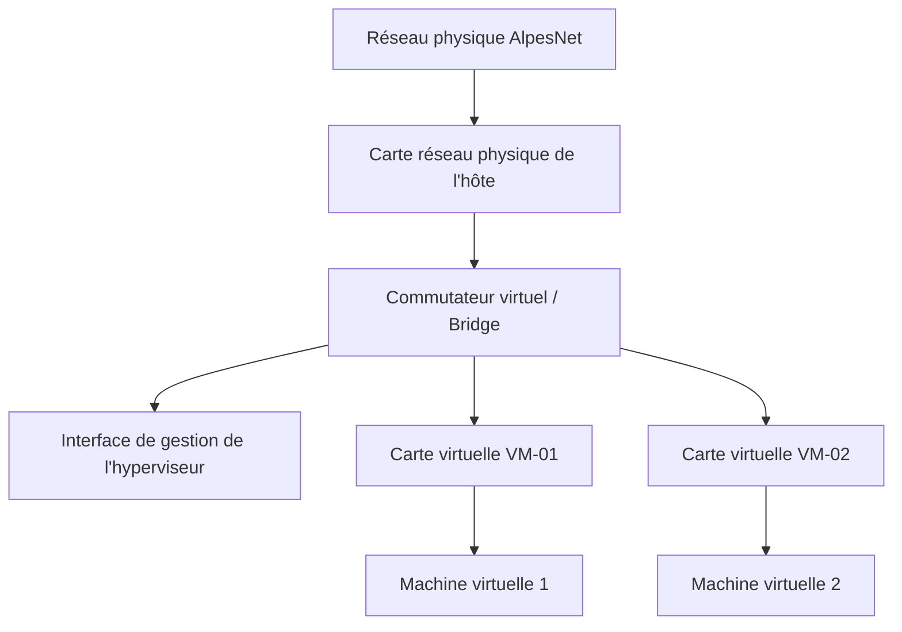
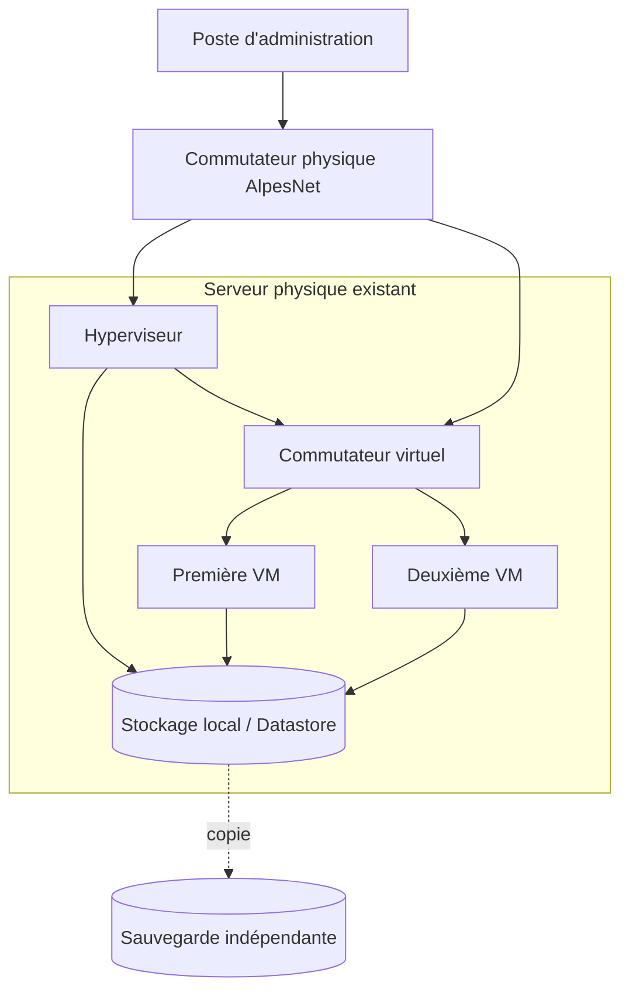

# Itération 2 — Déploiement de machines virtuelles

## Synthèse

Cette itération marque le passage de la conception à la mise en œuvre. Après avoir validé le principe de la virtualisation, l'équipe Infrastructure d'AlpesNet réutilise le **serveur physique existant** afin de construire une plateforme de préproduction opérationnelle.

Le travail consiste à installer un hyperviseur, créer les premières machines virtuelles, dimensionner leurs ressources, configurer leur connectivité réseau et sécuriser les opérations d'administration au moyen de points de restauration.

!!! question "Problématique"
    Comment déployer une infrastructure virtualisée opérationnelle capable d'héberger les premiers services d'AlpesNet ?

    Il faut préparer le serveur physique, y installer un hyperviseur, créer et configurer les VM selon un cahier des charges, construire le réseau virtuel, tester les communications et documenter chaque opération.

## Situation professionnelle

L'étude réalisée pendant l'itération 1 a confirmé que la virtualisation pouvait répondre aux besoins de modernisation d'AlpesNet. Avant de migrer les serveurs de production, la solution doit être déployée et validée dans une infrastructure de **préproduction**.

Cette étape doit permettre de :

- vérifier la compatibilité du serveur physique avec l'hyperviseur retenu ;
- valider la procédure d'installation ;
- tester la création et le dimensionnement des VM ;
- vérifier les communications sur le réseau virtuel ;
- expérimenter un retour arrière sans affecter la production ;
- constituer une documentation réutilisable lors du futur déploiement.

!!! warning "Réutilisation du serveur existant"
    Avant toute installation, les données et la configuration encore utiles doivent être sauvegardées. Il faut également vérifier que le serveur peut être réinstallé, car le déploiement d'un hyperviseur de type 1 peut écraser le système et les partitions présents.

## Objectifs de l'itération

À l'issue de cette itération, je dois être capable de :

| Compétence attendue | Validation |
|---|---|
| Déployer un hyperviseur sur un serveur physique | CA-04 |
| Déployer une VM à partir d'un support d'installation | CA-05 |
| Configurer les ressources d'une VM selon un cahier des charges | CA-06 |
| Configurer un réseau virtuel permettant la communication entre plusieurs VM | CA-07 |
| Créer un point de restauration avant une opération d'administration | CA-08 |
| Expliquer la différence entre un point de restauration et une sauvegarde | CA-08 |

## Déroulement général


### 1. Préparer le serveur physique

Avant l'installation, il faut relever et vérifier :

- le modèle du serveur et son numéro d'inventaire ;
- le nombre de processeurs et de cœurs ;
- la quantité de RAM disponible ;
- les contrôleurs et capacités de stockage ;
- les interfaces réseau et leurs débits ;
- la prise en charge de la virtualisation matérielle Intel VT-x ou AMD-V ;
- l'ordre de démarrage et les paramètres BIOS/UEFI ;
- la compatibilité du matériel avec l'hyperviseur choisi ;
- la présence d'une sauvegarde des données à conserver.

### 2. Déployer l'hyperviseur

La procédure générale consiste à :

1. télécharger l'image ISO depuis la source officielle ;
2. vérifier son intégrité à l'aide de son empreinte ;
3. créer un support USB amorçable ou utiliser une console distante ;
4. démarrer le serveur sur le support d'installation ;
5. sélectionner le disque système et installer l'hyperviseur ;
6. définir les paramètres régionaux et le compte d'administration ;
7. configurer l'adresse IP, le masque, la passerelle et le DNS de gestion ;
8. appliquer les mises à jour disponibles ;
9. tester l'accès à l'interface d'administration.

!!! tip "Bonne pratique"
    Le réseau d'administration de l'hyperviseur doit être identifié et, si possible, séparé du réseau utilisé par les machines virtuelles.

### 3. Créer les machines virtuelles

Chaque VM est créée à partir d'un support d'installation, généralement une image ISO. Sa configuration doit respecter le cahier des charges sans consommer inutilement les ressources de l'hôte.

| Paramètre | Rôle | Point de vigilance |
|---|---|---|
| Nom de la VM | Identifier clairement la machine et sa fonction | Utiliser une convention de nommage cohérente |
| vCPU | Fournir la puissance de calcul | Éviter une surallocation excessive |
| vRAM | Fournir la mémoire de travail | Conserver suffisamment de RAM pour l'hyperviseur |
| Disque virtuel | Accueillir l'OS, les applications et les données | Prévoir la croissance et les performances |
| Carte réseau virtuelle | Relier la VM au réseau | Sélectionner le bon réseau virtuel ou VLAN |
| Image ISO | Installer le système invité | Vérifier sa provenance et son intégrité |
| Ordre de démarrage | Choisir le support utilisé au démarrage | Retirer ou déconnecter l'ISO après installation |

### 4. Configurer le réseau virtuel

Le réseau virtuel relie les cartes réseau virtuelles des VM aux interfaces physiques de l'hôte. Selon l'hyperviseur, le composant central est appelé **vSwitch**, **bridge** ou commutateur virtuel.



Les tests doivent au minimum vérifier :

- l'adresse IP et la route par défaut de chaque VM ;
- la communication entre les VM ;
- la communication avec la passerelle ;
- la résolution DNS ;
- l'accès aux services attendus ;
- l'absence d'accès non autorisé entre réseaux séparés.

Exemples de commandes de contrôle :

```bash
ip addr
ip route
ping -c 4 ADRESSE_IP
nslookup NOM_DNS
```

Sous Windows, les commandes équivalentes sont notamment `ipconfig /all`, `ping`, `tracert`, `nslookup` et `Test-NetConnection`.

## Point de restauration et sauvegarde

Un **point de restauration**, aussi appelé snapshot ou instantané, enregistre l'état d'une VM à un moment précis. Il est utile avant une mise à jour, l'installation d'un logiciel ou une modification risquée.

Procédure générale :

1. vérifier l'état et l'espace disponible du stockage ;
2. nommer le snapshot avec la date et la raison de sa création ;
3. réaliser le point de restauration avant la modification ;
4. effectuer et tester l'opération d'administration ;
5. revenir au snapshot uniquement en cas d'échec ;
6. supprimer ou consolider le snapshot lorsqu'il n'est plus nécessaire.

| Critère | Point de restauration | Sauvegarde |
|---|---|---|
| Objectif | Retour arrière rapide avant une modification | Restauration après perte, panne ou sinistre |
| Dépendance | Reste généralement dépendant de la VM et de son stockage | Doit être conservée sur un support indépendant |
| Durée de conservation | Courte et temporaire | Définie par une politique de rétention |
| Protection contre la panne du stockage | Non | Oui, si la copie est externalisée |
| Usage | Administration et tests | Continuité, reprise et conservation des données |

!!! danger "Un snapshot n'est pas une sauvegarde"
    Si le datastore ou l'hôte est perdu, le snapshot peut disparaître avec la VM. Une véritable sauvegarde doit être indépendante, protégée et régulièrement testée par une restauration.

## Architecture de préproduction attendue



Cette plateforme de préproduction permet de valider le déploiement sur le serveur existant. Elle ne constitue pas encore une architecture de production hautement disponible : avec un seul hôte, une panne physique interrompt toutes les VM.
