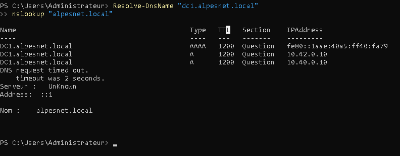
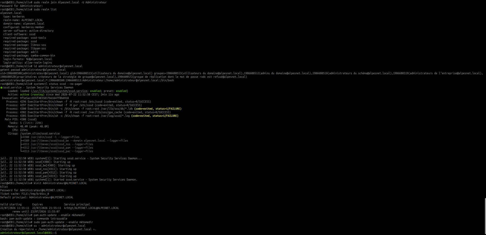

# Intégrer WEB1 au domaine et déployer Apache

## Paramètres utilisés

| Élément | Valeur |
|---|---|
| Domaine | `alpesnet.local` |
| Contrôleur de domaine et DNS | `DC1` — `10.42.0.10` |
| Serveur Web | `WEB1` — `10.42.0.125` |
| Réseau | `10.42.0.0/24` |
| Serveur HTTP | Apache 2 |

## 1. Vérifier le nom et le réseau

Sur Debian :

```bash
sudo hostnamectl set-hostname WEB1
hostnamectl
ip address
ip route
```

L'adresse actuellement attribuée à `WEB1` est `10.42.0.125/24`. Pour éviter qu'elle change, elle devra être configurée en adresse fixe ou réservée dans le serveur DHCP. Son DNS doit pointer vers `10.42.0.10`.

```bash
cat /etc/resolv.conf
ping -c 4 10.42.0.10
getent hosts dc1.alpesnet.local
```

Le fichier doit utiliser le DNS du domaine :

```text
nameserver 10.42.0.10
search alpesnet.local
```

!!! warning
    Ne pas modifier durablement `/etc/resolv.conf` s'il est généré par NetworkManager ou `systemd-resolved`. Configurer le DNS dans le gestionnaire réseau utilisé par Debian.

## 2. Vérifier l'heure

Kerberos exige une heure cohérente entre `WEB1` et `DC1`.

```bash
timedatectl
sudo timedatectl set-ntp true
```

## 3. Installer les composants du domaine

```bash
sudo apt update
sudo apt install -y \
  realmd sssd-ad sssd-tools adcli \
  krb5-user libnss-sss libpam-sss \
  samba-common-bin packagekit
```

Lorsque l'installation demande le domaine Kerberos, saisir :

```text
ALPESNET.LOCAL
```

## 4. Découvrir et rejoindre le domaine

```bash
realm discover alpesnet.local
sudo realm join alpesnet.local -U Administrateur
```

Saisir le mot de passe du compte `ALPESNET\Administrateur`, puis vérifier :

```bash
realm list
id administrateur@alpesnet.local
getent passwd administrateur@alpesnet.local
```

## 5. Autoriser les utilisateurs nécessaires

Pour le laboratoire, autoriser temporairement tous les comptes du domaine :

```bash
sudo realm permit --all
```

En production, préférer un groupe AD dédié :

```bash
sudo realm deny --all
sudo realm permit -g admins-linux@alpesnet.local
```

Activer la création automatique des dossiers personnels :

```bash
sudo pam-auth-update --enable mkhomedir
```

## 6. Installer Apache

```bash
sudo apt install -y apache2
sudo systemctl enable --now apache2
sudo systemctl status apache2 --no-pager
```

Définir le nom complet du serveur pour supprimer l'avertissement Apache `AH00558` :

```bash
echo "ServerName web1.alpesnet.local" | sudo tee /etc/apache2/conf-available/servername.conf
sudo a2enconf servername
sudo apache2ctl configtest
sudo systemctl reload apache2
```

Test local :

```bash
curl -I http://localhost
```

## 7. Copier la page stylée

Télécharger le modèle :

[Télécharger la page WEB1](../../assets/files/admin-systemes-virtualisation/it-2/web1/index.html)

Depuis le poste contenant le fichier :

```bash
scp index.html utilisateur@10.42.0.125:/tmp/index.html
```

Sur `WEB1`, sauvegarder la page Apache par défaut puis publier le modèle :

```bash
sudo cp /var/www/html/index.html /var/www/html/index.html.orig
sudo install -o root -g root -m 0644 /tmp/index.html /var/www/html/index.html
```

## 8. Vérifier la publication

```bash
sudo apache2ctl configtest
sudo systemctl reload apache2
curl -I http://localhost
curl http://localhost | head
```

Depuis un poste du réseau, ouvrir :

```text
http://10.42.0.125
```

Une fois le DNS configuré, utiliser par exemple :

```text
http://web1.alpesnet.local
```

## 9. Contrôles finaux

- [ ] `WEB1` utilise `10.42.0.10` comme DNS.
- [ ] `realm list` affiche `alpesnet.local`.
- [ ] Un compte du domaine est reconnu par `id`.
- [ ] Apache est actif et activé au démarrage.
- [ ] La page répond localement et depuis le réseau.
- [ ] Le nom `web1.alpesnet.local` se résout correctement.

## Preuves de validation

### Résolution DNS de DC1



La capture confirme que `dc1.alpesnet.local` est résolu vers l'adresse actuelle `10.42.0.10`. Elle fait également apparaître un ancien enregistrement `10.40.0.10`, à supprimer de la zone DNS afin d'éviter une réponse incorrecte de certains clients.

### Intégration de Debian dans Active Directory



Les commandes `realm list`, `id`, `getent`, `systemctl status sssd`, `kinit` et `klist` démontrent que :

- `WEB1` est membre du domaine `alpesnet.local` ;
- SSSD communique avec Active Directory ;
- le compte `Administrateur@ALPESNET.LOCAL` est reconnu ;
- un ticket Kerberos valide est obtenu ;
- une session de domaine peut créer son répertoire personnel.

### Publication de la page Apache


La page est accessible depuis un navigateur à l'adresse `http://10.42.0.125`. Cette validation démontre le bon fonctionnement de la VM, du réseau virtuel et du service Apache.
