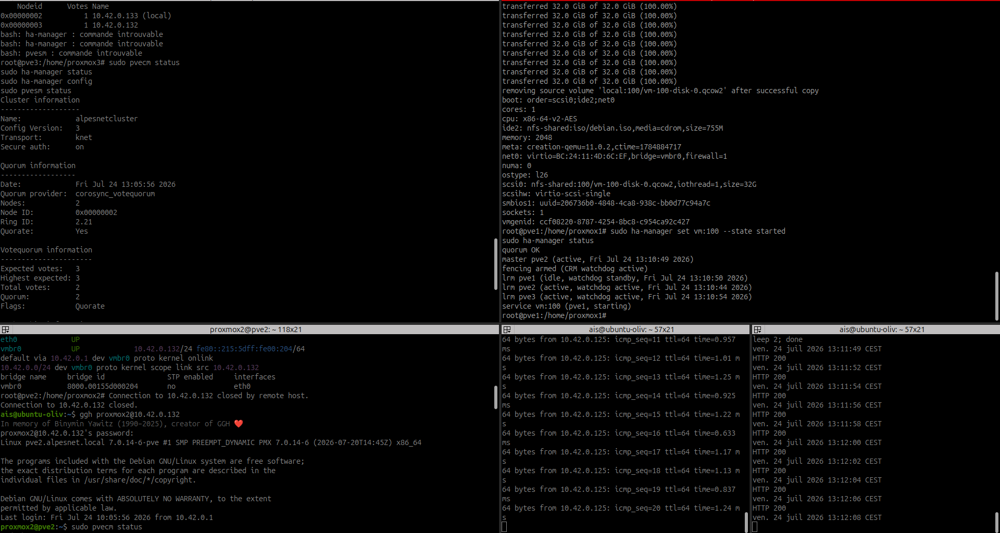
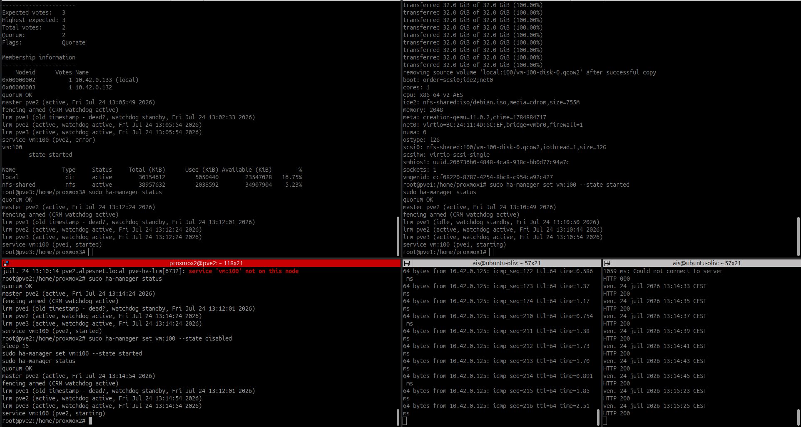
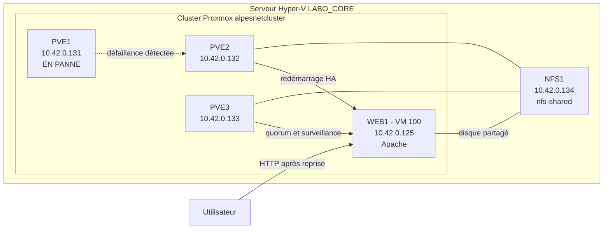

# Comment assurer automatiquement la continuité de service ?

## Contexte

Les opérations de maintenance peuvent être réalisées grâce à la migration à
chaud. Une panne matérielle, en revanche, ne peut pas toujours être anticipée.
AlpesNet doit donc étudier un mécanisme capable de redémarrer automatiquement
un service critique sur un autre hyperviseur.

Dans le laboratoire, la haute disponibilité sera testée avec :

| Élément | Configuration |
|---|---|
| Cluster | `alpesnetcluster` |
| Nœuds | `pve1`, `pve2`, `pve3` |
| Stockage partagé | `nfs-shared` sur `NFS1` (`10.42.0.134`) |
| Machine protégée | `WEB1` — VM `100` |
| Service contrôlé | Apache — `http://10.42.0.125` |

!!! warning "Limite du laboratoire"
    Les trois nœuds Proxmox et `NFS1` sont des machines virtuelles hébergées sur
    le même serveur Hyper-V `LABO_CORE`. La manipulation protège `WEB1` contre
    l'arrêt d'un nœud Proxmox, mais pas contre la panne du serveur physique
    Hyper-V, du réseau commun ou de `NFS1`.

## Activité 1 — Étudier la haute disponibilité

### Qu'est-ce que la haute disponibilité ?

La **haute disponibilité**, ou **HA**, est un mécanisme de surveillance qui
redémarre automatiquement une machine virtuelle sur un autre nœud lorsqu'un
nœud du cluster devient indisponible.

Dans Proxmox VE, les gestionnaires HA surveillent l'état des nœuds et des
ressources protégées. Si `pve1` tombe en panne alors qu'il exécute `WEB1`, le
cluster peut relancer la VM `100` sur `pve2` ou `pve3`.

La HA réduit la durée d'interruption, mais ne garantit pas un service sans
aucune coupure : la panne doit être détectée, puis la VM doit redémarrer et
Apache doit redevenir disponible.

### Limites

- la HA ne remplace pas une sauvegarde ;
- elle ne protège pas contre la corruption du système ou des données ;
- le stockage partagé et le réseau restent des dépendances critiques ;
- le cluster doit conserver le **quorum** (majorité des votes) ;
- une capacité suffisante doit rester disponible sur les autres nœuds ;
- une application non redondée subit une interruption pendant le redémarrage ;
- une mauvaise configuration peut provoquer un **split-brain** (des nœuds
  isolés prennent des décisions contradictoires).

### Migration à chaud ou haute disponibilité ?

| Mécanisme | Migration à chaud | Haute disponibilité |
|---|---|---|
| Déclenchement | Action planifiée par l'administrateur | Réaction automatique à une panne |
| État du nœud source | Disponible | Indisponible ou considéré en panne |
| Traitement de la VM | Transfert de la mémoire et de l'exécution | Redémarrage sur un autre nœud |
| Interruption | Très faible | Présente pendant la détection et le redémarrage |
| Usage | Maintenance planifiée | Défaillance imprévue |

### Prérequis

- au moins trois nœuds pour conserver facilement une majorité après la perte
  d'un nœud ;
- des nœuds membres du même cluster et capables de communiquer ;
- une heure synchronisée sur tous les nœuds ;
- un quorum opérationnel ;
- un mécanisme de **fencing** (mise à l'écart certaine d'un nœud défaillant)
  assuré par le cluster Proxmox ;
- un stockage partagé accessible depuis tous les nœuds ;
- une configuration réseau compatible sur tous les nœuds, notamment le même
  pont `vmbr0` ;
- suffisamment de processeur et de mémoire sur les nœuds restants ;
- une VM dont tous les disques nécessaires sont stockés sur `nfs-shared`.

### Services à protéger en priorité

Dans l'environnement actuel, `WEB1` est la seule VM applicative présente dans
le cluster. Elle est donc protégée en priorité afin de maintenir le site Web
d'AlpesNet.

Dans une infrastructure de production, l'ordre de priorité serait :

1. les contrôleurs de domaine et le DNS ;
2. les bases de données et applications métier ;
3. les serveurs Web exposés aux utilisateurs ;
4. les serveurs de fichiers et de ticketing.

La protection d'un contrôleur de domaine doit toutefois être complétée par un
second contrôleur de domaine : la HA d'une VM ne remplace pas la redondance du
service Active Directory.

## Activité 2 — Protéger WEB1

### 1. Contrôler les prérequis

Depuis un nœud Proxmox :

```bash
pvecm status
pvecm nodes
pvesm status
qm config 100
```

Points attendus :

- trois nœuds en ligne ;
- quorum acquis ;
- `nfs-shared` actif ;
- disque de la VM `100` présent sur `nfs-shared` ;
- carte réseau connectée à un pont disponible sur les trois nœuds.

Tester également la page :

```bash
curl -I http://10.42.0.125
```

### 2. Ajouter WEB1 à la haute disponibilité

La commande peut être exécutée depuis n'importe quel nœud du cluster :

```bash
ha-manager add vm:100 --state started
```

Contrôler la configuration :

```bash
ha-manager config
ha-manager status
```

La ressource `vm:100` doit apparaître dans l'état demandé `started`.

La même opération est possible dans l'interface :

1. ouvrir **Datacenter → HA** ;
2. choisir **Add** ;
3. sélectionner la VM `100 (WEB1)` ;
4. choisir l'état demandé **Started** ;
5. valider.

!!! danger "Ne pas lancer immédiatement un arrêt brutal"
    Vérifier d'abord le quorum, le stockage partagé et la présence des trois
    nœuds. `NFS1`, `pve2` et `pve3` doivent rester démarrés pendant le test.

### 3. Préparer le relevé de test

Avant la panne, noter :

```bash
qm status 100
ha-manager status
date
```

### Preuve — État avant la panne


La capture confirme qu'avant le test :

- `WEB1` est active ;
- la ressource `vm:100` est démarrée sur `pve1` ;
- les trois gestionnaires locaux HA sont présents ;
- le quorum et le watchdog sont opérationnels.

Depuis un poste client, lancer une surveillance continue :

```bash
ping 10.42.0.125
```

Dans un second terminal :

```bash
while true; do
  date
  curl -sS -o /dev/null -w 'HTTP %{http_code}\n' http://10.42.0.125
  sleep 2
done
```

Ces commandes permettent de mesurer la période durant laquelle WEB1 ne répond
plus.

## Activité 3 — Simuler la panne d'un nœud

### 1. Identifier le nœud qui exécute WEB1

```bash
ha-manager status
```

Le résultat indique le nœud sur lequel `vm:100` est active.

### 2. Provoquer la panne simulée

Dans ce laboratoire imbriqué, arrêter brutalement **uniquement la VM Hyper-V
correspondant au nœud Proxmox qui exécute WEB1**. Ne pas arrêter `LABO_CORE`,
car il héberge tout le laboratoire.

Exemple si WEB1 fonctionne sur `PVE1`, depuis PowerShell sur Hyper-V :

```powershell
Stop-VM -Name "PVE1" -TurnOff
```

`-TurnOff` simule une coupure électrique. Cette commande ne doit être utilisée
qu'après avoir vérifié que WEB1 est gérée par la HA.

### Preuve — Arrêt de PVE1 et maintien du quorum



Après l'arrêt de `pve1`, `pve2` et `pve3` restent membres du cluster. Deux votes
sur trois sont disponibles : le cluster conserve donc le quorum et peut prendre
en charge la ressource HA.

### 3. Observer le comportement

Depuis `pve2` ou `pve3` :

```bash
pvecm status
ha-manager status
journalctl -u pve-ha-crm -u pve-ha-lrm --since "-10 minutes" --no-pager
```

Le résultat attendu est :

1. `pve1` devient indisponible ;
2. les deux nœuds restants conservent le quorum ;
3. le cluster déplace la ressource HA ;
4. `WEB1` redémarre sur `pve2` ou `pve3` ;
5. l'adresse `10.42.0.125` et la page Apache redeviennent accessibles.

Contrôler :

```bash
ping -c 4 10.42.0.125
curl -I http://10.42.0.125
ha-manager status
```

### Incident rencontré et correction

Le premier essai n'a pas permis de redémarrer WEB1. Le journal HA indiquait :

```text
volume 'local:100/vm-100-disk-0.qcow2' does not exist
service vm:100 is in an error state
```

Le disque système était encore stocké localement sur `pve1`. Le stockage NFS
était bien partagé, mais seule l'image ISO y était enregistrée. Après avoir
remis la configuration de la VM sur `pve1`, le disque a été déplacé :

```bash
qm move_disk 100 scsi0 nfs-shared --delete 1
```

La configuration obtenue confirme le stockage partagé :

```text
scsi0: nfs-shared:100/vm-100-disk-0.qcow2
```

Cette correction était indispensable : un nœud survivant ne peut pas redémarrer
une VM dont le disque se trouve sur le stockage local du nœud en panne.

### Preuve — Reprise automatique de WEB1



La capture de synthèse montre :

- `pve1` déclaré indisponible ;
- le quorum maintenu par `pve2` et `pve3` ;
- le disque de 32 Gio transféré vers `nfs-shared` ;
- la ressource `vm:100` reprise par `pve2` ;
- le retour des réponses ICMP ;
- le retour du code `HTTP 200` fourni par Apache.

Le test valide donc le redémarrage automatique de WEB1 après la perte d'un nœud
Proxmox. Une interruption temporaire a été observée pendant la détection de la
panne et le redémarrage de la VM.

### 4. Relever les résultats

| Contrôle | Résultat à compléter |
|---|---|
| Nœud initial de WEB1 | `pve1` |
| Heure de la panne | Environ `13:12` |
| Nœud de redémarrage | `pve2` |
| Heure du retour d'Apache | Environ `13:14` |
| Temps d'interruption | Quelques minutes, incluant la détection et le redémarrage |
| Quorum conservé | Oui — deux votes sur trois |
| Code HTTP après reprise | `200` |
| Événements observés | PVE1 déclaré mort, affectation de `vm:100` à PVE2, démarrage d'Apache |

### Analyse attendue

La continuité de service est considérée comme assurée si WEB1 redémarre
automatiquement sur un autre nœud sans intervention manuelle. Une interruption
temporaire reste normale : la HA fournit un **redémarrage automatique**, et non
une exécution simultanée de la même VM.

Les améliorations possibles sont :

- héberger les nœuds Proxmox sur plusieurs serveurs physiques ;
- rendre le stockage NFS redondant ;
- séparer les réseaux de gestion, de cluster, de stockage et des VM ;
- ajouter de la mémoire pour absorber la perte d'un nœud ;
- superviser le cluster et envoyer des alertes ;
- déployer plusieurs serveurs Web derrière un répartiteur de charge ;
- conserver des sauvegardes indépendantes du stockage partagé.

## Schéma du fonctionnement en cas de panne



## Captures à intégrer

- configuration HA de `vm:100` ;
- état du cluster avant la panne ;
- nœud `pve1` hors ligne ;
- redémarrage de WEB1 sur `pve2` ou `pve3` ;
- page Apache de nouveau accessible ;
- événements HA affichés dans Proxmox.

## Validation

- [ ] Je distingue la migration à chaud de la haute disponibilité.
- [ ] Je connais les prérequis et les limites de la HA.
- [x] La VM `100` est gérée par la HA.
- [x] Le cluster conserve le quorum après la perte d'un nœud.
- [x] WEB1 redémarre automatiquement sur un autre nœud.
- [x] La page Apache redevient accessible.
- [x] Le temps d'interruption et les événements sont consignés.
