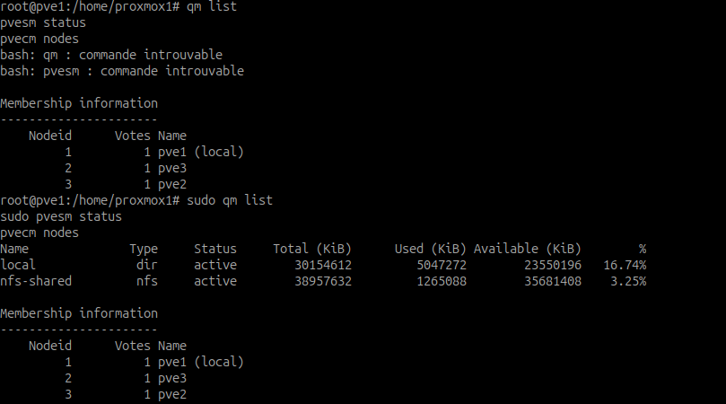
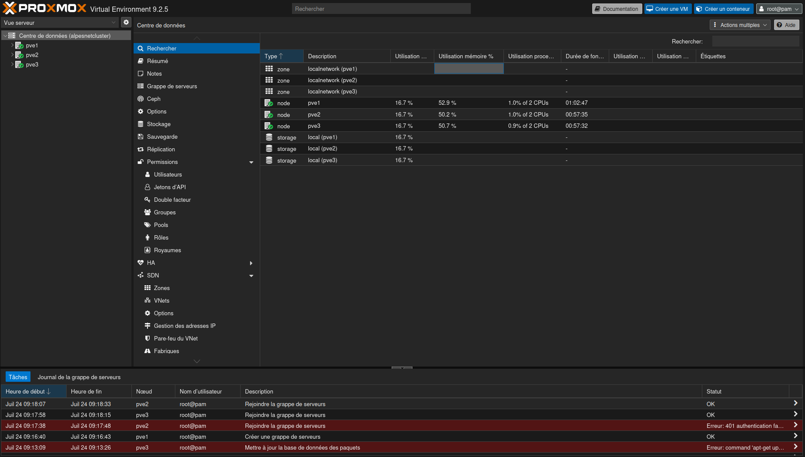
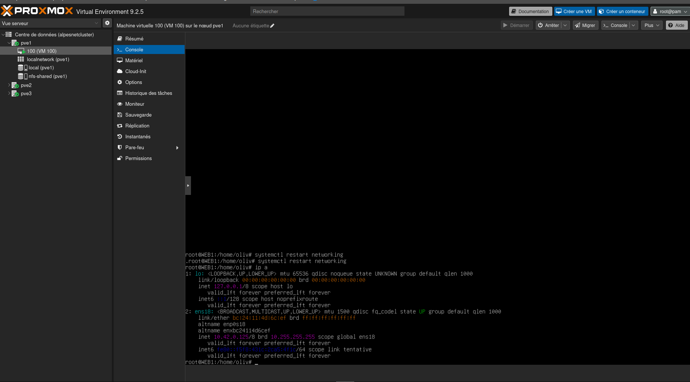
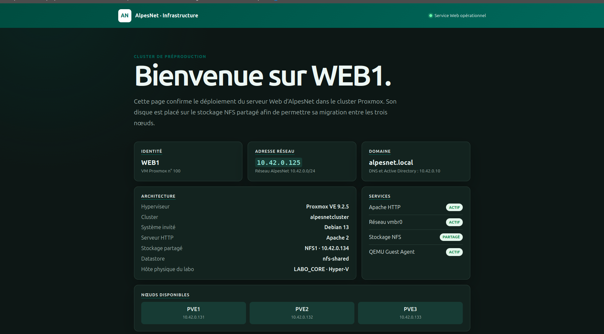
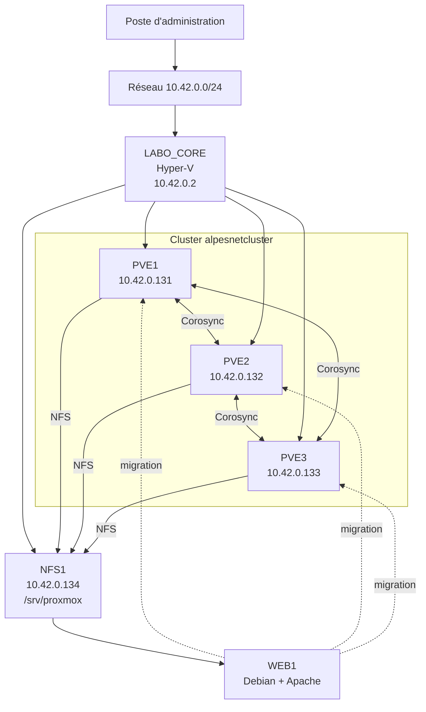

# Comment créer un cluster Proxmox ?

## Objectif

Créer et valider le cluster `alpesnetcluster` composé de trois nœuds Proxmox VE, connecté au stockage partagé `NFS1`.

!!! info "Adaptation au laboratoire"
    Le sujet initial prévoyait deux hyperviseurs. Le laboratoire utilise finalement **trois nœuds Proxmox VE imbriqués dans Hyper-V**. Une seule machine virtuelle applicative est prévue dans le cluster : le serveur Web.

## Architecture utilisée

| Élément | Nom | Adresse | Rôle |
| --- | --- | --- | --- |
| Hôte physique | `LABO_CORE` | `10.42.0.2` | Hyper-V hébergeant le laboratoire |
| Nœud 1 | `pve1.alpesnet.local` | `10.42.0.131/24` | Création initiale du cluster |
| Nœud 2 | `pve2.alpesnet.local` | `10.42.0.132/24` | Second membre |
| Nœud 3 | `pve3.alpesnet.local` | `10.42.0.133/24` | Troisième membre |
| Stockage | `nfs1.alpesnet.local` | `10.42.0.134/24` | Partage NFS `/srv/proxmox` |
| VM prévue | `WEB1` | À définir dans le cluster | Debian et Apache |

Les trois nœuds utilisent :

- Proxmox VE `9.2.5` ;
- le noyau `7.0.14-6-pve` ;
- le réseau `10.42.0.0/24` ;
- la passerelle `10.42.0.1` ;
- le DNS `10.42.0.10` ;
- le fuseau horaire `Europe/Paris` ;
- une horloge synchronisée par NTP.

!!! warning "Limite de l'exercice"
    `PVE1`, `PVE2`, `PVE3` et `NFS1` sont hébergés dans le même serveur Hyper-V. Le cluster démontre le quorum, la migration et le redémarrage de `WEB1` entre les nœuds, mais ne protège pas contre une panne physique de `LABO_CORE`.

## Activité 1 — Identifier les prérequis

### Quels sont les prérequis nécessaires ?

| Prérequis | Justification |
| --- | --- |
| Trois noms uniques | Chaque nœud doit être identifié sans ambiguïté. |
| Adresses IP fixes | Corosync et l'administration ne doivent pas dépendre d'une adresse changeante. |
| Résolution des noms | Chaque nœud doit résoudre `pve1`, `pve2`, `pve3` et `nfs1`. |
| Même version Proxmox | Réduit les risques d'incompatibilité pendant la jonction et la migration. |
| Horloges synchronisées | Nécessaire pour Corosync, les certificats et les journaux. |
| Communication réseau | Les nœuds doivent échanger les messages du cluster sans perte importante. |
| Virtualisation imbriquée | KVM doit recevoir les extensions processeur exposées par Hyper-V. |
| MAC spoofing | Les VM hébergées dans Proxmox doivent pouvoir communiquer sur le réseau Hyper-V. |
| Stockage partagé | Les trois nœuds doivent pouvoir accéder au disque de `WEB1`. |
| Nœuds à joindre vides | La jonction remplace la configuration locale située dans `/etc/pve`. |
| Trois votes disponibles | Le nombre impair de nœuds permet de conserver un quorum majoritaire. |

### Pourquoi utiliser le même stockage ?

Si le disque de `WEB1` est uniquement présent dans `local-lvm` sur `PVE1`, les autres nœuds ne peuvent pas le démarrer immédiatement après l'arrêt de `PVE1`.

Avec le partage NFS :

- le disque de `WEB1` reste dans `/srv/proxmox` sur `NFS1` ;
- les trois nœuds voient le même fichier ;
- la migration ne nécessite pas de recopier entièrement le disque ;
- un autre nœud peut redémarrer `WEB1` ;
- la configuration du stockage est distribuée par le cluster.

Le stockage partagé facilite la migration et la HA, mais ne remplace pas une sauvegarde.

### Quels éléments doivent être identiques ou compatibles ?

| Élément | Exigence dans le laboratoire |
| --- | --- |
| Version Proxmox | `9.2.5` sur les trois nœuds |
| Noyau | `7.0.14-6-pve` |
| Architecture CPU | x86-64 exposée par le même hôte Hyper-V |
| Modèle CPU des VM | Compatible entre les nœuds pour la migration |
| Bridges réseau | Même nom, par exemple `vmbr0` |
| VLAN | Même configuration sur chaque nœud |
| Stockage | Même identifiant `nfs-shared` et même export |
| Noms et adresses | Uniques, fixes et correctement résolus |
| Heure | Synchronisée sur les trois nœuds |

### Contrôles préalables

Sur chaque nœud :

```bash
hostname --fqdn
pveversion
uname -r
timedatectl
systemctl --failed

getent hosts pve1.alpesnet.local
getent hosts pve2.alpesnet.local
getent hosts pve3.alpesnet.local
getent hosts nfs1.alpesnet.local

ping -c 4 10.42.0.131
ping -c 4 10.42.0.132
ping -c 4 10.42.0.133
ping -c 4 10.42.0.134
```

## Activité 2 — Créer le cluster

### 1. Vérifier le stockage NFS

Sur `NFS1` :

```bash
su -
exportfs -v
systemctl status nfs-server --no-pager
```

Export attendu :

```text
/srv/proxmox 10.42.0.0/24(rw,sync,no_subtree_check,no_root_squash)
```

Depuis chacun des trois Proxmox :

```bash
pvesm scan nfs 10.42.0.134
showmount -e 10.42.0.134
```

### 2. Créer le cluster sur PVE1

Cette commande s'exécute uniquement sur `PVE1` :

```bash
su -
pvecm create alpesnetcluster
pvecm status
pvecm nodes
```

Le nom `alpesnetcluster` contient 15 caractères.

### Preuve — Création sur PVE1


La capture confirme :

- l'exécution de `pvecm create alpesnetcluster` ;
- la génération des clés Corosync ;
- la création de `/etc/pve/corosync.conf` ;
- le démarrage initial du cluster avec `PVE1` ;
- le statut `Quorate: Yes`.

### 3. Ajouter PVE2

Depuis `PVE2` :

```bash
su -
pvecm add 10.42.0.131
```

Saisir le mot de passe `root` de `PVE1`, vérifier l'empreinte puis confirmer.

### 4. Ajouter PVE3

Depuis `PVE3` :

```bash
su -
pvecm add 10.42.0.131
```

### Preuve — Jonction des nœuds


La capture montre l'authentification auprès de `PVE1`, la sauvegarde de l'ancienne configuration locale, la génération du certificat du nœud et le message confirmant l'ajout au cluster.

!!! danger "Commande à ne pas répéter"
    Ne pas exécuter `pvecm create` sur `PVE2` ou `PVE3`. Ils doivent rejoindre le cluster créé sur `PVE1` avec `pvecm add`.

### 5. Ajouter le stockage partagé

Depuis un seul nœud du cluster :

```bash
pvesm add nfs nfs-shared \
  --server 10.42.0.134 \
  --export /srv/proxmox \
  --content images,iso,vztmpl,backup \
  --options vers=4
```

Cette commande est une commande Linux Proxmox. Elle ne doit pas être exécutée dans PowerShell sur `LABO_CORE`.

La configuration est enregistrée dans `/etc/pve/storage.cfg`, puis distribuée automatiquement aux trois nœuds.

## Activité 3 — Contrôler le cluster

### Présence des trois nœuds

```bash
pvecm nodes
```

Résultat attendu :

| Nœud | Vote | État attendu |
| --- | ---: | --- |
| `pve1` | 1 | Online |
| `pve2` | 1 | Online |
| `pve3` | 1 | Online |

### État général et quorum

```bash
pvecm status
```

Les informations attendues sont :

- nom : `alpesnetcluster` ;
- moteur : Corosync ;
- nœuds : `3` ;
- votes attendus : `3` ;
- votes présents : `3` ;
- quorum : `2` ;
- état : `Quorate: Yes`.

Avec trois votes, deux nœuds doivent être disponibles pour conserver le quorum.

### État des services

```bash
systemctl status corosync pve-cluster --no-pager
systemctl --failed
```

`corosync` et `pve-cluster` doivent être actifs, sans unité critique en échec.

### Communication Corosync

```bash
corosync-cfgtool -s
corosync-quorumtool -s
```

Les liens doivent être connectés et les trois membres visibles.

### Visibilité du stockage partagé

```bash
pvesm status
grep -A 6 "nfs: nfs-shared" /etc/pve/storage.cfg
```

Le stockage `nfs-shared` doit apparaître `active` sur `PVE1`, `PVE2` et `PVE3`.

### Preuve — NFS et membres du cluster



La sortie utile confirme :

- `nfs-shared` de type `nfs` avec l'état `active` ;
- la présence de `pve1`, `pve2` et `pve3` ;
- un vote attribué à chaque nœud.

Les messages `commande introuvable` visibles au début proviennent de commandes mal saisies (`qm` et `pvesm`) avant leur correction. Ils ne remettent pas en cause les sorties valides de `pvesm status` et `pvecm nodes`.

### Interfaces Web

Les trois nœuds sont administrables depuis :

- `https://10.42.0.131:8006` ;
- `https://10.42.0.132:8006` ;
- `https://10.42.0.133:8006`.

Une fois le cluster créé, l'interface d'un seul nœud permet de voir et d'administrer les trois membres.

### Preuve — Vue centralisée Proxmox



L'interface Web affiche le centre de données `alpesnetcluster` et les trois nœuds `pve1`, `pve2` et `pve3` en ligne. Les tâches de création et de jonction terminées avec le statut `OK` valident l'intégration du cluster.

## Machine virtuelle prévue : WEB1

Une seule VM applicative est prévue pour les tests : `WEB1`.

Configuration légère proposée :

| Paramètre | Valeur |
| --- | --- |
| Nom | `WEB1` |
| Système | Debian |
| Rôle | Apache |
| vCPU | 1 |
| vRAM | 1 Gio |
| Disque | VHDX récupéré depuis l'ancienne VM Hyper-V |
| Stockage | `nfs-shared` |
| Bridge | `vmbr0` |
| Adresse | `10.42.0.125/24` |

!!! warning "Ressources limitées"
    `LABO_CORE` possède peu de mémoire disponible. `WEB1` doit rester légère et les anciennes VM de l'itération 2 peuvent être arrêtées pendant les essais.

## Installer proprement WEB1 depuis une ISO Debian

L'importation du VHDX Hyper-V a été testée, mais elle a provoqué des problèmes de démarrage UEFI, de chipset PCI, d'affichage et de carte réseau. Pour ce laboratoire, une installation Debian propre sur Proxmox est plus rapide, plus fiable et plus simple à documenter.

Le VHDX récupéré est conservé comme source de secours jusqu'à la validation complète de la nouvelle VM.

### 1. Arrêter l'essai d'importation

Contrôler précisément la VM avant toute suppression :

```bash
qm status 120
qm config 120
```

Si la VM 120 correspond bien à l'essai `WEB1` devenu inutile :

```bash
qm stop 120
```

La suppression définitive depuis **More > Remove** dans l'interface Proxmox ne doit être réalisée qu'après avoir confirmé que le VHDX original est conservé ailleurs.

### 2. Envoyer l'ISO Debian sur NFS1

Le stockage `nfs-shared` accepte les images ISO. Depuis l'interface Proxmox :

1. ouvrir `nfs-shared` ;
2. sélectionner **ISO Images** ;
3. cliquer sur **Upload** ;
4. choisir l'ISO Debian 13 amd64 ;
5. attendre la fin du transfert.

Depuis PowerShell sur `LABO_CORE`, il est également possible de copier l'ISO directement :

```powershell
scp "C:\Iso\debian.iso" `
  root@10.42.0.131:/mnt/pve/nfs-shared/template/iso/debian.iso
```

Vérifier sur `PVE1` :

```bash
pvesm list nfs-shared --content iso
```

### 3. Créer une nouvelle VM WEB1

Choisir un VMID libre :

```bash
pvesh get /cluster/nextid
```

La nouvelle VM a été créée depuis l'interface Web avec le **VMID `100`**. L'ancien essai d'importation utilisait le VMID `120` et ne doit pas être confondu avec cette installation propre.

Dans l'interface :

1. cliquer sur **Create VM** ;
2. saisir le VMID `100` et le nom `WEB1` ;
3. sélectionner l'ISO Debian présente sur `nfs-shared` ;
4. choisir un disque de 12 Go sur `nfs-shared` ;
5. attribuer 1 vCPU et 1 Gio de RAM ;
6. connecter la carte VirtIO à `vmbr0` ;
7. valider puis démarrer la VM.

Équivalent en ligne de commande :

```bash
qm create 100 \
  --name WEB1 \
  --memory 1024 \
  --cores 1 \
  --cpu host \
  --machine q35 \
  --bios ovmf \
  --scsihw virtio-scsi-single \
  --net0 virtio,bridge=vmbr0 \
  --agent enabled=1

qm set 100 \
  --efidisk0 nfs-shared:0,efitype=4m,pre-enrolled-keys=0

qm set 100 \
  --scsi0 nfs-shared:12,format=qcow2,discard=on,iothread=1

qm set 100 \
  --ide2 nfs-shared:iso/debian.iso,media=cdrom

qm set 100 --boot order='ide2;scsi0'
```

Configuration obtenue :

| Paramètre | Valeur |
| --- | --- |
| vCPU | 1 |
| RAM | 1 Gio |
| Disque | 12 Go en `qcow2` |
| Stockage | `nfs-shared` |
| Firmware | OVMF/UEFI |
| Machine | Q35 |
| Carte réseau | VirtIO sur `vmbr0` |

### 4. Installer Debian

Démarrer la VM et ouvrir sa console :

```bash
qm start 100
```

Pendant l'installation :

```text
Nom d'hôte : WEB1
Domaine : alpesnet.local
Adresse : 10.42.0.125/24
Passerelle : 10.42.0.1
DNS : 10.42.0.10
Utilisateur : oliv
```

Sélectionner uniquement :

- serveur SSH ;
- utilitaires usuels du système.

Ne pas installer d'environnement graphique.

### 5. Retirer l'ISO

Après l'installation :

```bash
qm stop 100
qm set 100 --delete ide2
qm set 100 --boot order=scsi0
qm start 100
```

### 6. Installer les composants de WEB1

Dans la nouvelle VM :

```bash
su -
apt update
apt install -y apache2 qemu-guest-agent
systemctl enable --now apache2 qemu-guest-agent
```

Installer ensuite les composants nécessaires à l'intégration Active Directory :

```bash
apt install -y \
  realmd sssd sssd-tools \
  libnss-sss libpam-sss \
  adcli samba-common-bin \
  krb5-user packagekit
```

Vérifier le DNS puis joindre le domaine :

```bash
getent hosts dc1.alpesnet.local
realm discover alpesnet.local
realm join -U adm-oliv alpesnet.local
realm list
```

La procédure détaillée Apache et domaine reste disponible dans
[Intégrer WEB1 au domaine et déployer Apache](../it-2/integrer-web1-au-domaine-et-deployer-apache.md).

### 7. Restaurer la page Web

La nouvelle page reprend le thème AlpesNet et présente le cluster, les trois
nœuds, le stockage NFS et les informations de `WEB1`.

Fichier prêt à déployer :

[Télécharger la page index de WEB1](../../assets/files/admin-systemes-virtualisation/it-3/web1/index.html)

Depuis la racine du dépôt, la copier vers la VM :

```bash
scp \
  docs/assets/files/admin-systemes-virtualisation/it-3/web1/index.html \
  oliv@10.42.0.125:/tmp/index.html
```

Dans `WEB1` :

```bash
su -
install -o root -g root -m 0644 \
  /tmp/index.html \
  /var/www/html/index.html
```

La page est installée dans :

```text
/var/www/html/index.html
```

Appliquer les droits attendus :

```bash
chown root:root /var/www/html/index.html
chmod 644 /var/www/html/index.html
apache2ctl configtest
systemctl reload apache2
```

### 8. Valider la nouvelle VM

Dans `WEB1` :

```bash
hostname --fqdn
ip -br address
ip route
systemctl status apache2 qemu-guest-agent --no-pager
realm list
```

Depuis un autre poste :

```bash
ping -c 4 10.42.0.125
curl -I http://10.42.0.125
```

Depuis `DC1` :

```powershell
Resolve-DnsName web1.alpesnet.local
Test-NetConnection 10.42.0.125 -Port 80
```

Validation attendue :

- [ ] Debian démarre normalement ;
- [ ] `WEB1` utilise `10.42.0.125/24` ;
- [ ] le DNS retourne la bonne adresse ;
- [ ] la VM appartient à `alpesnet.local` ;
- [ ] Apache retourne `HTTP/1.1 200 OK` ;
- [ ] le disque se trouve sur `nfs-shared` ;
- [ ] `qemu-guest-agent` est actif ;
- [ ] la VM redémarre correctement ;
- [ ] le VHDX original reste disponible pendant la validation.

!!! success "Solution retenue"
    La nouvelle `WEB1` est installée directement sur Proxmox avec un matériel virtuel natif et un disque partagé NFS. Cette solution évite les incompatibilités héritées de Hyper-V et prépare proprement la migration à chaud.

### Preuve — WEB1 active dans Proxmox



La capture confirme :

- la présence de la VM `100` sur `PVE1` ;
- son état démarré ;
- la présence du stockage `nfs-shared` ;
- le fonctionnement de Debian avec l'interface `ens18` ;
- l'attribution de l'adresse `10.42.0.125`.

!!! warning "Masque réseau à corriger"
    La capture affiche `10.42.0.125/8` et une diffusion `10.255.255.255`. Le plan d'adressage AlpesNet utilise `/24`. La configuration correcte doit être `10.42.0.125/24`, avec la diffusion `10.42.0.255`.

Dans `WEB1`, modifier `/etc/network/interfaces` :

```text
auto lo
iface lo inet loopback

auto ens18
iface ens18 inet static
    address 10.42.0.125/24
    gateway 10.42.0.1
    dns-nameservers 10.42.0.10
    dns-search alpesnet.local
```

Appliquer et contrôler :

```bash
systemctl restart networking
ip -br address
ip route
```

### Preuve — Page Web AlpesNet



La page accessible depuis le réseau confirme :

- le fonctionnement d'Apache ;
- le déploiement du nouveau thème AlpesNet ;
- l'utilisation du VMID `100` ;
- la présentation du cluster `alpesnetcluster` ;
- la visibilité de `NFS1` et des trois nœuds Proxmox.

## Pourquoi la migration à chaud sera-t-elle possible ?

Lors d'une migration de `WEB1` :

1. `PVE1`, `PVE2` et `PVE3` accèdent au même disque sur `nfs-shared` ;
2. le nœud source transfère l'état d'exécution et la mémoire ;
3. le nœud de destination reprend l'exécution ;
4. le disque reste sur `NFS1` ;
5. le bridge `vmbr0` permet à la VM de conserver sa connectivité.

Les processeurs virtuels sont compatibles parce que les trois Proxmox sont exécutés dans le même hôte Hyper-V.

## Schéma de progression



## Tableau de validation

| Contrôle | Preuve | État |
| --- | --- | --- |
| Trois nœuds présents | `pvecm nodes` et captures | ☑ |
| Cluster quorate | `pvecm status` | ☑ |
| Corosync actif | Création et jonction réussies | ☑ |
| NFS visible | `pvesm scan nfs 10.42.0.134` | ☑ |
| Stockage actif | `pvesm status` : `nfs-shared active` | ☑ |
| Interfaces Web accessibles | Vue centralisée des trois nœuds | ☑ |
| Schéma mis à jour | Schéma ci-dessus | ☑ |
| ISO Debian disponible | ISO sélectionnée dans l'interface Web | ☑ |
| Nouvelle WEB1 installée | VM 100 active sur PVE1 | ☑ |
| Page Apache accessible | Capture de la page AlpesNet | ☑ |
| Adresse en `/24` | `ip -br address` après correction | ☐ |
| `WEB1` stockée sur NFS | Configuration de la VM | ☑ |

## Synthèse

Le sujet initial à deux hyperviseurs est remplacé par un cluster Proxmox à trois nœuds. Cette architecture améliore le fonctionnement du quorum et permet de tester la migration de `WEB1` entre `PVE1`, `PVE2` et `PVE3`. Son disque sera conservé sur le partage NFS de `NFS1`, commun aux trois nœuds. La disponibilité obtenue reste pédagogique, car toutes les VM dépendent du serveur physique `LABO_CORE`.

## Documentation officielle

- [Proxmox VE — Machines virtuelles QEMU/KVM](https://pve.proxmox.com/pve-docs/chapter-qm.html)
- [Proxmox VE — Manuel de la commande `qm`](https://pve.proxmox.com/pve-docs/qm.1.html)
