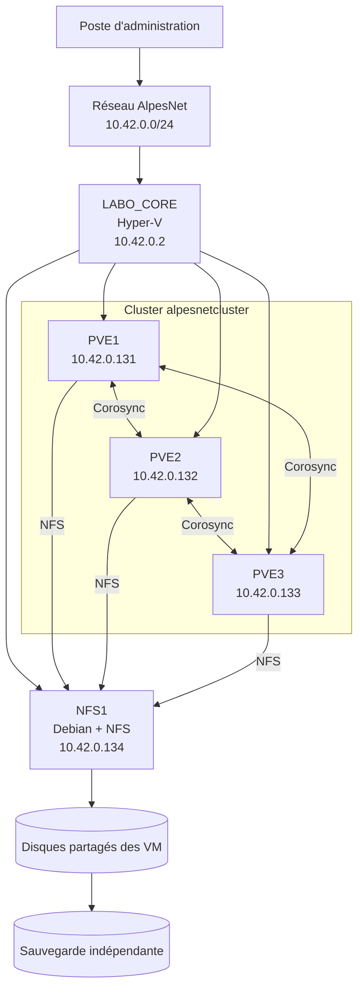

# Comment partager le stockage entre plusieurs hyperviseurs ?

## Objectif

Mettre à disposition des trois nœuds Proxmox VE un espace de stockage commun afin de préparer la migration et la haute disponibilité des machines virtuelles.

!!! info "Périmètre du laboratoire"
    Toutes les manipulations sont désormais réalisées dans le laboratoire Hyper-V `LABO_CORE`. Les serveurs physiques ESXi et la baie HPE MSA ne sont pas utilisés dans cet exercice.

!!! question "Problématique"
    Comment permettre à `PVE1`, `PVE2` et `PVE3` d'accéder aux mêmes disques de machines virtuelles afin qu'une VM puisse changer de nœud ?

## Architecture actuelle

Les trois nœuds Proxmox sont des VM exécutées dans le même serveur Hyper-V :

| Nœud | Nom complet | Adresse | Version | Noyau |
| --- | --- | --- | --- | --- |
| `PVE1` | `pve1.alpesnet.local` | `10.42.0.131/24` | Proxmox VE `9.2.5` | `7.0.14-6-pve` |
| `PVE2` | `pve2.alpesnet.local` | `10.42.0.132/24` | Proxmox VE `9.2.5` | `7.0.14-6-pve` |
| `PVE3` | `pve3.alpesnet.local` | `10.42.0.133/24` | Proxmox VE `9.2.5` | `7.0.14-6-pve` |

Paramètres communs :

- hôte parent : `LABO_CORE`, adresse `10.42.0.2` ;
- hyperviseur parent : Hyper-V ;
- commutateur : `vSwitch-Externe` ;
- passerelle : `10.42.0.1` ;
- DNS : `10.42.0.10` ;
- ressources par nœud : 2 vCPU, 3 Gio de RAM et 32 Go de disque ;
- virtualisation imbriquée et MAC spoofing activés ;
- heure synchronisée avec NTP ;
- fuseau horaire `Europe/Paris`.

La procédure de déploiement se trouve dans
[Installer trois Proxmox VE dans Hyper-V](installer-trois-proxmox-dans-hyper-v.md).

## Validation des trois nœuds

Les tests réalisés confirment :

- la communication entre `.131`, `.132` et `.133` sans perte ;
- une latence inférieure à une milliseconde ;
- la résolution correcte des trois noms ;
- une version et un noyau identiques ;
- la synchronisation des horloges ;
- l'accès aux interfaces Web sur le port TCP `8006`.

Commandes utilisées :

```bash
ping -c 4 10.42.0.131
ping -c 4 10.42.0.132
ping -c 4 10.42.0.133

getent hosts pve1.alpesnet.local
getent hosts pve2.alpesnet.local
getent hosts pve3.alpesnet.local

pveversion
uname -r
timedatectl
systemctl --failed
```

Chaque nœud contient les entrées suivantes dans `/etc/hosts` :

```text
127.0.0.1 localhost
10.42.0.131 pve1.alpesnet.local pve1
10.42.0.132 pve2.alpesnet.local pve2
10.42.0.133 pve3.alpesnet.local pve3
```

Le nom du nœud doit résoudre son adresse réelle, jamais `127.0.1.1`.

## Activité 1 — Analyser le besoin

### Une VM stockée localement peut-elle démarrer sur un autre nœud ?

Non. Une machine virtuelle Proxmox dépend notamment :

- de sa configuration située dans `/etc/pve` ;
- de son disque virtuel ;
- de ses éventuels snapshots ;
- de son réseau virtuel ;
- de ses paramètres matériels.

Si son disque reste uniquement dans le stockage `local-lvm` de `PVE1`, `PVE2` et `PVE3` ne peuvent pas le lire lorsque `PVE1` est arrêté.

Le cluster partage la configuration et coordonne les nœuds, mais il ne transforme pas automatiquement leurs disques locaux en stockage partagé.

### Limites du stockage local

| Limite | Conséquence |
| --- | --- |
| Disque attaché à un seul nœud | Les autres nœuds ne peuvent pas démarrer la VM directement. |
| Panne du nœud | La VM et son disque deviennent indisponibles. |
| Maintenance | Une migration avec copie du disque est nécessaire. |
| Gestion dispersée | Chaque nœud possède ses propres volumes. |
| Basculement HA impossible | Le disque n'est pas accessible au nœud de secours. |

!!! note
    Une migration avec stockage local peut recopier un disque entre deux nœuds lorsque les deux sont disponibles. En revanche, elle ne permet pas un redémarrage HA après la perte brutale du nœud qui détenait le disque.

### Comment les nœuds peuvent-ils accéder aux mêmes VM ?

Les fichiers ou volumes des VM doivent être placés dans un stockage :

- accessible depuis les trois nœuds ;
- déclaré au niveau du Datacenter Proxmox ;
- autorisé pour les adresses `.131`, `.132` et `.133` ;
- suffisamment fiable et performant ;
- indépendant du nœud qui exécute la VM.

Lors d'une migration, le nœud de destination utilise alors le même disque partagé. Seuls l'état d'exécution et la mémoire doivent principalement être transférés.

## Solutions possibles dans le laboratoire Hyper-V

| Solution | Principe | Avantages | Limites |
| --- | --- | --- | --- |
| NFS | Un serveur Debian exporte un répertoire aux trois Proxmox | Simple, lisible et rapide à mettre en œuvre | Le serveur NFS reste un point unique de défaillance |
| iSCSI avec LVM partagé | Une cible présente un LUN commun aux nœuds | Reproduit le fonctionnement d'un SAN | Configuration plus technique |
| Ceph | Les nœuds répliquent les données entre leurs disques | Stockage distribué intégré à Proxmox | Trop lourd pour trois VM de 3 Gio dans ce laboratoire |
| Réplication ZFS | Les données sont copiées périodiquement entre nœuds | Pas de serveur de stockage distinct | Réplication asynchrone, pas un stockage simultanément partagé |

### Choix recommandé

Pour le laboratoire, **NFS** est le choix le plus simple :

1. créer un petit serveur Debian de stockage dans Hyper-V ou utiliser une ressource NFS fournie pour le TP ;
2. lui attribuer une adresse fixe sur `10.42.0.0/24` ;
3. exporter un répertoire réservé à Proxmox ;
4. autoriser les trois nœuds ;
5. ajouter le partage dans le Datacenter Proxmox.

La cible NFS devra être extérieure à `PVE1`, `PVE2` et `PVE3`. Héberger l'unique partage dans l'un des trois nœuds empêcherait les autres d'y accéder lorsque ce nœud serait arrêté.

!!! warning "Limite pédagogique"
    Même avec un partage NFS distinct, les quatre VM restent hébergées par le même serveur physique Hyper-V. Le laboratoire permet de tester le cluster, le quorum et la migration, mais ne protège pas contre une panne de `LABO_CORE`.

## Activité 2 — Créer le cluster Proxmox

### 1. Derniers contrôles

Sur chaque nœud :

```bash
hostname --fqdn
pveversion
timedatectl
systemctl --failed

getent hosts pve1.alpesnet.local
getent hosts pve2.alpesnet.local
getent hosts pve3.alpesnet.local
```

Les trois nœuds doivent :

- avoir un nom unique ;
- utiliser la même version ;
- résoudre tous les noms ;
- posséder une heure synchronisée ;
- ne contenir aucune VM à conserver avant leur jonction.

### 2. Créer le cluster sur PVE1

À exécuter uniquement sur `PVE1` :

```bash
pvecm create alpesnetcluster
pvecm status
pvecm nodes
```

Le nom `alpesnetcluster` comporte 15 caractères et respecte la limite rencontrée pendant la manipulation.

### 3. Ajouter PVE2

Depuis `PVE2` :

```bash
pvecm add 10.42.0.131
```

Saisir le mot de passe `root` de `PVE1`, puis accepter l'empreinte présentée après vérification.

### 4. Ajouter PVE3

Depuis `PVE3` :

```bash
pvecm add 10.42.0.131
```

### 5. Vérifier le quorum

Depuis n'importe quel nœud :

```bash
pvecm status
pvecm nodes
```

Résultat attendu :

- `Nodes: 3` ;
- `Expected votes: 3` ;
- `Total votes: 3` ;
- `Quorate: Yes`.

!!! danger "Ne pas recréer le cluster sur chaque nœud"
    `pvecm create` s'exécute uniquement sur `PVE1`. `PVE2` et `PVE3` utilisent `pvecm add` pour rejoindre le cluster existant.

## Activité 3 — Préparer le stockage NFS

Les valeurs suivantes devront être complétées lorsque le serveur de stockage sera créé :

| Paramètre | Valeur |
| --- | --- |
| Nom du serveur | `NFS1` / `nfs1.alpesnet.local` |
| Adresse IP | `10.42.0.134/24` |
| Utilisateur local | `nfs1` |
| Protocole | NFS |
| Répertoire exporté | `/srv/proxmox` proposé |
| Clients autorisés | `10.42.0.131`, `.132` et `.133` |
| Contenu Proxmox | Images disque, ISO, conteneurs et sauvegardes |
| Capacité | À définir |

### Préparation de NFS1

Sur un futur serveur Debian :

```bash
apt update
apt install -y nfs-kernel-server
mkdir -p /srv/proxmox
nano /etc/exports
```

Exemple d'export limité au réseau du laboratoire :

```text
/srv/proxmox 10.42.0.0/24(rw,sync,no_subtree_check,no_root_squash)
```

Appliquer et vérifier :

```bash
exportfs -ra
exportfs -v
systemctl enable --now nfs-server
```

!!! warning "Sécurité"
    `no_root_squash` est pratique pour un laboratoire Proxmox, mais doit être réservé au réseau de stockage contrôlé. Un environnement de production exige un filtrage réseau, des exports plus restrictifs et une conception de sécurité validée.

### Tester depuis chaque Proxmox

```bash
pvesm scan nfs 10.42.0.134
showmount -e 10.42.0.134
```

Les trois nœuds doivent voir le même export `/srv/proxmox`.

### Ajouter le stockage dans Proxmox

Depuis l'interface Web :

1. ouvrir **Datacenter** ;
2. sélectionner **Storage** ;
3. cliquer sur **Add > NFS** ;
4. utiliser l'identifiant `nfs-shared` ;
5. renseigner l'adresse `10.42.0.134` ;
6. sélectionner l'export `/srv/proxmox` ;
7. choisir les contenus nécessaires ;
8. conserver les trois nœuds comme cibles ;
9. valider.

Équivalent en ligne de commande :

```bash
pvesm add nfs nfs-shared \
  --server 10.42.0.134 \
  --export /srv/proxmox \
  --content images,iso,vztmpl,backup \
  --options vers=4
```

La déclaration effectuée au niveau du Datacenter est distribuée aux trois nœuds par `/etc/pve/storage.cfg`.

### Vérifier le stockage partagé

Sur chaque nœud :

```bash
pvesm status
grep -A 6 "nfs: nfs-shared" /etc/pve/storage.cfg
```

Le stockage `nfs-shared` doit apparaître avec le statut `active`.

## Test de fonctionnement prévu

1. créer une petite VM de test sur `nfs-shared` ;
2. la démarrer sur `PVE1` ;
3. vérifier son fonctionnement ;
4. migrer la VM vers `PVE2` ;
5. vérifier que le disque reste sur le stockage NFS ;
6. migrer ensuite la VM vers `PVE3` ;
7. consigner les résultats et les captures.

Commandes utiles :

```bash
qm list
pvesm status
pvecm nodes
```

La migration pourra être lancée depuis l'interface Web avec **Migrate**, ou avec :

```bash
qm migrate ID_VM pve2 --online
```

Remplacer `ID_VM` par l'identifiant réel.

## Pourquoi le stockage partagé est nécessaire

### Migration à chaud

Les trois nœuds accèdent au même disque de VM sur `nfs-shared`. Pendant une migration à chaud, Proxmox transfère l'état de la VM et sa mémoire vers le nœud de destination, tandis que le disque reste au même emplacement.

### Haute disponibilité

Si un nœud Proxmox devient indisponible, un autre nœud peut accéder au même disque partagé et redémarrer la VM. Pour automatiser ce redémarrage, la VM doit être ajoutée aux ressources HA du cluster.

Le stockage partagé ne remplace pas :

- une sauvegarde ;
- la redondance du serveur de stockage ;
- la supervision ;
- les tests de restauration ;
- la protection de l'hôte physique Hyper-V.

## Schéma cible du laboratoire



## Synthèse

Le laboratoire repose exclusivement sur Hyper-V et trois nœuds Proxmox imbriqués. Leur réseau, leurs noms, leurs versions et leurs horloges ont été validés. Le cluster `alpesnetcluster` doit maintenant être créé, puis complété par un partage NFS commun. Cette architecture permettra de démontrer la migration et le redémarrage d'une VM sur un autre nœud, tout en conservant la limite physique liée à l'hôte unique `LABO_CORE`.

## Documentation officielle

- [Proxmox VE — Cluster Manager](https://pve.proxmox.com/pve-docs/chapter-pvecm.html)
- [Proxmox VE — Storage](https://pve.proxmox.com/pve-docs/chapter-pvesm.html)
- [Proxmox VE — High Availability](https://pve.proxmox.com/pve-docs/chapter-ha-manager.html)
- [Debian — NFS](https://wiki.debian.org/NFSServerSetup)

## Glossaire associé

→ [Consulter le glossaire Disponibilité et stockage partagé](../../pense-bete/glossaire/admin-systemes-virtualisation/it-3.md)
