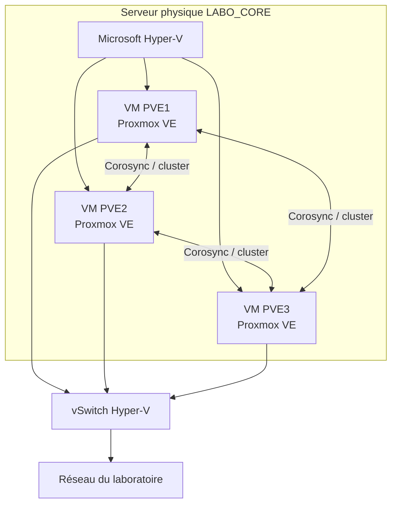
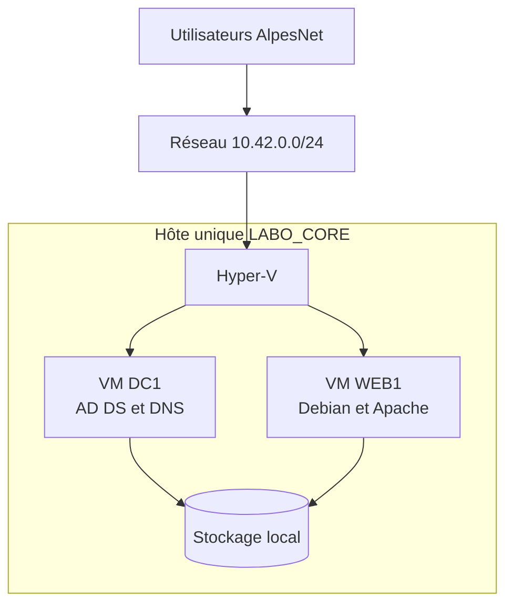
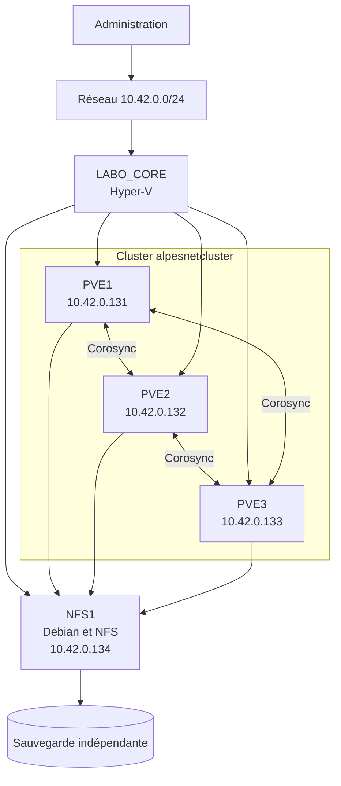

# Itération 3 — Disponibilité des services virtualisés

## Présentation

La plateforme Hyper-V déployée pendant l'itération 2 est désormais opérationnelle. Les premiers services d'AlpesNet, notamment `DC1` et `WEB1`, fonctionnent sous forme de machines virtuelles sur l'hôte physique `LABO_CORE`.

Cette infrastructure répond aux besoins fonctionnels, mais elle repose encore sur un **hôte unique**. Une panne matérielle, une maintenance ou un redémarrage de ce serveur provoquerait l'arrêt simultané de toutes les VM qu'il héberge.

L'objectif de cette itération est de faire évoluer la plateforme vers une architecture en **cluster**, capable de maintenir ou de rétablir rapidement les services lorsqu'un hôte devient indisponible.

## Environnement du laboratoire

Toutes les manipulations sont réalisées avec **trois machines virtuelles Proxmox VE** hébergées sur le serveur Hyper-V `LABO_CORE`. Les gros serveurs ESXi ne font plus partie du périmètre de l'exercice.



### Objectif pédagogique

Les trois nœuds permettront d'étudier :

- la création d'un cluster Proxmox ;
- le rôle du quorum avec un nombre impair de nœuds ;
- la communication Corosync entre les membres ;
- le partage ou la réplication du stockage ;
- la migration d'une VM ou d'un conteneur ;
- le comportement du cluster lorsqu'un nœud est arrêté.

### Ressources de LABO_CORE

L'hôte dispose d'environ 15,8 Gio de RAM, 12 processeurs logiques et environ 197 Go libres lors du dernier relevé. Le dimensionnement doit donc rester léger.

| VM | vCPU proposés | vRAM proposée | Disque système proposé | Réseau |
|---|---:|---:|---:|---|
| `PVE1` | 2 | 3 Gio | 32 Go dynamique | `vSwitch-Externe` |
| `PVE2` | 2 | 3 Gio | 32 Go dynamique | `vSwitch-Externe` |
| `PVE3` | 2 | 3 Gio | 32 Go dynamique | `vSwitch-Externe` |

Cette configuration consomme 9 Gio de RAM au démarrage et réserve une partie des ressources à Windows Server et Hyper-V. Les VM `DC1` et `WEB1` devront éventuellement être arrêtées pendant le laboratoire si la mémoire devient insuffisante.

!!! warning "Cluster imbriqué"
    Ce montage valide les mécanismes de cluster, mais il ne fournit pas une haute disponibilité physique réelle. Les trois nœuds Proxmox dépendent du même serveur `LABO_CORE`, de la même alimentation et du même stockage. Une panne de l'hôte Hyper-V arrête l'ensemble du cluster.

### Prérequis Hyper-V

Chaque VM Proxmox doit recevoir les extensions de virtualisation matérielle et autoriser le trafic des VM qu'elle hébergera :

```powershell
Set-VMProcessor -VMName "PVE1" -ExposeVirtualizationExtensions $true
Set-VMProcessor -VMName "PVE2" -ExposeVirtualizationExtensions $true
Set-VMProcessor -VMName "PVE3" -ExposeVirtualizationExtensions $true

Get-VMNetworkAdapter -VMName "PVE1" |
  Set-VMNetworkAdapter -MacAddressSpoofing On
Get-VMNetworkAdapter -VMName "PVE2" |
  Set-VMNetworkAdapter -MacAddressSpoofing On
Get-VMNetworkAdapter -VMName "PVE3" |
  Set-VMNetworkAdapter -MacAddressSpoofing On
```

Les commandes s'exécutent lorsque les VM Proxmox sont arrêtées pour éviter une modification imprévisible de leur configuration.

La procédure complète de création et d'installation est disponible dans la feuille
[Installer trois Proxmox VE dans Hyper-V](installer-trois-proxmox-dans-hyper-v.md).

!!! question "Problématique"
    Comment garantir la disponibilité des services d'AlpesNet même en cas de panne d'un serveur physique ?
    Dans le laboratoire, les trois nœuds Proxmox permettent de simuler le quorum, la migration et le redémarrage des VM. Cette démonstration reste logique : une panne physique de `LABO_CORE` arrêterait les trois nœuds imbriqués.

## Situation initiale



### Limites identifiées

- `LABO_CORE` constitue un **point unique de défaillance** ;
- une maintenance de l'hôte impose l'arrêt des services ;
- les VM ne peuvent pas redémarrer automatiquement sur un autre serveur ;
- le stockage local reste inaccessible si l'hôte tombe en panne ;
- le réseau et le stockage peuvent eux-mêmes comporter des composants uniques ;
- un checkpoint ne protège pas contre la perte de l'hôte ou de son disque.

## Architecture cible

L'évolution pédagogique repose sur les trois nœuds Proxmox regroupés dans le cluster `alpesnetcluster` et connectés à un stockage NFS partagé.



### Composants indispensables

| Composant | Rôle dans la disponibilité |
| --- | --- |
| Trois nœuds Proxmox | Permettre l'exécution des VM sur un autre nœud logique. |
| Cluster `alpesnetcluster` | Surveiller les nœuds et maintenir le quorum. |
| Corosync | Assurer les communications et l'appartenance au cluster. |
| Stockage NFS partagé | Rendre les disques des VM accessibles aux trois nœuds. |
| Quorum | Éviter que plusieurs parties du cluster prennent simultanément des décisions contradictoires. |
| Haute disponibilité des VM | Déclarer les VM comme rôles du cluster afin qu'elles puissent basculer. |
| Migration à chaud | Déplacer une VM en fonctionnement avant une maintenance planifiée. |
| Supervision | Détecter les pannes, saturations et basculements. |
| Sauvegarde indépendante | Restaurer les données après une suppression, une corruption ou un sinistre. |

## Maintenance et panne : deux scénarios différents

### Maintenance planifiée

Lors d'une maintenance, les VM peuvent être déplacées vers un autre nœud au moyen d'une **migration à chaud**. L'hôte est ensuite mis en pause ou arrêté sans interrompre notablement les services.

### Panne imprévue

Lorsqu'un hôte cesse brutalement de fonctionner, sa mémoire est perdue. Le cluster détecte la panne et **redémarre** les VM concernées sur un autre nœud disposant des ressources et du stockage nécessaires. Cette opération réduit l'indisponibilité, mais ne correspond pas à une exécution sans aucune interruption.

!!! note "Disponibilité du service"
    La haute disponibilité de la VM ne suffit pas toujours à garantir celle de l'application. Active Directory doit conserver plusieurs contrôleurs de domaine, et une application Web critique peut nécessiter plusieurs instances derrière un répartiteur de charge.

## Mission de l'itération

La mission consiste à concevoir puis mettre en œuvre cette évolution :

1. analyser les risques de l'architecture actuelle ;
2. définir l'architecture du cluster et ses prérequis ;
3. valider les trois nœuds Proxmox et leur réseau ;
4. créer le cluster `alpesnetcluster` ;
5. vérifier son quorum ;
6. déployer un stockage NFS partagé dans le laboratoire Hyper-V ;
7. rendre une VM de test hautement disponible ;
8. tester une migration planifiée ;
9. simuler l'arrêt d'un nœud Proxmox dans un cadre contrôlé ;
10. documenter les résultats et le retour à l'état normal.

## Principes de dimensionnement

Le cluster doit conserver assez de capacité pour héberger les VM après la perte d'un nœud. Dans une architecture à deux hôtes, chacun doit pouvoir reprendre les charges indispensables de l'autre.

| Ressource | Point de contrôle |
| --- | --- |
| CPU | Nombre de cœurs et compatibilité des processeurs entre les hôtes. |
| RAM | Mémoire suffisante pour redémarrer les VM prioritaires sur un seul nœud. |
| Stockage | Capacité, performances, redondance et accès simultané. |
| Réseau | Débit, VLAN, redondance et séparation des flux techniques. |
| Alimentation | Alimentations, onduleurs et circuits électriques redondants si possible. |

## Risques à traiter

- capacité insuffisante du nœud restant après une panne ;
- perte du stockage partagé devenu lui-même un point unique de défaillance ;
- incohérence des commutateurs virtuels ou VLAN entre les hôtes ;
- mauvaise configuration du quorum ;
- absence de résolution DNS ou de synchronisation horaire ;
- incompatibilité matérielle entre les nœuds ;
- basculement réussi de la VM mais échec du service applicatif ;
- sauvegardes non testées ;
- simulation de panne réalisée sans procédure de retour arrière.

## Glossaire associé

→ [Consulter le glossaire Disponibilité et stockage partagé](../../pense-bete/glossaire/admin-systemes-virtualisation/it-3.md)

!!! warning "Sécurité des essais"
    Toute simulation de panne doit être préparée, limitée à l'environnement de préproduction et accompagnée d'une procédure de retour à l'état normal. Une migration contrôlée doit être privilégiée avant une maintenance planifiée.
