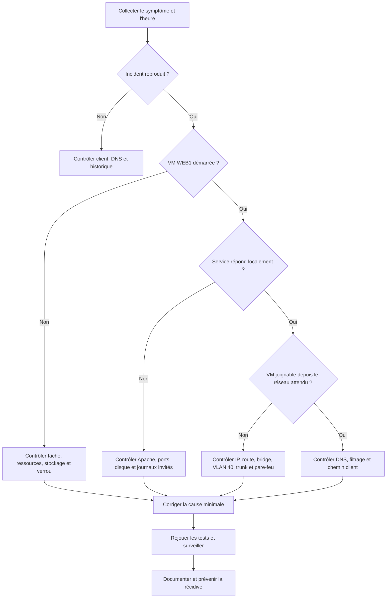

# Comment identifier l'origine d'un dysfonctionnement ?

## Mise en situation

L'infrastructure virtualisée d'AlpesNet est désormais en production. Un utilisateur signale qu'un service de l'entreprise est devenu indisponible.

Avant toute intervention, l'objectif est de localiser la panne, d'en mesurer l'étendue et de préserver les éléments nécessaires à son analyse.

!!! question "Problématique"
    **Comment identifier rapidement l'origine d'un dysfonctionnement sans aggraver l'incident ni masquer ses causes ?**

## Environnement concerné

Le laboratoire réellement disponible comprend :

- le cluster `alpesnetcluster` composé de `PVE1`, `PVE2` et `PVE3` ;
- le stockage partagé `nfs-shared` fourni par `NFS1` ;
- la VM 100 `WEB1`, seule VM applicative encore présente ;
- un hôte Hyper-V `LABO_CORE` disposant de ressources limitées.

Le manque de CPU et de mémoire de `LABO_CORE` constitue un facteur de risque important : une lenteur simultanée des trois nœuds Proxmox peut provenir de l'hôte physique commun et non d'une panne propre au cluster.

---

## Activité 1 — Élaborer la procédure de diagnostic

### Principales causes d'un dysfonctionnement

| Domaine | Causes possibles | Symptômes fréquents |
| --- | --- | --- |
| Utilisateur ou poste client | erreur d'URL, cache, DNS local, pare-feu client | un seul utilisateur affecté |
| Service applicatif | Apache arrêté, erreur de configuration, port non écouté | VM joignable mais page indisponible |
| Système invité | VM arrêtée, démarrage incomplet, disque plein, mémoire saturée | console lente, erreurs système |
| Configuration de la VM | carte déconnectée, mauvais bridge, tag VLAN incorrect, ressources insuffisantes | perte réseau ou mauvaises performances |
| Nœud Proxmox | saturation CPU/RAM, service Proxmox arrêté, interface défaillante | plusieurs fonctions du même nœud touchées |
| Réseau | mauvaise IP, route, DNS, VLAN, MTU, trunk Hyper-V ou règle de pare-feu | timeout, réseau partiellement accessible |
| Stockage | NFS indisponible, espace ou inodes épuisés, latence élevée | VM bloquée, migration ou démarrage impossible |
| Cluster | perte du quorum, Corosync instable, nœud isolé | configuration en lecture seule, HA perturbée |
| Migration ou HA | verrou résiduel, cible sans ressources, stockage inaccessible | tâche échouée, VM bloquée ou arrêtée |
| Hôte physique | CPU/RAM saturés, arrêt de `LABO_CORE`, problème du vSwitch Hyper-V | plusieurs nœuds imbriqués affectés ensemble |

### Éléments à vérifier en priorité

Les contrôles doivent aller du plus visible et du moins intrusif vers le composant le plus profond :

1. **qualifier le symptôme** : service, utilisateur, heure, message et dernière modification ;
2. **déterminer l'étendue** : un client, une VM, un nœud ou tout le cluster ;
3. **contrôler l'état de `WEB1`** et tester le service depuis plusieurs points ;
4. **vérifier les ressources** CPU, mémoire, disque et stockage ;
5. **contrôler le réseau** de bout en bout, notamment le bridge et le VLAN 40 ;
6. **contrôler le quorum, HA et NFS** ;
7. **corréler les journaux** à l'heure exacte de l'incident ;
8. formuler une hypothèse, la tester, puis seulement appliquer une correction.

!!! warning "Observer avant de modifier"
    Un redémarrage immédiat peut rétablir temporairement le service tout en supprimant des indices. Relever l'heure, les états, les erreurs et les ressources avant toute action corrective.

### Outils de diagnostic

#### Interface Proxmox VE

- **Centre de données → Résumé** : état global et consommation ;
- **Nœud → Résumé** : CPU, mémoire, charge et stockage ;
- **Nœud ou VM → Résumé** : graphiques d'utilisation ;
- **VM 100 → Matériel** : disque, bridge, modèle réseau et VLAN ;
- **VM 100 → Console** : accès lorsque le réseau invité est indisponible ;
- **Tâches** et **Journaux** : migration, démarrage, arrêt, sauvegarde et erreurs ;
- **Centre de données → HA** : état des ressources gérées.

#### Commandes Proxmox

```bash
# Vue générale
pveversion -v
uptime
free -h
df -h
df -i

# VM
qm list
qm status 100
qm config 100

# Cluster, HA et stockage
pvecm status
pvecm nodes
ha-manager status
pvesm status

# Réseau
ip -br address
ip route
bridge vlan show
```

#### Services et journaux

```bash
systemctl --failed
systemctl status pve-cluster corosync pvedaemon pveproxy pvestatd
journalctl -p warning --since "-30 min"
journalctl -u corosync --since "-30 min"
journalctl -u pve-cluster --since "-30 min"
```

La période doit être adaptée à l'heure réelle de l'incident. L'absence de quorum peut rendre `/etc/pve` non modifiable ; elle ne doit pas être contournée avant d'avoir identifié la cause de la perte des votes.

#### Contrôles dans `WEB1`

```bash
ip -br address
ip route
cat /etc/resolv.conf
systemctl --failed
systemctl status apache2
ss -lntp
curl -I http://127.0.0.1
journalctl -u apache2 --since "-30 min"
```

#### Contrôles depuis un poste

```powershell
Resolve-DnsName <nom-du-service>
Test-NetConnection 10.42.0.125 -Port 80
Test-NetConnection 10.42.0.131 -Port 8006
Test-NetConnection 10.42.0.134 -Port 2049
Test-Connection 10.42.0.125 -Count 4
```

Le port doit correspondre au service réellement configuré. Dans le laboratoire, `WEB1` utilise HTTP `80` tant qu'HTTPS n'a pas été déployé.

### Ordre de diagnostic recommandé



### Procédure opérationnelle

#### Étape 1 — Ouvrir une fiche d'incident

| Champ | Valeur |
| --- | --- |
| Date et heure du signalement | |
| Utilisateur ou source | |
| Service concerné | |
| Symptôme exact | |
| Étendue connue | |
| Dernière modification | |
| Administrateur | |

#### Étape 2 — Reproduire sans modifier

- tester le service par son nom puis par son IP ;
- tester depuis un second poste si possible ;
- noter le message exact et la durée de réponse ;
- vérifier si les interfaces Proxmox et les autres services répondent.

#### Étape 3 — Descendre les couches

1. service applicatif ;
2. système invité ;
3. configuration de la VM ;
4. réseau virtuel et physique ;
5. stockage ;
6. nœud Proxmox ;
7. cluster et Hyper-V.

#### Étape 4 — Corréler les preuves

Une hypothèse n'est retenue que si elle explique les symptômes et est appuyée par au moins un état, un journal ou un test. Exemple : « Apache est arrêté » doit être confirmé par `systemctl status apache2` et par l'absence d'écoute sur le port 80.

#### Étape 5 — Corriger au niveau minimal

- ne pas redémarrer tout le cluster pour un service invité arrêté ;
- ne pas désactiver globalement le pare-feu pour tester un seul port ;
- ne pas supprimer un verrou sans vérifier que l'ancienne tâche est terminée ;
- ne pas forcer le quorum sans analyser Corosync et l'état des autres nœuds ;
- sauvegarder la configuration avant une modification réseau.

#### Étape 6 — Valider

Le retour au vert de l'interface ne suffit pas. Il faut rejouer le test utilisateur, vérifier les dépendances, consulter les nouveaux journaux et surveiller la stabilité pendant quelques minutes.

---

## Activité 2 — Traiter le scénario d'incident

### Fiche de diagnostic à compléter

| Phase | Relevé à fournir |
| --- | --- |
| Symptômes | comportement observé, message, heure et périmètre |
| État initial | VM, service, CPU, RAM, disque, réseau, stockage et cluster |
| Hypothèses | causes envisagées, classées par probabilité |
| Tests | commande ou outil, résultat et interprétation |
| Cause racine | composant et configuration responsables |
| Correction | action exacte réalisée |
| Validation | résultat depuis la VM et depuis le poste utilisateur |
| Retour arrière | méthode prévue si la correction échoue |

### Scénarios et contrôles adaptés

| Scénario | Contrôles prioritaires | Correction possible après confirmation |
| --- | --- | --- |
| VM arrêtée | `qm status 100`, tâches, stockage, HA | traiter la cause puis `qm start 100` |
| Saturation mémoire | `free -h`, `top`, graphiques, mémoire de la VM | arrêter une charge non indispensable ou ajuster prudemment les ressources |
| Stockage insuffisant | `pvesm status`, `df -h`, `df -i`, taille des volumes | libérer/étendre sans supprimer de disque de VM |
| Interface mal configurée | `qm config 100`, `ip -br address`, `ip route` | corriger bridge, VLAN, IP ou route |
| Migration échouée | journal de tâche, quorum, NFS, ressources cible | corriger la dépendance puis relancer |
| VM isolée | VLAN 40, trunk Hyper-V, pare-feu, route et port | rétablir la cohérence de bout en bout |
| Service indisponible | `systemctl status apache2`, `ss`, `curl`, journaux | corriger la configuration puis redémarrer uniquement le service |

### Cas particulièrement probable dans le laboratoire

Après l'affectation de `WEB1` au VLAN 40, une indisponibilité réseau peut provenir d'une incohérence entre :

- le tag `40` configuré sur `net0` ;
- la plage VLAN autorisée sur `vmbr0` ;
- le trunk de la carte virtuelle du nœud Proxmox dans Hyper-V ;
- l'adresse et la passerelle configurées dans `WEB1` ;
- l'existence d'une interface de routage pour le VLAN 40.

Commandes de collecte :

```bash
qm config 100 | grep '^net'
bridge vlan show
ip -br address
ip route
```

Dans `WEB1` :

```bash
ip -br address
ip route
ping -c 4 10.42.40.1
curl -I http://127.0.0.1
```

Une réponse locale de `curl` associée à un échec distant oriente vers le réseau. Un échec local indique d'abord un problème du service ou du système invité.

!!! warning "Ne pas confondre"
    Un échec sur TCP `443` ne prouve pas une panne réseau si Apache n'écoute que sur TCP `80`.

---

## Activité 3 — Analyser et capitaliser

### Compte rendu d'intervention

#### Contrôles réalisés

Indiquer les contrôles dans leur ordre réel, avec la commande, le résultat utile et son interprétation. Les longues sorties sans explication ne constituent pas une analyse.

#### Origine du dysfonctionnement

Formuler une cause précise. Exemple :

> `WEB1` répondait localement sur TCP 80, mais sa carte virtuelle portait le VLAN 40 alors que le trunk Hyper-V ne transportait pas ce VLAN. Le service Apache était sain ; l'origine était la chaîne réseau virtuelle.

Cet exemple ne doit être repris que si les tests du scénario le confirment.

#### Action corrective

Documenter :

- la configuration avant modification ;
- la commande ou l'écran utilisé ;
- la modification réalisée ;
- le risque et la possibilité de retour arrière ;
- l'heure de rétablissement.

#### Vérification du rétablissement

```bash
# Dans WEB1
systemctl is-active apache2
curl -I http://127.0.0.1
```

```powershell
# Depuis le poste autorisé
Test-NetConnection <IP_WEB1> -Port 80
Invoke-WebRequest "http://<IP_WEB1>" -UseBasicParsing
```

La validation doit confirmer le service depuis le point de vue de l'utilisateur, et pas uniquement l'état « running » de la VM.

### Mesures préventives

- superviser CPU, RAM, espace disque, NFS, quorum et disponibilité HTTP ;
- définir des seuils d'alerte avant saturation ;
- conserver une marge de ressources sur `LABO_CORE` ;
- documenter bridges, VLAN, trunks, IP et règles de pare-feu ;
- vérifier automatiquement le service après une migration ;
- sauvegarder les configurations avant modification ;
- conserver les journaux et l'heure synchronisée ;
- tester périodiquement les sauvegardes et la procédure de reprise ;
- appliquer les changements réseau un nœud à la fois avec un accès console ;
- tenir à jour une fiche d'incident et une base des erreurs connues.

### Preuves attendues

- capture du symptôme avec contexte ;
- état de `WEB1` et du service ;
- ressources du nœud concerné ;
- état du cluster et de `nfs-shared` ;
- configuration réseau utile ;
- extrait de journal ciblé sur l'heure de l'incident ;
- preuve de la correction ;
- test final depuis le poste utilisateur ;
- analyse de la cause racine et mesure préventive.

## Références officielles

- [Proxmox VE — Administration Guide](https://pve.proxmox.com/pve-docs/pve-admin-guide.pdf)
- [Proxmox VE — Cluster Manager](https://pve.proxmox.com/pve-docs/chapter-pvecm.html)
- [Proxmox VE — Proxmox Cluster File System](https://pve.proxmox.com/pve-docs/chapter-pmxcfs.html)
- [Proxmox VE — Network Configuration](https://pve.proxmox.com/wiki/Network_Configuration)
- [Proxmox VE — qm, gestion des machines virtuelles](https://pve.proxmox.com/pve-docs/qm.1.html)
- [Proxmox VE — pvesm, gestion du stockage](https://pve.proxmox.com/pve-docs/pvesm.1.html)

