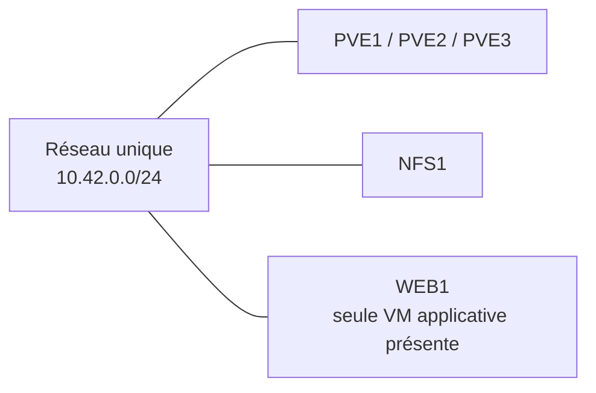
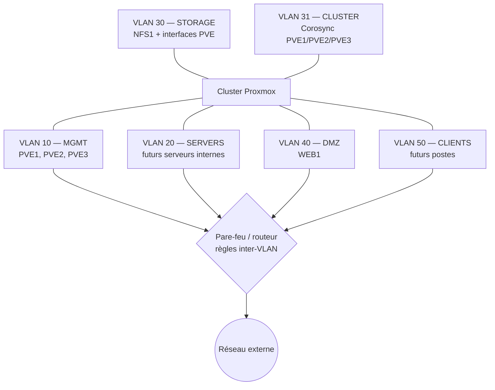
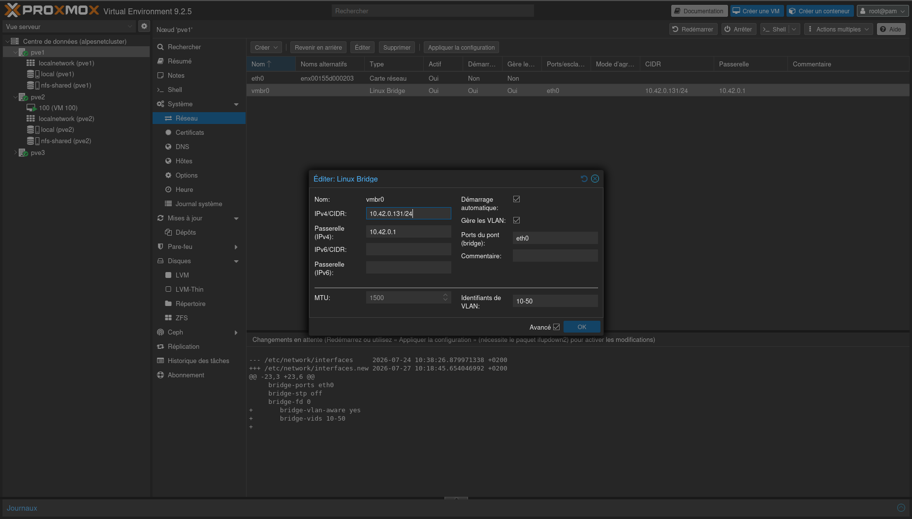
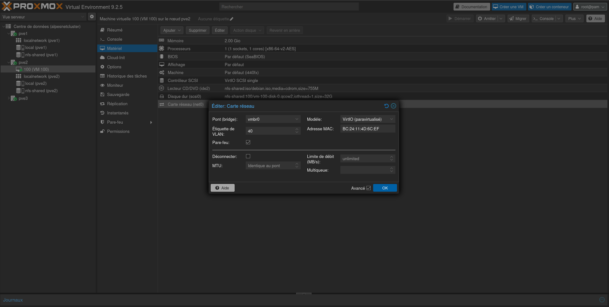
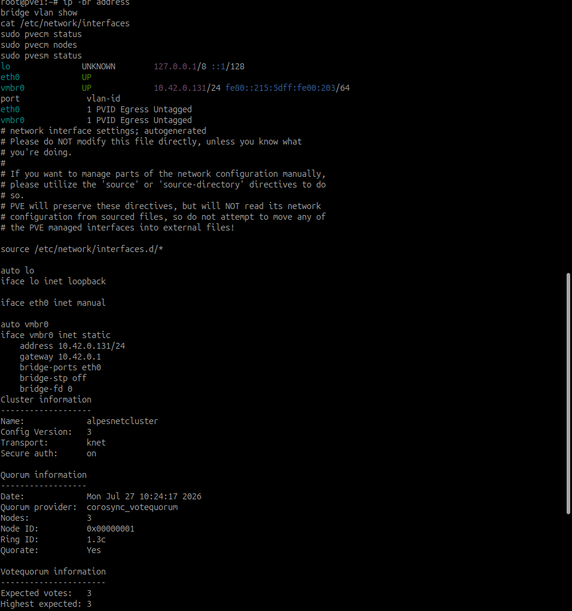
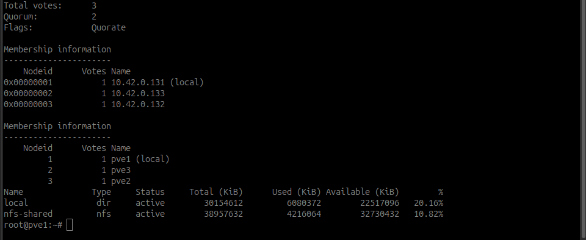
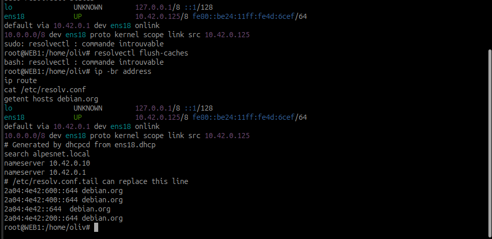

# Comment sécuriser les communications entre les machines virtuelles ?

## Mise en situation

Cette activité permet de comprendre l'intérêt de la segmentation réseau dans une infrastructure virtualisée et de mettre en œuvre une architecture répondant aux besoins de sécurité d'AlpesNet.

!!! question "Problématique"
    **Comment limiter les communications entre les différents services d'AlpesNet afin de renforcer la sécurité de l'infrastructure virtualisée ?**

## Situation initiale réelle

L'environnement encore présent comprend les trois nœuds Proxmox, le stockage partagé `NFS1` et une seule VM applicative : `WEB1`. Les autres VM ont été supprimées en raison du manque important de ressources de `LABO_CORE`.

Ces composants utilisent le même réseau `10.42.0.0/24`. Ils appartiennent donc au même domaine de diffusion et peuvent, en l'absence de pare-feu local, communiquer directement entre eux.



!!! warning "Portée de la réalisation"
    Seuls `WEB1`, les nœuds Proxmox et `NFS1` peuvent produire des preuves réelles. Les autres zones décrivent une architecture future et ne doivent pas être présentées comme déjà déployées.

---

## Activité 1 — Étudier et concevoir la segmentation

### Pourquoi ne pas placer toutes les VM sur le même réseau ?

Un réseau unique ne tient pas compte de la fonction ni du niveau de confiance des machines. Un poste utilisateur, un serveur Web exposé, un contrôleur de domaine et le stockage des VM ne devraient pas disposer du même niveau d'accès.

Sur un même segment, un équipement compromis peut plus facilement :

- découvrir les autres systèmes par ARP, diffusion ou scan ;
- tenter des mouvements latéraux vers les serveurs ;
- atteindre les interfaces d'administration des hyperviseurs ;
- attaquer le stockage contenant les disques des VM ;
- intercepter ou perturber les communications locales ;
- générer des diffusions ou un trafic excessif affectant tout le réseau ;
- contourner le contrôle inter-réseaux puisqu'aucun routeur ou pare-feu ne voit les échanges locaux.

La segmentation réduit la surface d'attaque et place les communications entre zones sous le contrôle d'un équipement de niveau 3 ou d'un pare-feu.

### Services à isoler

| Zone | Systèmes concernés | État |
| --- | --- | --- |
| Administration | Interfaces de `PVE1`, `PVE2` et `PVE3` | Présent |
| Cluster | Corosync entre les trois nœuds | Présent |
| Stockage | `NFS1` et interfaces de stockage des nœuds | Présent |
| DMZ | `WEB1` | Présent |
| Serveurs internes | AD, DNS, CA et fichiers | Cible future |
| Clients | Postes utilisateurs | Cible future |

### Mécanismes utilisables

- **VLAN IEEE 802.1Q** : création de domaines de diffusion distincts sur la même infrastructure physique ;
- **bridges Linux Proxmox** : commutateurs virtuels auxquels sont raccordées les interfaces des VM ;
- **bridge VLAN-aware** : transport de plusieurs VLAN sur `vmbr0`, avec une étiquette affectée à chaque carte virtuelle ;
- **plusieurs interfaces physiques ou bridges** : séparation physique ou logique des flux sensibles ;
- **routage inter-VLAN** : passage obligatoire par un routeur ou pare-feu ;
- **pare-feu Proxmox et pare-feu des systèmes** : filtrage complémentaire au niveau du datacenter, du nœud ou de la VM ;
- **ACL et politique de moindre privilège** : refus par défaut, puis autorisation des seuls flux justifiés.

### Architecture proposée

Les sous-réseaux suivants constituent une **cible de déploiement**. Ils ne représentent pas tous des machines existantes et ne remplacent l'adressage actuel qu'après validation du routage, des VLAN et d'un plan de retour arrière.

| VLAN | Nom | Sous-réseau cible | Passerelle cible | Affectation |
| ---: | --- | --- | --- | --- |
| 10 | `MGMT` | `10.42.10.0/24` | `10.42.10.1` | Proxmox et administration |
| 20 | `SERVERS` | `10.42.20.0/24` | `10.42.20.1` | AD, DNS, CA et fichiers |
| 30 | `STORAGE` | `10.42.30.0/24` | aucune si non routé | NFS partagé |
| 31 | `CLUSTER` | `10.42.31.0/24` | aucune si non routé | Corosync |
| 40 | `DMZ` | `10.42.40.0/24` | `10.42.40.1` | `WEB1` |
| 50 | `CLIENTS` | `10.42.50.0/24` | `10.42.50.1` | `POSTE-01` |

Avec les ressources actuelles, la réalisation se concentre sur les VLAN 10, 30, 31 et 40. Les VLAN `SERVERS` et `CLIENTS` restent documentés pour une évolution future.

### Simulation légère avec des conteneurs LXC

Le manque de puissance de `LABO_CORE` peut être contourné en partie avec des conteneurs LXC pris en charge par Proxmox :

| Conteneur | Rôle | VLAN | Configuration minimale |
| --- | --- | ---: | --- |
| `CT201` | poste client Linux simulé | 50 | 1 vCPU, 256 Mio de RAM, 2 Gio |
| `CT202` | serveur interne Linux simulé | 20 | 1 vCPU, 256 Mio de RAM, 2 Gio |

`CT201` permet de tester les accès autorisés vers `WEB1` et les refus vers les réseaux d'administration ou de stockage. `CT202` permet de vérifier l'isolation entre la DMZ et les serveurs internes.

Les commandes `pct set` ci-dessous supposent que les conteneurs ont déjà été créés. Vérifier leur présence :

```bash
pct list
pct config 201

# Affecter un CT201 existant au VLAN CLIENTS
pct set 201 \
  -net0 name=eth0,bridge=vmbr0,tag=50,ip=dhcp,firewall=1

# Affecter un CT202 existant au VLAN SERVERS
pct set 202 \
  -net0 name=eth0,bridge=vmbr0,tag=20,ip=dhcp,firewall=1
```

Si `Configuration file ... does not exist` apparaît, le CT concerné n'existe pas encore. Le créer depuis **Créer un conteneur** dans Proxmox avant d'utiliser `pct set`.

Ces commandes supposent qu'un DHCP est disponible dans chaque VLAN. Sinon, configurer des adresses statiques et une passerelle correspondant au routeur inter-VLAN.

!!! note "Portée pédagogique"
    Les LXC partagent le noyau Linux du nœud. Ils ne remplacent pas complètement des VM, mais fournissent des points de test très légers pour la communication, l'isolement, le routage et le pare-feu.



Le stockage et Corosync n'ont pas besoin d'une passerelle par défaut : seuls les nœuds Proxmox doivent les joindre. En production, des interfaces physiques ou des liens redondants dédiés sont préférables. Dans le laboratoire imbriqué, des VLAN transportés par le commutateur virtuel Hyper-V permettent d'en reproduire la séparation logique.

### Matrice de flux minimale

| Source | Destination | Flux autorisés | Décision |
| --- | --- | --- | --- |
| Poste d'administration | PVE | TCP `8006`, SSH `22` si nécessaire | Autoriser |
| Futurs clients | Futur serveur AD | DNS, Kerberos, LDAPS, SMB/RPC nécessaires au domaine | Autoriser et journaliser |
| Futurs clients | Futur serveur de fichiers | SMB TCP `445` | Autoriser |
| Clients / externe | `WEB1` | HTTPS TCP `443`, HTTP `80` si redirection | Autoriser |
| `WEB1` | Serveurs internes | Aucun par défaut ; exception applicative documentée | Refuser |
| PVE | `NFS1` | NFSv4 TCP `2049` | Autoriser uniquement depuis les nœuds |
| PVE1/PVE2/PVE3 | VLAN Cluster | Communications Corosync entre nœuds | Autoriser uniquement entre membres |
| Clients / DMZ | VLAN Management, stockage, cluster | Aucun | Refuser |

!!! note "Principe"
    Un VLAN assure une séparation de niveau 2, mais ne constitue pas à lui seul une politique de sécurité. Le filtrage inter-VLAN doit être appliqué par un pare-feu ou des ACL.

---

## Activité 2 — Mettre en œuvre l'architecture

### 1. Préparer l'interconnexion

Avant toute modification :

1. sauvegarder `/etc/network/interfaces` sur chaque nœud ;
2. conserver un accès console Hyper-V aux VM Proxmox ;
3. créer les VLAN sur le routeur ou pare-feu ;
4. configurer le lien vers Hyper-V et Proxmox en trunk pour les VLAN autorisés ;
5. maintenir temporairement le réseau de gestion actuel jusqu'à validation du VLAN 10 ;
6. vérifier que l'usurpation d'adresse MAC reste activée sur les cartes Hyper-V des nœuds imbriqués.

### 2. Configurer le bridge VLAN-aware

Dans Proxmox VE 9.2.5, passer d'abord la vue de gauche sur **Server View**, développer **Datacenter**, puis sélectionner directement le nœud concerné (`PVE1`, `PVE2` ou `PVE3`). Ouvrir ensuite **System → Network** — ou **Système → Réseau** avec l'interface française.

Le bridge n'est pas nécessairement nommé `vmbr0`. Relever celui réellement utilisé par `WEB1`, puis sélectionner sa ligne et cliquer sur **Edit**. Dans le laboratoire, le bridge utilisé est `vmbr0`.

Dans la fenêtre **Éditer : Linux Bridge**, cocher **Gère les VLAN**. L'interface de Proxmox VE 9.2.5 demande une borne de début et une borne de fin. Les valeurs suivantes ont donc été retenues :

| Paramètre | Valeur |
| --- | ---: |
| VLAN début | `10` |
| VLAN fin | `50` |

Cette configuration autorise la plage complète `10-50`, y compris les VLAN intermédiaires qui ne sont pas utilisés par AlpesNet. Ce choix est acceptable pour le laboratoire, mais il est moins restrictif que la liste exacte prévue.

Pour limiter strictement le bridge aux VLAN `10`, `20`, `30`, `31`, `40` et `50`, la configuration peut être ajustée dans `/etc/network/interfaces` :

```text
bridge-vlan-aware yes
bridge-vids 10 20 30 31 40 50
```

!!! note "Justification à fournir"
    La plage `10-50` est utilisée en raison du format proposé par l'interface graphique de Proxmox VE 9.2.5. Seuls les VLAN définis dans le plan d'adressage seront réellement affectés aux VM et aux interfaces. Une configuration de production devrait autoriser exclusivement les identifiants nécessaires.

### Preuve — Configuration de `vmbr0`



*Capture réalisée sur `PVE1` dans **Système → Réseau**. Le bridge `vmbr0`, relié à `eth0`, conserve l'adresse de gestion `10.42.0.131/24`. L'option **Gère les VLAN** est activée et la plage `10-50` apparaît dans les modifications en attente. La capture prouve la préparation du bridge ; l'application effective doit encore être contrôlée avec `bridge vlan show`.*

Pour identifier le bridge sans dépendre de l'interface graphique :

```bash
# Bridges présents sur le nœud
ip -br link show type bridge

# Configuration réseau Proxmox
cat /etc/network/interfaces

# Bridge actuellement utilisé par WEB1 (VM 100 dans ce laboratoire)
qm config 100 | grep '^net'
```

Si la dernière commande affiche par exemple `bridge=vmbr1`, il faut modifier `vmbr1` et non `vmbr0`. Si `WEB1` n'a plus l'ID 100, retrouver son ID avec `qm list`.

Exemple de principe pour `/etc/network/interfaces` :

```text
auto vmbr0
iface vmbr0 inet manual
    bridge-ports ens18
    bridge-stp off
    bridge-fd 0
    bridge-vlan-aware yes
    bridge-vids 10 20 30 31 40 50
```

Le nom `ens18` doit être remplacé par l'interface réellement relevée avec `ip -br link`. La modification est à reproduire de façon cohérente sur les trois nœuds.

!!! danger "Risque de perte d'accès"
    Ne pas déplacer l'adresse de gestion à distance sans console de secours. Appliquer un nœud à la fois, contrôler son accès, puis poursuivre.

### 3. Rattacher les VM

Dans **VM → Hardware → Network Device → Edit** :

- sélectionner le bridge `vmbr0` ;
- saisir le tag VLAN correspondant au rôle ;
- activer le pare-feu de la carte si la politique Proxmox est utilisée ;
- configurer dans l'OS une adresse appartenant au nouveau sous-réseau.

Exemples en ligne de commande :

```bash
# WEB1, VM 100, dans la DMZ
qm set 100 --net0 virtio,bridge=vmbr0,tag=40,firewall=1

# Vérifier la configuration de la VM
qm config 100 | grep '^net'
```

Les ID des autres VM sont à relever avec `qm list` avant toute commande. Une VM ne doit pas recevoir un tag supposé.

### Preuve — Affectation de `WEB1` au VLAN 40



*La carte `net0` de la VM 100 utilise le bridge `vmbr0`, le modèle VirtIO et l'étiquette VLAN `40`. Le pare-feu de l'interface est également activé. Cette capture prouve l'affectation logique de `WEB1` à la DMZ ; elle ne prouve pas encore que le trunk Hyper-V, l'adressage de la VM et le routage du VLAN 40 sont opérationnels.*

### 4. Affectation attendue

| Machine | Segment cible | Contrôle |
| --- | --- | --- |
| `PVE1`, `PVE2`, `PVE3` | VLAN 10 | GUI `8006` accessible depuis l'administration uniquement |
| Futurs serveurs internes | VLAN 20 | cible non déployée |
| `NFS1` et interfaces PVE dédiées | VLAN 30 | montage NFS fonctionnel depuis les trois nœuds |
| interfaces Corosync des PVE | VLAN 31 | quorum et liens Corosync sains |
| `WEB1` | VLAN 40 | publication Web fonctionnelle, accès interne bloqué par défaut |
| Futurs postes clients | VLAN 50 | cible non déployée |

### 5. Vérifier les interfaces

Sur chaque nœud Proxmox :

```bash
ip -br address
bridge vlan show
cat /etc/network/interfaces
pvecm status
pvecm nodes
pvesm status
```



*Premier relevé sur `PVE1` : `vmbr0` porte l'adresse `10.42.0.131/24` et utilise `eth0`. Le cluster `alpesnetcluster` contient trois nœuds et possède le quorum. Le relevé affiché correspond à l'adressage initial ; il doit être complété après application par une sortie de `bridge vlan show` présentant les VLAN autorisés.*



*La suite du contrôle confirme trois votes, un quorum à deux et l'état `Quorate`. Les stockages `local` et `nfs-shared` sont actifs. La modification réseau n'a donc pas dégradé le cluster ni l'accès au stockage au moment de cette vérification.*

Dans les VM Linux :

```bash
ip -br address
ip route
cat /etc/resolv.conf
getent hosts debian.org
```

La commande `resolvectl status` peut être utilisée uniquement si `systemd-resolved` est installé :

```bash
command -v resolvectl >/dev/null && resolvectl status
```

Sur Debian et Proxmox, son absence n'indique pas à elle seule un défaut DNS. Le contenu de `/etc/resolv.conf` permet d'identifier les serveurs DNS configurés, tandis que `getent hosts` valide une résolution effective.



*Dans `WEB1`, l'interface `ens18` possède encore l'adresse initiale `10.42.0.125/8` et la route par défaut pointe vers `10.42.0.1`. `resolvectl` est absent, mais `/etc/resolv.conf` indique les DNS `10.42.0.10` et `10.42.0.1`, puis `getent hosts debian.org` valide la résolution. Cette capture constitue un état initial fonctionnel, pas encore la preuve d'un adressage dans le sous-réseau cible du VLAN 40.*

Dans les VM Windows :

```powershell
Get-NetIPConfiguration
Get-NetIPAddress -AddressFamily IPv4
Get-NetRoute -DestinationPrefix "0.0.0.0/0"
Get-DnsClientServerAddress -AddressFamily IPv4
```

### Justification

L'organisation cible suit le niveau de confiance et le rôle des systèmes. Dans la réalisation actuelle, le bridge est devenu compatible VLAN et `WEB1` a reçu l'étiquette 40. Les interfaces de gestion Proxmox et `NFS1` conservent toutefois leur adressage `10.42.0.0/24`. La séparation complète nécessiterait aussi des interfaces ou VLAN dédiés, un équipement de routage et des règles de filtrage.

---

## Activité 3 — Contrôler et prouver le fonctionnement

### Plan de tests

Le laboratoire ne possède plus qu'une seule VM. Il permet donc de prouver la configuration VLAN de `WEB1`, mais pas une communication entre deux VM du même VLAN. Depuis le poste d'administration actuel, Proxmox et NFS doivent rester accessibles pour administrer et exploiter le cluster.

| Test | Commande ou action | Résultat attendu |
| --- | --- | --- |
| Configuration du bridge | `bridge vlan show` | VLAN autorisés visibles |
| Configuration de `WEB1` | `qm config 100 | grep '^net'` | `bridge=vmbr0` et `tag=40` |
| Poste d'administration vers Proxmox | `Test-NetConnection 10.42.0.131 -Port 8006` | Réussi : accès d'administration conservé |
| Poste d'administration vers NFS | `Test-NetConnection 10.42.0.134 -Port 2049` | Réussi dans le laboratoire actuel |
| Poste vers WEB1 | `Test-NetConnection 10.42.0.125 -Port 80` | À interpréter selon le trunk et l'isolement du VLAN 40 |
| WEB1 vers administration | tentative TCP `8006`/`3389` | Échec attendu |
| PVE vers NFS | `nc -vz 10.42.0.134 2049` | Réussi |
| État cluster | `pvecm status` | quorum présent, trois nœuds attendus |
| Stockage partagé | `pvesm status` | stockage `nfs-shared` actif |
| Migration WEB1 | migration à chaud contrôlée | service toujours accessible |

!!! tip "Un ping refusé ne suffit pas"
    L'isolement doit être validé avec les ports applicatifs concernés. Un pare-feu peut bloquer ICMP tout en autorisant un service TCP.

### Commandes de preuve adaptées au laboratoire

```powershell
$Tests = @(
  @{ Nom = "HTTP-WEB1"; Cible = "10.42.0.125"; Port = 80; Attendu = $true },
  @{ Nom = "Administration-Proxmox"; Cible = "10.42.0.131"; Port = 8006; Attendu = $true },
  @{ Nom = "Stockage-NFS"; Cible = "10.42.0.134"; Port = 2049; Attendu = $true }
)

$Tests | ForEach-Object {
  $Resultat = Test-NetConnection $_.Cible -Port $_.Port -WarningAction SilentlyContinue
  [pscustomobject]@{
    Test = $_.Nom
    Cible = "$($_.Cible):$($_.Port)"
    Obtenu = $Resultat.TcpTestSucceeded
    Attendu = $_.Attendu
    Conforme = ($Resultat.TcpTestSucceeded -eq $_.Attendu)
  }
} | Format-Table -AutoSize
```


*Ce premier essai utilisait des marqueurs génériques et des résultats attendus correspondant à l'architecture cible. Il n'était pas adapté à l'état réel du laboratoire. L'accès à Proxmox sur `8006` et à NFS sur `2049` est normal depuis le poste d'administration, car ces interfaces n'ont pas été déplacées vers des réseaux filtrés. Le service Web doit être testé sur le port réellement configuré, ici HTTP `80` plutôt que HTTPS `443`.*

!!! success "Conclusion de la réalisation"
    L'exercice de configuration est réalisé : `vmbr0` gère les VLAN et la carte de `WEB1` porte le tag 40. Les résultats TCP ne remettent pas cette configuration en cause. Ils montrent simplement que Proxmox et NFS restent volontairement joignables sur le réseau d'administration actuel. La validation d'un isolement inter-VM complet demanderait une seconde VM ou un poste placé dans un autre VLAN, ainsi qu'un routage filtré.

### Preuves à intégrer

- vue Proxmox montrant le bridge et l'option VLAN-aware ;
- configuration de la carte de `WEB1` avec son tag VLAN ;
- adressage relevé dans chaque zone ;
- règles inter-VLAN du pare-feu ;
- résultats positifs vers les services autorisés ;
- résultats négatifs vers les réseaux interdits ;
- état du cluster et du stockage après segmentation ;
- test de migration de `WEB1` ;
- schéma final annoté avec VLAN, sous-réseaux, VM et flux.

Chaque capture doit comporter un titre, la machine source, la date ou le contexte, l'action réalisée et l'interprétation du résultat.

## Analyse du gain de sécurité

La segmentation ne supprime pas une compromission, mais elle en limite les conséquences. Un attaquant ayant pris le contrôle de `WEB1` reste confiné dans la DMZ et ne peut plus atteindre directement les interfaces Proxmox, Corosync ou NFS. Un poste utilisateur compromis ne peut pas administrer l'hyperviseur ni lire le stockage des VM. Les flux nécessaires traversent un point de contrôle où ils peuvent être filtrés, journalisés et audités.

Cette architecture améliore également l'exploitation : les diffusions sont contenues, les flux de stockage et de cluster sont séparés des usages courants, les anomalies sont plus faciles à localiser et la matrice de communication fournit une base claire pour les futurs administrateurs.

## Documentation de référence

- [Proxmox VE — Network Configuration](https://pve.proxmox.com/wiki/Network_Configuration)
- [Proxmox VE — Administration Guide](https://pve.proxmox.com/pve-docs/pve-admin-guide.pdf)
- [Proxmox VE — Firewall](https://pve.proxmox.com/pve-docs/chapter-pve-firewall.html)
- [Proxmox VE — Cluster Manager](https://pve.proxmox.com/pve-docs/chapter-pvecm.html)
