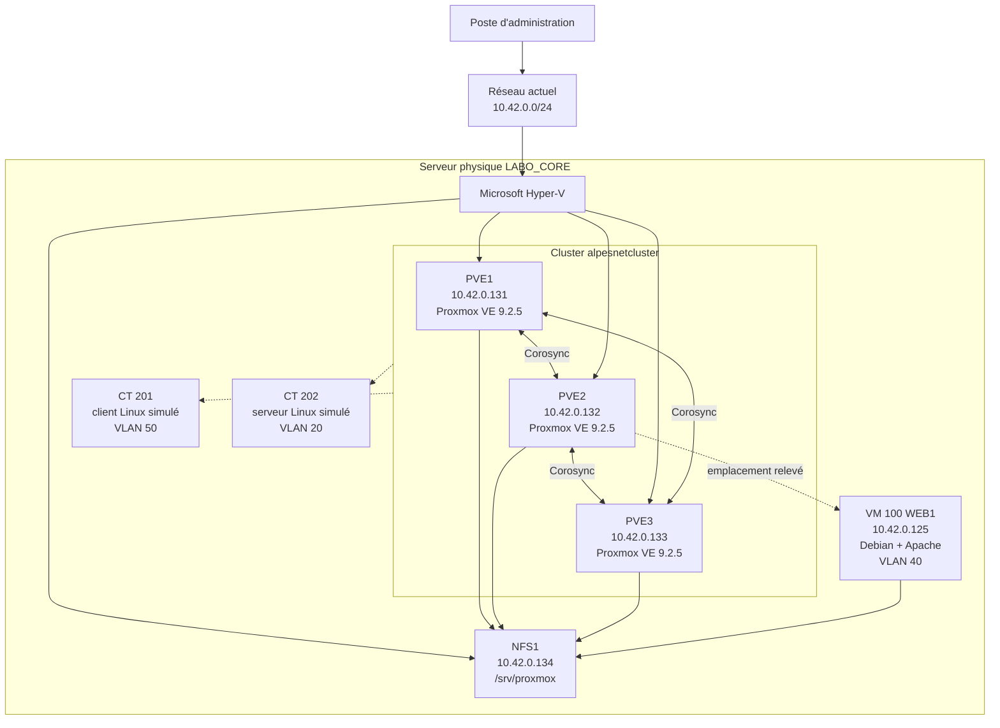
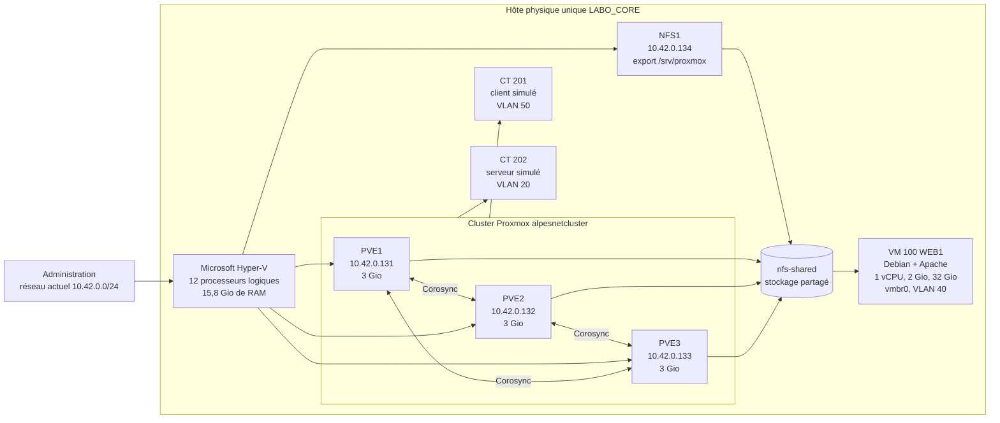

# Comment transmettre une infrastructure à une autre équipe ?

## Mise en situation

Le projet de virtualisation d'AlpesNet est terminé. Une autre équipe doit reprendre l'exploitation quotidienne de l'infrastructure.

Le dossier de transmission doit lui permettre de comprendre l'architecture, d'effectuer les opérations courantes, de diagnostiquer un incident et de connaître les limites de la plateforme sans dépendre de son concepteur.

!!! question "Problématique"
    **L'infrastructure d'AlpesNet est-elle prête à être exploitée en production ?**

---

## Activité 1 — Identifier les informations à transmettre

### Pourquoi documenter une infrastructure ?

La documentation :

- réduit la dépendance envers une seule personne ;
- accélère le diagnostic et le rétablissement des services ;
- évite les modifications réalisées sur de mauvaises hypothèses ;
- facilite les opérations de maintenance et leur retour arrière ;
- permet de contrôler la sécurité, la capacité et la conformité ;
- conserve les choix techniques et leurs justifications ;
- améliore la continuité d'activité lors d'un changement d'équipe.

Une documentation utile décrit à la fois **ce qui existe**, **comment cela fonctionne**, **comment l'exploiter** et **quelles sont ses limites**.

### Documents indispensables

| Document | Contenu attendu |
| --- | --- |
| Schéma d'architecture | hôtes, cluster, VM, stockage, réseaux et dépendances |
| Inventaire | équipements, versions, rôles, IP, ressources et état |
| Plan réseau | bridges, VLAN, sous-réseaux, passerelles et flux autorisés |
| Plan de stockage | volumes, capacité, protocole, dépendances et sauvegardes |
| Procédures d'exploitation | démarrage, arrêt, migration, sauvegarde, restauration et supervision |
| Procédure d'incident | ordre des contrôles, commandes et escalade |
| Plan de continuité | HA, quorum, scénarios de panne et retour à la normale |
| Registre des changements | date, auteur, motif, résultat et retour arrière |
| Matrice des accès | rôles et périmètres, sans mot de passe ni secret |
| Liste des limites | risques acceptés, travaux restants et recommandations |

### Informations à maintenir à jour

- versions de Proxmox VE, Hyper-V, Debian et paquets critiques ;
- inventaire des nœuds, VM et conteneurs ;
- ressources CPU, RAM et disque ;
- adresses IP, VLAN, bridges, DNS et passerelles ;
- emplacement réel des disques des VM ;
- membres du cluster, quorum et ressources HA ;
- capacité et état des stockages ;
- calendrier, destination et résultat des sauvegardes ;
- règles de pare-feu et flux autorisés ;
- contacts, responsabilités et procédure d'escalade ;
- dates des derniers tests de migration et de restauration ;
- incidents, changements et risques connus.

### Risques d'une documentation incomplète

- interruption prolongée pendant un incident ;
- suppression ou modification du mauvais composant ;
- perte d'accès après une modification réseau ;
- migration impossible à cause d'une dépendance inconnue ;
- sauvegardes présentes mais impossibles à restaurer ;
- exposition d'un service ou conservation d'un accès inutile ;
- saturation non anticipée ;
- perte de quorum ou double démarrage d'une VM ;
- transmission de secrets dans des captures ou scripts ;
- décisions contradictoires entre administrateurs.

!!! warning "Gestion des secrets"
    Le dossier indique où les accès sont gérés et qui en est responsable. Il ne contient aucun mot de passe, jeton, fichier de clé privée ou secret d'API.

---

## Activité 2 — Dossier technique final

## 1. Résumé exécutif

L'environnement est un laboratoire de haute disponibilité Proxmox imbriqué dans Hyper-V. Trois nœuds forment le cluster `alpesnetcluster`. Le disque de la VM 100 `WEB1` se trouve sur le stockage NFS partagé `nfs-shared`, ce qui permet sa migration entre les nœuds.

Le montage démontre les fonctions attendues, mais tous les composants dépendent du même serveur physique `LABO_CORE`.

## 2. Schéma d'architecture final



!!! warning "Lecture du schéma"
    L'emplacement de `WEB1` peut changer après une migration ou une action HA. Le stockage NFS reste accessible aux trois nœuds. Le VLAN 40 est configuré sur la carte virtuelle de `WEB1`, mais son routage et son filtrage de bout en bout restent à valider.

## 3. Inventaire des hyperviseurs

| Nœud | IP | Version | Ressources Hyper-V | Rôle | État connu |
| --- | --- | --- | --- | --- | --- |
| `PVE1` | `10.42.0.131/24` | Proxmox VE 9.2.5 | 2 vCPU, 3 Gio RAM | cluster, migration et HA | actif |
| `PVE2` | `10.42.0.132/24` | Proxmox VE 9.2.5 | 2 vCPU, 3 Gio RAM | cluster, hébergement relevé de `WEB1` | actif, pression mémoire |
| `PVE3` | `10.42.0.133/24` | Proxmox VE 9.2.5 | 2 vCPU, 3 Gio RAM | cluster, migration et HA | actif |

État du quorum relevé : trois nœuds, trois votes, quorum à deux et état `Quorate`.

### Dépendance physique

| Composant | Caractéristiques utiles |
| --- | --- |
| `LABO_CORE` | Hyper-V, environ 12 processeurs logiques et 15,8 Gio de RAM |
| vSwitch Hyper-V | transporte les interfaces des trois nœuds et de `NFS1` |
| Risque principal | panne ou saturation de `LABO_CORE` affectant tout le cluster |

## 4. Inventaire des machines virtuelles

### VM gérée par Proxmox

| ID | Nom | OS et service | vCPU | RAM | Disque | Réseau | État |
| ---: | --- | --- | ---: | ---: | --- | --- | --- |
| 100 | `WEB1` | Debian, Apache | 1 | 2 Gio | 32 Gio sur `nfs-shared`, QCOW2 | `vmbr0`, tag VLAN 40, IP relevée `10.42.0.125` | seule VM applicative présente |

### VM Hyper-V hors périmètre actif

Les anciennes VM Hyper-V `DC1` et `WEB1` apparaissent arrêtées. Elles ne doivent pas être confondues avec la VM 100 `WEB1` exécutée dans Proxmox. Leur conservation ou leur suppression devra faire l'objet d'une décision et d'un changement documenté.

### Conteneurs LXC

Deux conteneurs légers complètent désormais l'environnement afin de simuler plusieurs segments sans consommer les ressources d'une VM complète :

| ID | Nom ou rôle | Système | vCPU | RAM | Réseau | Adresse | Emplacement |
| ---: | --- | --- | ---: | ---: | --- | --- | --- |
| 201 | client utilisateur simulé | Linux LXC | 1 | 256 Mio | `vmbr0`, VLAN 50 | à relever | à relever |
| 202 | serveur interne simulé | Linux LXC | 1 | 256 Mio | `vmbr0`, VLAN 20 | à relever | à relever |

Leur état, leur adresse et leur nœud d'exécution doivent être actualisés avec :

```bash
pct list
pct config 201
pct config 202
```

Ces conteneurs servent aux tests de communication, d'isolement et de filtrage. Ils partagent le noyau du nœud Proxmox et ne remplacent donc pas entièrement des VM dans une validation de production.

## 5. Inventaire des réseaux virtuels

### Configuration réellement relevée

| Élément | Configuration |
| --- | --- |
| Réseau principal | `10.42.0.0/24` |
| Passerelle des nœuds | `10.42.0.1` |
| Bridge Proxmox | `vmbr0` relié à `eth0` |
| Gestion des VLAN | activée sur `vmbr0` |
| VLAN autorisés dans le laboratoire | plage `10-50` |
| VLAN affecté à `WEB1` | 40 |

### Architecture réseau cible

| VLAN | Nom | Sous-réseau cible | Usage |
| ---: | --- | --- | --- |
| 10 | `MGMT` | `10.42.10.0/24` | administration |
| 20 | `SERVERS` | `10.42.20.0/24` | serveurs internes |
| 30 | `STORAGE` | `10.42.30.0/24` | NFS |
| 31 | `CLUSTER` | `10.42.31.0/24` | Corosync |
| 40 | `DMZ` | `10.42.40.0/24` | `WEB1` |
| 50 | `CLIENTS` | `10.42.50.0/24` | clients de test |

Cette architecture est documentée, mais elle n'est pas entièrement déployée. Les adresses de gestion, NFS et Corosync restent sur `10.42.0.0/24`.

## 6. Inventaire des stockages

| ID | Type | Emplacement | Usage | État relevé |
| --- | --- | --- | --- | --- |
| `local` | répertoire local | chaque nœud | ISO, modèles et données locales selon configuration | actif, environ 20,17 % utilisé |
| `nfs-shared` | NFS | `NFS1:/srv/proxmox` | disque partagé de `WEB1` | actif, environ 10,82 % utilisé |

Ceph est initialisé mais inutilisé :

- aucun OSD ;
- aucun pool ;
- aucun stockage Ceph déclaré dans `pvesm status` ;
- avertissement accepté : `OSD count 0 < osd_pool_default_size 3`.

Ceph ne doit pas être utilisé dans cet environnement sans nouveau dimensionnement. Il consommerait des ressources dont `LABO_CORE` ne dispose pas.

## 7. État des ressources

| VM Hyper-V | RAM attribuée | RAM demandée relevée | Analyse |
| --- | ---: | ---: | --- |
| `NFS1` | 0,50 Gio | environ 0,20 Gio | marge disponible |
| `PVE1` | 3 Gio | environ 3,72 Gio | demande supérieure |
| `PVE2` | 3 Gio | environ 4,95 Gio | pression importante |
| `PVE3` | 3 Gio | environ 2,67 Gio | marge faible mais positive |

La demande cumulée des trois nœuds atteint environ 11,34 Gio pour 9 Gio attribués. Il ne faut pas ajouter de charge significative sans corriger ce surengagement.

## 8. Principales procédures d'exploitation

### Contrôle quotidien

```bash
pvecm status
pvecm nodes
pvesm status
ha-manager status
qm list
systemctl --failed
```

Vérifier également :

- disponibilité HTTP de `WEB1` ;
- nouvelles tâches en erreur ;
- CPU et mémoire des nœuds ;
- capacité de `local` et `nfs-shared` ;
- erreurs réseau ou perte d'un membre.

### Migration planifiée

1. vérifier quorum, cible et stockage ;
2. vérifier l'absence de sauvegarde ou de migration concurrente ;
3. tester `WEB1` avant l'opération ;
4. lancer la migration à chaud ;
5. contrôler la tâche ;
6. vérifier le nouvel emplacement et le service HTTP.

→ [Procédure de création et validation du cluster](../it-3/comment-creer-un-cluster-proxmox.md)

→ [Procédure de haute disponibilité](../it-3/comment-assurer-la-haute-disponibilite.md)

### Stockage partagé

```bash
pvesm status
findmnt -t nfs,nfs4
ping -c 4 10.42.0.134
```

→ [Procédure de stockage partagé](../it-3/comment-partager-le-stockage-entre-plusieurs-hyperviseurs.md)

### Diagnostic d'incident

Appliquer la méthode du service vers l'infrastructure : utilisateur, service, VM, réseau, stockage, nœud, cluster puis Hyper-V.

→ [Procédure de diagnostic](comment-identifier-origine-dysfonctionnement.md)

### Réseau et VLAN

```bash
ip -br address
ip route
bridge vlan show
qm config 100 | grep '^net'
```

→ [Procédure de segmentation](comment-securiser-les-communications-entre-les-machines-virtuelles.md)

### Performances

Comparer les mesures Proxmox avec celles de `LABO_CORE` avant toute augmentation de ressources.

→ [Procédure d'optimisation](comment-optimiser-performances-infrastructure-virtualisee.md)

### Sauvegarde et restauration

Le stockage partagé ne remplace pas une sauvegarde. La nouvelle équipe doit vérifier :

- qu'une sauvegarde indépendante de `WEB1` est planifiée ;
- que sa destination ne dépend pas uniquement de `LABO_CORE` ;
- qu'une politique de rétention existe ;
- qu'un test de restauration est réalisé et daté ;
- que la configuration Proxmox utile à la reprise est conservée.

!!! danger "Point bloquant"
    Aucune mise en production réelle ne doit être validée sans preuve récente d'une restauration complète de `WEB1`.

## 9. Planning d'exploitation

| Fréquence | Contrôles |
| --- | --- |
| Quotidien | service HTTP, tâches en erreur, quorum, HA et stockage |
| Hebdomadaire | CPU, RAM, espace, latence, sauvegardes et journaux |
| Mensuel | mises à jour, capacité, comptes, règles réseau et documentation |
| Trimestriel | restauration, migration, scénario de panne et contacts |
| Après chaque changement | tests fonctionnels, preuve, retour arrière et mise à jour du dossier |

## 10. Recommandations aux futurs administrateurs

- utiliser un compte nominatif et réserver `root` aux opérations nécessaires ;
- ne jamais conserver de secret dans la documentation ;
- prendre une sauvegarde avant une modification structurante ;
- appliquer les changements réseau un nœud à la fois avec un accès console ;
- ne pas forcer le quorum sans analyser les membres et Corosync ;
- ne pas supprimer un verrou de VM sans vérifier la tâche associée ;
- ne pas confondre l'ancienne VM Hyper-V `WEB1` avec la VM Proxmox 100 ;
- ne pas ajouter de VM sur `PVE2` tant que sa pression mémoire n'est pas corrigée ;
- ne pas déployer Ceph avec les ressources actuelles ;
- documenter chaque migration, incident et modification ;
- tester le service depuis le point de vue utilisateur après chaque intervention.

## 11. Checklist de transmission

- [ ] schéma validé par l'équipe entrante ;
- [ ] inventaires comparés à l'état réel ;
- [ ] accès transmis par un canal sécurisé ;
- [ ] aucun secret présent dans le dossier ;
- [ ] dépendances Hyper-V et NFS comprises ;
- [ ] procédure de migration exécutée en démonstration ;
- [ ] procédure d'incident parcourue ;
- [ ] sauvegarde et restauration démontrées ;
- [ ] limites et risques acceptés formellement ;
- [ ] responsable et circuit d'escalade identifiés ;
- [ ] emplacement et propriétaire de la documentation connus ;
- [ ] date de prochaine revue fixée.

---

## Livrables à présenter au formateur

## Livrable 1 — Schéma d'architecture exploitable par un tiers

La source modifiable du schéma est fournie au format Draw.io :

[:material-download: Télécharger le schéma AlpesNet au format Draw.io](../../assets/diagrams/admin-systemes-virtualisation/alpesnet-architecture-virtualisee.drawio){ .md-button }

Le fichier peut être ouvert avec l'application Draw.io ou directement sur [diagrams.net](https://app.diagrams.net/). Il contient les nœuds du cluster, le stockage NFS, `WEB1`, les deux conteneurs et leurs VLAN.

### Schéma de présentation



### Explication du fonctionnement

1. `LABO_CORE` exécute Hyper-V et héberge les trois nœuds Proxmox ainsi que `NFS1`.
2. `PVE1`, `PVE2` et `PVE3` forment le cluster `alpesnetcluster`. Corosync maintient l'appartenance et le quorum ; deux votes sur trois sont nécessaires.
3. `NFS1` exporte `/srv/proxmox`. Proxmox le déclare sous l'identifiant `nfs-shared`, accessible depuis les trois nœuds.
4. Le disque de `WEB1` se trouve sur ce stockage partagé. La VM peut donc migrer sans copie complète de son disque.
5. `WEB1` est raccordée à `vmbr0` avec le VLAN 40. Les CT 201 et 202 simulent les VLAN 50 et 20 avec une faible consommation.
6. L'administration des nœuds et NFS utilise encore `10.42.0.0/24`. Les réseaux techniques cibles ne sont pas tous séparés physiquement.
7. Le cluster fournit une disponibilité logique, mais pas physique : la perte de `LABO_CORE` arrête toute l'architecture.

### Cohérence à démontrer

| Critère | Élément visible |
| --- | --- |
| Cluster | trois nœuds, liens Corosync et nom `alpesnetcluster` |
| Réseaux | réseau de gestion, `vmbr0` et VLAN 20, 40 et 50 |
| Stockage | `NFS1`, export et stockage `nfs-shared` |
| VM | VM 100 `WEB1`, ressources, service et rattachement réseau |

---

## Livrable 2 — Inventaire documenté des machines virtuelles

### Inventaire à présenter

| Type/ID | Nom | Système et rôle | CPU | RAM | Disque | Stockage | Réseau | Mobilité |
| --- | --- | --- | ---: | ---: | ---: | --- | --- | --- |
| VM 100 | `WEB1` | Debian, serveur Apache | 1 vCPU | 2 Gio | 32 Gio QCOW2 | `nfs-shared` | VirtIO sur `vmbr0`, VLAN 40, IP relevée `10.42.0.125` | migration à chaud possible |
| CT 201 | client simulé | Linux LXC | 1 vCPU | 256 Mio | 2 Gio prévus | à relever | `vmbr0`, VLAN 50, `10.42.50.201/24` | selon stockage réel |
| CT 202 | serveur simulé | Linux LXC | 1 vCPU | 256 Mio | 2 Gio prévus | à relever | `vmbr0`, VLAN 20, `10.42.20.202/24` | selon stockage réel |

Avant la présentation, remplacer les mentions « à relever » avec :

```bash
pct config 201
pct config 202
pct list
```

### Justification du dimensionnement de `WEB1`

`WEB1` est la VM de référence à expliquer si le formateur la choisit.

| Ressource | Valeur | Justification |
| --- | ---: | --- |
| CPU | 1 vCPU | Apache sert une charge pédagogique légère. Ajouter des vCPU sans saturation mesurée augmenterait le surengagement de `LABO_CORE`. |
| RAM | 2 Gio | quantité suffisante pour Debian et Apache tout en conservant une marge minimale sur le nœud Proxmox |
| Disque | 32 Gio | espace suffisant pour le système, les journaux et le contenu Web du laboratoire |
| Format | QCOW2 | compatible avec les fonctions attendues du stockage NFS, notamment les instantanés gérés par Proxmox |
| Contrôleur | VirtIO SCSI single | pilote paravirtualisé adapté aux performances d'une VM Linux |
| Réseau | VirtIO | réduit le coût de l'émulation réseau |
| VLAN | 40 | place le serveur Web dans la zone DMZ prévue |
| Stockage | `nfs-shared` | rend le disque visible depuis les trois nœuds et permet la migration à chaud |

Ce dimensionnement tient compte de la charge réelle et de la contrainte principale : `PVE2` demande déjà environ 4,95 Gio pour seulement 3 Gio attribués dans Hyper-V. Une augmentation de `WEB1` ne serait justifiée qu'après mesure d'une saturation interne et ajout de capacité sur `LABO_CORE`.

### Contrôles de cohérence

```bash
qm config 100
qm status 100
pvesm status
pvesh get /cluster/resources --type vm
```

L'inventaire doit être mis à jour après toute création, suppression, migration permanente ou modification de ressources.

---

## Livrable 3 — Procédure reproductible de migration à chaud

### Objectif

Déplacer la VM 100 `WEB1` d'un nœud Proxmox vers un autre sans arrêter la VM et avec une interruption minimale du service HTTP.

### Prérequis

- les trois nœuds sont en ligne et possèdent le quorum ;
- `WEB1` est démarrée ;
- son disque est entièrement situé sur `nfs-shared` ;
- `nfs-shared` est actif sur la source et la cible ;
- la cible possède assez de CPU et de mémoire ;
- `vmbr0` et le VLAN 40 existent sur la cible ;
- aucune sauvegarde, migration ou tâche incompatible n'est en cours ;
- un poste peut tester HTTP avant et après la migration.

### Étape 1 — Identifier la source et choisir la cible

Depuis n'importe quel nœud :

```bash
pvesh get /cluster/resources --type vm
pvecm nodes
```

Choisir un nœud en ligne différent de la source. Dans l'exemple, `WEB1` se trouve sur `PVE2` et la cible est `PVE1`.

**Étape critique :** ne pas supposer l'emplacement de la VM. Une migration précédente ou la HA peut l'avoir déplacée.

### Étape 2 — Effectuer les précontrôles

Sur le nœud source :

```bash
date
pvecm status
pvesm status
qm status 100
qm config 100
ha-manager status
```

Résultats attendus :

- `Quorate` et trois membres ;
- `nfs-shared` à l'état `active` ;
- VM 100 à l'état `running` ;
- disque de la VM référencé sur `nfs-shared` ;
- aucune erreur HA.

**Justification :** la migration dépend simultanément du cluster, de la cible, du stockage partagé et de la configuration réseau.

### Étape 3 — Mesurer le service avant migration

Depuis un poste autorisé :

```powershell
Test-NetConnection 10.42.0.125 -Port 80
Invoke-WebRequest `
  "http://10.42.0.125" `
  -UseBasicParsing |
  Select-Object StatusCode
```

Conserver le résultat comme état de référence.

### Étape 4 — Lancer la migration

#### Depuis l'interface

1. sélectionner **VM 100** ;
2. cliquer sur **Migrer** ;
3. choisir le nœud cible ;
4. conserver la migration **en ligne** ;
5. contrôler le résumé ;
6. démarrer et suivre le journal de tâche.

#### Depuis la ligne de commande

La commande doit être lancée sur le nœud qui héberge actuellement la VM :

```bash
qm migrate 100 pve1 --online
```

Remplacer `pve1` par la cible réellement choisie.

**Étape critique :** ne pas interrompre une migration en cours. Lire le journal avant toute tentative de déverrouillage ou de relance.

### Étape 5 — Vérifier la migration

```bash
pvesh get /cluster/resources --type vm
qm status 100
pvesm status
pvecm status
```

Depuis le poste :

```powershell
Test-NetConnection 10.42.0.125 -Port 80
Invoke-WebRequest `
  "http://10.42.0.125" `
  -UseBasicParsing |
  Select-Object StatusCode
```

La procédure est validée si :

- `WEB1` apparaît sur la cible ;
- la VM reste `running` ;
- le stockage et le quorum restent sains ;
- le test HTTP retourne un code valide ;
- aucune nouvelle erreur n'apparaît dans les tâches.

### Étape 6 — Documenter

| Information | Valeur à renseigner |
| --- | --- |
| Date et administrateur | |
| Nœud source | |
| Nœud cible | |
| Motif | |
| Heure de début et de fin | |
| Résultat avant migration | |
| Résultat du journal de tâche | |
| Résultat HTTP après migration | |
| Incident éventuel | |

### Échec et retour à l'état normal

- si le précontrôle échoue, ne pas lancer la migration ;
- si la tâche échoue, conserver son journal et vérifier quorum, NFS, mémoire et réseau ;
- si la VM reste sur la source et fonctionne, ne pas la déplacer manuellement ;
- si la VM arrive sur la cible mais que HTTP échoue, utiliser sa console et contrôler `vmbr0`, le VLAN 40, l'adresse IP et Apache ;
- une fois la cause corrigée, une migration inverse peut être réalisée avec la même procédure ;
- ne jamais démarrer manuellement une seconde instance de la même VM.

### Justification des étapes critiques

| Étape | Pourquoi elle est indispensable |
| --- | --- |
| Identifier la source | évite d'exécuter la commande sur le mauvais nœud |
| Vérifier le quorum | garantit la cohérence de la configuration du cluster |
| Vérifier NFS | garantit que le disque reste accessible sur la cible |
| Vérifier les ressources | évite une migration vers un nœud incapable d'héberger la VM |
| Tester HTTP avant | fournit un état de référence |
| Suivre le journal | permet de diagnostiquer sans masquer l'erreur |
| Tester HTTP après | valide le service, pas seulement l'état de la VM |
| Documenter | rend l'opération traçable et reproductible |

---

## Activité 3 — Présenter le dossier

### Architecture retenue

La présentation doit commencer par la chaîne de dépendance :

```text
LABO_CORE → Hyper-V → PVE1/PVE2/PVE3
          → NFS1 → nfs-shared → VM 100 WEB1
```

Le cluster apporte le quorum, la migration logique et le redémarrage HA. Le stockage partagé rend le disque de `WEB1` accessible aux trois nœuds.

### Choix techniques

| Choix | Justification | Limite |
| --- | --- | --- |
| Trois nœuds Proxmox | quorum majoritaire | trois VM sur un seul hôte physique |
| NFS partagé | simple et peu coûteux pour le laboratoire | `NFS1` est un point unique de panne |
| Disque de `WEB1` sur NFS | migration et HA possibles | dépend du réseau et de NFS |
| Bridge VLAN-aware | prépare la segmentation | routage et filtrage incomplets |
| Pas de Ceph | ressources insuffisantes | pas de stockage distribué |
| Une VM et deux LXC légers | permet de tester plusieurs segments avec peu de RAM | les LXC ne reproduisent pas complètement des VM |

### Procédures à présenter

1. contrôle quotidien de l'état ;
2. migration planifiée de `WEB1` ;
3. réaction à la perte d'un nœud ;
4. contrôle de `nfs-shared` ;
5. diagnostic d'un service indisponible ;
6. vérification des ressources et du surengagement ;
7. sauvegarde et restauration ;
8. mise à jour du dossier après changement.

### Réponse à la problématique

!!! failure "Verdict : non prête pour une production réelle"
    L'infrastructure est fonctionnelle comme laboratoire ou plateforme de démonstration, mais elle n'est pas prête à héberger durablement des services de production.

#### Éléments validés

- cluster à trois nœuds et quorum opérationnel ;
- stockage NFS partagé accessible ;
- migration de `WEB1` démontrée ;
- mécanisme HA testé ;
- bridge VLAN-aware et tag VLAN 40 configurés ;
- procédures de diagnostic et d'optimisation documentées.

#### Points bloquants

- `LABO_CORE` reste un point unique de défaillance ;
- les trois nœuds partagent les mêmes ressources physiques ;
- la pression mémoire est déjà visible ;
- `NFS1` constitue un point unique de panne ;
- la segmentation n'est pas validée de bout en bout ;
- la redondance du réseau et du stockage est absente ;
- une seule VM et deux LXC légers ne permettent pas de valider un véritable équilibrage de charges de production ;
- la sauvegarde indépendante et la restauration doivent être prouvées ;
- la supervision et les alertes restent à industrialiser.

#### Conditions minimales avant production

1. installer les nœuds sur des serveurs physiques distincts ;
2. augmenter et redimensionner CPU et RAM avec une réserve N+1 ;
3. rendre le stockage et le réseau redondants ;
4. finaliser les VLAN, le routage et le filtrage ;
5. mettre en place supervision et alertes ;
6. déployer des sauvegardes indépendantes ;
7. réussir un test documenté de restauration ;
8. effectuer une recette de panne, de charge et de sécurité ;
9. faire valider le dossier par l'équipe entrante.

## Conclusion

Le projet démontre correctement les principes de cluster, quorum, stockage partagé, migration, haute disponibilité, segmentation et diagnostic. Sa documentation permet à une autre équipe de reprendre le laboratoire.

Le passage en production doit cependant rester conditionné à la suppression des points uniques de défaillance, à l'ajout de capacité, à la validation complète du réseau et à la preuve d'une restauration. Le bon résultat du laboratoire ne doit pas être confondu avec une haute disponibilité physique.
