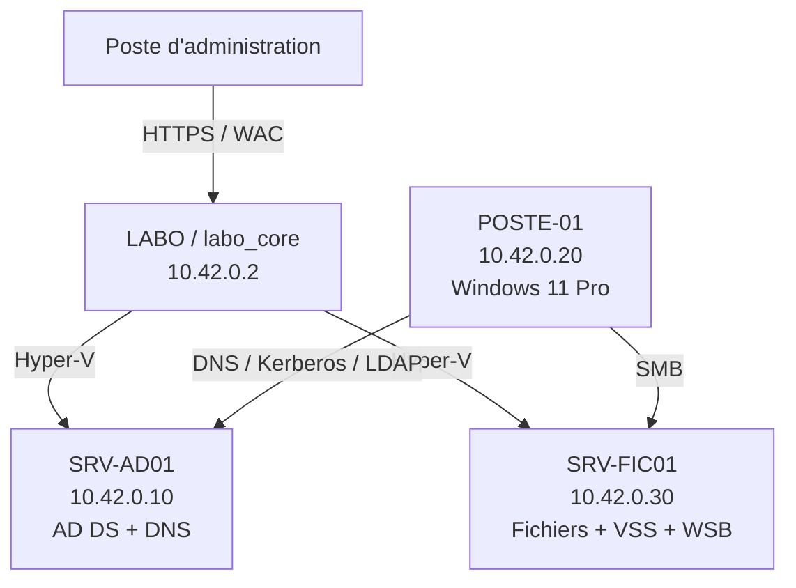

# Architecture, domaine et adressage

## Vue d'ensemble



## Inventaire des machines

| Élément | Adresse / système | Rôle | Source |
| --- | --- | --- | --- |
| `LABO` (`labo_core`) | `10.42.0.2/24`, Windows Server Core | Hôte Hyper-V et Windows Admin Center | Fiche d'installation |
| `SRV-AD01` | `10.42.0.10/24`, Windows Server 2025 Datacenter | Contrôleur de domaine, AD DS et DNS | Fiche + inventaire AD |
| `SRV-FIC01` | `10.42.0.30/24`, Windows Server 2025 Datacenter | Serveur membre et serveur de fichiers | IP confirmée + objet AD constaté |
| `POSTE-01` | `10.42.0.20/24`, Windows 11 Pro | Poste client joint au domaine | IP confirmée + objet AD constaté |

## Paramètres du domaine

| Paramètre | Valeur |
| --- | --- |
| Domaine DNS | `corp.local` |
| Nom NetBIOS | `CORP` |
| Réseau | `10.42.0.0/24` |
| Passerelle | `10.42.0.1` |
| DNS des membres | `10.42.0.10` — SRV-AD01 |
| Hôte Hyper-V | LABO |
| Administration | Windows Admin Center, PowerShell Remoting et RDP si justifié |

!!! danger "Dépendance DNS"
    Les machines jointes au domaine doivent utiliser le DNS de `SRV-AD01`. Un DNS public configuré directement sur un membre empêche la découverte fiable des services Active Directory.

## Contrôles de reprise

```powershell
hostname
ipconfig /all
Get-ADDomain
Get-ADForest
Get-ADDomainController
Get-DnsServerZone
nslookup SRV-AD01.corp.local 10.42.0.10
nslookup -type=SRV _ldap._tcp.dc._msdcs.corp.local 10.42.0.10
```

## Preuve — contrôleur de domaine

**Contexte :** identifier le serveur qui porte les services du domaine avant toute opération de reprise.


**Interprétation :** `SRV-AD01` est identifié comme contrôleur du domaine. La résolution DNS, les partages `SYSVOL` et `NETLOGON`, puis `dcdiag` doivent compléter ce contrôle.
