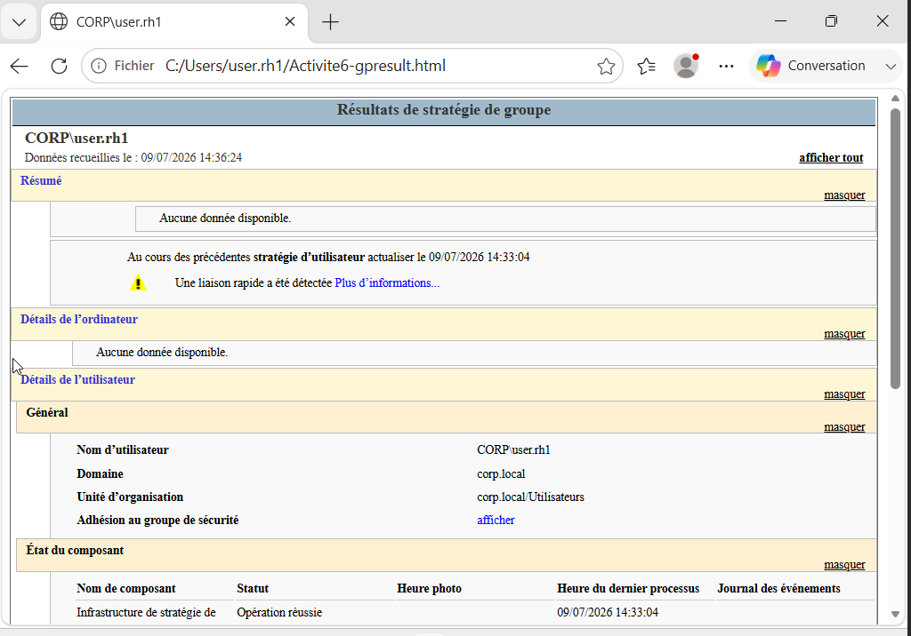

# GPO, BitLocker et Windows LAPS

## Inventaire des GPO

| GPO | Cible | Objectif | Preuve d'application |
| --- | --- | --- | --- |
| `GPO-PasswordPolicy` | Domaine | Documenter la politique de mot de passe | `Get-ADDefaultDomainPasswordPolicy` |
| `GPO-Restriction-Panel` | OU Utilisateurs | Interdire le panneau de configuration | `gpresult` utilisateur |
| `GPO-Deploy-7Zip` | OU Ordinateurs | Déployer 7-Zip depuis un chemin UNC | Application installée + `gpresult` |
| `GPO-BitLocker` | OU Ordinateurs | Chiffrement et récupération dans AD | `manage-bde`, objet AD masqué |
| `GPO-LAPS` | OU Ordinateurs | Rotation du mot de passe administrateur local | Journal LAPS, secret non affiché |
| `GPO-Map-Drives` | OU Utilisateurs | Mapper H:, I: et S: selon les groupes | `net use` et lecteurs visibles |
| `GPO-FW-SRV-AD01` | Domain Controllers | Réduire l'exposition du contrôleur | Export CSV + tests de ports |
| `GPO-FW-SRV-FIC01` | OU Serveurs | Autoriser SMB et administration justifiée | Export CSV + tests de ports |

```powershell
Get-GPO -All | Select-Object DisplayName,GpoStatus
Get-GPInheritance -Target "OU=Ordinateurs,DC=corp,DC=local"
gpupdate /force
gpresult /h C:\Temp\gpresult.html
Get-ADDefaultDomainPasswordPolicy
```



**Contexte :** un rapport `gpresult` démontre l'application effective d'une GPO. La présence d'une GPO dans GPMC ne suffit pas à prouver son traitement par le client.

## BitLocker

| Paramètre | Configuration documentée |
| --- | --- |
| Cible | `POSTE-01` |
| Prérequis | Windows 11 Pro, VM génération 2 et TPM virtuel |
| Méthode | XTS-AES 128 |
| Protecteurs | TPM et récupération |
| Stockage récupération | Active Directory avant chiffrement |

```powershell
Get-BitLockerVolume -MountPoint "C:" |
  Select-Object MountPoint,VolumeStatus,ProtectionStatus,EncryptionMethod

manage-bde -status C:
```


**Interprétation :** le volume système est chiffré à 100 % en XTS-AES 128 et la protection est activée. Aucune clé de récupération n'est publiée.

## Windows LAPS

| Paramètre | Valeur |
| --- | --- |
| GPO | `GPO-LAPS` |
| Cible | `OU=Ordinateurs,DC=corp,DC=local` |
| Sauvegarde | Windows Server Active Directory — `BackupDirectory=2` |
| Délégation | Auto-écriture des attributs LAPS par les ordinateurs |
| Lecture | Administrateurs explicitement habilités uniquement |

```powershell
# Le mot de passe reste protégé : ne pas utiliser -AsPlainText dans une preuve.
Get-LapsADPassword -Identity "POSTE-01" -AsPlainText:$false

Get-WinEvent -LogName "Microsoft-Windows-LAPS/Operational" -MaxEvents 20 |
  Select-Object TimeCreated,Id,LevelDisplayName,Message
```


**Contexte :** la preuve vérifie que les données LAPS sont disponibles dans AD tout en conservant le champ `Password` sous forme de `SecureString`.

!!! danger "Capture exclue"
    La capture originale utilisant `Get-LapsADPassword -AsPlainText` n'est pas reproduite : elle expose un mot de passe local. Un secret déjà affiché ou partagé doit être renouvelé.

## Retour arrière d'une GPO

1. Désactiver le lien sans supprimer immédiatement la GPO.
2. Forcer l'actualisation sur un poste pilote.
3. Vérifier `gpresult` et le journal `Microsoft-Windows-GroupPolicy/Operational`.
4. Confirmer le rétablissement du service.
5. Documenter la cause, l'impact et la décision finale.

