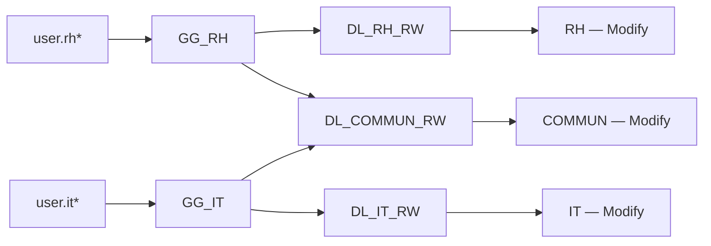
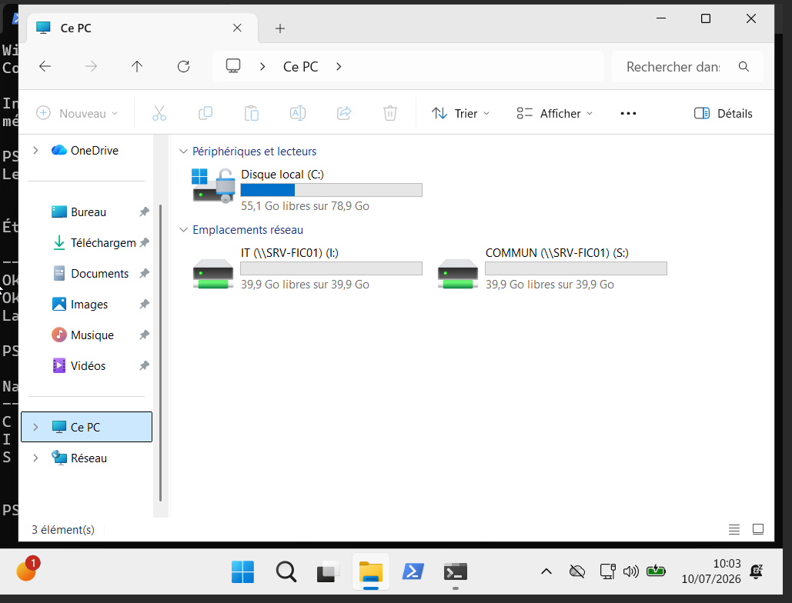
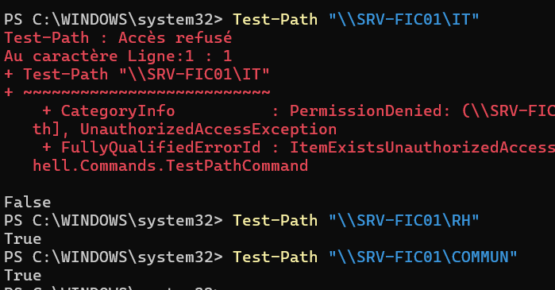

# SRV-FIC01, partages et AGDLP

## Configuration du serveur

| Composant | Configuration |
| --- | --- |
| Nom | `SRV-FIC01` |
| Domaine / OU | `corp.local` / `OU=Serveurs` |
| VM | 2 vCPU, 4 Go RAM, disque système 60 Go |
| Données | Volume `D:` — label DATA — 40 Go |
| Sauvegarde laboratoire | Volume `E:` — label BACKUP — 40 Go |
| Rôle Windows | `FS-FileServer` |
| Racine des données | `D:\DATA` |

## Principe AGDLP

```text
Account → Global group → Domain Local group → Permission
Utilisateur → Groupe global métier → Groupe local de domaine → Droit
```

Les utilisateurs sont placés dans les groupes globaux de leur métier. Ces groupes sont imbriqués dans des groupes locaux de domaine, seuls objets auxquels les permissions de ressources sont accordées.



## Matrice des accès

| Ressource | Chemin UNC | Affectation AGDLP | NTFS / SMB | Lecteur |
| --- | --- | --- | --- | --- |
| RH | `\\SRV-FIC01\RH` | `GG_RH` → `DL_RH_RW` | Modify / Change | `H:` |
| IT | `\\SRV-FIC01\IT` | `GG_IT` → `DL_IT_RW` | Modify / Change | `I:` |
| COMMUN | `\\SRV-FIC01\COMMUN` | `GG_RH` + `GG_IT` → `DL_COMMUN_RW` | Modify / Change | `S:` |

!!! info "Droits effectifs"
    Les droits SMB autorisent l'entrée dans le partage. Les droits NTFS déterminent les opérations possibles sur le dossier. Le droit effectif est la combinaison la plus restrictive.

## Contrôles

```powershell
Get-SmbShare | Select-Object Name,Path,Description
Get-SmbShareAccess -Name RH
Get-SmbShareAccess -Name IT
Get-SmbShareAccess -Name COMMUN

icacls D:\DATA\RH
icacls D:\DATA\IT
icacls D:\DATA\COMMUN

Get-ADGroupMember GG_RH
Get-ADGroupMember DL_RH_RW
```

## Preuves

### Lecteurs d'un utilisateur IT



**Contexte :** vérifier que la GPO de mappage présente seulement les lecteurs correspondant aux groupes du compte connecté.

### Accès gérés



**Contexte :** confirmer que les ressources sont administrées par groupes et non par des permissions directement affectées aux utilisateurs.

