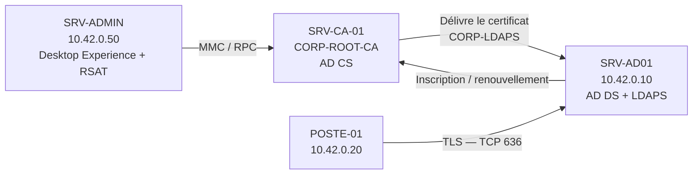
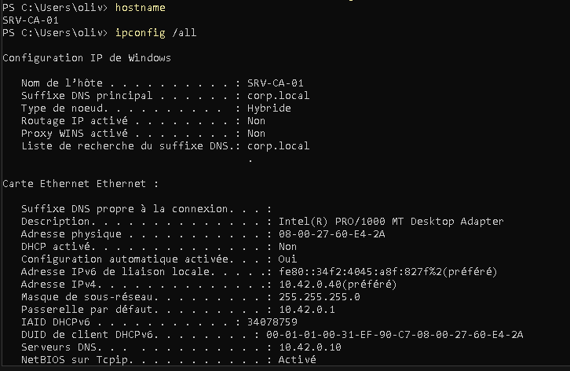
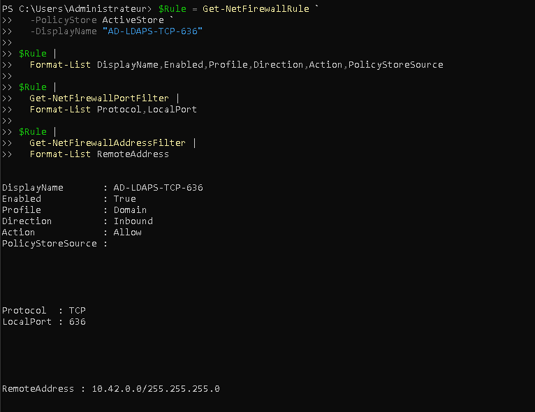
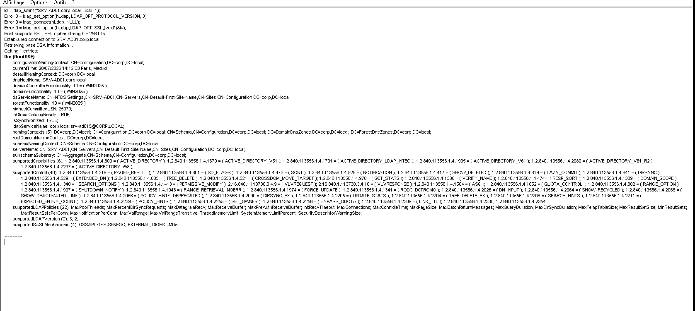
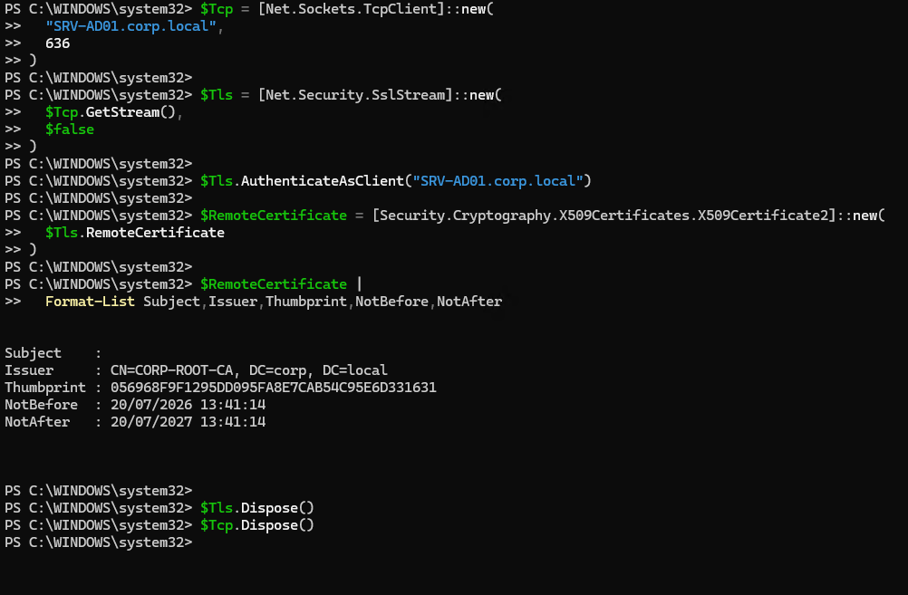

# Activité 13 — Déployer une PKI interne et activer LDAPS

## Mise en situation

Le RSSI impose le chiffrement des communications LDAP. Une autorité de certification interne doit être déployée sur une nouvelle VM `SRV-CA-01`, puis un certificat doit être délivré à `SRV-AD01` afin d'activer LDAP sur TLS, appelé **LDAPS**, sur le port TCP `636`.

!!! info "Résultat attendu"
    `POSTE-01` doit pouvoir établir une connexion TLS vers `SRV-AD01.corp.local:636`, valider la chaîne de confiance et interroger `RootDSE` avec `LDP.exe`.

## Architecture déployée



## Paramètres de référence

| Élément | Valeur |
| --- | --- |
| Domaine | `corp.local` |
| Contrôleur de domaine | `SRV-AD01` — `10.42.0.10` |
| Poste de validation | `POSTE-01` — `10.42.0.20` |
| Autorité de certification | `SRV-CA-01` — `10.42.0.40` — Server Core |
| Serveur d'administration | `SRV-ADMIN` — `10.42.0.50` — Desktop Experience + RSAT AD CS |
| Type d'autorité | Enterprise Root CA |
| Nom commun de la CA | `CORP-ROOT-CA` |
| Clé | RSA 2048 bits minimum, 4096 bits recommandé pour une nouvelle racine |
| Hachage | SHA-256 |
| Validité de la CA | 5 ans |
| Modèle de certificat | `CORP-LDAPS` |
| Port LDAPS | TCP `636` |

## État d'avancement constaté

| Élément | État |
| --- | --- |
| `SRV-CA-01` joint à `corp.local` | Validé, canal sécurisé fonctionnel |
| Rôle `ADCS-Cert-Authority` | Installé sur Server Core |
| `CORP-ROOT-CA` | Configurée et joignable avec `certutil -ping` |
| `SRV-ADMIN` | Installé en Desktop Experience, joint au domaine, RSAT AD CS installé |
| Modèle `CORP-LDAPS` dans Active Directory | Créé ; existence validée par `certutil -template` |
| Permissions du modèle | À restreindre : `Authenticated Users` doit conserver Lecture uniquement |
| Publication par la CA | Validée localement avec `certutil -SetCATemplates +CORP-LDAPS` |
| GPO d'auto-inscription | `AEPolicy = 7`, liaison à l'OU Domain Controllers validée |
| Certificat LDAPS sur `SRV-AD01` | Validé : SAN, EKU, clé privée et empreinte du certificat présenté sur 636 concordent |
| Test TCP 636 / LDP | Validé depuis `POSTE-01`, RootDSE reçu sur TLS |

Certificat effectivement présenté par `SRV-AD01.corp.local:636` :

| Propriété | Valeur constatée |
| --- | --- |
| Émetteur | `CN=CORP-ROOT-CA, DC=corp, DC=local` |
| Empreinte | `056968F9F1295DD095FA8E7CAB54C95E6D331631` |
| Validité | 20/07/2026 13:41:14 au 20/07/2027 13:41:14 |
| FQDN | `SRV-AD01.corp.local` présent dans le SAN |
| Clé privée sur SRV-AD01 | Oui |
| EKU | Server Authentication et Client Authentication |

## Répartition des opérations

| Machine | Opérations |
| --- | --- |
| `SRV-CA-01` | Héberger/configurer la CA, publier localement le modèle, contrôler `CertSvc` |
| `SRV-ADMIN` | Gérer les modèles avec `certtmpl.msc`, créer les GPO, administrer à distance |
| `SRV-AD01` | Appliquer les GPO, demander et vérifier le certificat, héberger LDAPS |
| `POSTE-01` | Tester DNS, TCP 636 et la connexion TLS avec `LDP.exe` |

!!! warning "Avant l'installation d'AD CS"
    Définir définitivement le nom `SRV-CA-01`, configurer une IP fixe, utiliser `10.42.0.10` comme DNS, joindre `corp.local`, synchroniser l'heure et installer les mises à jour. Après l'installation d'AD CS, ne plus renommer le serveur et ne plus modifier son appartenance au domaine.

## Partie 1 — Installer le rôle AD CS

### 1. Préparer SRV-CA-01

Sur la nouvelle VM :

```powershell
Rename-Computer -NewName "SRV-CA-01" -Restart
```

Après le redémarrage, configurer l'adresse IP fixe choisie, puis joindre le domaine :

```powershell
$Credential = Get-Credential "CORP\Administrateur"
Add-Computer -DomainName "corp.local" -Credential $Credential -Restart
```

Contrôler l'état de la machine :

```powershell
hostname
ipconfig /all
whoami
Test-ComputerSecureChannel -Verbose
```

#### Preuve — adressage de SRV-CA-01

**Contexte :** vérifier le nom, l'adresse fixe `10.42.0.40`, la passerelle `10.42.0.1` et le DNS AD `10.42.0.10` avant l'installation d'AD CS.



### 2. Installer Certification Authority

Ouvrir PowerShell en administrateur sur `SRV-CA-01` :

```powershell
Start-Transcript -Path "C:\Logs\Activite13-ADCS-LDAPS.txt" -Force

Install-WindowsFeature ADCS-Cert-Authority `
  -IncludeManagementTools

Get-WindowsFeature ADCS-Cert-Authority
```

Le service de rôle nécessaire est **Certification Authority**. Les services Web Enrollment, NDES et Online Responder ne sont pas requis dans cette activité.

#### Preuve — rôle Certification Authority

**Contexte :** confirmer que le rôle `ADCS-Cert-Authority` est installé sur `SRV-CA-01`.


### 3. Cas de Windows Server Core

`SRV-CA-01` étant installé en **Server Core**, aucune console MMC graphique ne peut être ouverte localement. La vérification locale s'effectue en PowerShell :

```powershell
Get-WindowsFeature ADCS-Cert-Authority
Get-Service CertSvc -ErrorAction SilentlyContinue
Get-Command -Module ADCSDeployment
```

À ce stade, le rôle est installé mais le service `CertSvc` ne sera opérationnel qu'après la configuration de la CA dans la partie suivante.

!!! note "App Compatibility"
    `ServerCore.AppCompatibility` a été installé sur `SRV-CA-01`. Il fournit notamment `mmc.exe`, mais pas les composants enfichables AD CS `certsrv.msc` et `certtmpl.msc`. L'administration graphique reste donc déportée sur `SRV-ADMIN`.

### 4. Installer la console sur un poste graphique

Dans ce laboratoire, l'administration graphique est réalisée depuis `SRV-ADMIN` (`10.42.0.50`), joint à `corp.local`. Installer les outils RSAT AD CS :

```powershell
Install-WindowsFeature RSAT-ADCS -IncludeAllSubFeature
```

Vérifier l'installation :

```powershell
Get-WindowsFeature -Name "RSAT-ADCS*"
```

Après la configuration de la CA, ouvrir la console depuis `SRV-ADMIN` :

```powershell
certsrv.msc
```

Dans la console, clic droit sur **Certification Authority (Local)** ou sur le nœud racine, puis **Retarget Certification Authority** afin de sélectionner `SRV-CA-01`.

Contrôler la CA distante sans dépendre de la console :

```powershell
certutil -config "SRV-CA-01\CORP-ROOT-CA" -ping
```

L'absence du service `CertSvc` local sur `SRV-ADMIN` est normale : ce serveur administre la CA distante mais n'héberge pas lui-même d'autorité.

### 5. Utiliser Windows Admin Center avec Server Core

Windows Admin Center peut administrer `SRV-CA-01` et `SRV-AD01` sans interface graphique locale.

Depuis Windows Admin Center :

1. Aller dans **All connections** > **Add** > **Servers**.
2. Ajouter `SRV-CA-01.corp.local`.
3. Utiliser un compte autorisé avec **Manage as** si nécessaire.
4. Dans **Roles & features**, vérifier ou installer **Active Directory Certificate Services** et **Certification Authority**.
5. Dans **PowerShell**, exécuter `Install-AdcsCertificationAuthority` et les commandes `certutil` de cette feuille.
6. Dans **Services**, contrôler que `Active Directory Certificate Services` — service `CertSvc` — est démarré après configuration.
7. Dans **Certificates**, consulter les magasins et les certificats de la machine gérée.

Pour `SRV-AD01`, ouvrir la connexion correspondante puis utiliser **Certificates** afin de rechercher le certificat délivré par `CORP-ROOT-CA` dans le magasin ordinateur **Personal / My**.

!!! warning "Limite de Windows Admin Center"
    Windows Admin Center gère les rôles, les services, PowerShell et les magasins de certificats, mais il ne fournit pas l'équivalent complet de `certsrv.msc` et `certtmpl.msc`. La duplication du modèle **Domain Controller Authentication** et ses permissions **Enroll/Autoenroll** sont gérées depuis `SRV-ADMIN`.

## Partie 2 — Configurer CORP-ROOT-CA

Sur Server Core, effectuer la configuration avec PowerShell :

Vérifier auparavant que la session utilise un compte du domaine disposant des droits **Admins du domaine** et **Administrateurs de l'entreprise** :

```powershell
whoami
whoami /groups
```

Résultat attendu pour ce laboratoire : `corp\administrateur`. Un compte local comme `SRV-CA-01\oliv`, même administrateur local, ne peut pas créer une Enterprise CA.

```powershell
Install-AdcsCertificationAuthority `
  -CAType EnterpriseRootCA `
  -CACommonName "CORP-ROOT-CA" `
  -CryptoProviderName "RSA#Microsoft Software Key Storage Provider" `
  -KeyLength 4096 `
  -HashAlgorithmName SHA256 `
  -ValidityPeriod Years `
  -ValidityPeriodUnits 5 `
  -Force
```

!!! note "Taille de clé"
    La consigne accepte RSA 2048 ou 4096 bits. Cette procédure retient 4096 bits pour la clé de la nouvelle CA racine. Si les contraintes du laboratoire imposent 2048 bits, modifier uniquement `-KeyLength`.

### Contrôler la CA sur Server Core

```powershell
Get-Service CertSvc
certutil -getreg CA\CommonName
certutil -getreg CA\CSP\HashAlgorithm
certutil -getreg CA\ValidityPeriod
certutil -getreg CA\ValidityPeriodUnits
certutil -cainfo
```

Résultats attendus :

- service `CertSvc` démarré ;
- autorité `CORP-ROOT-CA` visible dans `certsrv.msc` ;
- certificat de CA valide pendant 5 ans ;
- clé RSA et signature SHA-256.

#### Preuve — autorité CORP-ROOT-CA opérationnelle

**Contexte :** confirmer sur `SRV-CA-01` que le service `CertSvc` fonctionne et que l'autorité locale est une Enterprise Root CA nommée `CORP-ROOT-CA`.


**Résultat :** le service est démarré, le nom commun est correct, le type Enterprise Root CA est confirmé et `certutil -cainfo` se termine correctement.

Depuis `SRV-ADMIN`, la même autorité peut ensuite être administrée à distance avec `certsrv.msc`. Le contrôle suivant valide la CA même si la console rencontre un problème de version RPC :

```powershell
certutil -config "SRV-CA-01\CORP-ROOT-CA" -ping
```

!!! warning "Sauvegarde de la PKI"
    La clé privée de la CA est critique. Prévoir une sauvegarde protégée de la CA et de sa base avec `Backup-CARoleService`, sans placer la clé ou son mot de passe dans les captures et livrables.

## Partie 3 — Créer et publier le modèle CORP-LDAPS

### 1. Dupliquer le modèle

La gestion graphique des modèles ne s'effectue pas localement sur Server Core. Depuis `SRV-ADMIN`, avec RSAT AD CS installé :

1. Ouvrir `certsrv.msc` et se connecter à `SRV-CA-01`.
2. Clic droit sur **Certificate Templates** > **Manage**.
3. Clic droit sur **Domain Controller Authentication** > **Duplicate Template**.
4. Dans **General**, définir le nom affiché `CORP-LDAPS`.
5. Définir une durée de validité cohérente et une période de renouvellement permettant l'auto-renouvellement avant expiration.

### 2. Configurer le sujet et les usages

Dans **Subject Name**, conserver **Build from this Active Directory information** et inclure le nom DNS. Le certificat doit contenir le FQDN du contrôleur, ici `SRV-AD01.corp.local`, dans le sujet ou le SAN DNS.

Dans **Extensions** > **Application Policies**, vérifier :

- **Server Authentication** — OID `1.3.6.1.5.5.7.3.1` ;
- **Client Authentication** — OID `1.3.6.1.5.5.7.3.2`, conformément à la consigne de l'activité.

!!! info "Exigence LDAPS"
    `Server Authentication` est l'usage indispensable à LDAPS. `Client Authentication` est conservé ici parce qu'il est demandé dans l'activité, mais il n'est pas nécessaire à lui seul pour que le contrôleur accepte LDAPS.

### 3. Configurer la sécurité

Dans l'onglet **Security** :

1. Ajouter ou sélectionner le groupe `Domain Controllers`.
2. Autoriser **Read**.
3. Autoriser **Enroll**.
4. Autoriser **Autoenroll**.
5. Pour `Authenticated Users`, conserver **Read** uniquement.
6. Retirer **Enroll** et **Autoenroll** de `Authenticated Users` s'ils sont cochés.
7. Ne pas accorder ces permissions à des groupes plus larges sans justification.

Contrôler les permissions et l'existence du modèle depuis `SRV-ADMIN` :

```powershell
certutil -template "CORP-LDAPS"
```

### 4. Publier le modèle

La console distante de `SRV-ADMIN` et la CA Core ont présenté un décalage de version RPC/OLE (`RPC_E_VERSION_MISMATCH`). Enregistrer d'abord le modèle dans Active Directory en choisissant **Oui** dans le message de sauvegarde, puis publier le modèle **localement sur `SRV-CA-01`** :

```powershell
certutil -SetCATemplates +CORP-LDAPS
```

Alternative PowerShell :

```powershell
Import-Module ADCSAdministration
Add-CATemplate -Name "CORP-LDAPS" -Force
```

Vérifier localement sur `SRV-CA-01` :

```powershell
certutil -CATemplates | Select-String "CORP-LDAPS"
```

Si le modèle n'apparaît pas immédiatement :

```powershell
Restart-Service CertSvc
certutil -CATemplates | Select-String "CORP-LDAPS"
```

#### Preuve — publication locale du modèle

**Contexte :** contourner le décalage RPC de la console distante et publier `CORP-LDAPS` directement depuis la CA Core.


**Résultat :** `certutil -SetCATemplates` confirme l'ajout de `CORP-LDAPS` et se termine correctement.

La méthode graphique suivante reste valable lorsque les versions de console et de CA sont compatibles :

1. Clic droit sur **Certificate Templates**.
2. **New** > **Certificate Template to Issue**.
3. Sélectionner `CORP-LDAPS`.
4. Valider et vérifier que le modèle apparaît sous l'autorité.

Ne pas utiliser ici `certutil -config ... -SetCATemplates` depuis `SRV-ADMIN` si la commande renvoie `RPC_E_VERSION_MISMATCH`.

## Partie 4 — Activer l'auto-inscription et émettre le certificat

### 1. Créer la GPO depuis SRV-ADMIN

Le droit `Autoenroll` du modèle doit être accompagné d'une stratégie d'auto-inscription ordinateur. Sur `SRV-ADMIN`, connecté avec `CORP\Administrateur` :

```powershell
Install-WindowsFeature GPMC
Import-Module GroupPolicy

$GpoName = "GPO-Certificate-AutoEnrollment"
$TargetOU = "OU=Domain Controllers,DC=corp,DC=local"
$RegistryKey = "HKLM\Software\Policies\Microsoft\Cryptography\AutoEnrollment"

if (-not (Get-GPO -Name $GpoName -ErrorAction SilentlyContinue)) {
  New-GPO `
    -Name $GpoName `
    -Comment "Auto-inscription des certificats ordinateurs des contrôleurs de domaine"
}

Set-GPRegistryValue `
  -Name $GpoName `
  -Key $RegistryKey `
  -ValueName "AEPolicy" `
  -Type DWord `
  -Value 7

$ExistingLinks = (Get-GPInheritance -Target $TargetOU).GpoLinks.DisplayName

if ($ExistingLinks -notcontains $GpoName) {
  New-GPLink -Name $GpoName -Target $TargetOU -LinkEnabled Yes
}
```

La valeur `AEPolicy = 7` correspond à l'activation de l'auto-inscription et aux options de renouvellement/mise à jour demandées.

Contrôler depuis `SRV-ADMIN` :

```powershell
Get-GPRegistryValue -Name $GpoName -Key $RegistryKey

(Get-GPInheritance -Target $TargetOU).GpoLinks |
  Select-Object DisplayName,Enabled
```

#### Preuve — GPO d'auto-inscription

**Contexte :** vérifier la valeur `AEPolicy=7` et la liaison de `GPO-Certificate-AutoEnrollment` à l'OU des contrôleurs de domaine.


La même configuration peut être visualisée dans GPMC :

Dans une GPO appliquée à l'OU **Domain Controllers** :

```text
Computer Configuration
└── Policies
    └── Windows Settings
        └── Security Settings
            └── Public Key Policies
                └── Certificate Services Client - Auto-Enrollment
```

Activer la stratégie et cocher :

- renouveler les certificats expirés ;
- mettre à jour les certificats utilisant des modèles ;
- inscrire les certificats automatiquement.

### 2. Déclencher l'inscription sur SRV-AD01

Sur `SRV-AD01` :

```powershell
gpupdate /force

Get-ItemProperty `
  "HKLM:\Software\Policies\Microsoft\Cryptography\AutoEnrollment"

certutil -pulse
```

Résultat attendu avant `certutil -pulse` : `AEPolicy = 7`.

Attendre quelques instants. Puis vérifier directement sur `SRV-AD01` avec PowerShell. Comme il est lui aussi en Server Core, `certlm.msc` ne peut pas y être ouvert localement.

Pour une consultation graphique distante depuis `SRV-ADMIN` :

1. Exécuter `mmc.exe`.
2. **File** > **Add/Remove Snap-in**.
3. Ajouter **Certificates**.
4. Choisir **Computer account**, puis **Another computer**.
5. Saisir `SRV-AD01`.
6. Ouvrir **Personal > Certificates**.

La consultation distante nécessite les droits d'administration et l'accès RPC/firewall correspondant. Le contrôle PowerShell ci-dessous reste la méthode la plus fiable sur Server Core.

### 3. Vérifier le certificat sans exposer la clé privée

```powershell
Get-ChildItem Cert:\LocalMachine\My |
  Where-Object {
    $_.EnhancedKeyUsageList.ObjectId -contains "1.3.6.1.5.5.7.3.1"
  } |
  Select-Object Subject,DnsNameList,Issuer,NotBefore,NotAfter,HasPrivateKey,Thumbprint
```

Vérifier :

- émetteur `CORP-ROOT-CA` ;
- FQDN `SRV-AD01.corp.local` dans le sujet ou le SAN ;
- usage **Server Authentication** ;
- clé privée présente — `HasPrivateKey = True` ;
- chaîne de certification valide ;
- date de validité correcte.

#### Preuve — certificats émis sur SRV-AD01

**Contexte :** inventorier les certificats délivrés par `CORP-ROOT-CA` dans le magasin ordinateur de `SRV-AD01` et confirmer la présence du certificat LDAPS avec son SAN, ses EKU et sa clé privée.


**Résultat :** le certificat d'empreinte `056968F9F1295DD095FA8E7CAB54C95E6D331631` contient `SRV-AD01.corp.local`, les usages Server/Client Authentication et `HasPrivateKey=True`.

!!! warning "Activation de LDAPS"
    Après l'installation d'un certificat conforme, redémarrer `SRV-AD01` pendant une fenêtre de maintenance. AD DS sélectionne alors le certificat et accepte les connexions TLS. Si plusieurs certificats compatibles existent, la sélection peut devenir ambiguë : retirer ou renouveler proprement les certificats obsolètes.

## Partie 5 — Autoriser et valider LDAPS

### 1. Mettre à jour la GPO Firewall

La GPO existante `GPO-FW-SRV-AD01` contient déjà une règle LDAPS dans l'inventaire de l'activité 12. Vérifier sa présence plutôt que créer un doublon :

```powershell
$PolicyStore = "corp.local\GPO-FW-SRV-AD01"

Get-NetFirewallRule `
  -PolicyStore $PolicyStore `
  -DisplayName "AD-LDAPS-TCP-636" `
  -ErrorAction SilentlyContinue
```

Si la règle n'existe pas :

```powershell
New-NetFirewallRule `
  -PolicyStore $PolicyStore `
  -DisplayName "AD-LDAPS-TCP-636" `
  -Direction Inbound `
  -Action Allow `
  -Protocol TCP `
  -LocalPort 636 `
  -RemoteAddress 10.42.0.0/24 `
  -Profile Domain
```

Puis sur `SRV-AD01` :

```powershell
gpupdate /force
Get-NetFirewallRule -DisplayName "AD-LDAPS-TCP-636" |
  Get-NetFirewallAddressFilter
```

#### Preuve — règle firewall effective

**Contexte :** vérifier dans l'ActiveStore de `SRV-AD01` que la règle LDAPS est réellement active après application de la GPO.



**Résultat :** règle entrante active sur le profil Domaine, action Allow, protocole TCP, port local 636 et portée distante limitée au réseau du laboratoire `10.42.0.0/24` (`10.42.0.0/255.255.255.0` dans la sortie).

### 2. Tester le port depuis POSTE-01

Utiliser le nom DNS, car il doit correspondre au certificat :

```powershell
Resolve-DnsName SRV-AD01.corp.local
Test-NetConnection SRV-AD01.corp.local -Port 636
```

Résultat attendu :

```text
TcpTestSucceeded : True
```

#### Preuve — connectivité LDAPS

**Contexte :** depuis `POSTE-01` (`10.42.0.20`), résoudre le FQDN de `SRV-AD01` et tester TCP 636.


!!! note "Limite de Test-NetConnection"
    Un test TCP réussi prouve seulement que le port répond. Il ne valide ni le certificat, ni la chaîne de confiance, ni l'établissement correct d'une session LDAP sur TLS. Le test avec `LDP.exe` reste nécessaire.

### 3. Valider avec LDP.exe

Sur `POSTE-01` :

1. Ouvrir `ldp.exe`.
2. Aller dans **Connection** > **Connect**.
3. Saisir `SRV-AD01.corp.local`.
4. Saisir le port `636`.
5. Cocher **SSL**.
6. Cliquer sur **OK**.

Résultat attendu : la connexion réussit et les informations `RootDSE` apparaissent dans le volet droit.

#### Preuve — session LDAP sur TLS

**Contexte :** confirmer avec `LDP.exe` que la connexion SSL vers `SRV-AD01.corp.local:636` établit réellement une session LDAP et retourne `RootDSE`.



**Résultat :** la connexion TLS est établie avec un chiffrement Schannel de 256 bits et les informations Active Directory sont retournées.

### 4. Identifier le certificat réellement présenté

Depuis `POSTE-01`, ouvrir une session TLS validée par Windows et lire le certificat distant :

```powershell
$Tcp = [Net.Sockets.TcpClient]::new("SRV-AD01.corp.local",636)
$Tls = [Net.Security.SslStream]::new($Tcp.GetStream(),$false)
$Tls.AuthenticateAsClient("SRV-AD01.corp.local")

$RemoteCertificate = [Security.Cryptography.X509Certificates.X509Certificate2]::new(
  $Tls.RemoteCertificate
)

$RemoteCertificate |
  Format-List Subject,Issuer,Thumbprint,NotBefore,NotAfter

$Tls.Dispose()
$Tcp.Dispose()
```

Résultat constaté : l'empreinte présentée est `056968F9F1295DD095FA8E7CAB54C95E6D331631`, identique à celle du certificat LDAPS possédant le SAN `SRV-AD01.corp.local`, les EKU serveur/client et une clé privée. L'absence de CN dans `Subject` n'est pas bloquante : l'identité DNS est portée par le SAN et `AuthenticateAsClient` a validé la négociation TLS sans exception.

#### Preuve — certificat présenté sur TCP 636

**Contexte :** établir depuis `POSTE-01` une session TLS validée vers `SRV-AD01.corp.local:636` et comparer l'empreinte distante au certificat installé sur le contrôleur.



**Résultat :** la connexion TLS réussit et l'empreinte distante correspond au certificat LDAPS documenté sur `SRV-AD01`.

Pour tester une authentification : **Connection** > **Bind**, utiliser un compte de test non privilégié et ne jamais faire apparaître son mot de passe dans une capture.

## Diagnostic en cas d'échec

| Symptôme | Contrôle |
| --- | --- |
| Port 636 fermé | GPO firewall, profil Domaine, `gpupdate`, service AD DS |
| Alerte de confiance | Certificat racine présent dans les autorités racines de confiance du client |
| Nom non valide | Connexion avec le FQDN présent dans le SAN, pas avec l'adresse IP |
| Aucun certificat | Publication du modèle, droits Enroll/Autoenroll, GPO d'auto-inscription et `certutil -pulse` |
| Certificat ignoré | EKU Server Authentication, clé privée, FQDN, validité et chaîne de confiance |
| Plusieurs certificats compatibles | Identifier le certificat sélectionné et retirer les certificats obsolètes |
| Erreur TLS | Examiner les journaux Schannel et Directory Service |

```powershell
Get-WinEvent -LogName System -MaxEvents 200 |
  Where-Object ProviderName -eq "Schannel" |
  Select-Object TimeCreated,Id,LevelDisplayName,Message

Get-WinEvent -LogName "Directory Service" -MaxEvents 100 |
  Select-Object TimeCreated,Id,LevelDisplayName,Message
```

## Livrables et preuves attendues

| Preuve | Contexte obligatoire | Secret à exclure |
| --- | --- | --- |
| Rôle AD CS installé | Rôle et service de rôle sur `SRV-CA-01` | Aucun |
| Console distante ou sortie `certutil` | CA démarrée, type Enterprise Root CA | Clé privée de la CA |
| Propriétés `CORP-LDAPS` | EKU, sujet et permissions du groupe Domain Controllers | Aucun |
| Modèle publié | Modèle visible sous Certificate Templates | Aucun |
| Certificat de SRV-AD01 | Sujet/SAN, émetteur, EKU, validité et clé privée présente | Clé privée |
| `Test-NetConnection` | Source POSTE-01, destination FQDN et port 636 | Aucun |
| Connexion `LDP.exe` | SSL coché et RootDSE visible | Mot de passe de bind |
| Règle firewall | Port, protocole, profil et portée distante | Aucun |
| Journal PowerShell | Commandes et résultats utiles | Identifiants et secrets |

### Captures à ne pas remettre comme preuves finales

- `at13et4.png` : commande RSAT comportant un nom de capability erroné et état `NotPresent` ;
- `at13et4b.png` : ancien contrôle montrant `ValidityPeriodUnits = 2` et une erreur RPC ;
- `Cert ok.png` : existence du modèle validée, mais permissions `Enroll/Autoenroll` encore trop larges pour `Authenticated Users` ; refaire cette preuve après correction ;
- toute capture contenant une clé privée, un mot de passe ou une donnée de récupération.

Convention proposée :

```text
HIMBLOT-Olivier-Labo-Activite13-[NomLivrable]
```

## Checklist finale

- [ ] `SRV-CA-01` utilise un nom définitif, une IP fixe et le DNS `10.42.0.10`.
- [ ] `SRV-CA-01` est joint à `corp.local` avant l'installation AD CS.
- [ ] Le rôle AD CS et Certification Authority sont installés.
- [ ] `CORP-ROOT-CA` est une Enterprise Root CA RSA/SHA-256 valable 5 ans.
- [ ] Le modèle `CORP-LDAPS` est publié.
- [ ] Domain Controllers possède Read, Enroll et Autoenroll.
- [ ] Authenticated Users possède Read uniquement, sans Enroll ni Autoenroll.
- [ ] `GPO-Certificate-AutoEnrollment` est liée à l'OU Domain Controllers avec `AEPolicy = 7`.
- [ ] Le certificat de `SRV-AD01` contient son FQDN, Server Authentication et une clé privée.
- [ ] La chaîne vers `CORP-ROOT-CA` est approuvée par `POSTE-01`.
- [ ] La règle TCP 636 est active et limitée au réseau du laboratoire.
- [ ] `Test-NetConnection` retourne `TcpTestSucceeded : True`.
- [ ] `LDP.exe` affiche `RootDSE` avec SSL activé.
- [ ] Aucune clé privée ni aucun mot de passe ne figure dans les preuves.

## Commandes de validation finale à remettre

### Sur SRV-CA-01

```powershell
hostname
whoami
Get-Service CertSvc
certutil -cainfo
certutil -CATemplates | Select-String "CORP-LDAPS"

$CaCertificate = Get-ChildItem Cert:\LocalMachine\My |
  Where-Object Subject -like "*CORP-ROOT-CA*" |
  Select-Object -First 1

$CaCertificate |
  Select-Object Subject,Issuer,NotBefore,NotAfter,SignatureAlgorithm,HasPrivateKey

[Security.Cryptography.X509Certificates.RSACertificateExtensions]::GetRSAPublicKey(
  $CaCertificate
).KeySize
```

### Sur SRV-ADMIN

```powershell
certutil -config "SRV-CA-01\CORP-ROOT-CA" -ping
certutil -template "CORP-LDAPS"

$GpoName = "GPO-Certificate-AutoEnrollment"
$TargetOU = "OU=Domain Controllers,DC=corp,DC=local"
$RegistryKey = "HKLM\Software\Policies\Microsoft\Cryptography\AutoEnrollment"

Get-GPRegistryValue -Name $GpoName -Key $RegistryKey

(Get-GPInheritance -Target $TargetOU).GpoLinks |
  Select-Object DisplayName,Enabled
```

### Sur SRV-AD01

```powershell
gpupdate /force

Get-ItemProperty `
  "HKLM:\Software\Policies\Microsoft\Cryptography\AutoEnrollment"

certutil -pulse

Get-ChildItem Cert:\LocalMachine\My |
  Where-Object {
    $_.EnhancedKeyUsageList.ObjectId -contains "1.3.6.1.5.5.7.3.1"
  } |
  Select-Object Subject,Issuer,DnsNameList,NotBefore,NotAfter,HasPrivateKey,Thumbprint

Get-NetFirewallRule -DisplayName "AD-LDAPS-TCP-636" |
  Select-Object DisplayName,Enabled,Profile,Direction,Action

Get-NetFirewallRule -DisplayName "AD-LDAPS-TCP-636" |
  Get-NetFirewallPortFilter
```

### Sur POSTE-01

```powershell
Resolve-DnsName SRV-AD01.corp.local
Test-NetConnection SRV-AD01.corp.local -Port 636
ldp.exe
```

## Références

- [Microsoft Learn — Configure certificates for LDAP over SSL in AD DS](https://learn.microsoft.com/en-us/windows-server/identity/ad-ds/configure-ldap-signing-certificates?tabs=microsoft-enterprise-ca)
- [Microsoft Learn — Manage certificate templates](https://learn.microsoft.com/en-us/windows-server/identity/ad-cs/manage-certificate-templates)
- [Microsoft Learn — Certificate template concepts](https://learn.microsoft.com/en-us/windows-server/identity/ad-cs/certificate-template-concepts)
- [IT-Connect — Obtenir un certificat LDAPS avec AD CS](https://www.it-connect.fr/active-directory-obtenir-certificat-ldaps-avec-adcs/)
