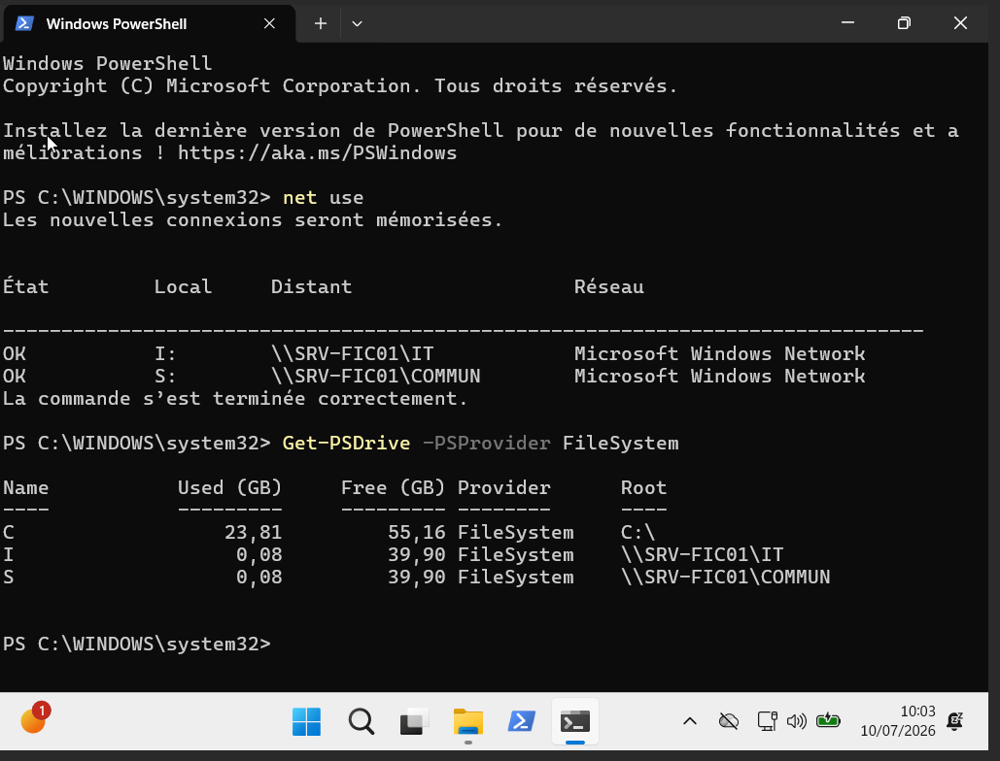
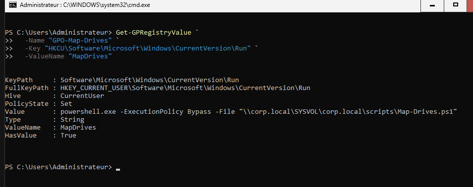

# Activité 7bis - AGDLP, partages SMB et lecteurs réseau

## Mise en situation

`SRV-FIC01` porte maintenant les données utilisateurs.

L'entreprise veut séparer les accès par service :

- les utilisateurs RH accèdent au dossier RH ;
- les utilisateurs IT accèdent au dossier IT ;
- les deux services accèdent à un espace commun ;
- les droits sont donnés aux groupes, pas directement aux utilisateurs.

## Objectif de l'activité

Cette activité sert à appliquer le modèle AGDLP sur le serveur de fichiers.

L'objectif est de :

- créer les groupes locaux de domaine `DL_RH_RW`, `DL_IT_RW`, `DL_COMMUN_RW` ;
- ajouter les groupes globaux métiers dans les groupes locaux de domaine ;
- appliquer les permissions NTFS sur `D:\DATA` ;
- créer les partages SMB ;
- tester les accès avec `user.rh1` et `user.it1` ;
- créer `GPO-Map-Drives` ;
- mapper les lecteurs `H:`, `I:` et `S:` selon les groupes ;
- vérifier après `gpupdate /force`.

## Vue d'ensemble

| Élément | Valeur |
| --- | --- |
| Serveur de fichiers | `SRV-FIC01` |
| Racine données | `D:\DATA` |
| Partages | `RH`, `IT`, `COMMUN` |
| Groupes globaux | `GG_RH`, `GG_IT` |
| Groupes locaux de domaine | `DL_RH_RW`, `DL_IT_RW`, `DL_COMMUN_RW` |
| GPO lecteurs | `GPO-Map-Drives` |
| OU utilisateurs | `OU=Utilisateurs,DC=corp,DC=local` |

!!! warning "Points de vigilance"
    Distinguer les permissions NTFS et les permissions de partage SMB. Ne pas affecter directement les utilisateurs : les accès passent par les groupes.

## Rappel AGDLP

Le modèle AGDLP se lit ainsi :

```text
Account -> Global group -> Domain Local group -> Permission
```

En français :

```text
Utilisateur -> Groupe global métier -> Groupe local de domaine -> Droit sur la ressource
```

## Matrice AGDLP

| Compte | Groupe global | Groupe local domaine | Ressource | Droit |
| --- | --- | --- | --- | --- |
| `user.rh1` | `GG_RH` | `DL_RH_RW` | `D:\DATA\RH` | Modify |
| `user.rh2` | `GG_RH` | `DL_RH_RW` | `D:\DATA\RH` | Modify |
| `user.it1` | `GG_IT` | `DL_IT_RW` | `D:\DATA\IT` | Modify |
| `GG_RH` + `GG_IT` | Groupes métiers | `DL_COMMUN_RW` | `D:\DATA\COMMUN` | Modify |

## Matrice NTFS / SMB

| Ressource | Chemin local | Partage | Groupe autorisé | NTFS | SMB |
| --- | --- | --- | --- | --- | --- |
| RH | `D:\DATA\RH` | `\\SRV-FIC01\RH` | `DL_RH_RW` | Modify | Change |
| IT | `D:\DATA\IT` | `\\SRV-FIC01\IT` | `DL_IT_RW` | Modify | Change |
| COMMUN | `D:\DATA\COMMUN` | `\\SRV-FIC01\COMMUN` | `DL_COMMUN_RW` | Modify | Change |

!!! note "Approche retenue"
    Les droits SMB donnent l'accès au partage. Les droits NTFS décident finement ce qui est autorisé dans le dossier. En cas de conflit, le droit le plus restrictif gagne.

## Étape 1 - Démarrer le journal PowerShell

Sur `SRV-AD01`, ouvrir PowerShell en administrateur :

```powershell
Start-Transcript -Path "C:\Activite7bis-AGDLP-Partages.txt"
```

Définir les variables :

```powershell
$DomainDN = "DC=corp,DC=local"
$GroupOU = "OU=Groupes,$DomainDN"
$UserOU = "OU=Utilisateurs,$DomainDN"
```

## Étape 2 - Créer les groupes locaux de domaine

Créer les groupes `DL_*_RW` dans l'OU `Groupes` :

```powershell
New-ADGroup `
  -Name "DL_RH_RW" `
  -SamAccountName "DL_RH_RW" `
  -GroupScope DomainLocal `
  -GroupCategory Security `
  -Path $GroupOU `
  -Description "Acces Modify au partage RH"

New-ADGroup `
  -Name "DL_IT_RW" `
  -SamAccountName "DL_IT_RW" `
  -GroupScope DomainLocal `
  -GroupCategory Security `
  -Path $GroupOU `
  -Description "Acces Modify au partage IT"

New-ADGroup `
  -Name "DL_COMMUN_RW" `
  -SamAccountName "DL_COMMUN_RW" `
  -GroupScope DomainLocal `
  -GroupCategory Security `
  -Path $GroupOU `
  -Description "Acces Modify au partage COMMUN"
```

Vérifier :

```powershell
Get-ADGroup -Filter 'Name -like "DL_*_RW"' -Properties GroupScope, Description |
  Select-Object Name, GroupScope, Description
```

## Étape 3 - Ajouter les groupes globaux dans les groupes locaux

Ajouter `GG_RH` dans `DL_RH_RW` :

```powershell
Add-ADGroupMember -Identity "DL_RH_RW" -Members "GG_RH"
```

Ajouter `GG_IT` dans `DL_IT_RW` :

```powershell
Add-ADGroupMember -Identity "DL_IT_RW" -Members "GG_IT"
```

Ajouter `GG_RH` et `GG_IT` dans `DL_COMMUN_RW` :

```powershell
Add-ADGroupMember -Identity "DL_COMMUN_RW" -Members "GG_RH","GG_IT"
```

Vérifier :

```powershell
Get-ADGroupMember "DL_RH_RW"
Get-ADGroupMember "DL_IT_RW"
Get-ADGroupMember "DL_COMMUN_RW"
```

## Étape 4 - Appliquer les permissions NTFS

Sur `SRV-FIC01`, ouvrir PowerShell en administrateur.

Vérifier l'arborescence :

```powershell
Get-ChildItem "D:\DATA"
```

Appliquer les permissions NTFS :

```powershell
icacls "D:\DATA\RH" /inheritance:r
icacls "D:\DATA\RH" /grant "CORP\DL_RH_RW:(OI)(CI)M" "CORP\Admins du domaine:(OI)(CI)F" "SYSTEM:(OI)(CI)F"

icacls "D:\DATA\IT" /inheritance:r
icacls "D:\DATA\IT" /grant "CORP\DL_IT_RW:(OI)(CI)M" "CORP\Admins du domaine:(OI)(CI)F" "SYSTEM:(OI)(CI)F"

icacls "D:\DATA\COMMUN" /inheritance:r
icacls "D:\DATA\COMMUN" /grant "CORP\DL_COMMUN_RW:(OI)(CI)M" "CORP\Admins du domaine:(OI)(CI)F" "SYSTEM:(OI)(CI)F"
```

Vérifier :

```powershell
icacls "D:\DATA\RH"
icacls "D:\DATA\IT"
icacls "D:\DATA\COMMUN"
```

!!! note "Droit Modify"
    `M` correspond au droit Modifier. `(OI)(CI)` permet l'héritage sur les fichiers et sous-dossiers.

## Étape 5 - Créer les partages SMB

Sur `SRV-FIC01` :

```powershell
New-SmbShare `
  -Name "RH" `
  -Path "D:\DATA\RH" `
  -ChangeAccess "CORP\DL_RH_RW" `
  -FullAccess "CORP\Admins du domaine"

New-SmbShare `
  -Name "IT" `
  -Path "D:\DATA\IT" `
  -ChangeAccess "CORP\DL_IT_RW" `
  -FullAccess "CORP\Admins du domaine"

New-SmbShare `
  -Name "COMMUN" `
  -Path "D:\DATA\COMMUN" `
  -ChangeAccess "CORP\DL_COMMUN_RW" `
  -FullAccess "CORP\Admins du domaine"
```

Vérifier :

```powershell
Get-SmbShare -Name "RH","IT","COMMUN"
Get-SmbShareAccess -Name "RH"
Get-SmbShareAccess -Name "IT"
Get-SmbShareAccess -Name "COMMUN"
```

## Étape 6 - Tester les accès utilisateurs

Depuis `POSTE-01`, ouvrir une session avec `CORP\user.rh1`.

Tester :

```powershell
Test-Path "\\SRV-FIC01\RH"
Test-Path "\\SRV-FIC01\IT"
Test-Path "\\SRV-FIC01\COMMUN"
```

Créer un fichier autorisé :

```powershell
"test RH" | Out-File "\\SRV-FIC01\RH\test-user-rh1.txt"
"test commun RH" | Out-File "\\SRV-FIC01\COMMUN\test-user-rh1.txt"
```

Le dossier `IT` doit être refusé pour `user.rh1`.

Depuis `POSTE-01`, ouvrir une session avec `CORP\user.it1`.

Tester :

```powershell
Test-Path "\\SRV-FIC01\RH"
Test-Path "\\SRV-FIC01\IT"
Test-Path "\\SRV-FIC01\COMMUN"
```

Créer un fichier autorisé :

```powershell
"test IT" | Out-File "\\SRV-FIC01\IT\test-user-it1.txt"
"test commun IT" | Out-File "\\SRV-FIC01\COMMUN\test-user-it1.txt"
```

Le dossier `RH` doit être refusé pour `user.it1`.

## Étape 7 - Créer GPO-Map-Drives

Sur `SRV-AD01` :

```powershell
New-GPO -Name "GPO-Map-Drives" -Comment "Mappage des lecteurs reseau par groupes metiers"
```

Lier la GPO à l'OU `Utilisateurs` :

```powershell
New-GPLink `
  -Name "GPO-Map-Drives" `
  -Target $UserOU `
  -LinkEnabled Yes
```

Vérifier :

```powershell
Get-GPInheritance -Target $UserOU
```

## Étape 8 - Mapper H:, I:, S: selon les groupes

Deux méthodes sont possibles.

### Méthode A - Préférences GPO avec GPMC

Le mappage des lecteurs se fait normalement avec les préférences de stratégie de groupe.

Depuis un poste avec RSAT/GPMC :

```text
gpmc.msc
```

Modifier `GPO-Map-Drives`, puis aller dans :

```text
Configuration utilisateur
Préférences
Paramètres Windows
Mappages de lecteurs
```

Créer les lecteurs :

| Lecteur | Chemin | Action | Ciblage par groupe |
| --- | --- | --- | --- |
| `H:` | `\\SRV-FIC01\RH` | Update | `CORP\GG_RH` |
| `I:` | `\\SRV-FIC01\IT` | Update | `CORP\GG_IT` |
| `S:` | `\\SRV-FIC01\COMMUN` | Update | `CORP\GG_RH` ou `CORP\GG_IT` |

Pour chaque lecteur :

1. Clic droit, `Nouveau`, `Lecteur mappé`.
2. Action : `Mettre à jour`.
3. Emplacement : chemin UNC.
4. Lettre de lecteur : `H:`, `I:` ou `S:`.
5. Onglet `Commun`.
6. Cocher `Ciblage au niveau de l'élément`.
7. Ajouter une condition `Groupe de sécurité`.
8. Choisir le groupe métier attendu.

!!! warning "Ciblage du lecteur COMMUN"
    Pour `S:`, créer deux conditions avec `GG_RH` ou `GG_IT`, ou deux entrées de lecteur identiques ciblées séparément. L'objectif est que RH et IT voient le commun.

### Méthode B - PowerShell sans GPMC

Si GPMC n'est pas disponible, utiliser un script PowerShell lancé à l'ouverture de session par la GPO.

Sur `SRV-AD01`, créer un dossier de scripts dans `SYSVOL` :

```powershell
$ScriptsPath = "\\corp.local\SYSVOL\corp.local\scripts"
New-Item -ItemType Directory -Path $ScriptsPath -Force
```

Créer le script de mappage :

```powershell
$MapScript = Join-Path $ScriptsPath "Map-Drives.ps1"

@'
$Groups = whoami /groups

function Set-NetworkDrive {
  param(
    [string]$Letter,
    [string]$Path
  )

  if (Test-Path "$Letter`:") {
    net use "$Letter`:" /delete /y | Out-Null
  }

  net use "$Letter`:" $Path /persistent:yes | Out-Null
}

if ($Groups -match "GG_RH") {
  Set-NetworkDrive -Letter "H" -Path "\\SRV-FIC01\RH"
  Set-NetworkDrive -Letter "S" -Path "\\SRV-FIC01\COMMUN"
}

if ($Groups -match "GG_IT") {
  Set-NetworkDrive -Letter "I" -Path "\\SRV-FIC01\IT"
  Set-NetworkDrive -Letter "S" -Path "\\SRV-FIC01\COMMUN"
}
'@ | Set-Content -Path $MapScript -Encoding UTF8
```

Configurer `GPO-Map-Drives` pour lancer le script à l'ouverture de session utilisateur :

```powershell
Set-GPRegistryValue `
  -Name "GPO-Map-Drives" `
  -Key "HKCU\Software\Microsoft\Windows\CurrentVersion\Run" `
  -ValueName "MapDrives" `
  -Type String `
  -Value 'powershell.exe -ExecutionPolicy Bypass -File "\\corp.local\SYSVOL\corp.local\scripts\Map-Drives.ps1"'
```

Vérifier la valeur dans la GPO :

```powershell
Get-GPRegistryValue `
  -Name "GPO-Map-Drives" `
  -Key "HKCU\Software\Microsoft\Windows\CurrentVersion\Run" `
  -ValueName "MapDrives"
```

!!! note "Pourquoi cette méthode fonctionne"
    La GPO applique une clé `Run` dans le profil utilisateur. À l'ouverture de session, Windows lance le script depuis `SYSVOL`, puis le script mappe les lecteurs selon les groupes visibles dans le jeton utilisateur.

!!! warning "Fermeture de session nécessaire"
    Si l'utilisateur vient d'être ajouté à un groupe, il faut fermer puis rouvrir la session. `whoami /groups` ne voit les nouveaux groupes qu'après renouvellement du jeton utilisateur.

## Étape 9 - Vérifier après gpupdate /force

Sur `POSTE-01`, connecté avec `user.rh1` :

```powershell
gpupdate /force
```

Fermer puis rouvrir la session si les lecteurs n'apparaissent pas immédiatement.

Vérifier :

```powershell
net use
Get-PSDrive -PSProvider FileSystem
```

Résultat attendu pour `user.rh1` :

| Lecteur | Résultat |
| --- | --- |
| `H:` | présent |
| `I:` | absent |
| `S:` | présent |

Résultat attendu pour `user.it1` :

| Lecteur | Résultat |
| --- | --- |
| `H:` | absent |
| `I:` | présent |
| `S:` | présent |

## Option avancée - Vérifier SMB et chiffrement

Sur `POSTE-01`, vérifier la connexion SMB :

```powershell
Get-SmbConnection
```

Vérifier les informations utiles :

```powershell
Get-SmbConnection |
  Select-Object ServerName, ShareName, Dialect, Encrypted
```

Sur `SRV-FIC01`, afficher les partages :

```powershell
Get-SmbShare |
  Select-Object Name, Path, EncryptData
```

Activer le chiffrement SMB sur un partage si demandé, depuis `SRV-FIC01` :

```powershell
Set-SmbShare -Name "COMMUN" -EncryptData $true
Get-SmbShare -Name "COMMUN" | Select-Object Name, Path, EncryptData
```

Depuis `SRV-AD01`, exécuter la commande à distance si WinRM est disponible :

```powershell
Invoke-Command -ComputerName "SRV-FIC01" -ScriptBlock {
  Set-SmbShare -Name "COMMUN" -EncryptData $true
  Get-SmbShare -Name "COMMUN" | Select-Object Name, Path, EncryptData
}
```

!!! warning "Serveur hébergeant le partage"
    `Set-SmbShare` agit sur les partages locaux de la machine où la commande s'exécute. Il faut donc lancer la commande sur `SRV-FIC01`, qui héberge `\\SRV-FIC01\COMMUN`. Depuis `POSTE-01`, la commande ne modifie pas le partage distant.

!!! note "Chiffrement SMB"
    Le chiffrement SMB protège les données en transit. Il peut avoir un impact sur les performances, mais il est utile pour les partages sensibles.

## Dépannage rapide

### Accès refusé alors que le groupe semble correct

Vérifier l'appartenance aux groupes :

```powershell
whoami /groups
```

Si le groupe vient d'être ajouté, fermer puis rouvrir la session utilisateur.

### Le partage fonctionne mais pas l'écriture

Vérifier les deux couches :

```powershell
Get-SmbShareAccess -Name "RH"
icacls "D:\DATA\RH"
```

Le droit le plus restrictif entre SMB et NTFS s'applique.

### Les lecteurs ne montent pas

Vérifier que la GPO s'applique côté utilisateur :

```powershell
gpresult /r
```

Vérifier que l'utilisateur est dans la bonne OU et le bon groupe.

## Livrables et preuves attendues

Convention de nommage :

```text
[Nom]-[Prénom]-[Site]-Activite7bis-[NomLivrable]
```

Livrables :

| Livrable | Preuve attendue | Exemple |
| --- | --- | --- |
| Matrice AGDLP | Comptes, groupes, ressources, droits | `Nom-Prenom-Site-Activite7bis-Matrice-AGDLP.md` |
| Matrice NTFS/SMB | Partages, NTFS, SMB | `Nom-Prenom-Site-Activite7bis-Matrice-NTFS-SMB.md` |
| Captures accès | Accès autorisé et refusé | `Nom-Prenom-Site-Activite7bis-Acces.png` |
| Capture lecteurs réseau | `H:`, `I:`, `S:` selon utilisateur | `Nom-Prenom-Site-Activite7bis-Lecteurs.png` |
| Journal PowerShell | Commandes groupes, NTFS, SMB | `Nom-Prenom-Site-Activite7bis-Journal.txt` |

## Exemples de preuves

Lecteurs réseau visibles depuis l'explorateur pour `user.it1` :


Vérification en ligne de commande avec `net use` et `Get-PSDrive` :



Clé de stratégie `MapDrives` configurée dans `GPO-Map-Drives` :



Vue de synthèse des accès gérés :


## Checklist finale

- [ ] `DL_RH_RW` créé.
- [ ] `DL_IT_RW` créé.
- [ ] `DL_COMMUN_RW` créé.
- [ ] `GG_RH` ajouté dans `DL_RH_RW`.
- [ ] `GG_IT` ajouté dans `DL_IT_RW`.
- [ ] `GG_RH` et `GG_IT` ajoutés dans `DL_COMMUN_RW`.
- [ ] NTFS appliqué sur `D:\DATA\RH`.
- [ ] NTFS appliqué sur `D:\DATA\IT`.
- [ ] NTFS appliqué sur `D:\DATA\COMMUN`.
- [ ] Partage `\\SRV-FIC01\RH` créé.
- [ ] Partage `\\SRV-FIC01\IT` créé.
- [ ] Partage `\\SRV-FIC01\COMMUN` créé.
- [ ] Tests `user.rh1` réalisés.
- [ ] Tests `user.it1` réalisés.
- [ ] `GPO-Map-Drives` créée.
- [ ] Lecteur `H:` mappé pour RH.
- [ ] Lecteur `I:` mappé pour IT.
- [ ] Lecteur `S:` mappé pour RH et IT.
- [ ] Vérification après `gpupdate /force`.

## Référence

- IT-Connect - AGDLP : <https://www.it-connect.fr/agdlp-bien-gerer-les-permissions-de-son-serveur-de-fichiers/>
