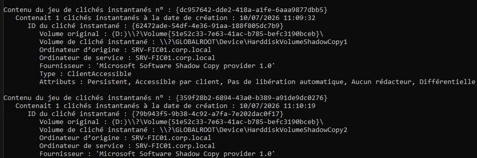
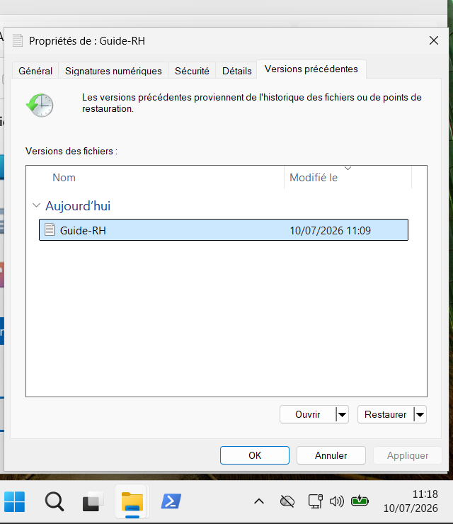
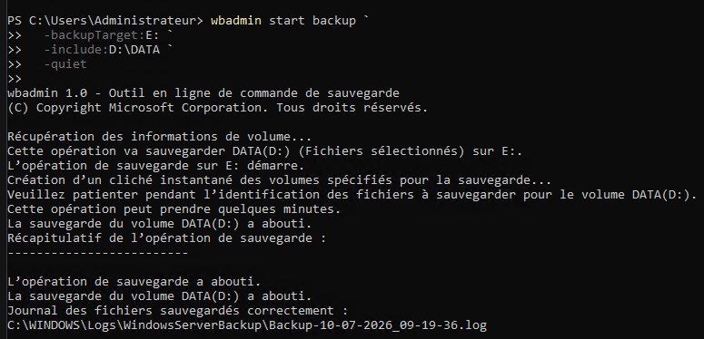
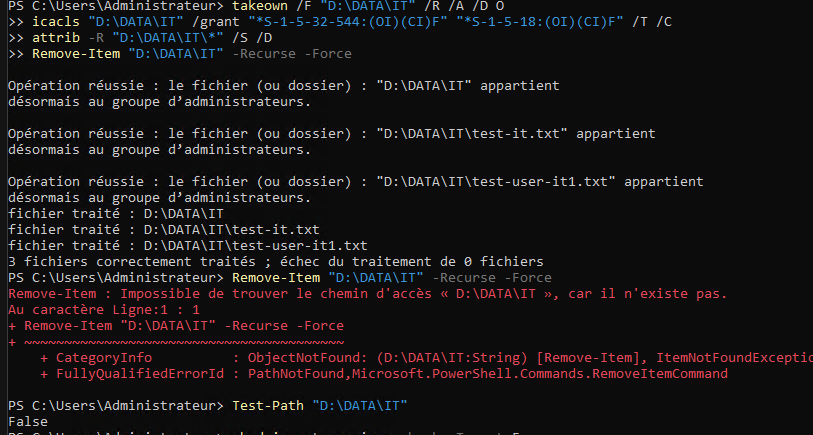
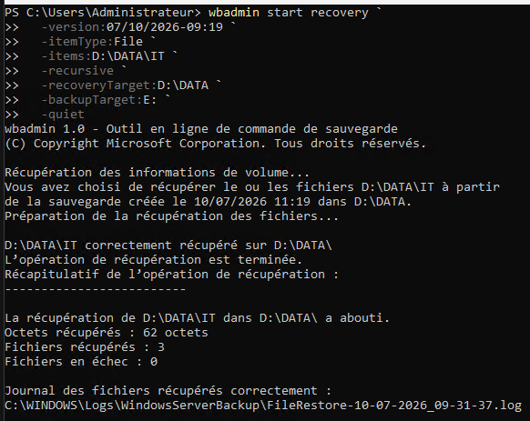
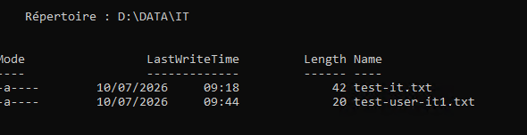
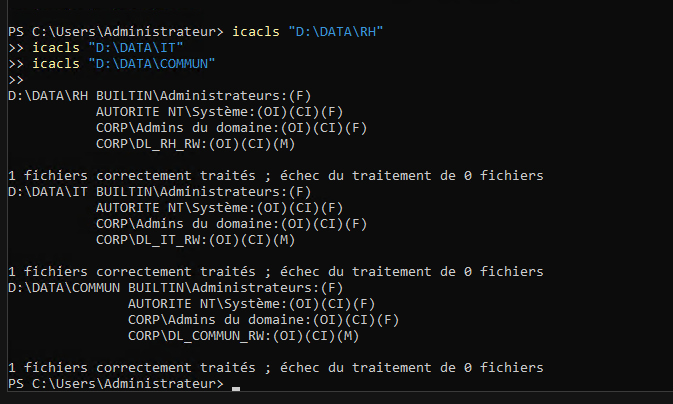

# Activité 8 - Sauvegarde et restauration de SRV-FIC01

## Mise en situation

`SRV-FIC01` héberge les données utilisateurs sur `D:\DATA`.

L'entreprise doit pouvoir :

- restaurer une version précédente d'un fichier après modification ;
- restaurer un fichier supprimé ;
- restaurer un dossier complet ;
- documenter la procédure de sauvegarde et restauration.

## Objectif de l'activité

Cette activité sert à tester deux mécanismes différents :

- les versions précédentes avec les clichés VSS ;
- la sauvegarde/restauration avec Windows Server Backup.

L'objectif est de :

- installer Windows Server Backup ;
- vérifier le volume `E:\BACKUP` ;
- activer ou vérifier les versions précédentes sur `D:` ;
- créer plusieurs clichés ;
- restaurer une version précédente depuis `POSTE-01` ;
- lancer une sauvegarde ponctuelle de `D:\DATA` ;
- restaurer un fichier supprimé ;
- restaurer un dossier complet ;
- vérifier l'arborescence et les permissions NTFS ;
- rédiger une procédure Word.

## Vue d'ensemble

| Élément | Valeur |
| --- | --- |
| Serveur | `SRV-FIC01` |
| Données | `D:\DATA` |
| Sauvegarde | `E:\BACKUP` ou disque dédié |
| Fichier test | `D:\DATA\RH\Guide-RH.docx` |
| Outils | Versions précédentes, VSS, Windows Server Backup |
| Poste de test | `POSTE-01` |

!!! warning "Points de vigilance"
    Ne pas sauvegarder sur le même volume que les données. Ne pas confondre un cliché VSS avec une vraie sauvegarde.

## Différence entre cliché et sauvegarde

| Mécanisme | Rôle | Limite |
| --- | --- | --- |
| Cliché VSS / versions précédentes | Revenir rapidement à une version précédente sur le même serveur | Ne protège pas contre la perte du disque ou du serveur |
| Windows Server Backup | Créer une sauvegarde restaurable sur un autre volume/disque | Plus lent, nécessite un support de sauvegarde |

## Étape 1 - Installer Windows Server Backup

Sur `SRV-FIC01`, ouvrir PowerShell en administrateur.

Démarrer un journal :

```powershell
Start-Transcript -Path "C:\Activite8-Sauvegarde-Restauration-SRV-FIC01.txt"
```

Installer Windows Server Backup :

```powershell
Install-WindowsFeature Windows-Server-Backup -IncludeManagementTools
```

Vérifier :

```powershell
Get-WindowsFeature Windows-Server-Backup
```

Résultat attendu :

```text
Install State : Installed
```

## Étape 2 - Créer ou vérifier E:\BACKUP

Vérifier les volumes :

```powershell
Get-Volume | Select-Object DriveLetter, FileSystemLabel, SizeRemaining, Size
```

Créer le dossier de sauvegarde :

```powershell
New-Item -ItemType Directory -Path "E:\BACKUP" -Force
```

Vérifier :

```powershell
Get-Item "E:\BACKUP"
```

!!! warning "Pas sur D:"
    `D:` contient les données. La sauvegarde doit être placée sur `E:` ou sur un disque/support dédié.

## Étape 3 - Activer ou vérifier les versions précédentes sur D:

Vérifier l'espace VSS :

```powershell
vssadmin list shadowstorage /for=D:
```

Si aucun stockage n'existe, le définir :

```powershell
vssadmin add shadowstorage /for=D: /on=D: /maxsize=10GB
```

Lister les clichés existants :

```powershell
vssadmin list shadows /for=D:
```

!!! note "Versions précédentes"
    Les versions précédentes visibles depuis un poste client s'appuient sur les clichés VSS du volume qui contient les données.

## Étape 4 - Créer un premier cliché

Sur `SRV-FIC01` :

```powershell
vssadmin create shadow /for=D:
```

Vérifier :

```powershell
vssadmin list shadows /for=D:
```

## Étape 5 - Modifier Guide-RH.docx

Créer ou modifier le document de test :

```powershell
"Version 1 - Guide RH" | Out-File "D:\DATA\RH\Guide-RH.docx" -Encoding UTF8
```

Vérifier :

```powershell
Get-Content "D:\DATA\RH\Guide-RH.docx"
```

!!! note "Fichier .docx de labo"
    Pour un test rapide, le fichier peut contenir du texte même avec l'extension `.docx`. Si Word est disponible, créer un vrai document Word pour une preuve plus propre.

## Étape 6 - Créer un second cliché

Créer un nouveau cliché après la première version :

```powershell
vssadmin create shadow /for=D:
```

Vérifier :

```powershell
vssadmin list shadows /for=D:
```

## Étape 7 - Modifier à nouveau le document

Modifier le document :

```powershell
"Version 2 - Guide RH modifie" | Out-File "D:\DATA\RH\Guide-RH.docx" -Encoding UTF8
```

Vérifier :

```powershell
Get-Content "D:\DATA\RH\Guide-RH.docx"
```

## Étape 8 - Restaurer une version précédente depuis POSTE-01

Depuis `POSTE-01`, connecté avec un compte autorisé à accéder au partage RH :

```text
\\SRV-FIC01\RH
```

Restaurer avec l'interface :

1. Clic droit sur `Guide-RH.docx`.
2. `Propriétés`.
3. Onglet `Versions précédentes`.
4. Sélectionner une version.
5. Ouvrir pour vérifier.
6. Restaurer ou copier la version précédente.

Vérifier le contenu restauré :

```powershell
Get-Content "\\SRV-FIC01\RH\Guide-RH.docx"
```

## Étape 9 - Lancer Backup Once > Custom

### Méthode graphique

Sur `SRV-FIC01`, ouvrir :

```text
Windows Server Backup
```

Puis :

```text
Backup Once
Different options
Custom
Add Items
D:\DATA
Local drives
E:
Backup
```

Noter :

- heure de début ;
- heure de fin ;
- taille ;
- statut.

### Méthode PowerShell

Créer une sauvegarde ponctuelle de `D:\DATA` vers `E:` :

```powershell
wbadmin start backup `
  -backupTarget:E: `
  -include:D:\DATA `
  -quiet
```

Vérifier les versions de sauvegarde :

```powershell
wbadmin get versions -backupTarget:E:
```

## Étape 10 - Compléter le journal de sauvegarde

Compléter ce tableau dans la procédure :

| Élément | Valeur |
| --- | --- |
| Serveur | `SRV-FIC01` |
| Données incluses | `D:\DATA` |
| Destination | `E:\BACKUP` ou `E:` |
| Début | à compléter |
| Fin | à compléter |
| Taille | à compléter |
| Statut | Réussite / échec |

## Étape 11 - Supprimer Guide-RH.docx

Sur `SRV-FIC01` ou depuis `POSTE-01` avec un compte autorisé :

```powershell
Remove-Item "D:\DATA\RH\Guide-RH.docx"
```

Vérifier la suppression :

```powershell
Test-Path "D:\DATA\RH\Guide-RH.docx"
```

Résultat attendu :

```text
False
```

## Étape 12 - Restaurer Guide-RH.docx avec Windows Server Backup

### Méthode graphique recommandée

Sur `SRV-FIC01`, ouvrir Windows Server Backup :

```text
Recover
This server
Choisir la date de sauvegarde
Files and folders
D:\DATA\RH\Guide-RH.docx
Original location ou Alternate location
Recover
```

Vérifier :

```powershell
Test-Path "D:\DATA\RH\Guide-RH.docx"
Get-Content "D:\DATA\RH\Guide-RH.docx"
```

### Méthode ligne de commande

Lister les versions :

```powershell
wbadmin get versions -backupTarget:E:
```

Restaurer le fichier en adaptant la version :

```powershell
wbadmin start recovery `
  -version:MM/DD/YYYY-HH:MM `
  -itemType:File `
  -items:D:\DATA\RH\Guide-RH.docx `
  -recoveryTarget:D:\DATA\RH `
  -backupTarget:E: `
  -quiet
```

!!! warning "Adapter la version"
    Remplacer `MM/DD/YYYY-HH:MM` par l'identifiant exact retourné par `wbadmin get versions`.

## Étape 13 - Supprimer D:\DATA\IT

Sur `SRV-FIC01` :

```powershell
Remove-Item "D:\DATA\IT" -Recurse -Force
```

Vérifier :

```powershell
Test-Path "D:\DATA\IT"
```

## Étape 14 - Restaurer le dossier IT complet

### Méthode graphique recommandée

Dans Windows Server Backup :

```text
Recover
This server
Choisir la sauvegarde
Files and folders
D:\DATA\IT
Original location ou Alternate location
Recover
```

### Méthode ligne de commande

```powershell
wbadmin start recovery `
  -version:MM/DD/YYYY-HH:MM `
  -itemType:File `
  -items:D:\DATA\IT `
  -recursive `
  -recoveryTarget:D:\DATA `
  -backupTarget:E: `
  -quiet
```

## Étape 15 - Vérifier fichiers, arborescence et permissions NTFS

Vérifier l'arborescence :

```powershell
Get-ChildItem "D:\DATA" -Recurse
```

Vérifier les permissions :

```powershell
icacls "D:\DATA\RH"
icacls "D:\DATA\IT"
icacls "D:\DATA\COMMUN"
```

Vérifier l'accès depuis `POSTE-01` :

```powershell
Test-Path "\\SRV-FIC01\RH\Guide-RH.docx"
Test-Path "\\SRV-FIC01\IT"
Test-Path "\\SRV-FIC01\COMMUN"
```

## Étape 16 - Compléter le tableau incident / méthode

| Incident | Méthode utilisée | Résultat attendu | Preuve |
| --- | --- | --- | --- |
| Modification de `Guide-RH.docx` | Version précédente | Ancienne version restaurée | Capture onglet versions précédentes |
| Suppression de `Guide-RH.docx` | Windows Server Backup | Fichier restauré | Capture fichier restauré |
| Suppression de `D:\DATA\IT` | Windows Server Backup | Dossier complet restauré | Capture arborescence |
| Vérification des droits | `icacls` | Permissions NTFS conservées | Sortie `icacls` |

## Étape 17 - Rédiger la procédure Word

Créer le document :

```text
Procedure-Sauvegarde-Restauration-SRV-FIC01.docx
```

Structure attendue :

1. Contexte.
2. Différence entre cliché VSS et sauvegarde.
3. Installation de Windows Server Backup.
4. Configuration de `E:\BACKUP`.
5. Création et test des versions précédentes.
6. Sauvegarde ponctuelle de `D:\DATA`.
7. Restauration d'un fichier.
8. Restauration d'un dossier.
9. Vérification des permissions NTFS.
10. Tableau incident / méthode.
11. Captures de preuve.
12. Points de vigilance.

## Dépannage rapide

### L'onglet Versions précédentes est vide

Vérifier qu'un cliché VSS existe :

```powershell
vssadmin list shadows /for=D:
```

Créer un nouveau cliché :

```powershell
vssadmin create shadow /for=D:
```

### Windows Server Backup ne voit pas E:

Vérifier le volume :

```powershell
Get-Volume
```

Vérifier l'espace libre :

```powershell
Get-PSDrive E
```

### La restauration ne remet pas les droits attendus

Vérifier NTFS :

```powershell
icacls "D:\DATA\IT"
```

Si besoin, réappliquer la matrice NTFS de l'activité 7bis.

### La suppression de D:\DATA\IT est refusée

Si les ACL NTFS empêchent la suppression du dossier pour simuler l'incident, reprendre la propriété puis supprimer.

Sur un Windows Server en français :

```powershell
takeown /F "D:\DATA\IT" /R /A /D O
icacls "D:\DATA\IT" /grant "*S-1-5-32-544:(OI)(CI)F" "*S-1-5-18:(OI)(CI)F" /T /C
attrib -R "D:\DATA\IT\*" /S /D
cmd /c rmdir /s /q "D:\DATA\IT"
```

!!! note "Pourquoi /D O ?"
    Sur Windows en français, `takeown /D Y` peut être refusé. Il faut utiliser `O` pour `Oui`.

## Livrables et preuves attendues

Convention de nommage :

```text
[Nom]-[Prénom]-[Site]-Activite8-[NomLivrable]
```

Livrables :

| Livrable | Preuve attendue | Exemple |
| --- | --- | --- |
| Capture Windows Server Backup | Fonctionnalité installée | `Nom-Prenom-Site-Activite8-WSB-Installe.png` |
| Capture Versions précédentes | Onglet avec versions disponibles | `Nom-Prenom-Site-Activite8-VersionsPrecedentes.png` |
| Capture sauvegarde | Statut de sauvegarde réussi | `Nom-Prenom-Site-Activite8-Sauvegarde.png` |
| Capture restauration | Fichier/dossier restauré | `Nom-Prenom-Site-Activite8-Restauration.png` |
| Procédure Word | Procédure complète | `Nom-Prenom-Site-Activite8-Procedure-Sauvegarde-Restauration-SRV-FIC01.docx` |

## Exemples de preuves

Cliché instantané créé sur le volume `D:` :



Versions précédentes disponibles :



Sauvegarde ponctuelle réussie :



Dossier `IT` supprimé pour simuler l'incident :



Restauration du dossier `IT` avec Windows Server Backup :



Dossier `IT` restauré et vérifié :



Tests de restauration sur le serveur de fichiers :



## Checklist finale

- [ ] Windows Server Backup installé.
- [ ] `E:\BACKUP` créé ou vérifié.
- [ ] Versions précédentes sur `D:` vérifiées.
- [ ] Premier cliché créé.
- [ ] `Guide-RH.docx` modifié.
- [ ] Second cliché créé.
- [ ] Document modifié à nouveau.
- [ ] Version précédente restaurée depuis `POSTE-01`.
- [ ] `Backup Once > Custom` réalisé.
- [ ] `D:\DATA` inclus dans la sauvegarde.
- [ ] Sauvegarde stockée sur `E:` ou disque dédié.
- [ ] Début, fin, taille et statut notés.
- [ ] `Guide-RH.docx` supprimé puis restauré.
- [ ] `D:\DATA\IT` supprimé puis restauré.
- [ ] Fichiers vérifiés.
- [ ] Arborescence vérifiée.
- [ ] Permissions NTFS vérifiées.
- [ ] Tableau incident / méthode complété.
- [ ] Procédure Word rédigée.

## Références

- Microsoft Learn - Windows Server Backup : <https://learn.microsoft.com/windows-server/administration/windows-server-backup/windows-server-backup-overview>
- Microsoft Learn - Volume Shadow Copy Service : <https://learn.microsoft.com/windows-server/storage/file-server/volume-shadow-copy-service>
