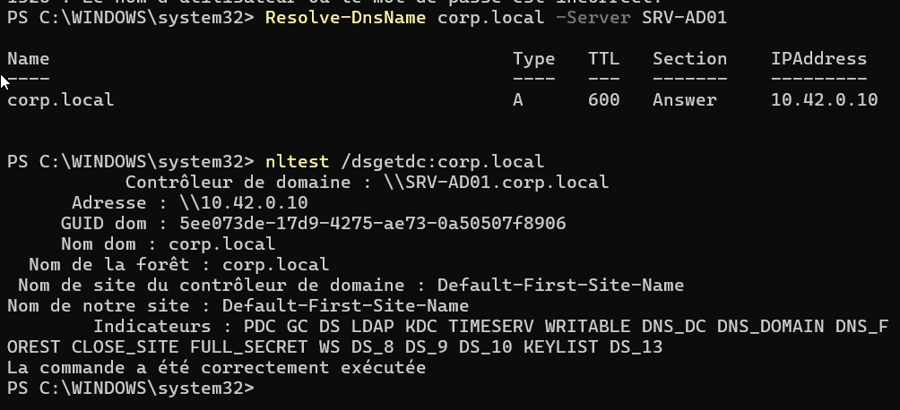

# Activité 11 - Durcissement firewall et journaux Windows

## Mise en situation

On applique le principe de moindre exposition réseau.

`SRV-AD01` et `SRV-FIC01` n'ont pas les mêmes rôles, donc ils ne doivent pas exposer les mêmes ports.

L'objectif est de créer deux GPO de pare-feu, de tester les flux utiles depuis `POSTE-01`, puis d'exploiter les journaux Windows pour documenter les connexions réussies, les échecs et les événements système.

## Objectif de l'activité

Cette activité sert à :

- créer `GPO-FW-SRV-AD01` ;
- créer `GPO-FW-SRV-FIC01` ;
- compléter une matrice des flux nécessaires ;
- autoriser uniquement les ports utiles ;
- ne pas ouvrir les services inutilisés ;
- appliquer les GPO ;
- tester depuis `POSTE-01` ;
- vérifier l'authentification domaine et les partages ;
- consulter les journaux `Security`, `System` et `Application` ;
- exporter ou capturer les événements importants ;
- rédiger une synthèse de durcissement.

!!! warning "Point de vigilance"
    Ne pas désactiver le pare-feu Windows. Le but est de le garder actif et de réduire les ouvertures au strict nécessaire.

## Vue d'ensemble

| Élément | Valeur |
| --- | --- |
| Contrôleur de domaine | `SRV-AD01` |
| Serveur de fichiers | `SRV-FIC01` |
| Poste de test | `POSTE-01` |
| Domaine | `corp.local` |
| GPO AD | `GPO-FW-SRV-AD01` |
| GPO fichiers | `GPO-FW-SRV-FIC01` |
| Outils principaux | PowerShell, GPMC, Event Viewer, `Get-WinEvent` |

## Matrice des flux nécessaires

| Serveur | Port | Protocole | Service | Justification |
| --- | --- | --- | --- | --- |
| `SRV-AD01` | 53 | TCP/UDP | DNS | Résolution de noms Active Directory |
| `SRV-AD01` | 88 | TCP/UDP | Kerberos | Authentification domaine |
| `SRV-AD01` | 389 | TCP/UDP | LDAP | Accès annuaire |
| `SRV-AD01` | 636 | TCP | LDAPS | LDAP chiffré si utilisé |
| `SRV-AD01` | 3268/3269 | TCP | Global Catalog | Catalogue global Active Directory |
| `SRV-AD01` | 445 | TCP | SMB | Accès `SYSVOL` et `NETLOGON` |
| `SRV-AD01` | 135 | TCP | RPC | Services Windows et administration AD |
| `SRV-AD01` | 3389 | TCP | RDP | Administration distante si justifiée |
| `SRV-FIC01` | 445 | TCP | SMB | Accès aux partages fichiers |
| `SRV-FIC01` | 135 | TCP | RPC | Administration Windows si nécessaire |
| `SRV-FIC01` | 3389 | TCP | RDP | Administration distante si autorisée |

Ne pas créer de règle d'autorisation pour `HTTP 80`, `HTTPS 443`, `FTP 21` ou les services de streaming si ces services ne sont pas utilisés.

## Étape 1 - Créer les GPO

Sur `SRV-AD01`, ouvrir PowerShell en administrateur.

Créer les GPO :

```powershell
New-GPO -Name "GPO-FW-SRV-AD01" -Comment "Durcissement firewall du controleur de domaine SRV-AD01"
New-GPO -Name "GPO-FW-SRV-FIC01" -Comment "Durcissement firewall du serveur de fichiers SRV-FIC01"
```

Définir les OU de liaison :

```powershell
$DomainDN = "DC=corp,DC=local"
$DcOU = "OU=Domain Controllers,$DomainDN"
$ServersOU = "OU=Serveurs,$DomainDN"
```

Lier les GPO :

```powershell
New-GPLink -Name "GPO-FW-SRV-AD01" -Target $DcOU -LinkEnabled Yes
New-GPLink -Name "GPO-FW-SRV-FIC01" -Target $ServersOU -LinkEnabled Yes
```

Vérifier :

```powershell
Get-GPO -Name "GPO-FW-SRV-AD01"
Get-GPO -Name "GPO-FW-SRV-FIC01"

(Get-GPInheritance -Target $DcOU).GpoLinks
(Get-GPInheritance -Target $ServersOU).GpoLinks
```

!!! note
    `SRV-AD01` est un contrôleur de domaine. Il est donc normalement dans l'OU `Domain Controllers`.
    `SRV-FIC01` doit être dans l'OU `Serveurs`.

## Étape 2 - Activer le pare-feu dans les GPO

Préparer les emplacements de stratégie :

```powershell
$AdPolicyStore = "corp.local\GPO-FW-SRV-AD01"
$FilePolicyStore = "corp.local\GPO-FW-SRV-FIC01"
```

Activer le profil domaine et garder le trafic sortant autorisé :

```powershell
Set-NetFirewallProfile `
  -PolicyStore $AdPolicyStore `
  -Profile Domain `
  -Enabled True `
  -DefaultInboundAction Block `
  -DefaultOutboundAction Allow

Set-NetFirewallProfile `
  -PolicyStore $FilePolicyStore `
  -Profile Domain `
  -Enabled True `
  -DefaultInboundAction Block `
  -DefaultOutboundAction Allow
```

## Étape 3 - Créer les règles pour SRV-AD01

Créer les règles nécessaires au contrôleur de domaine :

```powershell
$AdPolicyStore = "corp.local\GPO-FW-SRV-AD01"

New-NetFirewallRule -PolicyStore $AdPolicyStore -DisplayName "AD-DNS-TCP-53" -Direction Inbound -Action Allow -Protocol TCP -LocalPort 53 -Profile Domain
New-NetFirewallRule -PolicyStore $AdPolicyStore -DisplayName "AD-DNS-UDP-53" -Direction Inbound -Action Allow -Protocol UDP -LocalPort 53 -Profile Domain

New-NetFirewallRule -PolicyStore $AdPolicyStore -DisplayName "AD-Kerberos-TCP-88" -Direction Inbound -Action Allow -Protocol TCP -LocalPort 88 -Profile Domain
New-NetFirewallRule -PolicyStore $AdPolicyStore -DisplayName "AD-Kerberos-UDP-88" -Direction Inbound -Action Allow -Protocol UDP -LocalPort 88 -Profile Domain

New-NetFirewallRule -PolicyStore $AdPolicyStore -DisplayName "AD-LDAP-TCP-389" -Direction Inbound -Action Allow -Protocol TCP -LocalPort 389 -Profile Domain
New-NetFirewallRule -PolicyStore $AdPolicyStore -DisplayName "AD-LDAP-UDP-389" -Direction Inbound -Action Allow -Protocol UDP -LocalPort 389 -Profile Domain

New-NetFirewallRule -PolicyStore $AdPolicyStore -DisplayName "AD-LDAPS-TCP-636" -Direction Inbound -Action Allow -Protocol TCP -LocalPort 636 -Profile Domain

New-NetFirewallRule -PolicyStore $AdPolicyStore -DisplayName "AD-GlobalCatalog-TCP-3268-3269" -Direction Inbound -Action Allow -Protocol TCP -LocalPort 3268,3269 -Profile Domain
New-NetFirewallRule -PolicyStore $AdPolicyStore -DisplayName "AD-SMB-TCP-445" -Direction Inbound -Action Allow -Protocol TCP -LocalPort 445 -Profile Domain
New-NetFirewallRule -PolicyStore $AdPolicyStore -DisplayName "AD-RPC-TCP-135" -Direction Inbound -Action Allow -Protocol TCP -LocalPort 135 -Profile Domain
```

Si l'administration RDP est justifiée, limiter l'accès au réseau d'administration :

```powershell
New-NetFirewallRule `
  -PolicyStore $AdPolicyStore `
  -DisplayName "AD-RDP-TCP-3389-Admin" `
  -Direction Inbound `
  -Action Allow `
  -Protocol TCP `
  -LocalPort 3389 `
  -RemoteAddress 10.42.0.0/24 `
  -Profile Domain
```

## Étape 4 - Créer les règles pour SRV-FIC01

Créer les règles nécessaires au serveur de fichiers :

```powershell
$FilePolicyStore = "corp.local\GPO-FW-SRV-FIC01"

New-NetFirewallRule -PolicyStore $FilePolicyStore -DisplayName "FIC-SMB-TCP-445" -Direction Inbound -Action Allow -Protocol TCP -LocalPort 445 -Profile Domain
New-NetFirewallRule -PolicyStore $FilePolicyStore -DisplayName "FIC-RPC-TCP-135" -Direction Inbound -Action Allow -Protocol TCP -LocalPort 135 -Profile Domain
```

Si l'administration RDP est autorisée :

```powershell
New-NetFirewallRule `
  -PolicyStore $FilePolicyStore `
  -DisplayName "FIC-RDP-TCP-3389-Admin" `
  -Direction Inbound `
  -Action Allow `
  -Protocol TCP `
  -LocalPort 3389 `
  -RemoteAddress 10.42.0.0/24 `
  -Profile Domain
```

## Étape 5 - Vérifier les règles dans les GPO

Lister les règles de chaque GPO :

```powershell
Get-NetFirewallRule -PolicyStore "corp.local\GPO-FW-SRV-AD01" |
  Select-Object DisplayName, Enabled, Direction, Action

Get-NetFirewallRule -PolicyStore "corp.local\GPO-FW-SRV-FIC01" |
  Select-Object DisplayName, Enabled, Direction, Action
```

Exporter les règles pour preuve :

```powershell
New-Item -ItemType Directory -Path "C:\Exports\Activite11" -Force

Get-NetFirewallRule -PolicyStore "corp.local\GPO-FW-SRV-AD01" |
  Select-Object DisplayName, Enabled, Direction, Action, Profile |
  Export-Csv "C:\Exports\Activite11\GPO-FW-SRV-AD01-Rules.csv" -NoTypeInformation -Encoding UTF8

Get-NetFirewallRule -PolicyStore "corp.local\GPO-FW-SRV-FIC01" |
  Select-Object DisplayName, Enabled, Direction, Action, Profile |
  Export-Csv "C:\Exports\Activite11\GPO-FW-SRV-FIC01-Rules.csv" -NoTypeInformation -Encoding UTF8
```

## Étape 6 - Appliquer les GPO

Sur `SRV-AD01` :

```powershell
gpupdate /force
```

Sur `SRV-FIC01` :

```powershell
gpupdate /force
```

Vérifier que le pare-feu est actif :

```powershell
Get-NetFirewallProfile |
  Select-Object Name, Enabled, DefaultInboundAction, DefaultOutboundAction
```

Vérifier les règles actives :

```powershell
Get-NetFirewallRule |
  Where-Object DisplayName -like "AD-*" |
  Select-Object DisplayName, Enabled, Direction, Action

Get-NetFirewallRule |
  Where-Object DisplayName -like "FIC-*" |
  Select-Object DisplayName, Enabled, Direction, Action
```

## Étape 7 - Tester depuis POSTE-01

Sur `POSTE-01`, ouvrir PowerShell.

Tester les ports TCP de `SRV-AD01` :

```powershell
$AdTests = 53,88,389,636,3268,3269,445,135,3389

foreach ($Port in $AdTests) {
  Test-NetConnection -ComputerName "SRV-AD01" -Port $Port |
    Select-Object ComputerName, RemotePort, TcpTestSucceeded
}
```

Tester les ports TCP de `SRV-FIC01` :

```powershell
$FileTests = 445,135,3389

foreach ($Port in $FileTests) {
  Test-NetConnection -ComputerName "SRV-FIC01" -Port $Port |
    Select-Object ComputerName, RemotePort, TcpTestSucceeded
}
```

Tester DNS et domaine :

```powershell
Resolve-DnsName corp.local -Server SRV-AD01
nltest /dsgetdc:corp.local
whoami
```

Tester les partages :

```powershell
Test-Path "\\SRV-FIC01\COMMUN"
Test-Path "\\SRV-FIC01\RH"
Test-Path "\\SRV-FIC01\IT"
net use
```

!!! note
    `Test-NetConnection` teste surtout le TCP. Pour DNS en UDP, utiliser plutôt `Resolve-DnsName`.

## Étape 8 - Générer une connexion réussie et un échec

Depuis `POSTE-01`, ouvrir une session avec un compte valide du domaine, par exemple :

```powershell
whoami
```

Pour générer un échec contrôlé, tenter volontairement une connexion avec un mauvais mot de passe sur un compte de test.

Exemple :

```powershell
runas /user:CORP\user.rh1 cmd
```

Entrer volontairement un mauvais mot de passe.

!!! warning
    Ne pas faire trop d'essais avec un mauvais mot de passe si une stratégie de verrouillage de compte est active.

## Étape 9 - Consulter les journaux Windows

Sur `SRV-AD01`, rechercher les connexions réussies :

```powershell
Get-WinEvent -FilterHashtable @{
  LogName = "Security"
  Id = 4624
  StartTime = (Get-Date).AddHours(-4)
} -MaxEvents 10 |
  Select-Object TimeCreated, Id, ProviderName, Message
```

Rechercher les échecs de connexion :

```powershell
Get-WinEvent -FilterHashtable @{
  LogName = "Security"
  Id = 4625
  StartTime = (Get-Date).AddHours(-4)
} -MaxEvents 10 |
  Select-Object TimeCreated, Id, ProviderName, Message
```

Consulter les événements système récents :

```powershell
Get-WinEvent -FilterHashtable @{
  LogName = "System"
  StartTime = (Get-Date).AddHours(-4)
} -MaxEvents 10 |
  Select-Object TimeCreated, Id, ProviderName, LevelDisplayName, Message
```

Consulter les événements application récents :

```powershell
Get-WinEvent -FilterHashtable @{
  LogName = "Application"
  StartTime = (Get-Date).AddHours(-4)
} -MaxEvents 10 |
  Select-Object TimeCreated, Id, ProviderName, LevelDisplayName, Message
```

## Étape 10 - Exporter les événements

Créer un dossier d'export :

```powershell
New-Item -ItemType Directory -Path "C:\Exports\Activite11" -Force
```

Exporter les connexions réussies :

```powershell
Get-WinEvent -FilterHashtable @{
  LogName = "Security"
  Id = 4624
  StartTime = (Get-Date).AddHours(-4)
} -MaxEvents 20 |
  Select-Object TimeCreated, Id, ProviderName, Message |
  Export-Csv "C:\Exports\Activite11\Security-4624-Connexions-Reussies.csv" -NoTypeInformation -Encoding UTF8
```

Exporter les échecs de connexion :

```powershell
Get-WinEvent -FilterHashtable @{
  LogName = "Security"
  Id = 4625
  StartTime = (Get-Date).AddHours(-4)
} -MaxEvents 20 |
  Select-Object TimeCreated, Id, ProviderName, Message |
  Export-Csv "C:\Exports\Activite11\Security-4625-Echecs-Connexion.csv" -NoTypeInformation -Encoding UTF8
```

Exporter les journaux système et application :

```powershell
Get-WinEvent -FilterHashtable @{
  LogName = "System"
  StartTime = (Get-Date).AddHours(-4)
} -MaxEvents 20 |
  Select-Object TimeCreated, Id, ProviderName, LevelDisplayName, Message |
  Export-Csv "C:\Exports\Activite11\System-Events.csv" -NoTypeInformation -Encoding UTF8

Get-WinEvent -FilterHashtable @{
  LogName = "Application"
  StartTime = (Get-Date).AddHours(-4)
} -MaxEvents 20 |
  Select-Object TimeCreated, Id, ProviderName, LevelDisplayName, Message |
  Export-Csv "C:\Exports\Activite11\Application-Events.csv" -NoTypeInformation -Encoding UTF8
```

## Étape 11 - Synthèse de durcissement

Compléter le tableau suivant dans le compte rendu :

| Élément | Décision | Justification |
| --- | --- | --- |
| Pare-feu Windows | Activé | Réduire l'exposition réseau |
| Trafic entrant par défaut | Bloqué | Autoriser uniquement les flux nécessaires |
| `SRV-AD01` | Ports AD/DNS/SMB/RPC autorisés | Services indispensables au domaine |
| `SRV-FIC01` | SMB autorisé | Accès aux partages |
| RDP | Limité au réseau d'administration | Administration distante contrôlée |
| HTTP/HTTPS/FTP | Non ouverts | Services non utilisés sur ces serveurs |
| Journaux Security | Contrôlés | Connexion réussie et échec identifiés |
| Journaux System/Application | Contrôlés | Vérification de l'état système |

## Étape 12 - Ajouter les preuves BitLocker et LAPS

Ajouter au dossier de preuves les éléments déjà configurés dans les activités précédentes.

### Preuve BitLocker

Sur `POSTE-01`, vérifier l'état BitLocker :

```powershell
manage-bde -status C:
```

Preuves attendues :

- volume `C:` chiffré ou chiffrement en cours ;
- méthode de chiffrement visible ;
- protection activée ;
- clé de récupération sauvegardée dans Active Directory ;
- capture de la clé dans AD avec la valeur masquée.

Nom conseillé :

```text
[Nom]-[Prénom]-[Site]-Activite11-Preuve-BitLocker.png
```

### Preuve LAPS

Sur `SRV-AD01`, vérifier que le mot de passe administrateur local de `POSTE-01` est bien récupérable.

```powershell
Get-LapsADPassword POSTE-01
```

Si la récupération en clair est nécessaire pour la preuve, masquer le secret dans la capture :

```powershell
Get-LapsADPassword POSTE-01 -AsPlainText
```

Preuves attendues :

- l'objet `POSTE-01` possède une information LAPS ;
- la date d'expiration est visible ;
- le mot de passe est masqué dans le livrable ;
- la GPO LAPS est appliquée au poste.

Nom conseillé :

```text
[Nom]-[Prénom]-[Site]-Activite11-Preuve-LAPS.png
```

## Étape 13 - Lister les services conservés ou désactivés

Compléter une matrice des services afin de justifier les choix de durcissement.

| Serveur | Service | État retenu | Justification |
| --- | --- | --- | --- |
| `SRV-AD01` | DNS Server | Conservé | Rôle DNS nécessaire à Active Directory |
| `SRV-AD01` | Active Directory Domain Services | Conservé | Contrôleur de domaine |
| `SRV-AD01` | Kerberos Key Distribution Center | Conservé | Authentification domaine |
| `SRV-AD01` | Netlogon | Conservé | Authentification et localisation du DC |
| `SRV-AD01` | Server / SMB | Conservé | Accès `SYSVOL` et `NETLOGON` |
| `SRV-AD01` | Remote Desktop Services | Conservé si besoin | Administration distante justifiée |
| `SRV-AD01` | Web Server / IIS | Désactivé ou non installé | Aucun site web hébergé sur le DC |
| `SRV-AD01` | FTP Server | Désactivé ou non installé | Service non utilisé |
| `SRV-FIC01` | Server / SMB | Conservé | Partages `RH`, `IT`, `COMMUN` |
| `SRV-FIC01` | Workstation | Conservé | Accès aux ressources réseau Windows |
| `SRV-FIC01` | Windows Server Backup | Conservé | Sauvegarde et restauration du serveur de fichiers |
| `SRV-FIC01` | Volume Shadow Copy | Conservé | Versions précédentes |
| `SRV-FIC01` | Remote Desktop Services | Conservé si besoin | Administration distante justifiée |
| `SRV-FIC01` | DNS Server | Désactivé ou non installé | Le DNS est porté par `SRV-AD01` |
| `SRV-FIC01` | AD DS | Désactivé ou non installé | Le serveur de fichiers ne doit pas être DC |
| `SRV-FIC01` | Web Server / IIS | Désactivé ou non installé | Aucun site web hébergé |
| `SRV-FIC01` | FTP Server | Désactivé ou non installé | Service non utilisé |

Commandes utiles pour documenter les services :

```powershell
Get-Service |
  Sort-Object Status, DisplayName |
  Select-Object DisplayName, Name, Status, StartType
```

Vérifier les rôles installés :

```powershell
Get-WindowsFeature |
  Where-Object Installed -eq $true |
  Select-Object Name, DisplayName, InstallState
```

Exporter la liste :

```powershell
New-Item -ItemType Directory -Path "C:\Exports\Activite11" -Force

Get-Service |
  Sort-Object Status, DisplayName |
  Select-Object DisplayName, Name, Status, StartType |
  Export-Csv "C:\Exports\Activite11\Services.csv" -NoTypeInformation -Encoding UTF8

Get-WindowsFeature |
  Where-Object Installed -eq $true |
  Select-Object Name, DisplayName, InstallState |
  Export-Csv "C:\Exports\Activite11\Roles-Fonctionnalites.csv" -NoTypeInformation -Encoding UTF8
```

## Preuves collectées

Les captures et exports suivants documentent l'activité.

### Tests réseau et DNS




### Règles GPO firewall


Exports associés :

- [Règles GPO-FW-SRV-AD01](../../assets/files/admin-windows/it-4/GPO-FW-SRV-AD01-Rules.csv)
- [Règles GPO-FW-SRV-FIC01](../../assets/files/admin-windows/it-4/GPO-FW-SRV-FIC01-Rules.csv)

### Journaux et échec contrôlé


Exports associés :

- [Connexions réussies - événement 4624](../../assets/files/admin-windows/it-4/Security-4624-Connexions-Reussies.csv)
- [Échecs de connexion - événement 4625](../../assets/files/admin-windows/it-4/Security-4625-Echecs-Connexion.csv)
- [Événements System](../../assets/files/admin-windows/it-4/System-Events.csv)
- [Événements Application](../../assets/files/admin-windows/it-4/Application-Events.csv)

### BitLocker et LAPS


### Rôles et fonctionnalités

- [Rôles et fonctionnalités installés](../../assets/files/admin-windows/it-4/Roles-Fonctionnalites.csv)

## Livrables attendus

| Livrable | Nom conseillé |
| --- | --- |
| Capture GPO `GPO-FW-SRV-AD01` | `[Nom]-[Prénom]-[Site]-Activite11-GPO-FW-SRV-AD01.png` |
| Capture GPO `GPO-FW-SRV-FIC01` | `[Nom]-[Prénom]-[Site]-Activite11-GPO-FW-SRV-FIC01.png` |
| Tableau ports/justification | `[Nom]-[Prénom]-[Site]-Activite11-Matrice-Flux.pdf` |
| Capture événement connexion réussie | `[Nom]-[Prénom]-[Site]-Activite11-Event-4624.png` |
| Capture événement échec connexion | `[Nom]-[Prénom]-[Site]-Activite11-Event-4625.png` |
| Preuve BitLocker | `[Nom]-[Prénom]-[Site]-Activite11-Preuve-BitLocker.png` |
| Preuve LAPS | `[Nom]-[Prénom]-[Site]-Activite11-Preuve-LAPS.png` |
| Liste services conservés/désactivés | `[Nom]-[Prénom]-[Site]-Activite11-Services-Justification.pdf` |
| Exports CSV firewall/journaux | `[Nom]-[Prénom]-[Site]-Activite11-Exports.zip` |

## Checklist de validation

- [ ] `GPO-FW-SRV-AD01` créée.
- [ ] `GPO-FW-SRV-FIC01` créée.
- [ ] Matrice des flux complétée.
- [ ] Ports AD autorisés uniquement sur `SRV-AD01`.
- [ ] Port SMB autorisé sur `SRV-FIC01`.
- [ ] Services inutilisés non ouverts.
- [ ] GPO appliquées.
- [ ] Tests `Test-NetConnection` réalisés depuis `POSTE-01`.
- [ ] Authentification domaine vérifiée.
- [ ] Accès aux partages vérifié.
- [ ] Événement `4624` identifié.
- [ ] Événement `4625` identifié.
- [ ] Événement système ou application identifié.
- [ ] Preuve BitLocker ajoutée avec clé masquée.
- [ ] Preuve LAPS ajoutée avec secret masqué.
- [ ] Liste des services conservés ou désactivés complétée.
- [ ] Synthèse de durcissement rédigée.

## Références

- [Windows Firewall tools](https://learn.microsoft.com/windows/security/operating-system-security/network-security/windows-firewall/tools)
- [Get-WinEvent](https://learn.microsoft.com/powershell/module/microsoft.powershell.diagnostics/get-winevent)
