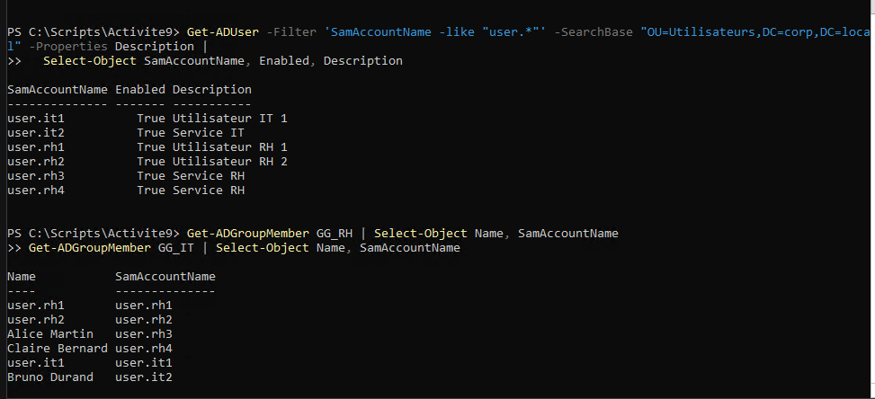

# Activité 9 - Créer des utilisateurs AD depuis un CSV avec PowerShell

## Mise en situation

Le service RH fournit une liste d'arrivants.

L'administrateur doit automatiser la création des comptes dans Active Directory, en évitant les erreurs de saisie et en produisant un rapport d'exécution.

## Objectif de l'activité

Cette activité sert à créer des comptes utilisateurs depuis un fichier CSV.

L'objectif est de :

- créer un CSV source ;
- écrire un script `Create-Users.ps1` ;
- ajouter un en-tête commenté ;
- importer le CSV ;
- vérifier si l'utilisateur existe déjà ;
- créer le compte dans la bonne OU ;
- ajouter l'utilisateur au bon groupe ;
- exporter un rapport CSV ;
- tester sur un petit jeu de données.

## Vue d'ensemble

| Élément | Valeur |
| --- | --- |
| Serveur d'exécution | `SRV-AD01` |
| Domaine | `corp.local` |
| CSV source | `Users-Source.csv` |
| Script | `Create-Users.ps1` |
| Rapport | `Create-Users-Report.csv` |
| OU utilisateurs | `OU=Utilisateurs,DC=corp,DC=local` |
| Groupes métiers | `GG_RH`, `GG_IT` |

!!! warning "Points de vigilance"
    Tester sur un petit jeu de données avant une exécution large. Ne jamais mettre de mot de passe définitif ou sensible en clair dans un script.

## Fichiers fournis

Des modèles sont disponibles dans les assets du module :

```text
docs/assets/files/admin-windows/it-4/Users-Source.csv
docs/assets/files/admin-windows/it-4/Create-Users.ps1
```

Copier les fichiers sur `SRV-AD01`, par exemple dans :

```text
C:\Scripts\Activite9
```

## Étape 1 - Créer le CSV source

Créer le fichier :

```text
Users-Source.csv
```

Colonnes attendues :

```csv
Prenom,Nom,Login,Service,Groupe
Alice,Martin,user.rh3,RH,GG_RH
Bruno,Durand,user.it2,IT,GG_IT
Claire,Bernard,user.rh4,RH,GG_RH
```

!!! note "Format CSV"
    Le script attend les colonnes `Prenom`, `Nom`, `Login`, `Service`, `Groupe`. Garder exactement ces noms de colonnes.

## Étape 2 - Préparer le dossier de travail

Sur `SRV-AD01`, PowerShell en administrateur :

```powershell
New-Item -ItemType Directory -Path "C:\Scripts\Activite9" -Force
```

Copier dans ce dossier :

```text
Users-Source.csv
Create-Users.ps1
```

Vérifier :

```powershell
Get-ChildItem "C:\Scripts\Activite9"
```

## Étape 3 - Créer Create-Users.ps1 avec en-tête commenté

Le script doit commencer par un en-tête expliquant :

- le nom du script ;
- l'objectif ;
- l'auteur ;
- la date ;
- le format du CSV ;
- les précautions.

Exemple :

```powershell
<#
.SYNOPSIS
  Cree des utilisateurs Active Directory depuis un CSV.

.DESCRIPTION
  Importe un fichier CSV contenant Prenom, Nom, Login, Service, Groupe.
  Cree les comptes dans OU=Utilisateurs et ajoute les comptes aux groupes demandes.
  Produit un rapport CSV.

.NOTES
  Activite 9 - Administration Windows
  Ne pas stocker de secret sensible en clair.
#>
```

## Étape 4 - Script PowerShell complet

Créer `Create-Users.ps1` :

```powershell
<#
.SYNOPSIS
  Cree des utilisateurs Active Directory depuis un CSV.

.DESCRIPTION
  Importe un fichier CSV contenant Prenom, Nom, Login, Service, Groupe.
  Verifie si les comptes existent deja.
  Cree les comptes dans la bonne OU.
  Ajoute les comptes au groupe demande.
  Exporte un rapport CSV.

.PARAMETER CsvPath
  Chemin du fichier CSV source.

.PARAMETER ReportPath
  Chemin du rapport CSV genere.

.PARAMETER WhatIf
  Simule les actions sans creer de compte.

.NOTES
  Activite 9 - Administration Windows
  Ne pas stocker de secret sensible en clair.
#>

[CmdletBinding(SupportsShouldProcess = $true)]
param(
  [string]$CsvPath = "C:\Scripts\Activite9\Users-Source.csv",
  [string]$ReportPath = "C:\Scripts\Activite9\Create-Users-Report.csv",
  [string]$DomainSuffix = "corp.local",
  [string]$UserOu = "OU=Utilisateurs,DC=corp,DC=local"
)

Import-Module ActiveDirectory

function New-TemporaryPassword {
  $Length = 16
  $Chars = "abcdefghijkmnopqrstuvwxyzABCDEFGHJKLMNPQRSTUVWXYZ23456789!*-_"
  $Random = [System.Security.Cryptography.RandomNumberGenerator]::Create()
  $Bytes = New-Object byte[] $Length
  $Random.GetBytes($Bytes)

  $Password = -join ($Bytes | ForEach-Object { $Chars[$_ % $Chars.Length] })
  ConvertTo-SecureString $Password -AsPlainText -Force
}

$Users = Import-Csv -Path $CsvPath
$Report = @()

foreach ($User in $Users) {
  $Status = "Pending"
  $Message = ""

  try {
    $Login = $User.Login.Trim()
    $Group = $User.Groupe.Trim()
    $DisplayName = "$($User.Prenom.Trim()) $($User.Nom.Trim())"
    $UserPrincipalName = "$Login@$DomainSuffix"

    $ExistingUser = Get-ADUser -Filter "SamAccountName -eq '$Login'" -ErrorAction SilentlyContinue
    $ExistingGroup = Get-ADGroup -Identity $Group -ErrorAction SilentlyContinue

    if (-not $ExistingGroup) {
      throw "Groupe introuvable : $Group"
    }

    if ($ExistingUser) {
      $Status = "Skipped"
      $Message = "Utilisateur deja existant"
    }
    else {
      $TemporaryPassword = New-TemporaryPassword

      if ($PSCmdlet.ShouldProcess($Login, "Creation utilisateur AD et ajout au groupe $Group")) {
        New-ADUser `
          -Name $DisplayName `
          -GivenName $User.Prenom `
          -Surname $User.Nom `
          -SamAccountName $Login `
          -UserPrincipalName $UserPrincipalName `
          -DisplayName $DisplayName `
          -Path $UserOu `
          -AccountPassword $TemporaryPassword `
          -Enabled $true `
          -ChangePasswordAtLogon $true `
          -Description "Service $($User.Service)"

        Add-ADGroupMember -Identity $Group -Members $Login
      }

      $Status = "Created"
      $Message = "Compte cree et ajoute au groupe $Group"
    }
  }
  catch {
    $Status = "Error"
    $Message = $_.Exception.Message
  }

  $Report += [PSCustomObject]@{
    Prenom  = $User.Prenom
    Nom     = $User.Nom
    Login   = $User.Login
    Service = $User.Service
    Groupe  = $User.Groupe
    Statut  = $Status
    Message = $Message
  }
}

$Report | Export-Csv -Path $ReportPath -NoTypeInformation -Encoding UTF8
$Report
```

## Étape 5 - Tester l'import CSV

Avant de créer des comptes, vérifier la lecture du CSV :

```powershell
Import-Csv "C:\Scripts\Activite9\Users-Source.csv"
```

Vérifier les groupes :

```powershell
Get-ADGroup GG_RH
Get-ADGroup GG_IT
```

## Étape 6 - Exécuter en simulation avec -WhatIf

Lancer le script en simulation :

```powershell
Set-Location "C:\Scripts\Activite9"

.\Create-Users.ps1 `
  -CsvPath "C:\Scripts\Activite9\Users-Source.csv" `
  -ReportPath "C:\Scripts\Activite9\Create-Users-Report-WhatIf.csv" `
  -WhatIf
```

Point de contrôle :

- aucune création réelle ;
- actions affichées en simulation ;
- aucun secret affiché.

## Étape 7 - Exécuter sur petit jeu de données

Si le test est correct :

```powershell
.\Create-Users.ps1 `
  -CsvPath "C:\Scripts\Activite9\Users-Source.csv" `
  -ReportPath "C:\Scripts\Activite9\Create-Users-Report.csv"
```

## Étape 8 - Vérifier les comptes créés

Vérifier les utilisateurs :

```powershell
Get-ADUser -Filter 'SamAccountName -like "user.*"' -SearchBase "OU=Utilisateurs,DC=corp,DC=local" -Properties Description |
  Select-Object SamAccountName, Enabled, Description
```

Vérifier les groupes :

```powershell
Get-ADGroupMember GG_RH | Select-Object Name, SamAccountName
Get-ADGroupMember GG_IT | Select-Object Name, SamAccountName
```

Vérifier le rapport :

```powershell
Import-Csv "C:\Scripts\Activite9\Create-Users-Report.csv"
```

## Étape 9 - Cas de relance

Relancer le script une deuxième fois :

```powershell
.\Create-Users.ps1
```

Résultat attendu :

- les comptes existants ne sont pas recréés ;
- le rapport indique `Skipped` pour les utilisateurs déjà présents.

## Dépannage rapide

### Import-Module ActiveDirectory échoue

Exécuter le script depuis `SRV-AD01`, où le module Active Directory est disponible.

Vérifier :

```powershell
Get-Command New-ADUser
```

### Le CSV n'est pas lu correctement

Vérifier les colonnes :

```powershell
Import-Csv "C:\Scripts\Activite9\Users-Source.csv" |
  Get-Member -MemberType NoteProperty
```

Les colonnes doivent être :

```text
Prenom
Nom
Login
Service
Groupe
```

### Le groupe est introuvable

Vérifier le nom exact :

```powershell
Get-ADGroup -Filter 'Name -like "GG_*"' | Select-Object Name
```

Corriger la colonne `Groupe` dans le CSV si nécessaire.

## Livrables et preuves attendues

Convention de nommage :

```text
[Nom]-[Prénom]-[Site]-Activite9-[NomLivrable]
```

Livrables :

| Livrable | Preuve attendue | Exemple |
| --- | --- | --- |
| CSV source | Fichier avec arrivants | `Nom-Prenom-Site-Activite9-Users-Source.csv` |
| Script commenté | `Create-Users.ps1` avec en-tête | `Nom-Prenom-Site-Activite9-Create-Users.ps1` |
| Rapport CSV | Statut par utilisateur | `Nom-Prenom-Site-Activite9-Rapport.csv` |
| Capture comptes créés | Utilisateurs dans AD | `Nom-Prenom-Site-Activite9-Comptes-Crees.png` |

## Exemples de preuves

Comptes créés et rapport d'exécution :



## Checklist finale

- [ ] CSV `Prenom, Nom, Login, Service, Groupe` créé.
- [ ] `Create-Users.ps1` créé.
- [ ] En-tête commenté ajouté.
- [ ] Import CSV testé.
- [ ] Existence utilisateur vérifiée.
- [ ] Compte créé dans la bonne OU.
- [ ] Utilisateur ajouté au bon groupe.
- [ ] Rapport CSV exporté.
- [ ] Petit jeu de données testé.
- [ ] `-WhatIf` testé.
- [ ] `try/catch` présent.
- [ ] Mot de passe temporaire aléatoire généré.

## Références

- Microsoft Learn - PowerShell : <https://learn.microsoft.com/powershell/>
- Microsoft Learn - Module Active Directory : <https://learn.microsoft.com/powershell/module/activedirectory/>
