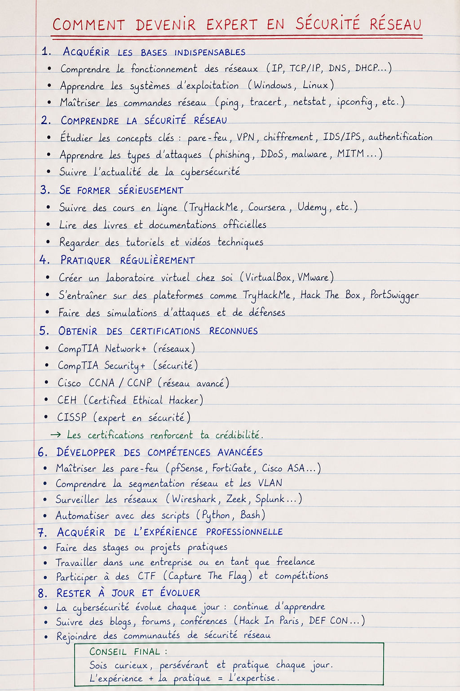

# Mémo AIS

Bienvenue dans ce **mémo personnel de formation AIS**.

Il sert à garder au même endroit les notions importantes vues pendant la formation.

L'idée est simple : pouvoir relire rapidement une définition, une commande ou un rappel utile.

## Organisation du mémo

Ce mémo est découpé en plusieurs parties :

- **Intro AIS** : bases du matériel, de Linux, du réseau et de la cybersécurité.
- **Schémas de l'AIS** : des schémas pour donner des exemples plus concret
- **Pense-bête** : rappels rapides, commandes utiles et ressources pour la veille technologique.
- **Système d’info & archi SI** : organisation du SI, des flux et des infrastructures.
- **RGPD** : formation CNIL, notions clés, conformité et protection des données personnelles.
- **Administration des systèmes — Linux** : installation, administration, sécurisation, automatisation et sauvegarde d'une infrastructure Debian.
- **Administration des réseaux — Fondamentaux** : base de gestion d'un réseau d'entreprise.

## Objectif

Ce support ne remplace pas un cours complet.

Il sert surtout à :

- mémoriser les notions essentielles,
- réviser rapidement,
- garder des explications simples avec quelques exemples concrets.

!!! note "Esprit du mémo"
    Le but n'est pas d'écrire comme un manuel ultra académique, mais d'avoir un document clair, utile et facile à relire.

(source IR Omer-Son)
