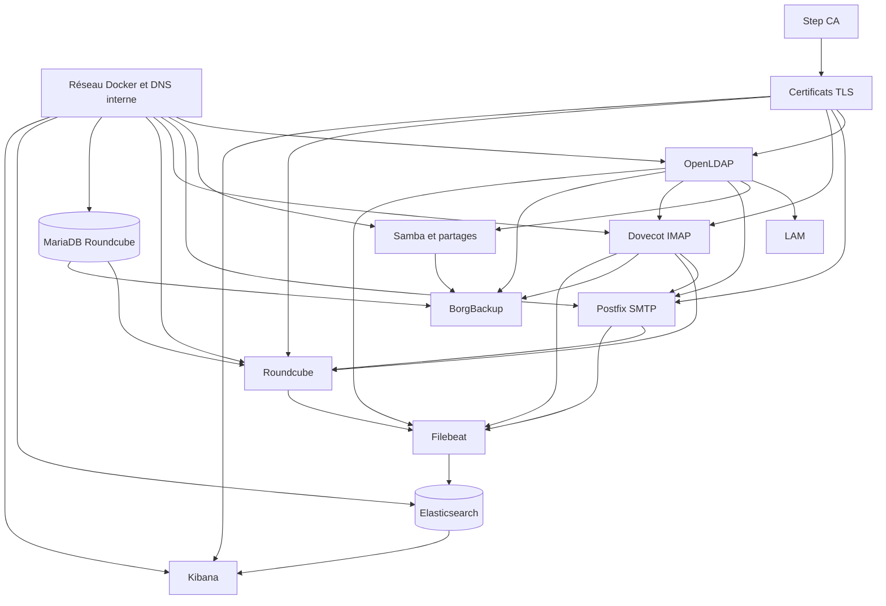

# Analyser les dépendances d'une infrastructure

## Objectif

Cartographier les dépendances de l'infrastructure **DIST-01a** avant de planifier sa migration cloud.

Avant de migrer quoi que ce soit, il faut savoir ce qui dépend de quoi. Une dépendance mal identifiée peut casser la migration au pire moment : par exemple un service déplacé dans le cloud qui interroge encore une base de données restée on-premise sans lien réseau stable.

## Ce que tu vas faire, et pourquoi

Pour chaque composant, il faut noter :

- ce dont il a besoin pour fonctionner ;
- les composants qui ont besoin de lui ;
- les dépendances réseau, DNS, annuaire, certificats, bases de données, volumes et sauvegardes ;
- les dépendances qui deviendront transverses pendant une migration progressive.

Un composant sans dépendance sortante non résolue peut souvent migrer plus tôt. Un composant dont dépendent beaucoup d'autres services doit être migré avec prudence, ou rester stable jusqu'à ce que les autres briques soient prêtes.

## Méthode

| Étape | Travail à faire | Résultat attendu |
| --- | --- | --- |
| 1 | Lister chaque service, VM, conteneur ou volume important. | Une liste complète du périmètre DIST-01a. |
| 2 | Pour chaque composant, noter ce dont il dépend. | Les dépendances techniques sortantes sont visibles. |
| 3 | Pour chaque composant, noter qui dépend de lui. | Les dépendances entrantes et les composants critiques ressortent. |
| 4 | Représenter le graphe. | Schéma à main levée, draw.io ou Mermaid. |
| 5 | Identifier les dépendances transverses pendant la migration. | Les points à garder accessibles entre on-premise et cloud sont connus. |

## Périmètre DIST-01a à analyser

La cartographie ci-dessous reprend l'infrastructure on-premise documentée dans le module :

- OpenLDAP ;
- LAM ;
- Samba et partages ;
- Postfix ;
- Dovecot ;
- Roundcube ;
- MariaDB Roundcube ;
- Step CA et certificats TLS ;
- BorgBackup ;
- Filebeat ;
- Elasticsearch ;
- Kibana ;
- réseau Docker, DNS interne, volumes et fichiers de configuration.

## Tableau de dépendances

| Composant | Dépend de | Dont dépendent |
| --- | --- | --- |
| Réseau Docker on-premise | Hôte Docker, règles de ports, résolution interne Compose | Tous les conteneurs applicatifs et de supervision |
| DNS interne / noms de service | Réseau Docker, noms Compose, éventuelles entrées locales | OpenLDAP, messagerie, Roundcube, Step CA, tests clients |
| OpenLDAP | Volumes `ldap_data`, `ldap_config`, secrets LDAP, réseau Docker | LAM, Samba `ldapsam`, Dovecot, Postfix, comptes de test, supervision des authentifications |
| LAM | OpenLDAP, mot de passe LAM, réseau Docker | Administration des comptes LDAP, validation visuelle des identités |
| Samba | OpenLDAP, schéma Samba, volume `samba_share`, configuration `smb.conf`, réseau Docker | Accès fichiers, tests SMB, sauvegardes des partages |
| Postfix | OpenLDAP pour l'authentification ou les comptes, Dovecot/LMTP, certificats TLS, DNS interne | Envoi SMTP, file mail, Roundcube pour l'envoi utilisateur |
| Dovecot | OpenLDAP, volumes de boîtes, certificats TLS, livraison depuis Postfix | Consultation IMAP, Roundcube, tests mail |
| Roundcube | Dovecot IMAP, Postfix SMTP, base MariaDB Roundcube, certificats TLS, réseau Docker | Accès webmail utilisateur, validation applicative de la messagerie |
| MariaDB Roundcube | Volume de base, secrets MariaDB, réseau Docker | Roundcube, sauvegarde/restauration de la configuration webmail |
| Step CA | `~/.step`, clé intermédiaire, `password.txt`, provisionneur, nom DNS de CA | Certificats OpenLDAP, Postfix, Dovecot, Roundcube, Kibana et validation TLS client |
| Certificats de service | Step CA, clés privées, volumes TLS, chaîne de confiance | LDAPS, IMAPS, SMTP STARTTLS, HTTPS Roundcube, accès client de confiance |
| BorgBackup | Accès aux volumes, exports LDAP, base Roundcube, passphrase Borg, espace disque | PRA, restauration, preuves de sauvegarde |
| Filebeat | Accès aux journaux Docker/services, configuration de collecte, réseau vers Elasticsearch | Supervision, tableaux de bord Kibana, analyse d'incident |
| Elasticsearch | Volume de données, mémoire, réseau, configuration de sécurité | Kibana, recherches de logs, tableaux de bord |
| Kibana | Elasticsearch, index `logs-infrastructure*`, navigateur d'administration | Visualisation, preuves de supervision, analyse d'incident |
| Fichiers Compose et `.env.example` | Git, documentation, secrets réels hors Git | Reconstruction, migration, automatisation OpenTofu/Ansible |

!!! warning "Secrets"
    Les dépendances vers `.env`, clés privées, passphrases, secrets LAPS/BitLocker ou clés cloud doivent être documentées comme dépendances, mais jamais copiées en clair dans la feuille.

## Graphe de dépendances

## Lecture de la cartographie

### Composants très structurants

| Composant | Pourquoi il est critique | Conséquence migration |
| --- | --- | --- |
| OpenLDAP | Il porte les identités utilisées par Samba et la messagerie. | Le migrer trop tôt oblige à maintenir un lien fiable entre services restés on-premise et annuaire cloud. |
| Step CA | Il fournit la confiance TLS interne. | Il faut décider si la CA reste source de confiance pendant la transition ou si une nouvelle PKI cloud prend le relais. |
| Réseau/DNS | Les services se trouvent par nom et par réseau Compose. | Une migration hybride nécessite une résolution de noms cohérente entre on-premise et cloud. |
| BorgBackup | Il protège les données avant migration. | Une sauvegarde validée doit exister avant tout déplacement de service critique. |

### Composants candidats à migrer plus tôt

| Composant | Condition préalable | Risque principal |
| --- | --- | --- |
| Kibana | Elasticsearch joignable ou migré avec lui | Tableau de bord vide si les index ou Filebeat ne suivent pas. |
| Roundcube | Dovecot, Postfix, MariaDB et TLS accessibles | Webmail inutilisable si une seule dépendance reste inaccessible. |
| LAM | OpenLDAP joignable | Administration LDAP impossible depuis le cloud sans lien sécurisé. |

## Dépendances transverses pendant la migration

Pendant une migration progressive, certaines dépendances devront fonctionner entre l'ancien environnement et le cloud.

| Dépendance transverse | Rôle pendant la transition | Point de vigilance |
| --- | --- | --- |
| VPN de transition | Permettre aux services cloud d'interroger des services restés on-premise. | Latence, routage, filtrage, journalisation. |
| DNS partagé | Résoudre les noms des services dans les deux environnements. | Éviter les noms qui pointent vers l'ancien service après migration. |
| Annuaire LDAP | Garder une source d'identité commune pendant la bascule. | Éviter les écritures concurrentes ou les mots de passe divergents. |
| PKI / certificats | Maintenir la confiance TLS entre clients, services on-premise et services cloud. | Renouvellement, distribution du certificat racine, protection des clés privées. |
| Sauvegardes | Pouvoir revenir en arrière si une migration échoue. | Tester la restauration avant la fenêtre de migration. |
| Supervision | Observer les deux environnements pendant la transition. | Ne pas perdre les journaux des services déplacés. |

## Ordre de migration proposé

Cet ordre est une hypothèse de travail, à valider par tests.

1. Sauvegardes et exports : sécuriser OpenLDAP, Samba, Dovecot, MariaDB Roundcube et configurations.
2. Supervision : préparer la collecte des logs dans les deux environnements.
3. PKI et DNS : décider comment les noms et certificats seront reconnus pendant la transition.
4. Services peu critiques ou de consultation : LAM ou Kibana, si leurs dépendances restent accessibles.
5. Messagerie complète : Postfix, Dovecot, Roundcube et MariaDB doivent migrer comme un groupe cohérent ou via une phase hybride maîtrisée.
6. Annuaire OpenLDAP : migrer avec une fenêtre contrôlée, car beaucoup de services en dépendent.
7. Samba et partages : migrer après validation des droits, volumes et accès utilisateurs.

## Pour aller plus loin

Identifier un cycle de dépendance dans DIST-01a et expliquer comment le résoudre.

Exemple :

| Cycle | Problème | Résolution possible |
| --- | --- | --- |
| Messagerie ↔ annuaire ↔ supervision | La messagerie dépend d'OpenLDAP pour authentifier les utilisateurs ; la supervision dépend des logs de messagerie pour détecter les erreurs LDAP ; les alertes peuvent être nécessaires pour décider si la bascule est saine. | Stabiliser OpenLDAP et la supervision avant la migration mail, puis migrer Postfix/Dovecot/Roundcube comme un bloc testé avec scénarios SMTP, IMAP et webmail. |

Autre cycle à chercher :

- Roundcube dépend de MariaDB, IMAP, SMTP et TLS ;
- Postfix dépend de Dovecot pour certaines fonctions d'authentification/livraison ;
- Dovecot dépend d'OpenLDAP pour authentifier l'utilisateur ;
- OpenLDAP dépend de la PKI si LDAPS devient obligatoire.

La résolution consiste à choisir un composant d'ancrage temporaire : par exemple garder OpenLDAP et Step CA stables on-premise pendant que les services mail sont déplacés, ou migrer d'abord l'annuaire puis tester chaque service dépendant avant bascule utilisateur.

## Preuves à conserver

| Preuve | Contenu attendu |
| --- | --- |
| Liste des composants | Services, conteneurs, volumes et fichiers de configuration importants. |
| Tableau de dépendances | Pour chaque composant : dépend de / dont dépendent. |
| Graphe | Schéma draw.io, capture Mermaid ou schéma manuscrit propre. |
| Dépendances transverses | DNS, VPN, annuaire, PKI, sauvegardes, supervision. |
| Analyse d'un cycle | Cycle identifié et stratégie de résolution pendant la migration. |

## État final attendu

À la fin de cette feuille :

- les composants DIST-01a sont listés ;
- les dépendances principales sont visibles ;
- les composants critiques sont identifiés ;
- les dépendances hybrides on-premise/cloud sont anticipées ;
- un premier ordre de migration argumenté est proposé ;
- aucun secret réel n'est exposé dans la documentation.

## Ressources

- [draw.io](https://app.diagrams.net/)
- [AWS Prescriptive Guidance - Dependency mapping](https://docs.aws.amazon.com/prescriptive-guidance/latest/migration-retiring-applications/dependency-mapping.html)
