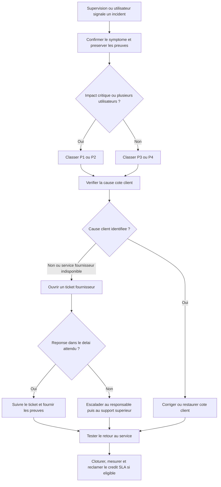

# Fiche SLA et circuit d'escalade

!!! info "Preuve de compétence"
    Cette fiche formalise la lecture du SLA retenu et la procédure à suivre
    lorsqu'un incident cloud n'est pas résolu au niveau attendu.

## 1. Périmètre du service

Le scénario porte sur une instance cloud hébergeant les services de
**DIST-01a**. Le SLA du fournisseur doit être lu service par service : une
garantie sur le calcul ne couvre pas automatiquement le stockage, le réseau,
le DNS, la sauvegarde ou l'application.

| Élément | Engagement à relever | Responsable principal |
| --- | --- | --- |
| Instance de calcul | Disponibilité mensuelle annoncée dans le SLA du fournisseur | Fournisseur |
| Stockage | Persistance et disponibilité du volume selon le SLA du service | Fournisseur, avec sauvegardes côté client |
| Réseau et adresse publique | Accessibilité du service jusqu'au point de démarcation prévu | Fournisseur et client selon la cause |
| Système et application | Fonctionnement, configuration, mises à jour et supervision | Client |
| Sauvegarde et restauration | Existence d'une copie restaurable et mesure du RPO/RTO | Client |
| Support | Canal de déclaration, délai de réponse et niveau de support souscrit | Fournisseur |

## 2. Engagements identifiés

Les valeurs ci-dessous sont celles du scénario comparatif déjà étudié. Avant
une mise en production, elles doivent être remplacées ou confirmées par le
contrat et le SLA de l'offre réellement souscrite.

| Fournisseur / service | Engagement lu | Déclaration et compensation |
| --- | --- | --- |
| OVHcloud Public Cloud Instance | 99,99 % de disponibilité mensuelle, selon les conditions de l'offre | Demande dans l'espace client dans les 60 jours calendaires ; crédit de service selon le niveau constaté |
| AWS EC2, instance seule | 99,5 % dans le scénario d'une instance isolée | Cas AWS Support Center avant la fin du deuxième cycle de facturation suivant l'incident ; crédit de service selon le niveau constaté |
| AWS EC2, architecture régionale éligible | Jusqu'à 99,99 % si les conditions de redondance prévues par le SLA sont respectées | La redondance multi-AZ et les services associés doivent réellement être en place |

### Traduction en durée d'indisponibilité

| Niveau | Indisponibilité annuelle approximative | Lecture pour DIST-01a |
| ---: | ---: | --- |
| 99,5 % | 43 h 48 min | Trop élevé pour un annuaire ou une messagerie critique sans reprise |
| 99,9 % | 8 h 45 min | Compatible avec un service non critique ou un PRA complémentaire |
| 99,99 % | 52 min 34 s | Niveau cohérent avec un objectif d'environ une heure, sans supprimer le risque |

Le crédit de service est une compensation contractuelle. Il ne remplace ni
la restauration des données, ni la réparation de l'application, ni la perte
d'activité.

## 3. Exclusions et responsabilités client

Les exclusions doivent être citées avant toute conclusion sur le respect du
SLA. Dans le scénario étudié, les cas suivants ne sont généralement pas
imputables au fournisseur :

- maintenance planifiée ou opération sans impact selon les conditions du SLA ;
- erreur de configuration, mauvaise utilisation ou logiciel client défaillant ;
- absence de sauvegarde, de redondance ou de supervision côté client ;
- incident Internet situé hors du point de démarcation du fournisseur ;
- attaque, force majeure ou événement hors contrôle direct du fournisseur ;
- service suspendu, résilié ou utilisé hors des conditions contractuelles ;
- version obsolète ou mise à jour de sécurité non appliquée lorsque le contrat
  met cette obligation à la charge du client.

Une panne applicative sur la VM, une règle de pare-feu incorrecte ou un disque
plein doivent donc être traités par l'équipe cliente, même si l'instance
cloud reste disponible.

## 4. Qualification initiale de l'incident

Le support reçoit un ticket unique par incident. L'équipe consigne l'heure de
détection en UTC, les ressources concernées, l'impact utilisateur et les
preuves. Elle ne ferme pas le ticket fournisseur avant d'avoir confirmé le
retour au service.

| Priorité | Critère | Délai interne de prise en charge | Escalade cible |
| --- | --- | ---: | --- |
| P1 - critique | Service métier indisponible pour tous, perte de données possible ou suspicion de sécurité | 15 min | Responsable d'astreinte puis support fournisseur prioritaire |
| P2 - majeure | Fonction critique dégradée pour plusieurs utilisateurs, contournement possible | 30 min | Référent technique puis support fournisseur |
| P3 - normale | Impact limité, anomalie avec contournement | 4 h ouvrées | Référent technique |
| P4 - demande | Question, amélioration ou incident sans impact | 1 jour ouvré | Support standard |

Ces délais sont des **objectifs internes de réaction**. Ils ne doivent pas
être présentés comme un engagement contractuel du fournisseur sans preuve dans
le contrat de support.

## 5. Procédure d'escalade formalisée

1. **Détecter et protéger** : confirmer le symptôme depuis un second point de
   contrôle, préserver les journaux et éviter toute action destructive.
2. **Qualifier** : attribuer une priorité P1 à P4, noter le début d'impact,
   les utilisateurs touchés, le service et l'identifiant de ressource.
3. **Diagnostiquer côté client** : vérifier changement récent, état de la VM,
   CPU, disque, réseau, DNS, certificats, journaux et dernière sauvegarde.
4. **Ouvrir le ticket fournisseur** : utiliser le canal correspondant au
   support souscrit et demander un identifiant de dossier. Pour une demande de
   crédit SLA, respecter le délai contractuel propre au fournisseur.
5. **Escalader** : si le délai de réaction interne est dépassé, transmettre
   le dossier au responsable d'astreinte ; si le fournisseur ne répond pas ou
   si l'impact augmente, demander une escalade de niveau au support.
6. **Suivre jusqu'au rétablissement** : ajouter les horaires, réponses,
   actions et changements dans le ticket. Pour P1, faire un point régulier
   jusqu'à stabilisation.
7. **Clôturer et réclamer** : valider le service avec un test fonctionnel,
   calculer la durée d'indisponibilité, demander le crédit éventuel et rédiger
   un retour d'expérience avec action corrective.

### Circuit de décision



## 6. Contenu obligatoire du ticket

```text
Objet : [P1/P2] Indisponibilite - service - ressource - date UTC

Debut constate : AAAA-MM-JJ hh:mm UTC
Fin constatee : a completer
Fournisseur / region / zone : a completer
Ressources et identifiants : a completer
Impact : utilisateurs, services et fonctions concernes
Tests realises : DNS, reseau, application, console et journaux
Dernier changement connu : a completer
Mesures deja prises : a completer
Pieces jointes : captures, extraits de logs masques, metriques
Demande : retablissement, cause technique, confirmation d'eligibilite SLA
Contact de suivi : nom, canal et disponibilite
```

Ne jamais joindre de mot de passe, jeton, clé privée ou donnée personnelle
inutile. Les logs sont réduits aux lignes nécessaires et les secrets sont
masqués.

## 7. Preuve à présenter

| Critère évalué | Élément de preuve dans cette fiche |
| --- | --- |
| Engagements identifiés | Tableau du périmètre et tableau des niveaux de disponibilité |
| Exclusions citées | Section 3 et distinction entre responsabilité fournisseur et client |
| Procédure d'escalade formalisée | Priorités, étapes 1 à 7, diagramme et modèle de ticket |

À l'oral, je présente d'abord le service couvert et la limite du SLA, puis je
qualifie un incident fictif P1. Je montre enfin le ticket, le point
d'escalade et les preuves nécessaires à une éventuelle réclamation.

## Sources à joindre au dossier

- [Lecture et interprétation du SLA cloud](lire-interpreter-sla-cloud.md)
- [AWS - Service Level Agreements](https://aws.amazon.com/legal/service-level-agreements/)
- [AWS - Amazon Compute Service Level Agreement](https://aws.amazon.com/compute/sla/)
- [OVHcloud - Support levels](https://www.ovhcloud.com/en/support-levels/plans/)
