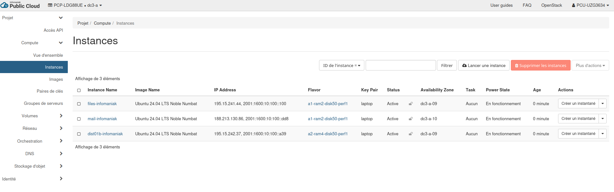
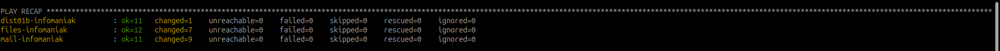
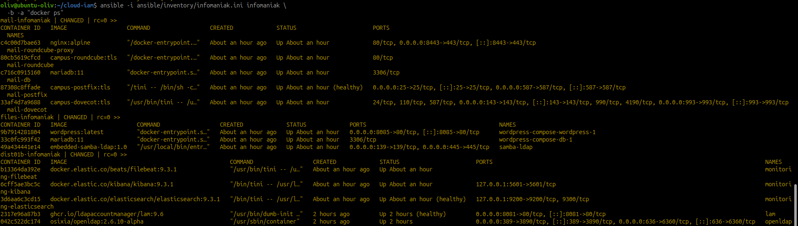
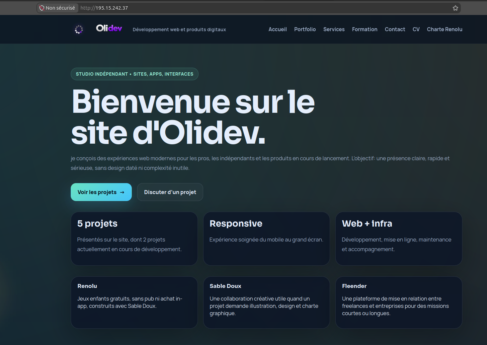
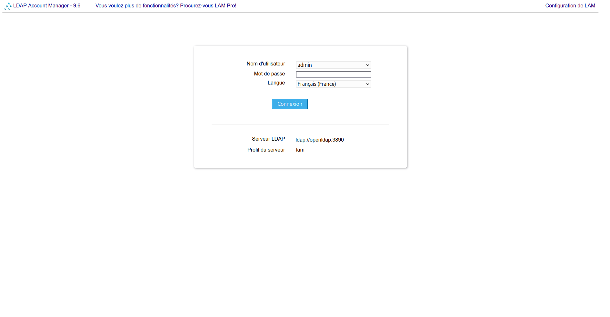
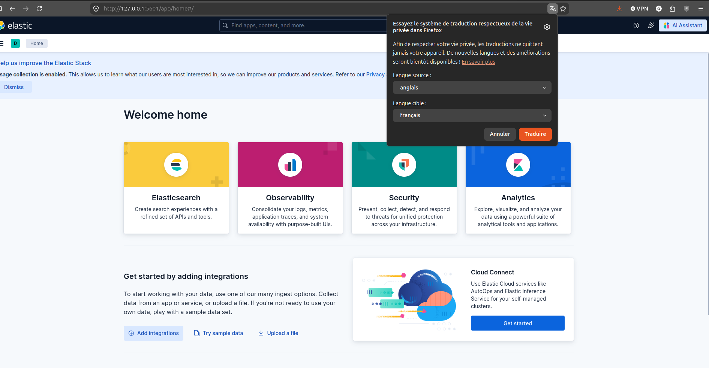
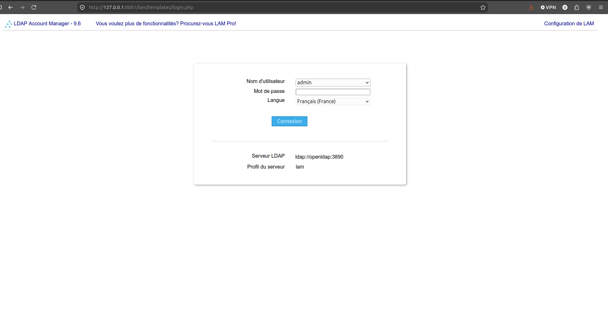
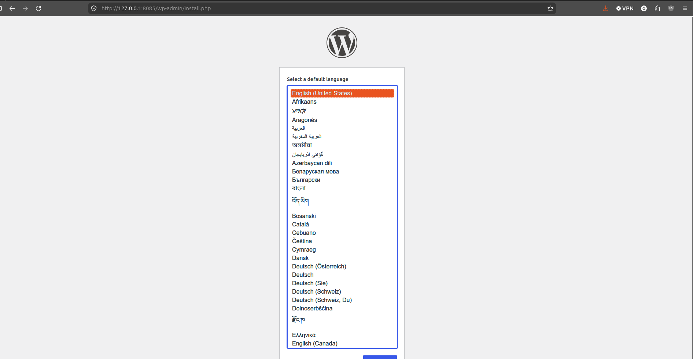
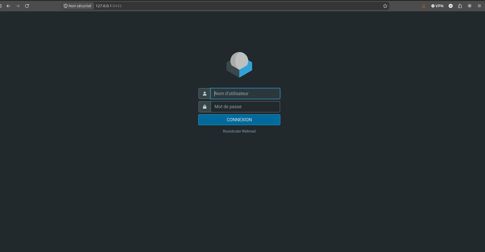

# Déployer et automatiser Infomaniak

!!! info "Second fournisseur cloud - déploiement en cours"
    Cette feuille porte le même socle DIST01b vers **Infomaniak Public Cloud**.
    L'authentification et la création des trois VM sont réalisées ; la
    configuration Ansible et la validation des services restent à poursuivre.

## Objectif

Reproduire l'architecture cloud du prototype sur un fournisseur OpenStack
différent, puis réutiliser Ansible pour configurer les VM et déployer les
services on-premise.

Le code correspondant se trouve dans
`/home/oliv/cloud-iam/opentofu/infomaniak/`. Le déploiement OVH existant n'est
pas modifié.

## Différences à relever

| Élément | OVHcloud | Infomaniak |
| --- | --- | --- |
| Authentification | OpenRC et variables `OS_*` | `clouds.yaml` téléchargé depuis le Manager |
| URL Keystone | `https://auth.cloud.ovh.net/v3` | `https://api.pub1.infomaniak.cloud/identity/v3` |
| Profil projet | Projet OVHcloud | Nom `PCP-XXXXXXX` et utilisateur `PCU-XXXXXXX` |
| Régions | `GRA9` | `dc3-a` ou `dc4-a` |
| Réseau public | `Ext-Net` | souvent `ext-net1`, à confirmer |
| Security Group | `default` | `default` dans le patron initial |
| Code IaC | Provider OpenStack | même provider OpenStack |

!!! warning "Valeurs à confirmer"
    Les noms de l'image Ubuntu, du flavor, du réseau privé et les quotas ne
    sont pas supposés identiques à OVHcloud. Les valeurs de l'exemple sont
    des paramètres de départ, pas une preuve de disponibilité.

## Étape 1 - Préparer le projet

Dans le Manager Infomaniak, relever le projet Public Cloud, la région et les
ressources disponibles. Télécharger ensuite le fichier de configuration
OpenStack pour la région choisie.

```bash
python -m pip install --user -U python-openstackclient
mkdir -p ~/.config/openstack
cp ~/Downloads/clouds.yaml ~/.config/openstack/clouds.yaml
chmod 600 ~/.config/openstack/clouds.yaml
openstack --os-cloud PCP-XXXXXXX token issue
```

Le fichier `clouds.yaml` reste dans le dossier personnel et ne doit jamais
être copié dans le dépôt.

### État constaté le 01/09/2026

| Élément | Résultat |
| --- | --- |
| Profil OpenStack | `PCP-LDG88UE-dc3-a` authentifié avec succès |
| Projet | `d31eb439006443c29da40965f5374ed7` |
| Image | `Ubuntu 24.04 LTS Noble Numbat` |
| VM principale | Créée avec `a2-ram4-disk50-perf1` |
| VM secondaires | Deux VM créées avec `a1-ram2-disk50-perf1` |
| Adresses IPv4 | Principale `195.15.242.37`, fichiers `195.15.241.44`, mail `188.213.130.86` |
| Réseau | Une seule interface publique par VM ; aucun réseau privé attribué |
| Accès SSH | Validé après ajout de la règle SSH dans `default` |
| Ansible | Playbooks système et déploiement exécutés avec succès sur les trois VM |

## Étape 2 - Relever les paramètres OpenStack

```bash
export OS_CLOUD=PCP-XXXXXXX
openstack region list
openstack image list
openstack flavor list
openstack network list
openstack keypair list
openstack quota show
```

Choisir une image et des flavors réellement présents dans la région. Dans
notre déploiement, les VM n'ont reçu qu'une interface publique et
`private_network_name` reste donc à `null`.

## Étape 3 - Préparer OpenTofu

```bash
cd ~/cloud-iam/opentofu/infomaniak
cp terraform.tfvars.example terraform.tfvars
${EDITOR:-nano} terraform.tfvars
```

Exemple de variables locales :

```hcl
cloud_name           = "PCP-XXXXXXX"
region               = "dc3-a"
image_name           = "Ubuntu 24.04 LTS Noble Numbat"
flavor_name          = "a2-ram4-disk50-perf1"
small_flavor_name    = "a1-ram2-disk50-perf1"
public_network_name  = "ext-net1"
private_network_name = null
```

Si un réseau privé est disponible plus tard, remplacer `null` par son nom exact.
Pour le déploiement actuel, Ansible utilise temporairement les IPv4 publiques
des trois VM pour les communications inter-services et limite les ports par
des règles UFW ciblées.

## Étape 4 - Contrôler le plan

```bash
tofu init
tofu fmt
tofu validate
tofu plan
```

Le plan attendu est une VM principale et deux VM secondaires, chacune avec le
réseau public, et éventuellement le réseau privé. Vérifier notamment la
région, les flavors, l'image, la clé SSH et l'absence de destruction
inattendue avant `tofu apply`.

```bash
tofu apply
tofu output
```

## Étape 5 - Autoriser SSH dans le Security Group

La VM peut être créée correctement tout en restant inaccessible : le
Security Group `default` Infomaniak bloque les connexions entrantes par défaut.
Autoriser SSH uniquement depuis le poste d'administration :

```bash
export ADMIN_IP=$(curl -4 -s https://ifconfig.me)

openstack --os-cloud PCP-LDG88UE-dc3-a \
  security group rule create \
  --ingress \
  --protocol tcp \
  --dst-port 22 \
  --ethertype IPv4 \
  --remote-ip "${ADMIN_IP}/32" \
  default
```

Contrôler la règle et tester la connexion :

```bash
openstack --os-cloud PCP-LDG88UE-dc3-a \
  security group rule list default

ssh -i ~/.ssh/id_ed25519 ubuntu@IP_PUBLIQUE_VM
```

Cette règle a été ajoutée dans le projet Infomaniak et l'accès SSH a ensuite
été validé. Elle devra être déclarée dans OpenTofu si l'on souhaite gérer
entièrement le réseau par le code.

!!! danger "Facturation et état"
    Ne pas appliquer avec des valeurs d'exemple. Ne pas commiter
    `terraform.tfvars`, `.terraform/`, les fichiers d'état, `clouds.yaml` ou
    une clé privée SSH.

## Étape 6 - Préparer Ansible

Après l'application, créer un inventaire Infomaniak distinct avec les IP
publiques réellement retournées. Comme aucune seconde interface n'est
présente, la variable `private_ip` reprend provisoirement la même IPv4 :

```bash
cd ~/cloud-iam
cp ansible/inventory/infomaniak.ini.example \
  ansible/inventory/infomaniak.ini
nano ansible/inventory/infomaniak.ini
```

```ini
[infomaniak]
dist01b-infomaniak ansible_host=195.15.242.37 ansible_user=ubuntu private_ip=195.15.242.37
files-infomaniak ansible_host=195.15.241.44 ansible_user=ubuntu private_ip=195.15.241.44
mail-infomaniak ansible_host=188.213.130.86 ansible_user=ubuntu private_ip=188.213.130.86

[infomaniak:vars]
ansible_python_interpreter=/usr/bin/python3
admin_ssh_cidr=IP_PUBLIQUE_ADMIN/32
private_network_cidr=
cloud_peer_ips_csv=195.15.242.37,195.15.241.44,188.213.130.86
cloud_compose_override=compose.infomaniak.yaml
```

Tester d'abord l'accès, puis appliquer le socle système :

```bash
ansible -i ansible/inventory/infomaniak.ini infomaniak -m ping
ansible-playbook -i ansible/inventory/infomaniak.ini \
  ansible/playbooks/base-system.yml
```

Le playbook de déploiement des services devra ensuite être adapté avec les
groupes `directory`, `files`, `mail` et `monitoring`, comme pour OVHcloud. Le
playbook commun récupère l'IP privée LDAP et l'IP privée de la VM fichiers
depuis cet inventaire ; aucune IP OVH n'est codée dans la variante Infomaniak.

Pour préparer Docker et UFW, puis déployer les services :

```bash
ansible -i ansible/inventory/infomaniak.ini infomaniak -m ping
ansible-playbook -i ansible/inventory/infomaniak.ini \
  ansible/playbooks/base-system.yml
ansible-playbook -i ansible/inventory/infomaniak.ini \
  ansible/playbooks/deploy-on-premise.yml
```

Pour vérifier les conteneurs sans conflit avec les expressions Jinja
`{{ ... }}` d'Ansible, utiliser la sortie standard de Docker :

```bash
ansible -i ansible/inventory/infomaniak.ini infomaniak \
  -b -a "docker ps"

ansible -i ansible/inventory/infomaniak.ini infomaniak \
  -a "sudo ufw status verbose"
```

Une commande contenant directement `{{.Names}}` est interprétée par Ansible
avant d'être envoyée à Docker et provoque une erreur de template.

## Captures de validation

Les captures suivantes documentent le déploiement Infomaniak du 01/09/2026,
dans l'ordre : instances, Ansible, conteneurs, puis accès aux services.



_Les trois VM sont actives dans la région `dc3-a`, avec les flavors prévus._



_Le playbook se termine sans hôte inaccessible ni tâche en échec._



_Les conteneurs OpenLDAP, LAM, supervision, Samba, WordPress et messagerie
sont démarrés._



_Le site Olidev est accessible sur l'IPv4 publique de la VM principale._



_LDAP Account Manager répond sur le port `8081`._



_Kibana est accessible localement par le tunnel SSH sur le port `5601`._



_La page de connexion LAM est de nouveau accessible depuis le navigateur._



_WordPress répond sur le port `8085` de la VM fichiers et affiche son écran
d'installation._



_Roundcube répond en HTTPS sur le port `8443` de la VM mail._

## Validation attendue

| Contrôle | Preuve attendue |
| --- | --- |
| Authentification | `openstack token issue` réussi |
| Provisionnement | `tofu apply` puis `tofu output` |
| Accès système | `ansible -m ping` sur les trois VM |
| Réseau privé | ping et tests de ports entre les VM |
| Configuration | seconde exécution Ansible avec `changed=0` |
| Services | Déploiement Ansible terminé ; `docker ps` à conserver |
| Sécurité | UFW actif ; SSH admin et ports inter-services limités aux IP connues |

## Ressources officielles

- [Infomaniak - connexion au projet](https://docs.infomaniak.cloud/getting_started/first_project/connect_project/)
- [Infomaniak - Terraform/OpenTofu](https://docs.infomaniak.cloud/orchestration/terraform/)
- [Infomaniak - première instance](https://docs.infomaniak.cloud/tutorials/terraform/first_instance/)
- [Infomaniak - compatibilité S3](https://docs.infomaniak.cloud/object_storage/s3/)
