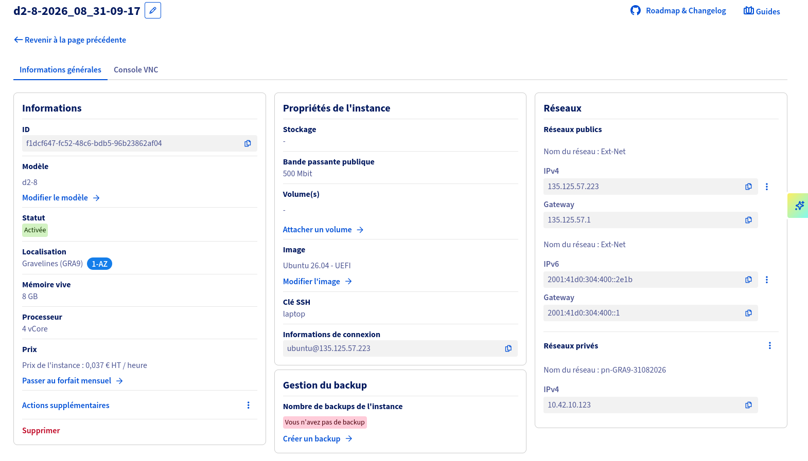
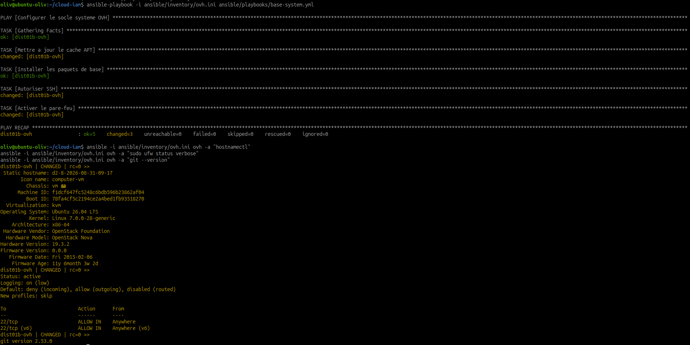

# Déployer et automatiser OVH

!!! info "Déployer et automatiser (1er fournisseur) - J3-J5 matin"
    Cette feuille couvre le premier fournisseur cloud du module :
    **OVHcloud**. Elle prépare un prototype reproductible avec OpenTofu et
    Ansible.

## Objectif

Déployer une première infrastructure OVHcloud pour accueillir le prototype de
migration DIST-01a, puis automatiser ce socle pour pouvoir le rejouer, le
contrôler et le documenter.

Cette feuille doit produire des preuves propres :

- commandes exécutées ;
- fichiers OpenTofu et Ansible ;
- captures ou sorties terminal sans secret ;
- état final vérifié ;
- écarts ou blocages documentés.

## Périmètre retenu

Le périmètre reste volontairement compact pour un premier fournisseur :

| Élément | Choix pédagogique |
| --- | --- |
| Fournisseur | OVHcloud Public Cloud |
| Région | GRA9, Gravelines |
| Instances | Une VM principale `d2-4` et deux petites VM `d2-2` |
| Système | Ubuntu 26.04 LTS - UEFI |
| Accès | SSH par clé, pas par mot de passe |
| Automatisation infra | OpenTofu |
| Configuration système | Ansible |
| Secrets | Variables locales, SOPS ou git-crypt ; jamais en clair dans Git |

## Étape 1 - Préparer le projet OVHcloud

Se connecter à l'espace client OVHcloud et vérifier :

- le compte ;
- le projet Public Cloud ;
- la région cible ;
- la possibilité de créer une instance ;
- la clé SSH publique à utiliser ;
- les limites, crédits ou blocages de paiement.

Preuves à conserver :

| Preuve | Contenu attendu |
| --- | --- |
| Projet Public Cloud | Nom du projet ou identifiant partiellement masqué. |
| Région | Région retenue et justification courte. |
| Quotas | Capacité à créer au moins une instance. |
| Clé SSH | Empreinte ou nom de la clé, pas la clé privée. |

!!! danger "Secrets"
    Ne jamais capturer une clé privée, un token OVH, une application key, une
    consumer key ou un mot de passe.

## Étape 2 - Préparer les identifiants API OVH

OpenTofu aura besoin d'identifiants API pour créer les ressources. Les valeurs
doivent rester hors Git.

Créer un fichier local non versionné, par exemple :

```bash
mkdir -p ~/cloud-iam-ovh/env
nano ~/cloud-iam-ovh/env/ovh.env
```

Exemple de contenu à adapter :

```bash
export OVH_ENDPOINT="ovh-eu"
export OVH_APPLICATION_KEY="a-remplacer"
export OVH_APPLICATION_SECRET="a-remplacer"
export OVH_CONSUMER_KEY="a-remplacer"
export OVH_CLOUD_PROJECT_SERVICE="a-remplacer"
```

Charger les variables seulement dans le terminal courant :

```bash
source ~/cloud-iam-ovh/env/ovh.env
```

Vérifier que le fichier n'est pas suivi par Git :

```bash
git status --short
git check-ignore -v env/ovh.env
git ls-files | grep -E 'ovh\.env|APPLICATION_SECRET|CONSUMER_KEY' || true
```

Si le dépôt de travail contient un dossier `env/`, ajouter une règle locale ou
un `.gitignore` adapté avant de continuer.

## Étape 3 - Préparer l'arborescence du dépôt

Créer une structure simple pour séparer l'infrastructure et la configuration :

```text
cloud-iam/
├── README.md
├── opentofu/
│   └── ovh/
│       ├── main.tf
│       ├── variables.tf
│       ├── outputs.tf
│       └── terraform.tfvars.example
└── ansible/
    ├── inventory/
    │   └── ovh.ini
    ├── playbooks/
    │   └── base-system.yml
    ├── roles/
    │   └── web/
    └── ansible.cfg
```

Le fichier `terraform.tfvars.example` peut être versionné s'il ne contient que
des valeurs fictives. Les fichiers réels contenant des identifiants ou des IP
sensibles restent locaux ou chiffrés.

## Étape 4 - Écrire le socle OpenTofu

Dans `opentofu/ovh/`, créer les fichiers de base.

`main.tf` :

```hcl
terraform {
  required_providers {
    ovh = {
      source  = "ovh/ovh"
      version = "~> 0.50"
    }
  }
}

provider "ovh" {
  endpoint           = var.ovh_endpoint
  application_key    = var.ovh_application_key
  application_secret = var.ovh_application_secret
  consumer_key       = var.ovh_consumer_key
}

resource "ovh_cloud_project_ssh_key" "admin" {
  service_name = var.service_name
  name         = var.ssh_key_name
  public_key   = file(var.ssh_public_key_path)
}

resource "ovh_cloud_project_instance" "prototype" {
  service_name = var.service_name
  region       = var.region
  name         = var.instance_name
  flavor_name  = var.flavor_name
  image_name   = var.image_name
  ssh_key      = ovh_cloud_project_ssh_key.admin.name
}
```

`variables.tf` :

```hcl
variable "ovh_endpoint" {
  type = string
}

variable "ovh_application_key" {
  type      = string
  sensitive = true
}

variable "ovh_application_secret" {
  type      = string
  sensitive = true
}

variable "ovh_consumer_key" {
  type      = string
  sensitive = true
}

variable "service_name" {
  type = string
}

variable "region" {
  type = string
}

variable "instance_name" {
  type    = string
  default = "dist01b-ovh-prototype"
}

variable "flavor_name" {
  type = string
}

variable "image_name" {
  type = string
}

variable "ssh_key_name" {
  type    = string
  default = "admin-dist01b"
}

variable "ssh_public_key_path" {
  type = string
}
```

`outputs.tf` :

```hcl
output "instance_id" {
  value = ovh_cloud_project_instance.prototype.id
}

output "instance_ipv4" {
  value = ovh_cloud_project_instance.prototype.ipv4_address
}
```

`terraform.tfvars.example` :

```hcl
ovh_endpoint        = "ovh-eu"
service_name        = "a-remplacer"
region              = "GRA11"
flavor_name         = "d2-4"
image_name          = "Debian 12"
ssh_public_key_path = "~/.ssh/id_ed25519.pub"
```

!!! warning "Versions et images"
    Les noms exacts de régions, images et flavors peuvent évoluer. Les valeurs
    retenues doivent être vérifiées dans le projet OVHcloud au moment du TP et
    notées dans les preuves.

## Étape 5 - Initialiser et planifier OpenTofu

Depuis le dossier `opentofu/ovh/` :

```bash
tofu fmt
tofu init
tofu validate
tofu plan
```

À conserver :

- sortie `tofu fmt` sans modification restante ;
- sortie `tofu validate` réussie ;
- extrait de `tofu plan` montrant les ressources prévues ;
- aucune valeur sensible visible.

## Étape 6 - Déployer l'instance OVH

Quand le plan est cohérent :

```bash
tofu apply
```

Après création :

```bash
tofu output
tofu state list
```

Tester l'accès SSH :

```bash
ssh debian@IP_PUBLIQUE
```

Adapter l'utilisateur selon l'image choisie (`debian`, `ubuntu` ou autre).

### Avancement réel au 31 août 2026

L'infrastructure OVHcloud comprend une VM principale `d2-4` et deux VM
`d2-2`. L'accès SSH a été validé depuis le poste d'administration. Le
déploiement Ansible est volontairement limité à la VM principale : les deux
petites VM restent disponibles côté OpenTofu, mais ne sont plus ciblées par
l'inventaire Ansible.



À compléter dans le livrable sans exposer de secret :

| Élément | Statut | Preuve attendue |
| --- | --- | --- |
| Instance principale | Réalisé le 31/08/2026 | `d2-8-2026_08_31-09-17`, flavor réel `d2-4`, statut actif. |
| Petites instances | Réalisé le 31/08/2026 | Deux instances `d2-2`, conservées côté OpenTofu mais retirées de l'inventaire Ansible. |
| Accès SSH | Réalisé le 31/08/2026 | `ubuntu@135.125.57.xxx`, capture du prompt à joindre si possible. |
| Région, image et flavor | Relevé le 31/08/2026 | `GRA9` / Ubuntu 26.04 - UEFI / `d2-4` pour la VM principale. |
| IP publique et IP privée | Relevé le 31/08/2026 | `135.125.57.xxx` et `10.42.10.123`. |
| Réseau privé | Relevé le 31/08/2026 | `pn-GRA9-31082026`. |
| OpenTofu | À compléter si non exécuté | `tofu fmt`, `tofu init`, `tofu validate`, `tofu plan`. |
| Ansible | Réalisé le 31/08/2026 | Playbook terminé sur la VM principale : `ok=12`, `changed=2`, `failed=0`. Seconde exécution : `ok=11`, `changed=0`. |



La capture confirme l'exécution du socle sur `dist01b-ovh`. Le playbook actuel
conserve une politique entrante `deny`, autorise SSH uniquement depuis le
poste d'administration et ouvre HTTP pour Nginx. Les deux VM `d2-2` ne sont
pas concernées par cette configuration Ansible.

## Étape 7 - Préparer l'inventaire Ansible

Créer ou mettre à jour `ansible/inventory/ovh.ini` :

```ini
[ovh]
dist01b-ovh ansible_host=IP_PUBLIQUE ansible_user=ubuntu

[ovh:vars]
ansible_python_interpreter=/usr/bin/python3
```

Les deux instances `d2-2` sont volontairement absentes de ce fichier. Elles
ne sont donc pas configurées par le playbook et ne sont pas supprimées de
l'infrastructure OpenTofu.

Tester la connexion :

```bash
ansible -i ansible/inventory/ovh.ini ovh -m ping
ansible -i ansible/inventory/ovh.ini ovh -m setup -a 'filter=ansible_distribution*'
```

## Étape 8 - Configurer le socle système avec Ansible

Créer un premier playbook `ansible/playbooks/base-system.yml` :

```yaml
---
- name: Configurer le socle systeme OVH
  hosts: ovh
  become: true

  tasks:
    - name: Mettre a jour le cache APT
      ansible.builtin.apt:
        update_cache: true
        cache_valid_time: 3600

    - name: Installer les paquets de base
      ansible.builtin.apt:
        name:
          - curl
          - git
          - htop
          - ufw
          - ca-certificates
        state: present

    - name: Supprimer l'ancienne autorisation SSH generale
      community.general.ufw:
        rule: allow
        delete: true
        port: "22"
        proto: tcp

    - name: Autoriser SSH depuis le poste admin
      community.general.ufw:
        rule: allow
        from_ip: "{{ admin_ssh_cidr }}"
        port: "22"
        proto: tcp

    - name: Activer le pare-feu
      community.general.ufw:
        state: enabled
        policy: deny

    - name: Autoriser HTTP pour la page web
      community.general.ufw:
        rule: allow
        port: "80"
        proto: tcp

    - name: Deployer le site web
      ansible.builtin.include_role:
        name: web
```

Le rôle `web` installe Nginx, déploie la page Olidev et ses assets depuis
`ansible/roles/web/files/site/`, puis active le service. Le fichier
`ansible.cfg` permet à Ansible de trouver ce rôle local.

Exécuter :

```bash
ansible-playbook -i ansible/inventory/ovh.ini ansible/playbooks/base-system.yml
```

Vérifier :

```bash
ansible -i ansible/inventory/ovh.ini ovh -a "hostnamectl"
ansible -i ansible/inventory/ovh.ini ovh -a "sudo ufw status verbose"
ansible -i ansible/inventory/ovh.ini ovh -a "git --version"
curl -4 -I http://IP_PUBLIQUE
```

Résultat observé le 31/08/2026 : Nginx répond en HTTP `200 OK`, UFW affiche
`22/tcp` limité à `90.38.162.195` et `80/tcp` ouvert pour la page web. Une
seconde exécution du playbook a produit `changed=0`, ce qui valide son
idempotence sur la VM principale.

!!! warning "Pare-feu"
    Toujours autoriser et tester SSH avant d'activer une politique restrictive.
    En cas de doute, garder une console de secours ouverte côté fournisseur.

## Étape 9 - Documenter l'état final

Créer une synthèse courte dans le journal technique du module ou dans le dépôt
du livrable :

| Élément | État à documenter |
| --- | --- |
| Fournisseur | OVHcloud |
| Projet | Nom ou identifiant masqué |
| Région | Région retenue |
| Image | Distribution et version |
| Instances | `d2-4` principale et deux `d2-2` |
| Accès | SSH par clé |
| OpenTofu | `fmt`, `init`, `validate`, `plan`, `apply` |
| Ansible | `ping`, rôle Nginx, page HTTP, UFW et seconde exécution idempotente |
| Sécurité | Secrets hors Git, pare-feu, mises à jour |
| Écarts | Blocages, valeurs simulées, points à confirmer |

## Livrables attendus

- arborescence `opentofu/ovh/` ;
- arborescence `ansible/` ;
- fichier d'exemple sans secret ;
- preuves `tofu validate`, `tofu plan`, `tofu apply` si le déploiement est
  réalisé ;
- preuve Ansible `ping` ;
- preuve du playbook appliqué ;
- vérification SSH et pare-feu ;
- journal des écarts.

## État final attendu

À la fin de cette feuille, le premier fournisseur est prêt pour la suite du
module :

- l'instance OVHcloud existe ou le blocage est clairement documenté ;
- l'infrastructure est décrite dans OpenTofu ;
- la configuration de base est rejouable avec Ansible ;
- le site web Olidev est servi par Nginx sur la VM principale ;
- les deux petites VM restent hors du périmètre Ansible tant qu'elles ne sont
  pas nécessaires ;
- les secrets sont exclus ou chiffrés ;
- le prochain travail peut porter sur les services, l'IAM, les sauvegardes et
  la migration progressive de DIST-01a.
