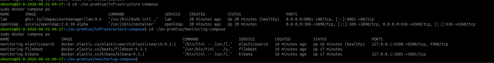
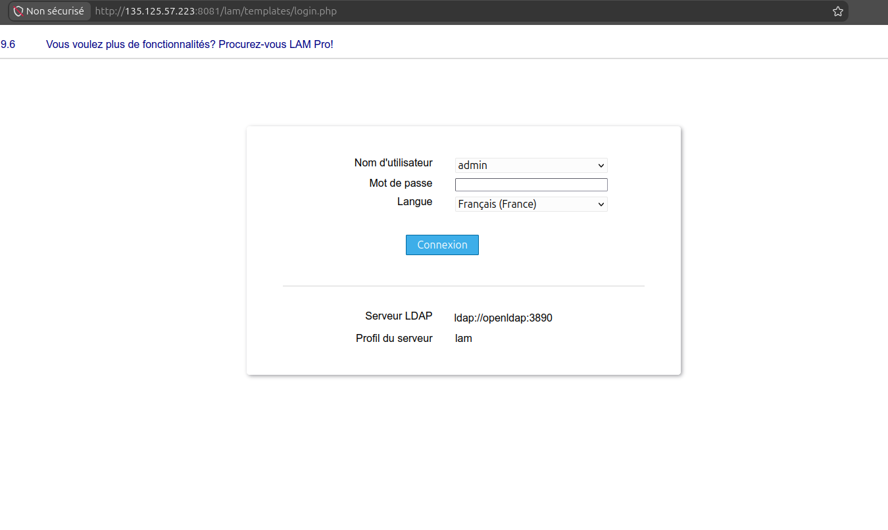
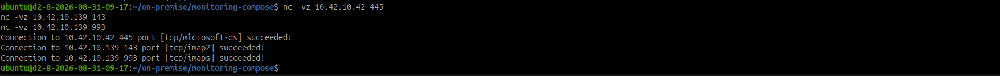
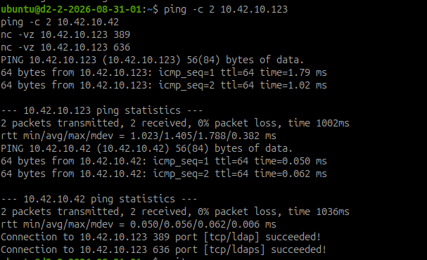
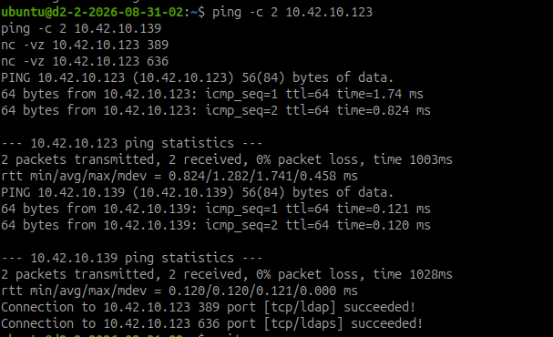
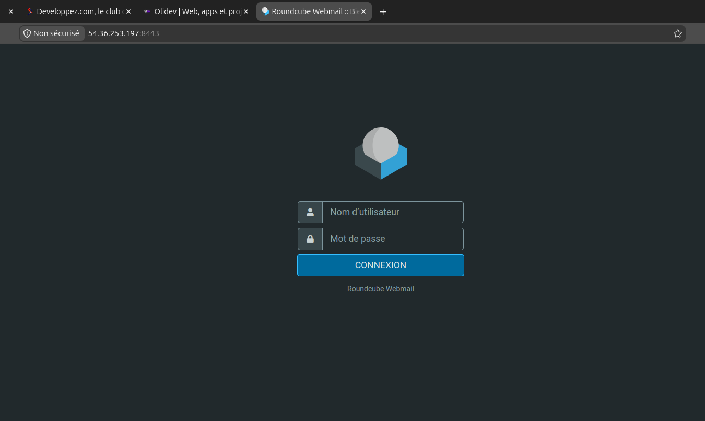
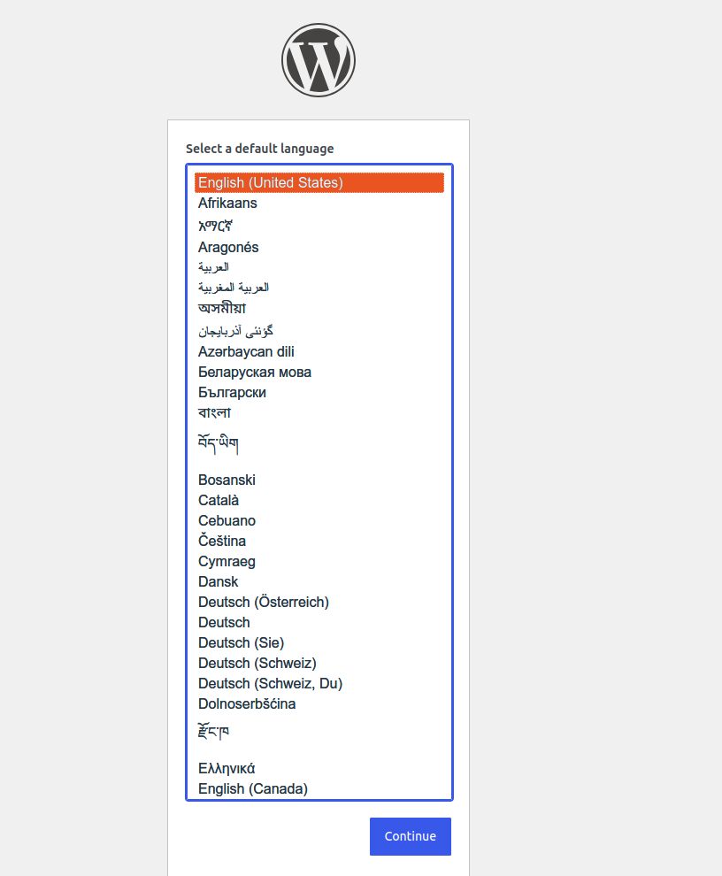
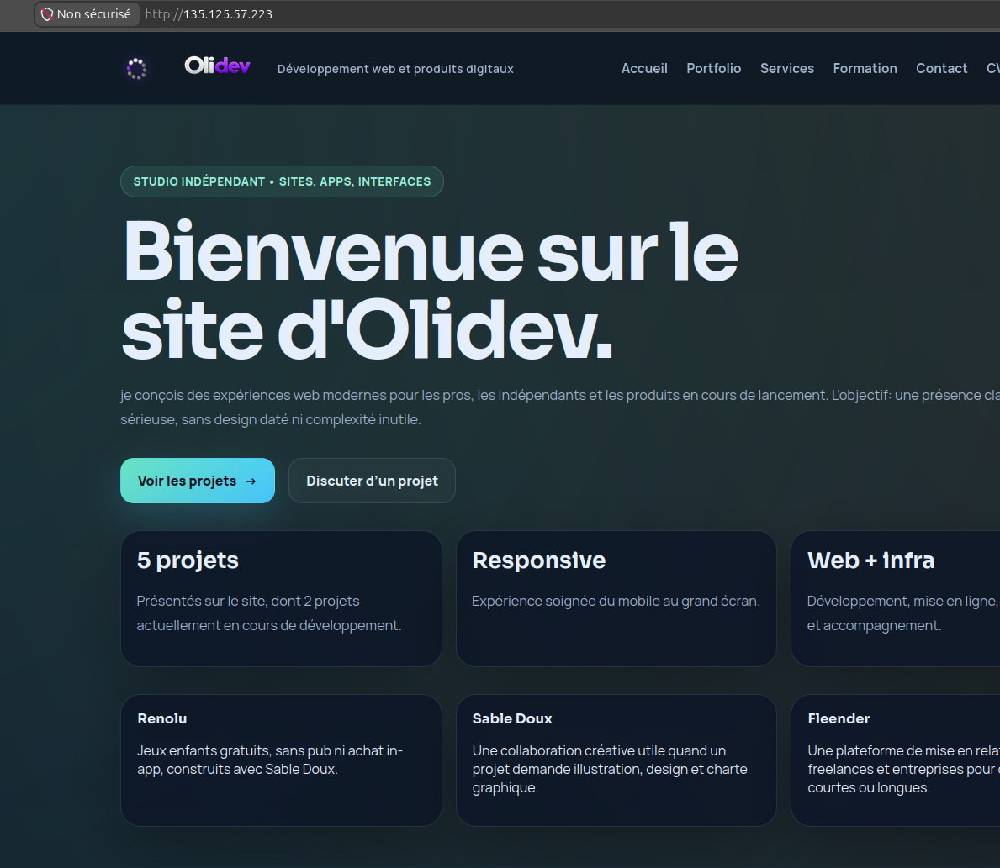
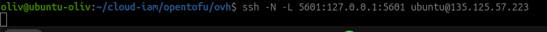
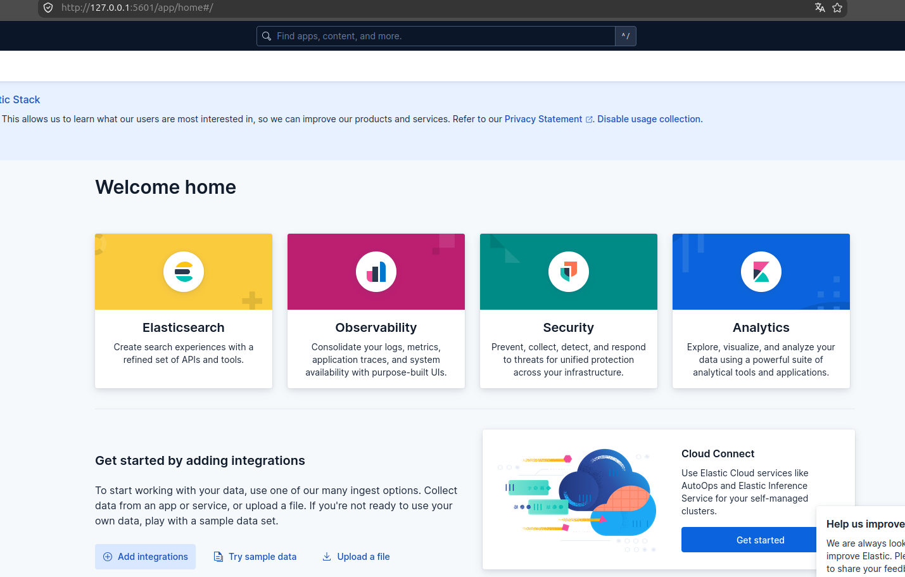

# Déployer le socle on-premise sur trois VM OVH

!!! info "Déploiement multi-VM - étape de migration"
    Cette feuille décrit la reprise du socle `/home/oliv/on-premise` sur les
    trois VM OVH. Le `tofu apply` est en cours au moment de la rédaction : les
    commandes ci-dessous restent des manipulations à retenir tant que les
    tests inter-hôtes et le déploiement des services n'ont pas été validés.

## Objectif

Déployer les services du projet on-premise sur trois VM OVHcloud et vérifier
qu'ils communiquent réellement par le réseau privé. OpenTofu fournit les
machines et Ansible prépare leur socle ; les fichiers Compose du projet
`/home/oliv/on-premise` doivent ensuite être adaptés à une exécution répartie.

La référence opérationnelle détaillée est le document
`documentation/cloud-migration-deployment.md` du dépôt on-premise.

## Architecture cible

| VM | Flavor | IP publique | IP privée | Services principaux |
| --- | --- | --- | --- | --- |
| `dist01b-ovh` | `d2-4` | `135.125.57.223` | `10.42.10.123` | OpenLDAP, LAM, Elasticsearch, Kibana, Filebeat |
| `files-ovh` | `d2-2` | `51.83.112.41` | `10.42.10.42` | Samba LDAP, WordPress, MariaDB |
| `mail-ovh` | `d2-2` | `54.36.253.197` | `10.42.10.139` | Postfix, Dovecot, Roundcube, MariaDB, sauvegardes |

Les deux `d2-2` avaient été supprimées pendant la réduction des coûts. Elles
ont été recréées par le `tofu apply` pour répondre au nouvel objectif : faire
fonctionner le socle sur trois hôtes. Leurs adresses doivent maintenant être
ajoutées à l'inventaire.

## Pré-requis réseau

Les VM utilisent le réseau privé OVH `10.42.10.0/24`. Un réseau Docker créé
par Compose reste local à l'hôte : `external: true` ne crée pas un réseau
Docker partagé entre plusieurs VM.

| Flux | Usage |
| --- | --- |
| TCP 389/636 vers `dist01b-ovh` | LDAP et LDAPS depuis Samba et la messagerie |
| TCP 139/445 vers `d2-2-01` | Partages SMB |
| TCP 25/587/143/993 vers `d2-2-02` | SMTP, submission et IMAP |
| TCP 8081/8082/5601 selon besoin | Interfaces Web de laboratoire |
| ICMP entre les trois VM | Diagnostic réseau |

Le pare-feu doit autoriser les flux privés nécessaires, tout en limitant les
ports exposés sur Internet. L'accès SSH reste limité à l'adresse publique du
poste d'administration.

## Étape 1 - Récupérer les adresses après OpenTofu

Une fois l'application terminée et confirmée dans le terminal :

```bash
cd /home/oliv/cloud-iam/opentofu/ovh
tofu output
tofu output small_instance_ipv4s
```

Relever pour chaque petite VM son adresse publique et son adresse privée avec
`openstack server show`, puis compléter
`/home/oliv/cloud-iam/ansible/inventory/ovh.ini`. Ne pas recopier de secret ou
de clé privée dans l'inventaire.

Exemple de groupes à obtenir :

```ini
[ovh]
dist01b-ovh ansible_host=IP_PUBLIQUE_PRINCIPALE ansible_user=ubuntu
files-ovh ansible_host=IP_PUBLIQUE_FILES ansible_user=ubuntu
mail-ovh ansible_host=IP_PUBLIQUE_MAIL ansible_user=ubuntu

[directory]
dist01b-ovh

[files]
files-ovh

[mail]
mail-ovh

[monitoring]
dist01b-ovh
```

Les noms et adresses de cet exemple sont à remplacer par les valeurs réelles
issues d'OpenStack.

## Étape 2 - Préparer les trois socles avec Ansible

Tester d'abord la connexion SSH :

```bash
cd /home/oliv/cloud-iam
ansible -i ansible/inventory/ovh.ini ovh -m ping
```

Puis appliquer le socle :

```bash
ansible-playbook -i ansible/inventory/ovh.ini \
  ansible/playbooks/base-system.yml
```

Contrôler au minimum Docker, Nginx si le groupe Web est conservé, et UFW sur
chaque hôte :

```bash
ansible -i ansible/inventory/ovh.ini ovh \
  -a "sudo ufw status verbose"
ansible -i ansible/inventory/ovh.ini ovh \
  -a "docker --version"
```

## Étape 3 - Adapter les Compose au multi-hôte

Avant de démarrer les services :

1. remplacer les noms Docker distants comme `openldap` par l'adresse privée de
   la VM annuaire ;
2. remplacer les anciennes références comme `ldap.embedded.local` par un nom
   résolu localement ou l'adresse privée prévue ;
3. publier LDAP/LDAPS sur la VM principale et tester l'accès depuis les VM
   fichiers et messagerie ;
4. conserver les noms de services Docker uniquement entre conteneurs du même
   Compose ;
5. adapter Filebeat pour collecter les journaux des hôtes nécessaires ;
6. adapter `backup/backup.sh`, car les volumes Docker sont locaux à chaque VM.

L'ordre de démarrage recommandé est le suivant :

```text
OpenLDAP + LAM
    -> Samba et WordPress
    -> Postfix, Dovecot et Roundcube
    -> Elasticsearch, Kibana et Filebeat
    -> sauvegardes
```

Chaque dépendance doit être validée avant de lancer le service suivant.

## Étape 4 - Vérifier les communications

Depuis chaque VM, tester les adresses privées des deux autres :

```bash
ping -c 2 IP_PRIVEE_AUTRE_VM
```

Depuis `files-ovh` et `mail-ovh`, vérifier LDAP :

```bash
nc -vz IP_PRIVEE_PRINCIPALE 389
nc -vz IP_PRIVEE_PRINCIPALE 636
openssl s_client -connect IP_PRIVEE_PRINCIPALE:636
```

Depuis le poste d'administration, vérifier les services publiés :

```bash
curl -I http://IP_PUBLIQUE_PRINCIPALE
curl -I http://IP_PUBLIQUE_FILES
nc -vz IP_PUBLIQUE_FILES 445
nc -vz IP_PUBLIQUE_MAIL 25
```

Sur chaque VM concernée :

```bash
docker compose ps
docker compose logs --tail=100 SERVICE
```

Une preuve utile montre à la fois le service démarré et sa dépendance
accessible : authentification LDAP, réponse HTTP, port SMTP/IMAP ou partage
SMB selon le cas.

## Captures de validation

Les captures suivantes ont été réalisées après le déploiement. Elles sont
présentées dans l'ordre : état des services, flux depuis la VM principale,
puis contrôles LDAP depuis les deux VM de services.



_Services OpenLDAP, LAM, Elasticsearch, Kibana et Filebeat actifs sur
`dist01b-ovh`._



_Interface LDAP Account Manager accessible sur `http://135.125.57.223:8081`._



_Le flux SMB vers `10.42.10.42` et les flux IMAP/IMAPS vers `10.42.10.139`
répondent depuis la VM principale._



_La VM fichiers joint l'annuaire principal sur `389/636`._



_La VM mail joint l'annuaire principal sur `389/636`._



_Roundcube est accessible derrière le conteneur Nginx reverse proxy sur
`mail-ovh:8443`._



_WordPress répond sur `files-ovh:8085` et présente son écran d'initialisation._



_Le site Olidev est servi par Nginx sur l'IP publique de la VM principale._

## Accéder à la supervision

Elasticsearch et Kibana sont actifs sur `dist01b-ovh`, mais leurs ports sont
liés à `127.0.0.1` pour éviter une exposition publique directe. Filebeat
envoie les journaux vers Elasticsearch dans le réseau Docker de supervision.

Depuis le poste d'administration, ouvrir un tunnel SSH :

```bash
ssh -L 5601:127.0.0.1:5601 \
  ubuntu@135.125.57.223
```

Puis ouvrir [http://127.0.0.1:5601](http://127.0.0.1:5601) dans le navigateur.
Pour l'API Elasticsearch, utiliser de la même manière le port local `9200` :

```bash
ssh -L 9200:127.0.0.1:9200 \
  ubuntu@135.125.57.223
```

La supervision est donc accessible par administration SSH, sans ajouter de
port Kibana ou Elasticsearch à l'exposition Internet.



_Tunnel SSH ouvert depuis le poste local vers Kibana sur la VM principale._



_Interface Kibana accessible sur `http://127.0.0.1:5601` grâce au tunnel SSH._

## État et preuves à conserver

| Élément | Statut au 31/08/2026 |
| --- | --- |
| VM principale `d2-4` | Réalisée et accessible en SSH |
| Deux VM `d2-2` | Créées par OpenTofu ; fichiers `10.42.10.42`, mail `10.42.10.139` |
| Réseau privé `10.42.10.0/24` | Validé entre les trois VM, 0 % de perte |
| Inventaire des trois VM | Complété avec les IP publiques et privées |
| Socle Ansible | Réalisé sur les trois VM ; seconde exécution `changed=0` |
| OpenLDAP, LAM et supervision | Déployés sur `dist01b-ovh`, conteneurs actifs |
| Samba et WordPress | Déployés sur `files-ovh`, conteneurs actifs |
| Postfix, Dovecot et Roundcube | Déployés sur `mail-ovh`, conteneurs actifs |
| LDAP privé depuis les VM dépendantes | Validé sur `389` et `636` |
| Ports SMB et IMAP/IMAPS | Validés depuis le poste d'administration |
| Adaptation des Compose | Réalisée par le playbook OVH et overrides distants |
| Tests applicatifs LDAP/SMB/mail complets | LDAP, SMB, IMAP/IMAPS validés ; SMTP `25` restant à vérifier |

Conserver les sorties `tofu output`, `ansible -m ping`, `docker compose ps`,
les tests `nc`/`openssl` et les captures utiles. Caviarder les clés S3, les
secrets OVH, les mots de passe, les tokens et les clés privées avant tout ajout
au mémo ou au dépôt Git.

!!! warning "Coût et nettoyage"
    Les trois VM et le stockage objet peuvent générer une facturation. Ne pas
    lancer `tofu destroy` sur l'infrastructure utile ou sur le bucket qui porte
    l'état distant. Toute suppression doit être précédée d'une vérification de
    l'état OpenTofu et des sauvegardes nécessaires.
