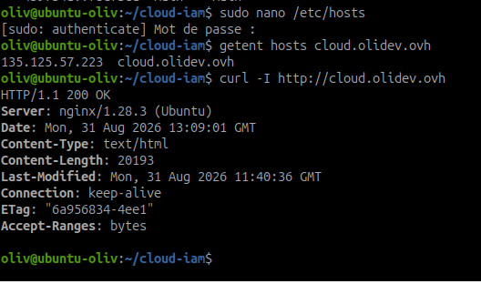
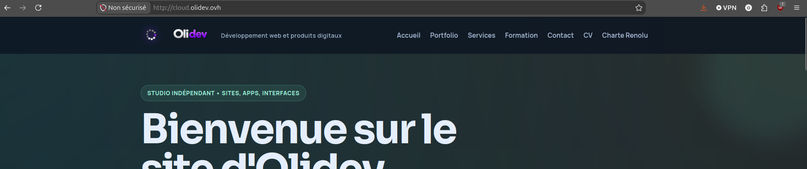

# DNS et répartition de charge cloud

!!! info "Durée indicative : 1 h 15"
    La partie obligatoire porte sur un enregistrement DNS et sa vérification.
    Le load balancer est une extension conditionnelle.

## Objectif

Faire pointer un nom de domaine vers une ressource cloud et vérifier la
résolution. Comprendre ensuite la différence entre DNS et répartition de charge.

## Pré-requis et état réel

Préparer une zone DNS administrable, l'adresse publique de la VM et un service
HTTP ou HTTPS réellement démarré si un test applicatif est prévu.

Dans le prototype OVH, aucun enregistrement DNS public n'est créé afin de
rester dans le périmètre gratuit. Le test est réalisé localement avec le nom
`cloud.olidev.ovh`, défini dans `/etc/hosts` sur le poste d'administration.
Cette méthode ne modifie pas la zone DNS publique et n'est visible que depuis
la machine configurée.

!!! warning "Adresse publique et pare-feu"
    Une adresse publique peut changer. Le DNS ne corrige pas un pare-feu qui
    bloque le service. Le prototype autorise actuellement SSH uniquement avec
    UFW : ouvrir HTTP/HTTPS nécessite une décision explicite.

## Types d'enregistrements

| Type | Exemple | Usage |
| --- | --- | --- |
| A | `web.example.tld -> 203.0.113.10` | Pointer vers une IPv4. |
| AAAA | `web.example.tld -> 2001:db8::10` | Pointer vers une IPv6. |
| CNAME | `www.example.tld -> web.example.tld` | Créer un alias vers un nom. |

Pour la VM OVH, un enregistrement A est le choix pédagogique le plus direct.

## Étape 1 - Créer un alias local gratuitement

Sur le poste d'administration, ouvrir le fichier `/etc/hosts` :

```bash
sudo nano /etc/hosts
```

Ajouter cette ligne :

```text
135.125.57.223 cloud.olidev.ovh
```

Cette entrée associe le nom à l'IP uniquement sur le poste local. Elle ne crée
pas de CNAME ou d'enregistrement A public et ne coûte rien. Ne pas remplacer
la résolution de `olidev.ovh`, qui doit continuer à pointer vers le site réel.

Fiche de la configuration réalisée :

| Élément | Valeur |
| --- | --- |
| Portée | Poste d'administration uniquement |
| Nom local | `cloud.olidev.ovh` |
| Mécanisme | `/etc/hosts` |
| Cible | `135.125.57.223` |
| DNS public | Aucun |
| Date | 31/08/2026 |

Ne pas publier une adresse ou une information de compte inutile à la preuve.

## Étape 2 - Vérifier la résolution et le service

Depuis le poste d'administration :

```bash
getent hosts cloud.olidev.ovh
curl -I http://cloud.olidev.ovh
```

`dig` et `nslookup` interrogent normalement un résolveur DNS et ne tiennent
pas compte de `/etc/hosts` de la même manière. Pour ce test local, `getent`
est donc la vérification adaptée de la résolution système.

Preuve terminale :



Vérifier ensuite le site dans un navigateur avec l'adresse :

```text
http://cloud.olidev.ovh
```

Preuve navigateur :



Pour un véritable enregistrement DNS public, comparer ensuite avec deux
résolveurs :

```bash
dig @1.1.1.1 +short cloud.example.tld A
dig @8.8.8.8 +short cloud.example.tld A
```

Ces commandes ne constituent pas une preuve pour l'alias `/etc/hosts` et sont
à utiliser seulement après la création éventuelle d'un enregistrement public.

Pour vérifier le service avec le nom local :

```bash
curl -I http://cloud.olidev.ovh
```

Une résolution réussie ne prouve pas que le service HTTP répond. Conserver les
sorties `getent` et `curl` comme deux preuves distinctes.

## Étape 3 - Documenter une bascule

Pour un test contrôlé :

1. relever l'ancien enregistrement et son TTL ;
2. modifier la cible vers une seconde adresse de laboratoire ;
3. relever l'heure de modification ;
4. interroger plusieurs résolveurs ;
5. remettre la cible initiale.

Pendant la propagation, différents clients peuvent encore recevoir l'ancienne
adresse. Cette bascule DNS ne constitue pas une haute disponibilité complète.

## DNS et load balancer

Plusieurs enregistrements A peuvent produire une répartition DNS rudimentaire,
mais le DNS ne suit pas chaque connexion et ne retire pas automatiquement une
VM défaillante sans mécanisme de santé.

| Besoin | Solution |
| --- | --- |
| Nom stable vers une VM | DNS A ou CNAME |
| Plusieurs cibles simples | Plusieurs A, avec limites documentées |
| Santé des backends et distribution des connexions | Load balancer |
| Bascule conditionnelle | DNS avec health checks et failover |

## Extension - Deux VM derrière un load balancer

Avec deux services web actifs, placer les VM derrière un load balancer OVH ou
un service équivalent. Vérifier l'état de santé des backends, le port contrôlé,
le protocole, le TLS et le comportement après arrêt d'une VM.

Cette extension est optionnelle et peut consommer un quota ou générer une
facturation. Elle n'est pas réalisée tant que sa configuration et ses tests ne
sont pas prouvés.

## État final attendu

| Point de contrôle | Statut initial |
| --- | --- |
| Alias local `/etc/hosts` | Réalisé le 31/08/2026 |
| Enregistrement DNS public A ou CNAME | Non réalisé, coût évité |
| Résolution locale avec `getent` | Réalisé le 31/08/2026 |
| Réponse HTTP avec le nom local | Réalisé le 31/08/2026, `200 OK` |
| Résolution avec un second résolveur public | Non applicable à `/etc/hosts` |
| Réponse HTTPS | Non réalisée, test en HTTP |
| Bascule d'adresse | Optionnelle |
| Load balancer avec deux VM | Extension non obligatoire |

## Preuves à conserver

- capture ou sortie de `/etc/hosts` sans secret ;
- sortie `getent` et `curl` datée ;
- capture navigateur avec `cloud.olidev.ovh` ;
- pour une zone publique, sortie `dig` ou `nslookup` et test depuis deux résolveurs ;
- sortie `curl` séparée si le service est exposé ;
- TTL, heure et observations lors d'une bascule ;
- pour l'extension, état des backends et test après arrêt d'une VM.

## Ressources

- [OVHcloud - documentation DNS](https://help.ovhcloud.com/)
- [AWS Route 53 - choix des enregistrements avec health checks](https://docs.aws.amazon.com/Route53/latest/DeveloperGuide/health-checks-how-route-53-chooses-records.html)
- [AWS Route 53 - configuration du failover DNS](https://docs.aws.amazon.com/Route53/latest/DeveloperGuide/dns-failover-configuring.html)
