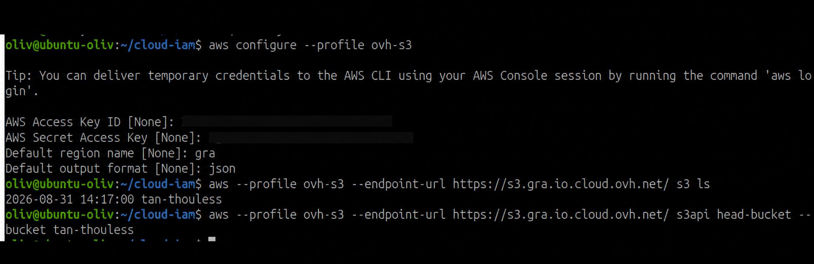
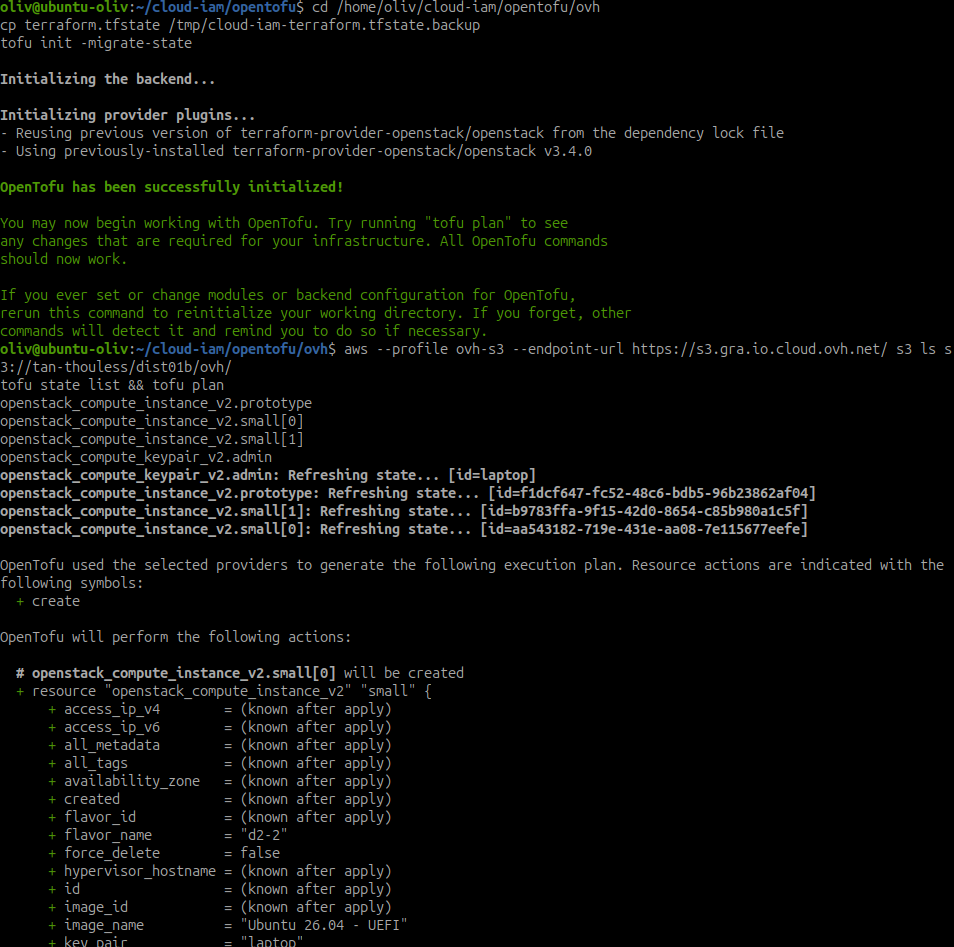
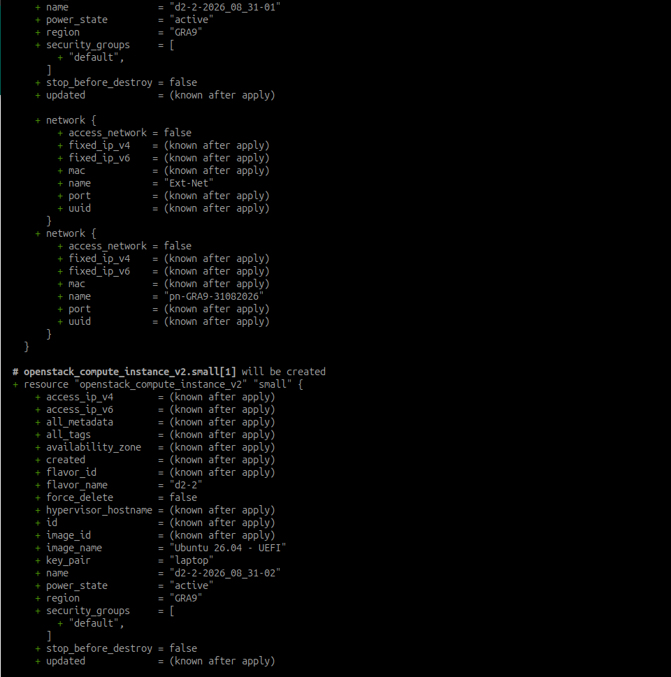
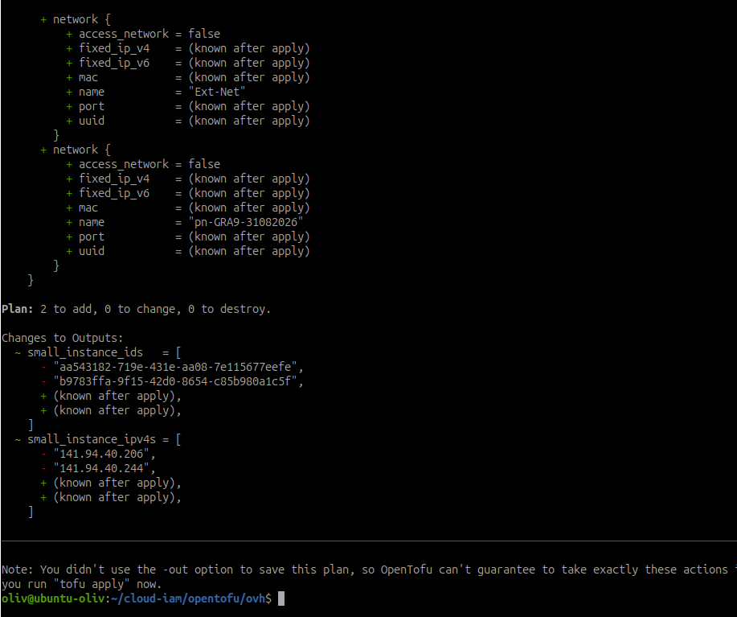

# Utiliser le stockage objet OVH comme backend OpenTofu

!!! info "Activité à réaliser"
    Cette feuille décrit un parcours à exécuter. La création du bucket, son
    test S3 et la migration de l'état ne sont pas considérés comme réalisés
    tant qu'une sortie de commande ou une capture ne les confirme pas.

## Objectif

Créer un bucket Object Storage OVHcloud, vérifier son accès avec l'API S3,
puis l'utiliser comme backend distant pour l'état OpenTofu. Le même stockage
pourra ensuite accueillir les sauvegardes du Kit 4.

À la fin, il faut pouvoir prouver le bucket, son endpoint, un échange d'objet,
la gestion déclarative et la migration de `terraform.tfstate`.

## Identifiants à distinguer

| Usage | Variables ou informations | Ne pas confondre avec |
| --- | --- | --- |
| API OVHcloud | `OVH_APPLICATION_KEY`, `OVH_APPLICATION_SECRET`, `OVH_CONSUMER_KEY` | les clés S3 |
| API OpenStack | `OS_AUTH_URL`, `OS_TENANT_ID`, `OS_USERNAME`, `OS_PASSWORD` | les clés S3 |
| API S3 | `AWS_ACCESS_KEY_ID`, `AWS_SECRET_ACCESS_KEY` | le mot de passe OpenStack |

Le `service_name` du provider OVH est l'identifiant du projet Public Cloud.
La région de calcul `GRA9` et la région Object Storage `GRA` ne sont pas
forcément nommées de la même façon.

!!! danger "Secrets et état"
    Ne jamais placer une clé S3, un secret, un mot de passe ou un token dans
    cette page, dans `terraform.tfvars`, dans le backend HCL ou dans Git. Le
    fichier d'état peut aussi contenir des informations sensibles.

## Étape 1 - Créer le bucket

Dans le projet Public Cloud, ouvrir `Object Storage`, créer un bucket dédié à
l'état OpenTofu, puis relever :

| Élément | Valeur |
| --- | --- |
| Nom du bucket | `tan-thouless` |
| Région Object Storage | `GRA`, Gravelines |
| Endpoint S3 | `https://s3.gra.io.cloud.ovh.net/` |
| Classe et zone | S3, `1-AZ` |
| Versioning | Activé |
| Chiffrement | Activé, `SSE-OMK` géré par OVHcloud |
| Object Lock | Désactivé |
| Utilisateur S3 associé | `A_COMPLETER` |

Activer le versioning si l'option est disponible et associer un utilisateur S3
avec les droits nécessaires sur ce bucket.

### Avancement réel au 31 août 2026

Le bucket `tan-thouless` a été créé dans le projet Public Cloud OVHcloud. Il
est situé à Gravelines, en zone `1-AZ`, avec le versioning et le chiffrement
activés. Aucun objet n'y est encore présent au moment du relevé.

La configuration du profil AWS CLI a été vérifiée avec des clés caviardées :



La capture conserve la région `gra`, le format `json`, le bucket et l'endpoint
utilisé. Les clés S3 ne doivent jamais apparaître en clair dans une preuve.

!!! warning "Endpoint"
    Reprendre l'endpoint fourni par la console. Un endpoint standard peut
    ressembler à `https://s3.gra.io.cloud.ovh.net/`; un endpoint High
    Performance peut utiliser `https://s3.gra.perf.cloud.ovh.net/`.

## Étape 2 - Configurer le client S3

Créer un profil AWS CLI séparé, sans mettre les clés dans une commande ou dans
le dépôt :

```bash
aws configure --profile ovh-s3
```

Tester l'accès avec l'endpoint réel :

```bash
aws --profile ovh-s3 --endpoint-url https://s3.gra.io.cloud.ovh.net/ s3 ls
aws --profile ovh-s3 --endpoint-url https://s3.gra.io.cloud.ovh.net/ s3api head-bucket --bucket tan-thouless
```

Le résultat attendu est une liste autorisée ou une liste vide, mais pas une
erreur d'authentification.

## Étape 3 - Tester un objet

Utiliser un fichier sans secret :

```bash
printf 'preuve Object Storage OVH\n' > /tmp/ovh-s3-test.txt
aws --profile ovh-s3 --endpoint-url https://s3.gra.io.cloud.ovh.net/ s3 cp /tmp/ovh-s3-test.txt s3://tan-thouless/validation/ovh-s3-test.txt
aws --profile ovh-s3 --endpoint-url https://s3.gra.io.cloud.ovh.net/ s3 ls s3://tan-thouless/validation/
aws --profile ovh-s3 --endpoint-url https://s3.gra.io.cloud.ovh.net/ s3 cp s3://tan-thouless/validation/ovh-s3-test.txt /tmp/ovh-s3-test-recu.txt
cmp /tmp/ovh-s3-test.txt /tmp/ovh-s3-test-recu.txt
```

Conserver les sorties d'envoi et de listing, ainsi que le résultat silencieux
de `cmp`. Supprimer ensuite l'objet de test si le bucket est réservé à l'état.

## Étape 4 - Déclarer le bucket avec OpenTofu

Le bucket utilise le provider OVH, différent du provider OpenStack des VM. Le
bootstrap doit rester séparé du projet qui utilisera son état, par exemple dans
`opentofu/ovh-object-storage/`.

Créer ces fichiers dans ce dossier :

```text
opentofu/ovh-object-storage/
├── main.tf
├── variables.tf
└── terraform.tfvars       # local, non versionné
```

Placer la configuration du provider et la ressource du bucket dans
`opentofu/ovh-object-storage/main.tf` :

```hcl
terraform {
  required_providers {
    ovh = {
      source  = "ovh/ovh"
      version = "~> 2.0"
    }
  }
}

provider "ovh" {
  endpoint = "ovh-eu"
}

resource "ovh_cloud_project_storage" "tofu_state" {
  service_name = var.service_name
  region_name  = "GRA"
  name         = var.bucket_name

  versioning = {
    status = "enabled"
  }

  encryption = {
    sse_algorithm = "AES256"
  }
}
```

Les valeurs de `service_name` et `bucket_name` restent locales. Les identifiants
du provider OVH sont fournis par les variables `OVH_*`.

Déclarer les variables dans `opentofu/ovh-object-storage/variables.tf`, puis
mettre les valeurs locales du projet et du bucket dans
`opentofu/ovh-object-storage/terraform.tfvars`. Ce dernier fichier ne doit pas
être commité.

Exemple de fichier `opentofu/ovh-object-storage/variables.tf` :

```hcl
variable "service_name" {
  description = "Identifiant du projet Public Cloud OVHcloud"
  type        = string
}

variable "bucket_name" {
  description = "Nom unique du bucket Object Storage"
  type        = string
}
```

Exemple de fichier local
`opentofu/ovh-object-storage/terraform.tfvars` :

```hcl
service_name = "0536ba70ed31491ab2eeb2590f12a8f8"
bucket_name  = "tan-thouless"
```

Le fichier `terraform.tfvars` ne contient ici aucun secret, mais il reste local
car il décrit l'environnement réel. Ajouter les identifiants OVH dans le
terminal avant l'initialisation, par exemple en chargeant le fichier local
prévu pour le projet :

```bash
source ~/cloud-iam-ovh/env/ovh.env
printf 'endpoint=%s project=%s\n' "$OVH_ENDPOINT" "$OVH_CLOUD_PROJECT_SERVICE"
```

Les variables `OVH_APPLICATION_KEY`, `OVH_APPLICATION_SECRET` et
`OVH_CONSUMER_KEY` ne doivent pas être affichées dans la sortie ni écrites dans
`variables.tf` ou `terraform.tfvars`.

```bash
cd /home/oliv/cloud-iam/opentofu/ovh-object-storage
tofu init && tofu fmt && tofu validate && tofu plan
```

Tester `tofu destroy` uniquement sur un bucket de laboratoire vide. Ne jamais
détruire le bucket qui porte l'état actif.

## Étape 5 - Configurer le backend S3

Le bucket doit exister avant `tofu init`. Le backend ne peut pas référencer
directement une ressource créée par la même initialisation.

Dans le projet principal `opentofu/ovh/`, créer un fichier dédié nommé
`backend.tf` :

```hcl
terraform {
  backend "s3" {
    bucket = "tan-thouless"
    key    = "dist01b/ovh/terraform.tfstate"
    region = "gra"

    endpoints = {
      s3 = "https://s3.gra.io.cloud.ovh.net/"
    }

    use_path_style              = true
    skip_credentials_validation = true
    skip_region_validation      = true
    skip_requesting_account_id  = true
    skip_s3_checksum             = true
  }
}
```

Pour High Performance, reprendre l'endpoint fourni par OVH. Charger les clés
depuis le profil AWS ou l'environnement, jamais dans le bloc backend :

```bash
export AWS_ACCESS_KEY_ID='A_REMPLACER'
export AWS_SECRET_ACCESS_KEY='A_REMPLACER'
```

Le fichier `backend.tf` peut contenir la configuration du backend, mais jamais
les clés S3. Elles sont chargées par le profil `ovh-s3` ou par l'environnement.

## Étape 6 - Migrer l'état

Sauvegarder l'état local dans un emplacement protégé, puis migrer :

```bash
cd /home/oliv/cloud-iam/opentofu/ovh
cp terraform.tfstate /tmp/cloud-iam-terraform.tfstate.backup
tofu init -migrate-state
```

Répondre `yes` uniquement après vérification du bucket, de l'endpoint et des
identifiants S3. Vérifier ensuite l'objet distant et l'absence de dérive :

```bash
aws --profile ovh-s3 --endpoint-url https://s3.gra.io.cloud.ovh.net/ s3 ls s3://tan-thouless/dist01b/ovh/
tofu state list && tofu plan
```

Preuves de la migration, dans l'ordre d'apparition dans le terminal :







La migration de l'état est visible dans la première capture. Les deux suivantes
montrent le `tofu state list` puis un plan qui prévoyait encore deux créations.
Ces créations correspondent aux deux petites VM `d2-2` supprimées
volontairement car elles ne sont pas utiles pour l'instant, alors que leurs
déclarations existent encore dans la configuration OpenTofu. Il faut donc
répercuter ce choix dans le code avant de retenir un plan final sans changement,
plutôt que recréer les VM avec `tofu apply`.

!!! danger "Ne pas détruire le backend actif"
    Une fois l'état distant activé, ne pas supprimer l'objet d'état ni lancer
    `tofu destroy` sur le bootstrap du bucket. Prévoir versioning et sauvegarde.

## Étape 7 - Cycle de vie et verrouillage

OpenTofu récent peut utiliser le verrouillage natif S3 avec `use_lockfile = true`.
Tester sa compatibilité avec OVH avant de retenir cette option comme preuve.

Pour une règle à 30 jours, cibler les anciennes versions ou un préfixe de
sauvegarde. Ne pas supprimer l'objet d'état courant. Vérifier le schéma accepté
par la version installée du provider OVH avant d'ajouter la règle.

## État final attendu

| Point de contrôle | Statut initial |
| --- | --- |
| Bucket, région et endpoint relevés | Réalisé le 31/08/2026 |
| Identifiants S3 testés et hors Git | Réalisé le 31/08/2026 |
| Objet de test envoyé puis relu | À exécuter |
| Bucket déclaré dans un bootstrap séparé | À exécuter |
| `tofu init -migrate-state` terminé | Réalisé le 31/08/2026 |
| Objet d'état visible dans le bucket | À exécuter |
| `tofu plan` sans recréation | À aligner : les deux créations correspondent aux VM `d2-2` supprimées volontairement |
| Préfixe de sauvegarde du Kit 4 identifié | À préparer |

## Preuves à conserver

- capture du bucket, de sa région et de son endpoint sans secret ;
- sorties `aws s3 ls` et `s3api head-bucket` ;
- upload, listing, téléchargement et comparaison de l'objet de test ;
- sorties `tofu fmt`, `tofu validate`, `tofu plan` et `tofu init` ;
- listing S3 montrant l'objet d'état, sans publier son contenu ;
- `tofu state list` et `tofu plan` après migration.

## Ressources

- [OVHcloud - gérer un bucket Object Storage avec Terraform](https://github.com/ovh/docs/blob/develop/pages/storage_and_backup/object_storage/s3_terraform/guide.en-ie.md)
- [OVHcloud - Object Storage comme backend Terraform](https://docs.ovh.com/en/guides/public-cloud/compute/use-object-storage-terraform-backend-state)
- [OpenTofu - backend S3](https://opentofu.org/docs/language/settings/backends/s3/)
- [AWS CLI - commande S3](https://docs.aws.amazon.com/cli/latest/reference/s3/)
