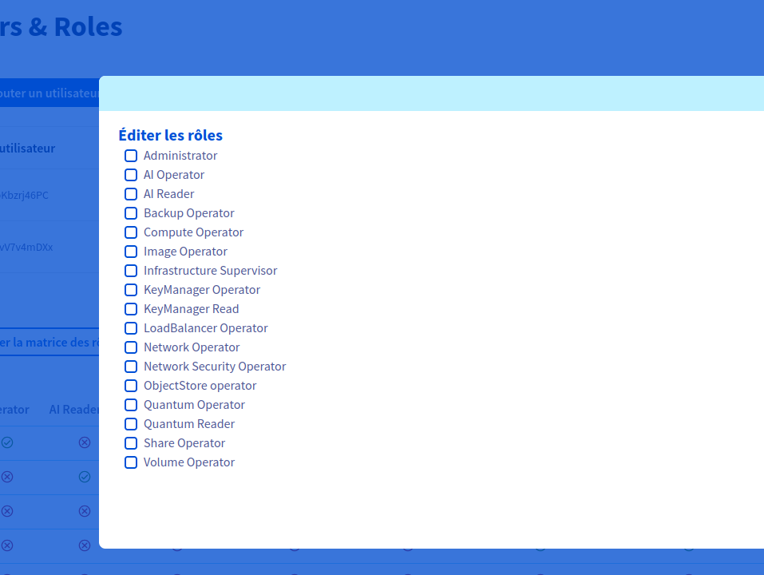
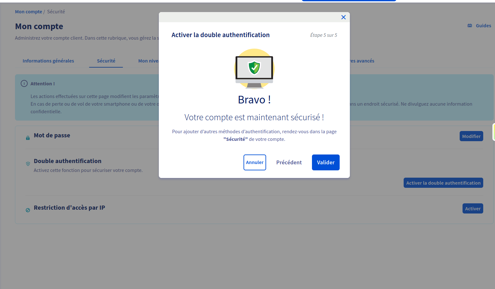
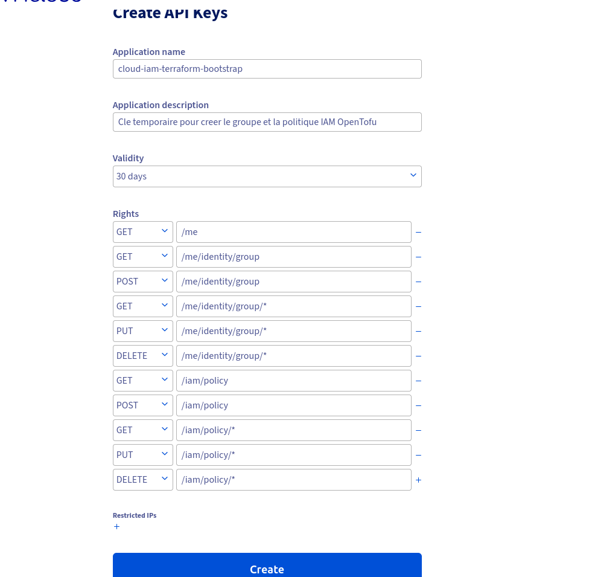
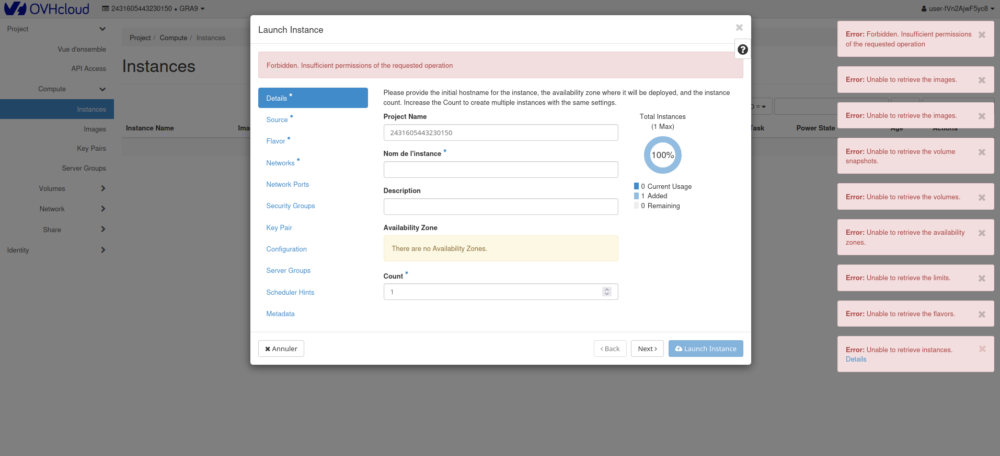
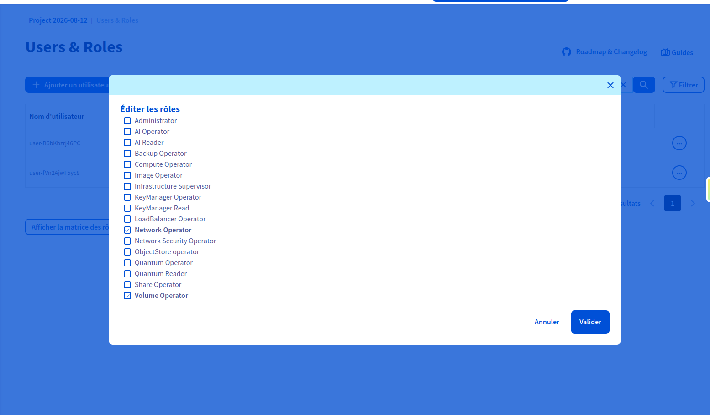
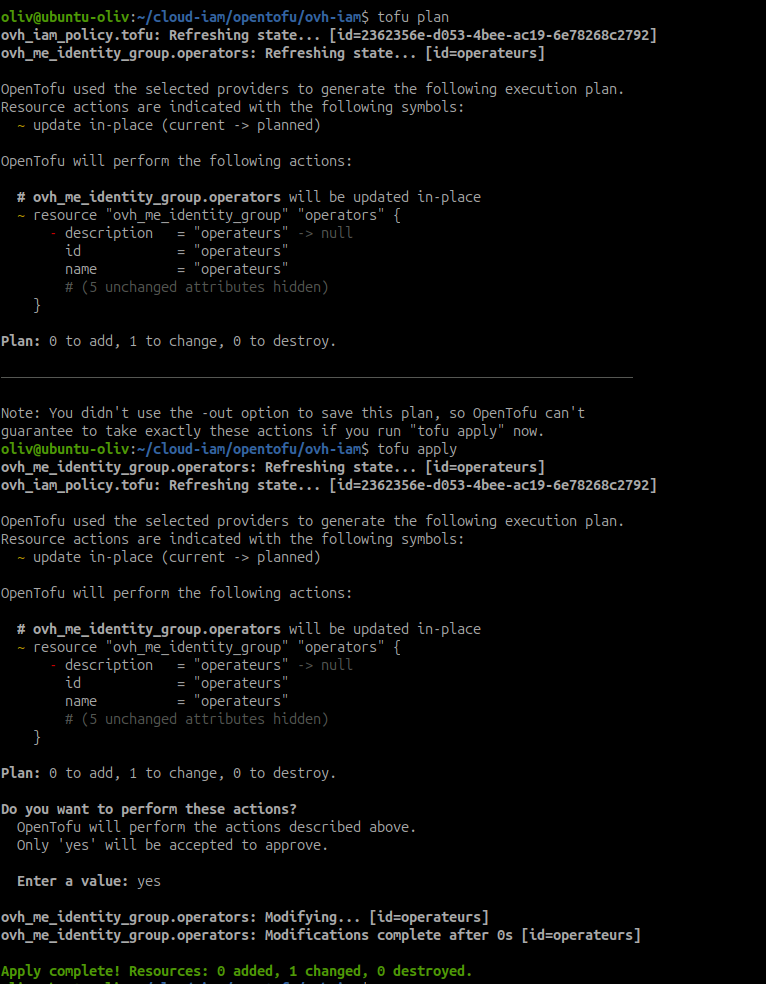

# Configurer l'IAM sur le premier fournisseur

!!! info "Durée : 3 h - atelier à réaliser"
    Cette feuille propose une mise en pratique sur le premier fournisseur du
    parcours, OVHcloud. Les exemples OpenTofu sont des squelettes à adapter et
    à valider dans un projet de laboratoire avant toute application.

## Objectif

Construire une organisation d'accès à deux niveaux et vérifier concrètement le
moindre privilège :

- un groupe d'opérateurs en lecture seule ;
- un groupe d'administrateurs applicatifs limité à la gestion des ressources ;
- une identité de service distincte pour OpenTofu ;
- le MFA sur le compte administrateur principal ;
- une action interdite qui échoue réellement.

## Point d'attention OVHcloud

OVHcloud distingue plusieurs périmètres. Il faut les identifier avant de créer
des droits :

| Périmètre | Ce qui est géré | Exemple dans ce parcours |
| --- | --- | --- |
| Compte OVHcloud / IAM | utilisateurs, groupes, politiques, identités de service, MFA | accès à l'API OVHcloud |
| Projet Public Cloud | utilisateurs du projet et rôles OpenStack | accès aux VM et aux réseaux |
| Machine cliente | fichiers `clouds.yaml`, variables et profils locaux | authentification d'OpenTofu |

Dans l'interface actuellement disponible pour le projet Public Cloud utilisé
dans ce parcours, le menu `Public Cloud` > projet > `Gestion de projet` >
`Utilisateurs et rôles` ne propose pas de groupes personnalisés. Il permet de
créer des utilisateurs du projet et de leur attribuer les rôles prédéfinis
affichés dans la matrice, par exemple `AI Reader`, `Compute Operator` ou
`Administrator`.

L'exercice est donc adapté à OVHcloud ainsi : le niveau « opérateur » est un
utilisateur avec un rôle de lecture, et le niveau « administrateur applicatif »
est un utilisateur avec les seuls rôles de service nécessaires. La notion de
groupe reste la cible théorique de l'IAM et pourra être rejouée chez un
fournisseur qui expose cette fonction dans son interface.

Le MFA du compte OVHcloud ne remplace pas la gestion des identifiants du projet
OpenStack. De même, une clé personnelle ne doit pas devenir la clé durable d'un
pipeline.

## Déroulement

### 1. Préparer la matrice des droits

Compléter cette matrice avant de cliquer dans le Manager. Remplacer les noms
indicatifs par les rôles réellement proposés dans le projet OVH.

| Profil / groupe cible | Identité réelle dans OVH | Droits attendus | Droits exclus |
| --- | --- | --- | --- |
| `operateurs` (théorique) | `operateur1` | consulter les projets, VM, réseaux et volumes | créer, modifier ou supprimer |
| `administrateurs-applicatifs` (théorique) | `admin-app1` | gérer les VM, réseaux et volumes du périmètre | IAM, facturation et administration du compte |
| identité de service | `tofu-ovh` | actions strictement nécessaires au déploiement | connexion interactive, IAM global |

### Rôles réellement proposés dans le projet

La matrice affichée dans `Users & Roles` propose actuellement : `Administrator`,
`AI Operator`, `AI Reader`, `Backup Operator`, `Compute Operator`, `Image
Operator`, `Infrastructure Supervisor`, `KeyManager Operator`, `KeyManager
Read`, `LoadBalancer Operator`, `Network Operator`, `Network Security
Operator`, `ObjectStore Operator`, `Quantum Operator`, `Quantum Reader`, `Share
Operator` et `Volume Operator`.

Il n'y a pas de rôle général `Reader` ou `Compute Reader`. Les rôles `AI Reader`,
`Quantum Reader` et `KeyManager Read` sont spécialisés et ne permettent pas de
consulter librement les VM, réseaux et volumes du projet. Pour cette
configuration OVH, ne pas attribuer `Compute Operator` à `operateur1` sous
prétexte d'obtenir la lecture : ce rôle autorise des opérations sur le calcul.

Le résultat honnête de l'exercice peut donc être : `operateur1` est créé sans
rôle, l'accès aux ressources est refusé, puis la limite fonctionnelle « pas de
lecture seule généraliste dans cette matrice » est consignée. La comparaison
avec un fournisseur proposant un rôle `Reader` général constitue l'extension de
l'atelier.



Le rôle `Administrator` ne convient pas à un opérateur. Pour le groupe de
lecture, sélectionner le rôle ou la politique prédéfinie de lecture seule
disponible dans le périmètre choisi et noter son libellé exact dans la preuve.

### 2. Créer l'opérateur et vérifier la lecture

Pour l'IAM du compte OVHcloud, ouvrir le menu global
`Identité, Sécurité & Opérations` puis `Identités` ou `Politiques`. C'est ici que
se trouvent les utilisateurs, groupes et politiques IAM du compte. Dans le
projet Public Cloud, le chemin complémentaire est
`Public Cloud` > sélectionner le projet > `Gestion de projet` > `Utilisateurs
et rôles` : cet écran attribue les rôles OpenStack du projet, mais ne remplace
pas les groupes IAM du compte.

Dans le périmètre choisi :

1. créer l'utilisateur secondaire `operateur1` ;
2. lui attribuer uniquement le rôle de lecture adapté au service ;
3. ouvrir une session séparée et vérifier qu'il peut consulter l'inventaire ;
4. noter dans le compte rendu que le regroupement `operateurs` n'est pas
   disponible dans cette interface OVH.

Ne pas utiliser le compte principal pour simuler l'opérateur. Conserver la
preuve de la page des rôles sans afficher de mot de passe, jeton ou clé.

### 3. Activer le MFA du compte privilégié

Le MFA n'est pas proposé dans l'écran `Users & Roles` du projet : ces comptes
OpenStack/Horizon utilisent un identifiant et un mot de passe avec les rôles du
projet. Cette étape n'est donc pas réalisable sur `operateur1` depuis cette
interface.

En revanche, le MFA reste activable pour le compte OVHcloud principal depuis
`Nom du compte` > `Mon compte` > `Sécurité` > `Activer la double
authentification`. Il protège alors l'accès au Manager OVHcloud, pas la session
OpenStack/Horizon de l'utilisateur du projet. Tester une nouvelle connexion
dans une fenêtre privée et conserver une capture du statut activé, sans afficher
le QR code, le secret de configuration ni les codes de secours. Stocker ces
éléments uniquement dans le gestionnaire de secrets prévu.

Si l'objectif est de protéger directement la connexion Horizon par MFA, il faut
mettre en place un mécanisme SSO/fédération compatible avec le fournisseur ; ce
n'est pas une case disponible dans la matrice de rôles actuelle.



### 4. Créer l'identité de service OpenTofu

Créer une identité de service dédiée, par exemple `tofu-ovh`, avec une politique
limitée au projet et aux actions nécessaires. OVHcloud recommande une identité
de service par script ou application ; privilégier le mécanisme de compte de
service/OAuth2 proposé par le fournisseur. Une clé API restreinte n'est qu'une
solution de compatibilité si l'outil retenu l'impose.

Règles de stockage :

- ne jamais mettre les secrets dans `terraform.tfvars`, Git, une capture ou la
  documentation ;
- charger les valeurs depuis l'environnement, un profil local protégé ou un
  gestionnaire de secrets ;
- vérifier les exclusions avec `git check-ignore -v` avant un commit ;
- révoquer et régénérer toute clé qui aurait été exposée.

La capture ci-dessous montre le formulaire de création de la clé API avec les
règles de lecture et d'écriture nécessaires aux ressources IAM renseignées et
une validité de 30 jours. La restriction IP est restée vide, car la VM ayant
été supprimée, l'adresse d'administration n'est plus retenue pour ce test :
cette absence doit être signalée comme une limite de la preuve.



### 5. Créer l'administrateur applicatif

Créer l'utilisateur `admin-app1` et lui attribuer les rôles prédéfinis
nécessaires aux VM, réseaux et volumes du projet. Ne pas lui accorder de droit sur les
utilisateurs, groupes, politiques IAM, factures ou moyens de paiement.

Le périmètre doit être explicite : project ID OVH Public Cloud, service, région
et environnement concernés. Une permission qui couvre tout le compte n'est
pas une permission limitée, même si son nom contient « application ».

Dans la capture fournie, le rôle `Administrator` est attribué à l'utilisateur
principal et le second utilisateur est encore en `Création en cours`. Cette
preuve montre bien la gestion des utilisateurs et des rôles du projet, mais pas
la création d'un groupe IAM. Le rôle `AI Reader` visible dans cette matrice est
limité aux services AI ; il ne constitue pas automatiquement un accès en
lecture aux VM OpenStack.

Si aucun rôle général `Compute Reader` n'est proposé, ne pas sélectionner
`AI Reader` pour prétendre tester la lecture des VM. Indiquer « fonctionnalité
non exposée dans l'interface Public Cloud utilisée » et réaliser le test IAM
sur un périmètre effectivement disponible.

### 6. Tester le moindre privilège

Avec `operateur1`, réaliser d'abord des commandes de lecture, puis tenter une
action d'écriture sur une ressource de laboratoire non critique. Par exemple,
tenter de supprimer une VM de test ou une ressource temporaire. Le résultat
attendu est un refus `403 Forbidden` ou l'équivalent affiché par le Manager.

Ne pas supprimer une VM utile à DIST-01b. Si aucune ressource de laboratoire
n'est disponible, utiliser la vérification des permissions dans l'interface ou
une commande d'écriture sans effet destructif proposée par le fournisseur, et
documenter cette limite.

| Test | Compte | Résultat attendu | Preuve |
| --- | --- | --- | --- |
| lister les VM | `operateur1` | succès | sortie ou capture sans secret |
| consulter un réseau | `operateur1` | succès | sortie ou capture |
| créer/modifier une ressource | `operateur1` | refus | code ou message d'erreur |
| supprimer une ressource de test | `operateur1` | refus | preuve datée, ressource non critique |
| gérer une VM du périmètre | `admin-app1` | succès | capture ou sortie contrôlée |
| modifier un rôle IAM | `admin-app1` | refus | preuve du refus |

### Preuve obtenue avec Horizon

La session `operateur1` permet d'ouvrir Horizon, mais le lancement d'une
instance échoue avec `Forbidden. Insufficient permissions of the requested
operation`. Les erreurs de lecture des images, volumes, quotas et instances
confirment que ce compte ne dispose pas des droits de calcul nécessaires.



Cette preuve valide le refus d'une action d'écriture. Elle ne prouve pas un
accès général en lecture seule : avec la matrice de rôles OVH disponible, ce
dernier niveau n'est pas exposé pour Compute.

Pour l'administrateur applicatif, la combinaison retenue dans l'essai est
`Network Operator` et `Volume Operator`. Elle couvre le réseau et les volumes,
mais ne donne pas le rôle `Administrator` ni la gestion des identités. Elle doit
être complétée par `Compute Operator` uniquement si la mission inclut réellement
la création ou la modification de VM.



## Reproduire avec OpenTofu

Le provider OpenStack utilisé pour les VM et le provider OVH utilisé pour l'IAM
ne couvrent pas le même périmètre. Si l'IAM global est activé et accessible sur
le compte, créer un dossier séparé, par exemple `opentofu/ovh-iam/`, et ne pas
mélanger cette pile avec l'état OpenStack des VM. Sinon, conserver la
configuration des utilisateurs/rôles du projet comme une étape manuelle
documentée et ne pas inventer une ressource OpenTofu qui n'est pas disponible
dans ce périmètre.

### Exemple de fichiers locaux

`opentofu/ovh-iam/variables.tf` :

```hcl
variable "ovh_endpoint" {
  type    = string
  default = "ovh-eu"
}

variable "project_urn" {
  type      = string
  sensitive = false
}

variable "tofu_service_identity" {
  type      = string
  sensitive = false
}

variable "tofu_allowed_actions" {
  description = "Actions OVHcloud strictement necessaires a OpenTofu"
  type        = list(string)
}
```

`opentofu/ovh-iam/main.tf` :

```hcl
terraform {
  required_providers {
    ovh = {
      source  = "ovh/ovh"
      version = "~> 2.0"
    }
  }
}

provider "ovh" {
  endpoint = var.ovh_endpoint
}

resource "ovh_me_identity_group" "operators" {
  name = "operateurs"
  role = "UNPRIVILEGED"
}

resource "ovh_iam_policy" "tofu" {
  name        = "tofu-project-limited"
  description = "Droits OpenTofu limites au projet de laboratoire"
  identities  = [var.tofu_service_identity]
  resources   = [var.project_urn]

  # Remplacer par les actions verifiees dans la documentation et l'API OVH.
  allow = var.tofu_allowed_actions
}
```

Ajouter dans `variables.tf` la variable `tofu_allowed_actions` de type
`list(string)`, puis renseigner les valeurs locales dans
`opentofu/ovh-iam/terraform.tfvars`. Ce fichier reste ignoré par Git. Les noms
d'actions et les URN sont volontairement à compléter : ils dépendent du
périmètre OVH ciblé et ne doivent pas être inventés à partir d'une politique
AWS.

Commandes de contrôle :

```bash
cd /home/oliv/cloud-iam/opentofu/ovh-iam
tofu init
tofu fmt -check
tofu validate
tofu plan
```

Le premier `plan` doit être relu avant toute création. Ne pas appliquer ce
squelette tant que l'identité, les actions, l'URN et la méthode de secret n'ont
pas été vérifiés dans le Manager et dans la documentation du provider.

### Preuve finale OpenTofu

Après l'import du groupe déjà créé lors d'un précédent essai, OpenTofu retrouve
les deux ressources dans son état. Le plan final ne prévoit plus de création ou
de destruction, puis l'application se termine avec `0 added, 1 changed, 0
destroyed`. La politique IAM était déjà présente ; seul le groupe a été
réconcilié.



## Pour aller plus loin : politique personnalisée

Remplacer la permission managée de lecture par une liste explicite d'actions
autorisées, puis ajouter un refus explicite pour les opérations IAM. Le JSON
d'une politique AWS n'est pas automatiquement accepté par OVHcloud : reprendre
la syntaxe attendue par le provider OVH et son API, puis conserver la politique
validée comme fichier versionné sans secret.

## Preuves et nettoyage

À conserver : matrice des droits, rôles affichés, MFA activé, identité de
service sans secret visible, résultats des tests de lecture/refus et sortie
`tofu plan`.

À la fin de l'atelier, désactiver ou supprimer les utilisateurs, groupes,
identités et ressources de laboratoire créés uniquement pour le test. Ne jamais
supprimer une identité encore utilisée par OpenTofu ni révoquer la clé active
avant d'avoir préparé son remplacement.

## Ressources officielles

- [OVHcloud IAM](https://help.ovhcloud.com/csm/en-sg-documentation-manage-operate-iam?id=kb_browse_cat&kb_category=f9734072c014f990f0785f572a5744ed&kb_id=3d4a8129a884a950f07829d7d5c75243)
- [Comptes de service OVHcloud](https://help.ovhcloud.com/csm/en-ca-api-service-account-connection?id=kb_article_view&sysparm_article=KB0059327)
- [Comptes de service pour l'API OpenStack](https://help.ovhcloud.com/csm/pt-public-cloud-authenticate-api-openstack-service-account?id=kb_article_view&sysparm_article=KB0059363)
- [Ressource `ovh_iam_policy`](https://registry.terraform.io/providers/ovh/ovh/latest/docs/resources/iam_policy)
- [Ressource `ovh_me_identity_group`](https://registry.terraform.io/providers/ovh/ovh/latest/docs/resources/me_identity_group)
