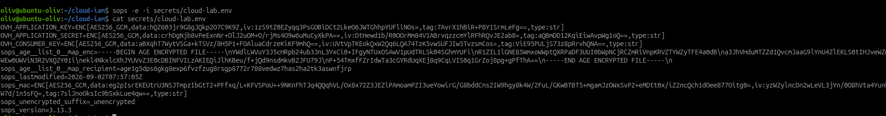
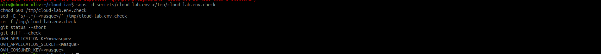

# 3.4 | Gestion des secrets avec SOPS

!!! info "Durée : 30 min - manipulation locale"
    Utiliser uniquement des valeurs fictives ou dédiées au laboratoire. Ne
    jamais placer une vraie clé API, un mot de passe ou un token dans cette
    feuille, une capture ou Git.

## Objectif

Comprendre SOPS et l'utiliser avec `age` pour chiffrer les secrets consommés
par OpenTofu et Ansible. Le dépôt conserve le fichier chiffré ; la clé privée
reste locale et protégée.

## Étape 1 - Vérifier les outils

```bash
sops --version
age --version
```

Installer SOPS et age depuis les paquets ou versions publiés par leurs projets
officiels, puis noter les versions utilisées.

## Étape 2 - Générer une clé age

```bash
install -d -m 700 ~/.config/sops/age
age-keygen -o ~/.config/sops/age/keys.txt
chmod 600 ~/.config/sops/age/keys.txt
age-keygen -y ~/.config/sops/age/keys.txt
```

La dernière commande affiche la clé publique `age1...`. Elle peut être
versionnée dans `.sops.yaml`. Ne jamais afficher ou committer `keys.txt`.

## Étape 3 - Créer `.sops.yaml`

À la racine du dépôt :

```yaml
creation_rules:
  - path_regex: secrets/.*\.(yaml|yml|json|env)$
    age: AGE_PUBLIC_KEY
```

Remplacer `AGE_PUBLIC_KEY` par la clé publique obtenue à l'étape précédente.

## Étape 4 - Chiffrer un fichier de test

```bash
mkdir -p secrets
printf '%s\n' \
  'OVH_APPLICATION_KEY=EXEMPLE_A_REMPLACER' \
  'OVH_APPLICATION_SECRET=EXEMPLE_A_REMPLACER' \
  'OVH_CONSUMER_KEY=EXEMPLE_A_REMPLACER' \
  > secrets/cloud-lab.env

sops -e -i secrets/cloud-lab.env
```

Selon la version installée, la forme récente équivalente est :

```bash
sops encrypt -i secrets/cloud-lab.env
```

Le fichier doit maintenant contenir des valeurs chiffrées et une section
`sops`. Si une vraie valeur a été utilisée par erreur, la révoquer et la
remplacer immédiatement.

La preuve ci-dessous montre que les trois valeurs du fichier `.env` sont
remplacées par des blocs `ENC[...]` et que les métadonnées SOPS sont présentes.
Le fichier reste exploitable par SOPS, mais aucune valeur de test n'est lisible
en clair dans le dépôt.



## Étape 5 - Lire et modifier avec SOPS

```bash
sops -d secrets/cloud-lab.env
sops secrets/cloud-lab.env
```

La seconde commande ouvre le fichier déchiffré dans l'éditeur, puis le
rechiffre à la sauvegarde. Ne pas utiliser `sops -d -i` sur un fichier destiné
au dépôt.

Ajouter les fichiers déchiffrés aux exclusions :

```gitignore
secrets/*.decrypted.*
secrets/*.clear.*
```

Vérifier ensuite :

```bash
git status --short
git diff --check
git check-ignore -v secrets/cloud-lab.env
```

Le fichier chiffré peut être versionné ; la clé privée et les fichiers clairs
ne le sont jamais.

## Étape 6 - Utiliser un secret avec OpenTofu

Déchiffrer dans un fichier temporaire protégé, l'utiliser, puis le supprimer :

```bash
tmp_env="$(mktemp)"
chmod 600 "$tmp_env"
trap 'rm -f "$tmp_env"' EXIT
sops -d secrets/cloud-lab.env > "$tmp_env"
set -a
source "$tmp_env"
set +a

cd /home/oliv/cloud-iam/opentofu/ovh-iam
tofu plan
```

Le fichier temporaire ne doit pas être copié dans le dépôt. En CI, préférer
l'injection par un gestionnaire de secrets.

## Étape 7 - Utiliser un secret avec Ansible

```bash
tmp_vars="$(mktemp)"
chmod 600 "$tmp_vars"
trap 'rm -f "$tmp_vars"' EXIT
sops -d secrets/ansible-lab.yml > "$tmp_vars"
ansible-playbook -i ansible/inventory/ovh.ini \
  ansible/playbooks/base-system.yml -e "@$tmp_vars"
```

Adapter les chemins au playbook réel. Ne pas afficher les secrets avec `debug`
ou dans des journaux Ansible trop verbeux.

## Étape 8 - Faire tourner les clés

1. Créer la nouvelle clé et tester l'automatisme.
2. Modifier le fichier avec `sops`.
3. Vérifier le diff du fichier chiffré.
4. Déployer la nouvelle valeur.
5. Révoquer l'ancienne clé après validation.

Si la clé privée age est perdue, les fichiers ne sont pas récupérables sans
destinataire de secours. Prévoir une sauvegarde chiffrée ou un second
destinataire de confiance.

## Validation finale

```bash
sops -d secrets/cloud-lab.env >/tmp/cloud-lab.env.check
chmod 600 /tmp/cloud-lab.env.check
sed -E 's/=.*/=<masque>/' /tmp/cloud-lab.env.check
rm -f /tmp/cloud-lab.env.check
git status --short
git diff --check
```

État attendu : le fichier versionné reste chiffré, la clé privée reste hors du
dépôt, aucun secret n'apparaît dans l'historique et le déploiement fonctionne
après déchiffrement contrôlé.

La capture finale montre le déchiffrement vers un fichier temporaire, le
masquage des valeurs avec `sed`, la suppression du fichier temporaire et le
contrôle `git diff --check`. Les valeurs affichées sont donc des noms de
variables, jamais leurs contenus.



## À retenir

- SOPS protège le fichier et age protège la clé de chiffrement ;
- la clé publique peut être partagée, la clé privée ne le peut pas ;
- le chiffrement ne remplace ni la rotation ni le moindre privilège ;
- une clé exposée doit être révoquée, même si le fichier est ensuite supprimé.

## Pour aller plus loin : git-crypt

`git-crypt` chiffre des fichiers entiers de façon transparente grâce aux
filtres Git. Un fichier marqué dans `.gitattributes` est chiffré lors du commit
et déchiffré automatiquement dans une copie de travail déverrouillée.

Exemple dans un dépôt de laboratoire :

```bash
cd ~/cloud-iam
git-crypt init
printf '%s\n' 'EXEMPLE_SECRET=A_REMPLACER' > secrets/git-crypt-lab.env
printf '%s\n' 'secrets/git-crypt-lab.env filter=git-crypt diff=git-crypt' \
  >> .gitattributes
git add .gitattributes secrets/git-crypt-lab.env
git commit -m "Ajouter un exemple git-crypt"
git-crypt status
```

Pour transmettre la clé à une autre personne, l'exporter dans un emplacement
protégé puis la remettre par un canal sécurisé :

```bash
umask 077
git-crypt export-key /tmp/cloud-iam-git-crypt.key
git-crypt lock
git-crypt unlock /tmp/cloud-iam-git-crypt.key
rm -f /tmp/cloud-iam-git-crypt.key
```

La clé exportée ne doit jamais être ajoutée au dépôt, envoyée par e-mail ou
placée dans une capture. `git-crypt` est pratique pour un dépôt déjà organisé
autour de fichiers entiers, mais SOPS est plus adapté lorsque l'on veut
chiffrer les valeurs d'un YAML, JSON ou `.env` en conservant sa structure.
Ne pas utiliser les deux outils sur les mêmes fichiers.

Voir la [documentation officielle git-crypt](https://github.com/AGWA/git-crypt).

## Ressource

- [SOPS - dépôt et documentation officielle](https://github.com/getsops/sops)
