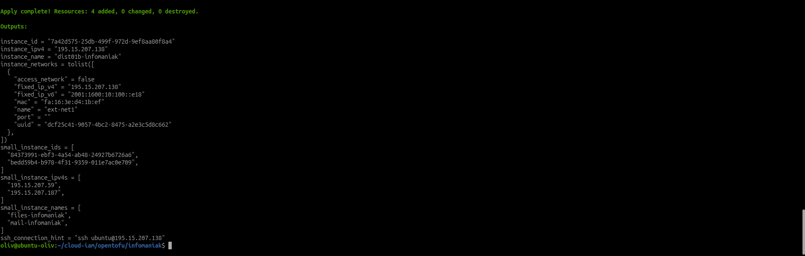
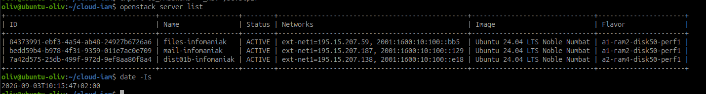
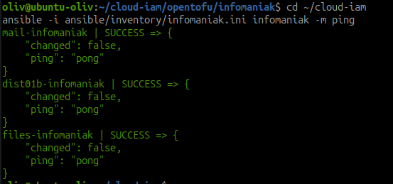
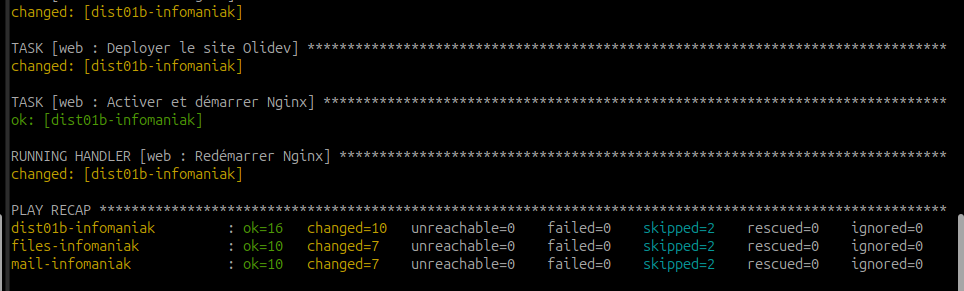
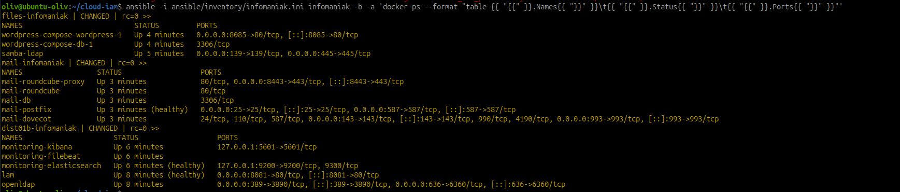
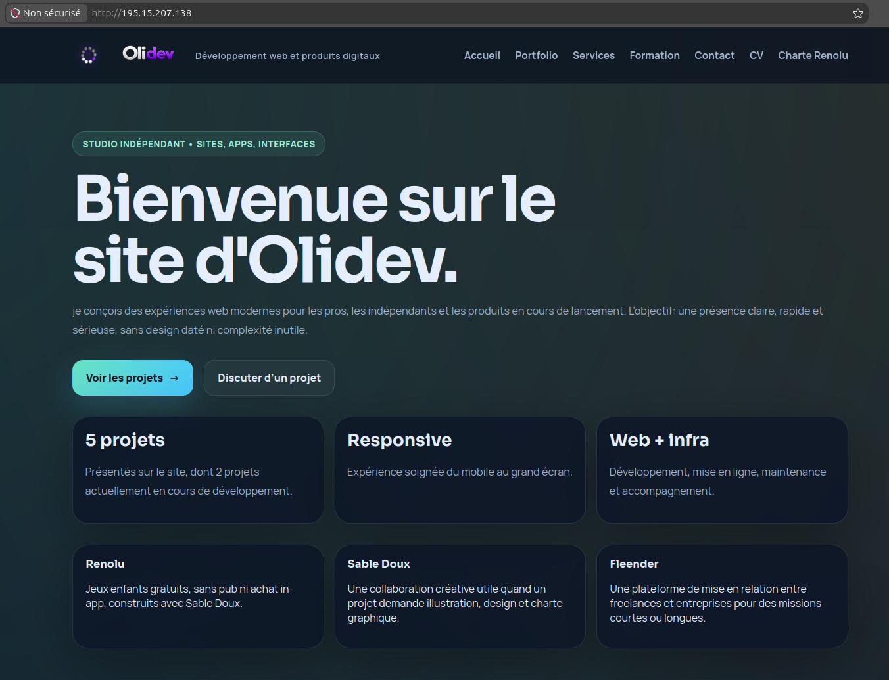
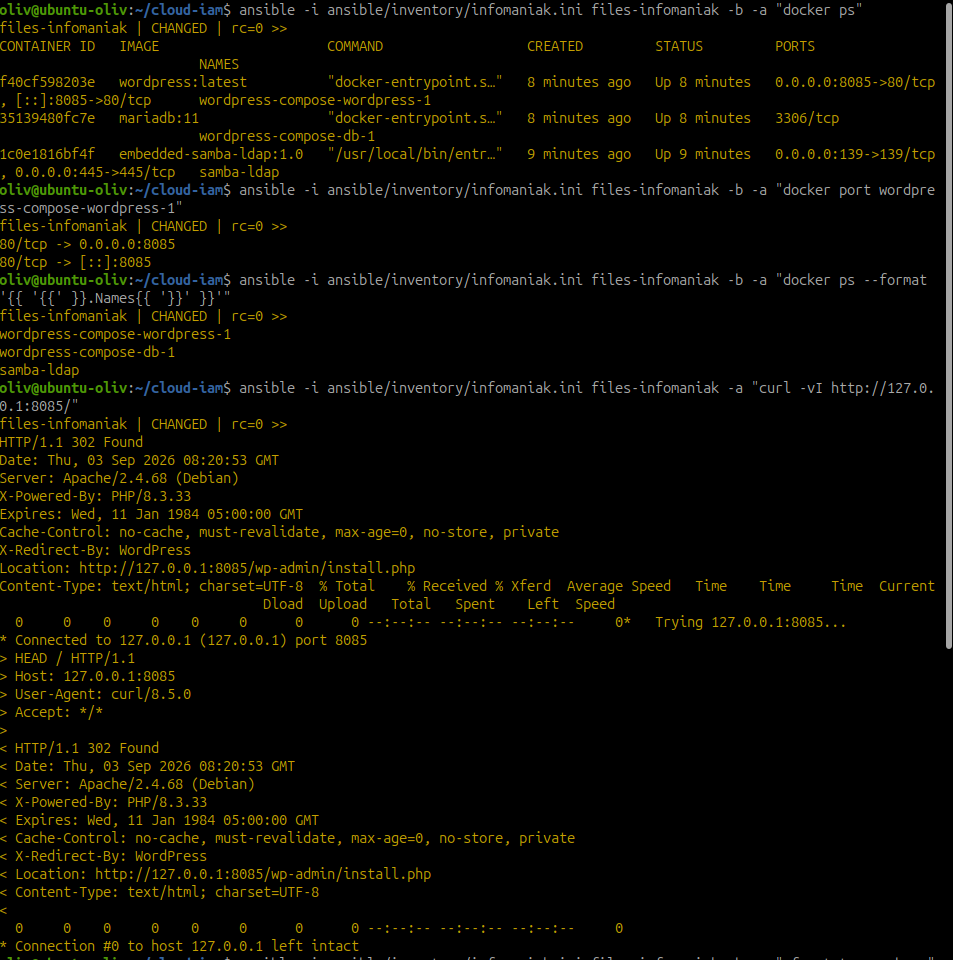

# Tester une restauration cloud et mesurer RTO/RPO

!!! info "Fiche PRA cloud"
    Cette feuille réutilise les notions de RTO/RPO vues dans le module
    on-premise, mais dans le contexte cloud. Elle décrit un exercice à réaliser
    sur Infomaniak avec OpenTofu, Ansible et une sauvegarde stockée dans un
    bucket compatible S3.

## Objectif

Réutiliser les notions de RTO/RPO vues en on-premise dans le contexte cloud,
et restaurer un service perdu.

Le **RTO** est le délai maximal acceptable pour restaurer un service après
incident. Le **RPO** est la perte de données maximale acceptable, mesurée à
partir de l'âge de la sauvegarde restaurée.

Dans ce scénario cloud :

- le RTO dépend du temps nécessaire pour recréer la ressource avec
  `tofu apply`, relancer la configuration Ansible et vérifier le service ;
- le RPO dépend de l'horodatage de la sauvegarde réellement restaurée depuis
  le bucket S3 du module.

!!! warning "Preuve attendue"
    Ne pas écrire que le PRA est validé tant que l'exercice n'a pas été rejoué
    et chronométré. Les tableaux ci-dessous servent à relever les preuves
    réelles pendant le test.

## Scénario

Une machine virtuelle est définitivement perdue suite à un incident matériel
chez le fournisseur. La VM n'est pas réparée : elle doit être recréée à partir
du code d'infrastructure, puis reconfigurée.

| Élément | Hypothèse de l'exercice |
| --- | --- |
| Fournisseur pratique | Infomaniak Public Cloud |
| Infrastructure | Socle DIST01b déployé par OpenTofu |
| Configuration | Playbooks Ansible du dépôt `~/cloud-iam` |
| État OpenTofu | Stocké dans un backend S3 compatible |
| Données | Dernière sauvegarde disponible dans le bucket S3 |
| Service à restaurer | `A_COMPLETER` : LAM, WordPress, Roundcube, etc. |

## Déroulement

| Étape | Action | Preuve à conserver |
| --- | --- | --- |
| 1 | Noter l'heure de constat de l'incident : T0. | Heure exacte et description de l'impact. |
| 2 | Supprimer manuellement l'instance concernée depuis la console. | Capture avant/après ou sortie `openstack server delete`. |
| 3 | Restaurer la ressource avec `tofu apply`. | Sortie `tofu plan`, `tofu apply`, `tofu output`. |
| 4 | Reconfigurer avec Ansible. | `ansible -m ping`, récapitulatif du playbook. |
| 5 | Restaurer les données depuis la dernière sauvegarde S3. | Nom, date et horodatage de l'archive restaurée. |
| 6 | Reconnecter le service et vérifier son fonctionnement. | Test HTTP, LDAP, mail ou applicatif selon le service. |
| 7 | Noter l'heure de rétablissement : T1. | Heure exacte de retour fonctionnel. |
| 8 | Calculer RTO et RPO. | Formules et valeurs horodatées. |
| 9 | Rédiger la chronologie minute par minute. | Tableau d'incident complet. |
| 10 | Formuler au moins deux recommandations. | Actions concrètes pour réduire RTO ou RPO. |

## Commandes à retenir

### Constater l'incident

```bash
date -Is
openstack server list
openstack server show NOM_OU_ID_VM
```

Noter T0 :

```text
T0 = AAAA-MM-JJTHH:MM:SS+02:00
Service impacté = A_COMPLETER
Symptôme = VM absente, service indisponible, IP non joignable
```

### Simuler la perte de VM

!!! danger "Action destructive"
    Cette étape supprime réellement une VM. Vérifier le périmètre, les preuves
    déjà conservées et la sauvegarde disponible avant de l'exécuter.

```bash
openstack server delete NOM_OU_ID_VM
openstack server list
```

### Recréer avec OpenTofu

```bash
cd ~/cloud-iam/opentofu/infomaniak
export OS_CLOUD=PCP-LDG88UE-dc3-a

tofu init
tofu fmt
tofu validate
tofu plan
tofu apply
tofu output
```

Le plan doit recréer uniquement la ressource perdue ou les ressources attendues.
Toute destruction non prévue doit arrêter l'exercice.

### Reconfigurer avec Ansible

Mettre à jour l'inventaire si les IP ont changé :

```bash
cd ~/cloud-iam
${EDITOR:-nano} ansible/inventory/infomaniak.ini
```

Relancer les contrôles et playbooks :

```bash
ansible -i ansible/inventory/infomaniak.ini infomaniak -m ping

ansible-playbook -i ansible/inventory/infomaniak.ini \
  ansible/playbooks/base-system.yml

ansible-playbook -i ansible/inventory/infomaniak.ini \
  ansible/playbooks/deploy-on-premise.yml
```

### Identifier la sauvegarde S3 restaurée

Le nom du bucket et l'outil exact dépendent du backend utilisé dans le module.
Utiliser les variables ou profils locaux, sans publier les clés.

Exemple avec une interface S3 compatible :

```bash
aws s3 ls s3://NOM_DU_BUCKET/ --recursive --human-readable --summarize
```

Relever l'archive utilisée :

```text
Sauvegarde restaurée = A_COMPLETER
Horodatage sauvegarde = AAAA-MM-JJTHH:MM:SS+02:00
```

### Vérifier le service

Adapter le contrôle au service restauré :

```bash
curl -I http://IP_VM/
curl -I http://IP_VM:8081/
curl -k -I https://IP_VM:8443/
```

Ou côté conteneurs :

```bash
ansible -i ansible/inventory/infomaniak.ini infomaniak -b -a "docker ps"
ansible -i ansible/inventory/infomaniak.ini infomaniak -a "sudo ufw status verbose"
```

## Calcul RTO/RPO

| Mesure | Formule | Valeur à relever |
| --- | --- | --- |
| RTO | `T1 - T0` | `A_COMPLETER` |
| RPO | `T0 - heure de la sauvegarde restaurée` | `A_COMPLETER` |

Exemple de calcul à remplacer par les valeurs réelles :

```text
T0 = 2026-09-03T10:00:00+02:00
T1 = 2026-09-03T10:42:00+02:00
Sauvegarde restaurée = 2026-09-03T09:15:00+02:00

RTO = 42 minutes
RPO = 45 minutes
```

## Preuves collectées le 03/09/2026

Les captures suivantes documentent une restauration réelle du lab Infomaniak
après suppression des VM. Elles prouvent les étapes techniques, mais le RTO/RPO
définitif reste à compléter avec les horodatages retenus dans le rapport.

| Preuve | Ce que la capture montre |
| --- | --- |
| Recréation OpenTofu | `tofu apply` terminé avec `4 added, 0 changed, 0 destroyed`, puis sorties d'IP. |
| Instances actives | Les trois VM `files-infomaniak`, `mail-infomaniak` et `dist01b-infomaniak` sont revenues en état `ACTIVE`. |
| Connexion Ansible | Les trois hôtes répondent au module `ping`. |
| Playbook Ansible | Le récapitulatif indique `unreachable=0` et `failed=0` sur les trois VM. |
| Conteneurs Docker | Les conteneurs OpenLDAP, LAM, supervision, WordPress, Samba, Postfix, Dovecot et Roundcube sont en état `Up`. |
| Service web | Le site principal répond depuis l'IP publique. |
| WordPress | Le test local sur la VM fichiers retourne `HTTP/1.1 302 Found`, preuve que WordPress répond sur `8085`. |















!!! note "Lecture de la preuve WordPress"
    Le service WordPress répond depuis la VM fichiers sur `127.0.0.1:8085`.
    Si le test depuis le poste d'administration ne répond pas, cela peut venir
    du pare-feu UFW : le service est restauré côté conteneur, mais le port
    public doit être ouvert seulement si l'exercice le demande.

## Chronologie minute par minute

| Heure | Action | Décision | Preuve |
| --- | --- | --- | --- |
| `T0` | Incident constaté | Déclenchement PRA | Capture ou sortie CLI |
| `T0 + ...` | VM supprimée pour simulation | Perte définitive confirmée | `openstack server list` |
| `T0 + ...` | `tofu plan` | Plan relu avant application | Sortie plan |
| `T0 + ...` | `tofu apply` | Ressource recréée | Sortie apply |
| `T0 + ...` | Inventaire Ansible mis à jour | IP corrigées si besoin | Diff local ou note |
| `T0 + ...` | Playbooks Ansible exécutés | Socle reconfiguré | Récapitulatif Ansible |
| `T0 + ...` | Sauvegarde S3 restaurée | Données remises en place | Nom et date de l'archive |
| `T1` | Service validé | Fin d'indisponibilité | Test fonctionnel |

## Rapport d'incident à préparer

| Rubrique | Contenu attendu |
| --- | --- |
| Contexte | Fournisseur, service, VM concernée, date. |
| Impact | Service indisponible, utilisateurs ou fonctions touchées. |
| Cause simulée | Perte définitive de VM suite à incident fournisseur. |
| Chronologie | Actions et décisions minute par minute. |
| Restauration | OpenTofu, Ansible, données S3, validation finale. |
| RTO/RPO | Valeurs calculées avec horodatages. |
| Difficultés | IP changée, délai `tofu apply`, sauvegarde trop ancienne, secrets. |
| Recommandations | Actions pour réduire RTO/RPO. |

## Recommandations possibles

| Objectif | Recommandation |
| --- | --- |
| Réduire le RTO | Préparer un inventaire Ansible généré automatiquement depuis `tofu output`. |
| Réduire le RTO | Tester régulièrement `tofu plan` pour détecter les dérives avant incident. |
| Réduire le RPO | Augmenter la fréquence des sauvegardes des données critiques. |
| Réduire le RPO | Ajouter une vérification automatique de présence et d'âge de la dernière sauvegarde S3. |
| Réduire les erreurs | Documenter les variables à exporter : `OS_CLOUD`, mot de passe, profils S3. |

## Pour aller plus loin : test périodique automatisé

Le script
[`test-restauration-cloud.sh`](../../assets/scripts/integration-distribuee-cloud-iam/it-4/test-restauration-cloud.sh)
prépare un test de restauration périodique dans un environnement isolé. Par
défaut il fonctionne en mode `dry-run` et affiche les commandes prévues sans
créer de ressources.

Exemple dry-run :

```bash
docs/assets/scripts/integration-distribuee-cloud-iam/it-4/test-restauration-cloud.sh \
  --infra-dir ~/cloud-iam/opentofu/infomaniak \
  --inventory ~/cloud-iam/ansible/inventory/infomaniak.ini \
  --service-url http://IP_VM/
```

Exécution réelle, uniquement sur un environnement de test :

```bash
docs/assets/scripts/integration-distribuee-cloud-iam/it-4/test-restauration-cloud.sh \
  --execute \
  --infra-dir ~/cloud-iam/opentofu/infomaniak \
  --inventory ~/cloud-iam/ansible/inventory/infomaniak.ini \
  --service-url http://IP_VM/
```

!!! danger "Coût et destruction"
    Un test automatisé de restauration peut créer des ressources facturées.
    L'environnement doit être isolé du déploiement principal, et le nettoyage
    doit être validé explicitement.

## État final attendu

À la fin de cette feuille :

- T0 et T1 sont relevés avec des horodatages précis ;
- la VM perdue est recréée par OpenTofu ;
- la configuration est rejouée par Ansible ;
- la sauvegarde S3 restaurée est identifiée par son horodatage ;
- le service répond de nouveau ;
- RTO et RPO sont calculés avec les vraies valeurs ;
- la chronologie et les recommandations sont prêtes pour le rapport du Kit 5.
