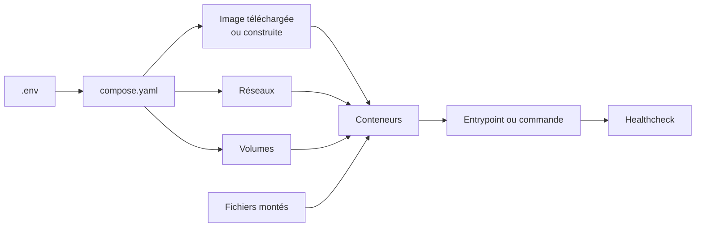
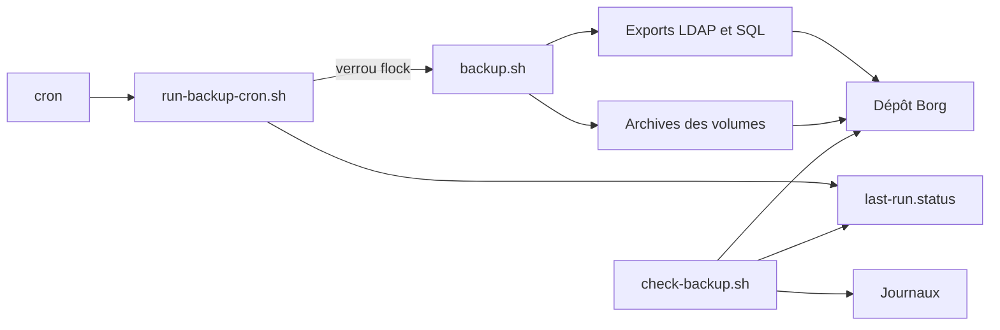

# Comprendre les fichiers Docker et les scripts

## Pourquoi plusieurs fichiers ?

Chaque fichier répond à une question différente :

| Fichier | Question à laquelle il répond |
|---|---|
| `Dockerfile` | Comment construire une image personnalisée ? |
| `compose.yaml` ou `docker-compose.yml` | Quels conteneurs, réseaux et volumes doivent fonctionner ensemble ? |
| `.env` | Quelles valeurs utilise cette machine ? |
| `.env.example` | Quelles variables faut-il renseigner sur une autre machine ? |
| `.gitignore` | Quels fichiers locaux ou sensibles Git doit-il ignorer ? |
| fichier de configuration | Comment le logiciel doit-il se comporter ? |
| script `.sh` | Quelles opérations ordonnées faut-il exécuter ? |
| `README.md` | Comment préparer, démarrer, vérifier et reprendre le projet ? |

Le Compose est **déclaratif** : il décrit l'état souhaité. Un script est
**impératif** : il exécute une suite d'actions dans un ordre précis.

## Comment Docker Compose lit un projet

Lors d'un `docker compose up -d`, Docker suit globalement ce chemin :



1. Compose remplace les expressions `${VARIABLE}` avec les valeurs de `.env`.
2. Il télécharge l'image indiquée par `image:` ou construit celle décrite par
   `build:` et le `Dockerfile`.
3. Il crée les réseaux et volumes absents.
4. Il crée les conteneurs avec leurs ports, variables et montages.
5. L'entrypoint de l'image prépare l'application puis lance son processus.
6. Le `healthcheck`, lorsqu'il existe, vérifie que le service répond réellement.

`docker compose config` montre le résultat après remplacement des variables.
Cette commande est utile pour comprendre le projet, mais sa sortie peut révéler
des secrets venant de `.env`.

## Les blocs les plus fréquents

```yaml
services:
  application:
    image: exemple:1.0
    restart: unless-stopped
    environment:
      PARAMETRE: ${VALEUR_LOCALE}
    ports:
      - "8080:80"
    volumes:
      - donnees:/var/lib/application
    networks:
      - interne
```

- `services` contient les conteneurs du projet ;
- `image` fixe l'image et, de préférence, sa version ;
- `restart: unless-stopped` relance le service après une panne ou un redémarrage
  de Docker, sauf arrêt manuel ;
- `environment` transmet des paramètres **dans** le conteneur ;
- `ports` suit la forme `adresse_hote:port_hote:port_conteneur` ;
- `volumes` conserve les données ou monte un fichier externe ;
- `networks` détermine quels services peuvent communiquer directement.

Sur un réseau Compose, le nom du service sert de nom DNS. Par exemple,
WordPress joint `db:3306` et Roundcube joint `dovecot:143` sans connaître leurs
adresses IP, qui peuvent changer.

## Volume nommé ou montage de fichier

```yaml
volumes:
  - db_data:/var/lib/mysql
  - ./dovecot:/etc/dovecot:ro
```

- `db_data:/var/lib/mysql` est un **volume nommé** géré par Docker. Il conserve
  les données après la suppression du conteneur ;
- `./dovecot:/etc/dovecot:ro` est un **bind mount**. Le dossier du projet est
  visible dans le conteneur. `ro` interdit au conteneur de le modifier.

Un volume contient l'état vivant du service. Un fichier versionné décrit sa
configuration reproductible. Les deux doivent être sauvegardés, mais ils ne se
restaurent pas de la même manière.

## `.env`, `.env.example` et secrets

Le chemin d'une variable est le suivant :

```text
.env -> substitution dans Compose -> variable du conteneur -> application
```

`.env` n'est pas un coffre-fort : il contient des valeurs lisibles. Il reste
local, protégé par les permissions et ignoré par Git. `.env.example` est le
contrat partageable : il contient les noms des variables et des valeurs
fictives.

Après une modification de `.env`, utiliser `docker compose up -d`. Un simple
`docker compose restart` redémarre l'ancien conteneur sans recréer ses variables.

## Dockerfiles de l'itération 1

Dans les démonstrations Figlet et Nginx :

- `FROM` choisit l'image de départ ;
- `RUN` exécute une commande pendant la construction de l'image ;
- `COPY` place un fichier du projet dans l'image ;
- `CMD` définit la commande lancée par défaut au démarrage du conteneur.

Une modification du `Dockerfile` ou d'un fichier copié demande une nouvelle
construction avec `docker build` ou `docker compose up -d --build`.

## WordPress et MariaDB

Le projet `wordpress-compose/compose.yaml` contient deux services :

| Élément | Rôle |
|---|---|
| `db` | exécute MariaDB et initialise la base ainsi que l'utilisateur WordPress |
| `wordpress` | exécute Apache/PHP/WordPress et joint MariaDB avec le nom DNS `db` |
| `db_data` | conserve la base, donc l'installation et les pages WordPress |
| `WORDPRESS_PORT` | choisit le port de l'hôte sans changer le port `80` du conteneur |
| `depends_on` | demande de créer `db` avant WordPress, sans garantir que MariaDB est déjà prête |

Les mots de passe MariaDB sont transmis aux deux services depuis `.env`. Ils
doivent correspondre : sinon WordPress démarre, mais ne peut pas ouvrir la base.

## OpenLDAP et LDAP Account Manager

### OpenLDAP

`openldap/compose.yaml` configure :

- le suffixe LDAP `dc=embedded,dc=local` ;
- les mots de passe administrateur sous forme de hash ;
- les schémas LDAP, dont les attributs POSIX et Samba ;
- le port hôte `389` redirigé vers le port `3890` de l'image ;
- trois volumes séparés pour les données, la configuration `slapd.d` et les
  sauvegardes internes.

Les variables `OPENLDAP_BOOTSTRAP_*` servent surtout lors de l'initialisation
d'un volume vide. Changer ces variables après la création de la base ne change
pas automatiquement les entrées et mots de passe déjà enregistrés.

Le montage `../samba-ldap/schema:/container/services/openldap/assets/schema:ro`
fournit le schéma Samba depuis un fichier externe versionné. Le suffixe `:ro`
empêche le conteneur de modifier la source.

### LAM

`ldap-account-manager/compose.yaml` ne stocke pas les identités. LAM est une
interface qui se connecte au serveur OpenLDAP grâce à :

- `LDAP_SERVER` pour l'adresse du serveur ;
- `LDAP_BASE_DN`, `LDAP_USERS_DN` et `LDAP_GROUPS_DN` pour les branches ;
- `LDAP_ADMIN_USER` pour le DN de connexion ;
- `LAM_PASSWORD` pour protéger les réglages internes de LAM.

Le réseau `openldap_default` est déclaré `external: true` : il existe en dehors
du projet LAM et permet de joindre le conteneur `openldap` déjà démarré.

### Compose fédérateur

`infrastructure-compose/compose.yaml` regroupe OpenLDAP et LAM. Ses volumes
sont eux aussi `external: true` afin de réutiliser les données historiques au
lieu de créer un annuaire vide. Compose refuse de démarrer si ces ressources
externes n'existent pas, ce qui évite une création silencieuse au mauvais nom.

## Samba et OpenLDAP

Le projet `samba-ad/` combine plusieurs types de fichiers :

| Fichier | Rôle précis |
|---|---|
| `Dockerfile` | construit une Debian avec Samba, les outils LDAP, NSLCD et `envsubst` |
| `compose.yaml` | construit l'image, publie SMB et relie Samba au réseau OpenLDAP |
| `config/smb.conf` | définit le backend LDAP, les partages et les groupes autorisés |
| `config/nsswitch.conf` | demande à Linux de chercher utilisateurs et groupes dans LDAP |
| `config/nslcd.conf.template` | décrit la connexion LDAP avec un emplacement pour le mot de passe |
| `entrypoint.sh` | initialise les configurations, contrôle LDAP puis lance Samba |
| `compose.ad.yaml` | conserve la tentative Samba AD historique ; il ne doit pas être lancé en parallèle |

Le `Dockerfile` copie les modèles dans l'image. Au premier démarrage,
`entrypoint.sh` les copie dans `samba_config`, puis installe cette version
persistante dans `/etc`. Ce détour permet de conserver les adaptations tout en
gardant un modèle versionné.

Le script utilise `envsubst` pour injecter temporairement
`LDAP_ADMIN_PASSWORD` dans `/etc/nslcd.conf`. Il vérifie ensuite :

1. la syntaxe Samba avec `testparm` ;
2. la connexion LDAP avec `ldapwhoami` ;
3. la synchronisation du secret Samba avec `smbpasswd -w` ;
4. puis remplace le shell par `smbd` grâce à `exec`.

`exec` est important : Samba devient le processus principal du conteneur et
reçoit correctement les signaux d'arrêt de Docker.

Les volumes ont des responsabilités séparées : configuration (`samba_config`),
état interne (`samba_state`) et documents partagés (`samba_share`).

## Messagerie

`messaging-compose/docker-compose.yml` assemble quatre services :

| Service | Fonction | Dépendance principale |
|---|---|---|
| `db` | conserve les préférences Roundcube | volume `roundcube_db` |
| `postfix` | reçoit, contrôle et distribue les messages | LDAP et socket LMTP Dovecot |
| `dovecot` | authentifie les comptes et expose les boîtes IMAP | LDAP et volume `dovecot_mail` |
| `roundcube` | fournit le webmail | Dovecot, Postfix et MariaDB |

Deux réseaux sont utilisés : `mail` pour les échanges internes de messagerie
et `openldap_default` pour que Postfix et Dovecot interrogent l'annuaire.

Le volume `postfix_spool` est monté dans Postfix et Dovecot. Il permet de
partager les sockets Unix `private/auth` et `private/dovecot-lmtp` : Postfix
délègue l'authentification SMTP et la livraison locale à Dovecot sans publier
de port supplémentaire.

`postfix-init.sh` est monté en lecture seule dans le mécanisme d'initialisation
de l'image Postfix. Il :

1. génère `/etc/postfix/ldap-users.cf` avec les paramètres LDAP ;
2. indique à Postfix comment rechercher un destinataire par son `uid` ;
3. active la table LDAP avec `postconf` ;
4. limite le port `587` aux clients authentifiés.

Les fichiers `dovecot/dovecot.conf` et `dovecot-ldap.conf.ext` définissent
respectivement les protocoles, sockets et boîtes Maildir, puis la méthode de
recherche et de bind LDAP. Ils sont montés depuis le dépôt pour rester lisibles
et versionnables.

Roundcube utilise les noms de services `db`, `dovecot` et `postfix`. Il ne
communique pas directement avec LDAP : l'authentification est réalisée par
Dovecot lors de la connexion IMAP.

## Sauvegarde BorgBackup

La chaîne d'automatisation est volontairement découpée :



### `backup.sh`

- `set -Eeuo pipefail` arrête le script sur une erreur, une variable absente ou
  une erreur cachée dans un pipeline ;
- `umask 077` rend les nouveaux fichiers accessibles uniquement au propriétaire ;
- `trap cleanup` réactive les conteneurs mis en pause et supprime le dossier
  temporaire même après une erreur ;
- `slapcat` et `mariadb-dump` produisent des exports logiques restaurables ;
- `backup_volume` monte chaque volume en lecture seule dans un conteneur Alpine
  temporaire et crée une archive `tar.gz` ;
- les services sensibles sont brièvement mis en pause pour obtenir une copie
  cohérente ;
- `borg create` sauvegarde le dépôt Git et les exports préparés ;
- `borg prune`, `compact` et `check` appliquent la rétention et contrôlent le dépôt.

### `run-backup-cron.sh`

Ce lanceur utilise `flock` pour empêcher deux sauvegardes simultanées. Il écrit
ensuite `last-run.status` par remplacement atomique avec le résultat, les dates
et le code retour.

### `check-backup.sh`

Le contrôle quotidien vérifie que le dernier statut vaut `SUCCESS`, que son âge
reste inférieur à 36 heures, qu'une archive et un journal existent et que le
marqueur de fin est présent.

`crontab.example` sépare la sauvegarde de 02 h 00 et le contrôle de 08 h 15. Un
échec nocturne peut ainsi être détecté au début de la journée.

## Supervision Elasticsearch et Kibana

`monitoring-compose/compose.yaml` contient :

- Elasticsearch en mode `single-node` pour le TP ;
- un volume `monitoring_elasticsearch_data` pour les index ;
- un tas Java limité à 1 Gio avec `ES_JAVA_OPTS` ;
- un `healthcheck` qui interroge `_cluster/health` ;
- Kibana, démarré seulement lorsque le contrôle Elasticsearch réussit ;
- un réseau `monitoring` dédié ;
- les ports liés à `127.0.0.1`, donc inaccessibles depuis une autre machine.

`depends_on` utilise ici `condition: service_healthy`, ce qui est plus précis
qu'un simple ordre de démarrage. La sécurité Elastic est temporairement
désactivée pour le test local ; TLS et l'authentification doivent être activés
avant une exposition réseau.

## Quelle commande après une modification ?

| Modification | Commande habituelle | Pourquoi |
|---|---|---|
| `.env` | `docker compose up -d` | recrée le conteneur avec les nouvelles variables |
| `compose.yaml` | `docker compose up -d` | rapproche l'exécution du nouvel état déclaré |
| `Dockerfile` ou fichier copié dans l'image | `docker compose up -d --build` | reconstruit l'image avant recréation |
| fichier monté par bind mount | `docker compose restart <service>` | le fichier est déjà visible, mais l'application doit souvent le relire |
| modèle Samba copié dans le volume | synchronisation documentée puis `up -d` | le volume persistant n'est volontairement pas écrasé automatiquement |

## Commandes pour comprendre un projet

```bash
# Voir la configuration Compose résolue
docker compose config

# Voir l'état et les ports
docker compose ps

# Lire les journaux d'un service
docker compose logs --tail=100 <service>

# Exécuter une commande dans un service actif
docker compose exec <service> <commande>

# Voir les montages et les réseaux d'un conteneur
docker inspect <conteneur>

# Vérifier un volume
docker volume inspect <volume>

# Vérifier que .env est ignoré
git check-ignore -v .env
```

Avant toute suppression, vérifier si les données se trouvent dans un volume.
`docker compose down` supprime les conteneurs et le réseau du projet, mais
conserve les volumes nommés. `docker compose down -v` supprime aussi les volumes
et peut donc effacer les données.
