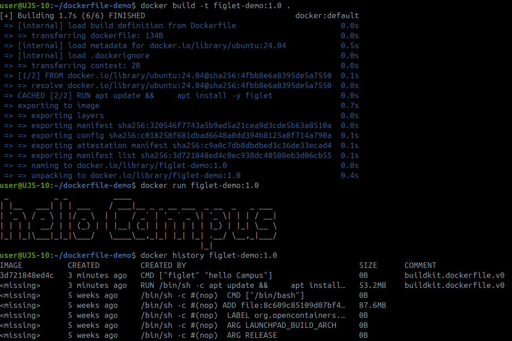
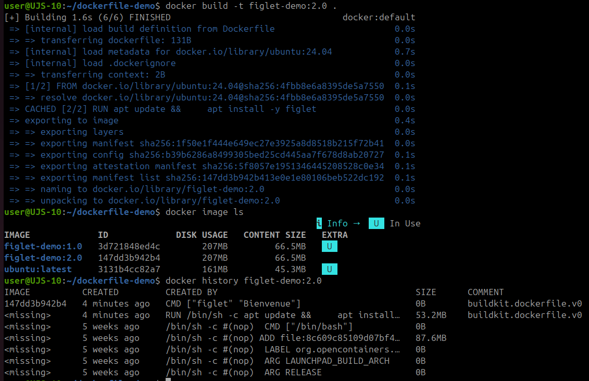

# Construire une image avec un Dockerfile

## Déroulement

### 1. Créer un répertoire de travail

Créez un dossier dédié à l'exercice :

```bash
mkdir dockerfile-demo
cd dockerfile-demo
```

Ce dossier contiendra le fichier de construction de l'image.

### 2. Créer le Dockerfile

Créez un fichier nommé exactement :

```text
Dockerfile
```

Ajoutez le contenu suivant :

```dockerfile
FROM ubuntu:24.04

RUN apt update && \
    apt install -y figlet

CMD ["figlet","Hello Campus"]
```

Explication rapide :

| Instruction | Rôle |
| --- | --- |
| `FROM ubuntu:24.04` | Définit l'image de départ. |
| `RUN apt update && apt install -y figlet` | Installe `figlet` pendant la construction de l'image. |
| `CMD ["figlet","Hello Campus"]` | Définit la commande lancée par défaut au démarrage du conteneur. |

### 3. Construire l'image

Depuis le répertoire contenant le `Dockerfile`, construisez l'image :

```bash
docker build -t figlet-demo:1.0 .
```

Le point final `.` indique que le contexte de build est le dossier courant.

### 4. Afficher les images disponibles

Vérifiez que l'image existe :

```bash
docker image ls
```

L'image `figlet-demo` avec le tag `1.0` doit apparaître.

### 5. Exécuter l'image

Lancez un conteneur depuis l'image construite :

```bash
docker run figlet-demo:1.0
```

Résultat attendu : le texte `Hello Campus` s'affiche avec `figlet`.

### 6. Afficher l'historique de l'image

Affichez les couches de construction :

```bash
docker history figlet-demo:1.0
```

Cette commande permet de voir les étapes qui ont produit l'image.

### Preuve - Image `figlet-demo:1.0`



Cette capture montre :

- la construction de l'image `figlet-demo:1.0` ;
- l'exécution avec `docker run figlet-demo:1.0` ;
- l'affichage du texte `Hello Campus` avec `figlet` ;
- l'historique de l'image avec `docker history figlet-demo:1.0`.

### 7. Modifier le texte affiché

Modifiez le `Dockerfile` :

```dockerfile
FROM ubuntu:24.04

RUN apt update && \
    apt install -y figlet

CMD ["figlet","Bienvenue"]
```

La base reste la même, mais la commande par défaut change.

### 8. Reconstruire l'image avec un nouveau tag

Construisez une seconde version :

```bash
docker build -t figlet-demo:2.0 .
```

### 9. Comparer les deux images

Affichez les images :

```bash
docker image ls
```

Comparez ensuite l'historique de la version `2.0` :

```bash
docker history figlet-demo:2.0
```

Observez ce qui change entre `figlet-demo:1.0` et `figlet-demo:2.0`.

### Preuve - Image `figlet-demo:2.0`



Cette capture montre :

- la reconstruction de l'image `figlet-demo:2.0` ;
- la présence des images `figlet-demo:1.0` et `figlet-demo:2.0` ;
- la comparaison possible avec `docker image ls` ;
- l'historique de la version `2.0` avec la commande `CMD ["figlet" "Bienvenue"]`.

## Commandes récapitulatives

```bash
mkdir dockerfile-demo
cd dockerfile-demo
nano Dockerfile
docker build -t figlet-demo:1.0 .
docker image ls
docker run figlet-demo:1.0
docker history figlet-demo:1.0
nano Dockerfile
docker build -t figlet-demo:2.0 .
docker image ls
docker history figlet-demo:2.0
```
