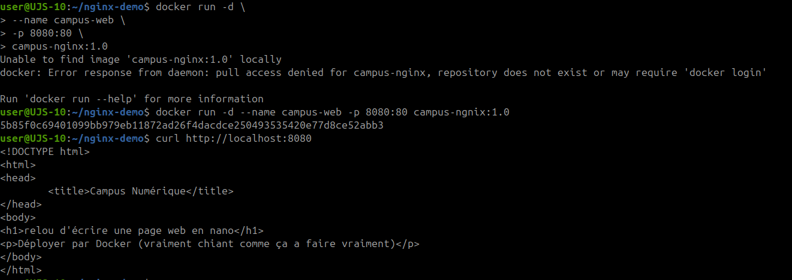
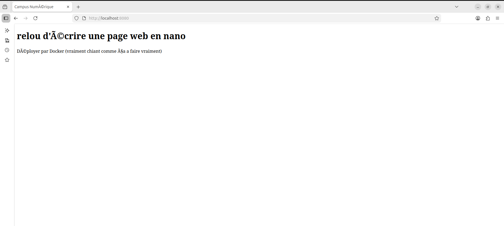
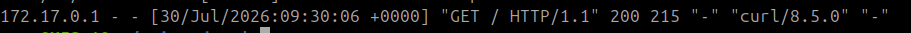

# Construire une image contenant une application Web simple

## Objectif

Construire une image Docker contenant une page web simple, basée sur l'image officielle Nginx.

Cette activité permet de comprendre comment intégrer un fichier applicatif dans une image, publier un port et vérifier le fonctionnement d'un conteneur web.

## Spécifications

- Travail individuel.
- Toutes les manipulations sont réalisées dans un répertoire dédié.
- Les commandes doivent être comprises avant d'être exécutées.
- Le conteneur doit être arrêté puis redémarré pour vérifier son cycle de vie.

## Déroulement

### 1. Créer un nouveau répertoire

Créez un répertoire de travail dédié :

```bash
mkdir nginx-demo
cd nginx-demo
```

Ce dossier contiendra la page web et le `Dockerfile`.

### 2. Créer le fichier `index.html`

Créez un fichier nommé :

```text
index.html
```

Ajoutez le contenu suivant :

```html
<!DOCTYPE html>
<html>
<head>
    <title>Campus Numérique</title>
</head>
<body>
<h1>Mon premier conteneur Web</h1>
<p>Déployé avec Docker.</p>
</body>
</html>
```

Ce fichier représente l'application web minimale à servir avec Nginx.

### 3. Créer le `Dockerfile`

Dans le même répertoire, créez un fichier nommé exactement :

```text
Dockerfile
```

Ajoutez le contenu suivant :

```dockerfile
FROM nginx:latest

COPY index.html /usr/share/nginx/html/index.html
```

Explication rapide :

| Instruction | Rôle |
| --- | --- |
| `FROM nginx:latest` | Utilise l'image officielle Nginx comme base. |
| `COPY index.html /usr/share/nginx/html/index.html` | Copie la page locale dans le dossier web servi par Nginx. |

### 4. Construire l'image

Construisez l'image :

```bash
docker build -t campus-nginx:1.0 .
```

Le point `.` indique que Docker utilise le répertoire courant comme contexte de construction.

### 5. Démarrer le conteneur

Démarrez le conteneur en arrière-plan :

```bash
docker run -d \
    --name campus-web \
    -p 8080:80 \
    campus-nginx:1.0
```

Explication :

| Option | Rôle |
| --- | --- |
| `-d` | Lance le conteneur en arrière-plan. |
| `--name campus-web` | Donne un nom au conteneur. |
| `-p 8080:80` | Publie le port `80` du conteneur sur le port `8080` de la machine. |

### 6. Vérifier le fonctionnement avec `curl`

Testez le service web :

```bash
curl http://localhost:8080
```

Résultat attendu : le contenu HTML de `index.html` doit apparaître dans le terminal.

Preuve de réalisation :



Point d'attention : la capture montre aussi une première tentative échouée liée à un nom d'image différent. La procédure à conserver est `campus-nginx:1.0`, ou alors il faut utiliser le même tag partout si un autre nom a été construit localement.

### 7. Ouvrir l'application dans un navigateur

Ouvrez l'adresse suivante dans un navigateur :

```text
http://localhost:8080
```

La page doit afficher :

```text
Mon premier conteneur Web
Déployé avec Docker.
```

Preuve de rendu dans le navigateur :



### 8. Arrêter le conteneur

Arrêtez le conteneur :

```bash
docker stop campus-web
```

Vérifiez son état si nécessaire :

```bash
docker ps -a
```

### 9. Redémarrer le conteneur

Redémarrez le même conteneur :

```bash
docker start campus-web
```

Vérifiez à nouveau le fonctionnement :

```bash
curl http://localhost:8080
```

### 10. Consulter les journaux

Consultez les logs du conteneur :

```bash
docker logs campus-web
```

Les journaux doivent montrer les requêtes reçues par Nginx, notamment les accès depuis `curl` ou le navigateur.

Preuve des journaux Nginx :



### 11. Supprimer le conteneur

Supprimez le conteneur :

```bash
docker rm -f campus-web
```

Vérifiez qu'il n'apparaît plus :

```bash
docker ps -a
```

## Commandes récapitulatives

```bash
mkdir nginx-demo
cd nginx-demo
nano index.html
nano Dockerfile
docker build -t campus-nginx:1.0 .
docker run -d --name campus-web -p 8080:80 campus-nginx:1.0
curl http://localhost:8080
docker stop campus-web
docker start campus-web
curl http://localhost:8080
docker logs campus-web
docker rm -f campus-web
docker ps -a
```

## Ressources

- [Official build of Nginx](https://hub.docker.com/_/nginx)
- [Dockerfile](https://docs.docker.com/reference/dockerfile/)
- [Docker: container logs](https://docs.docker.com/reference/cli/docker/container/logs/)
