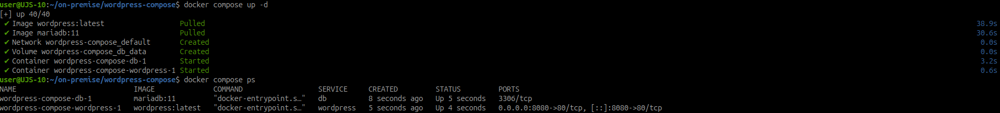
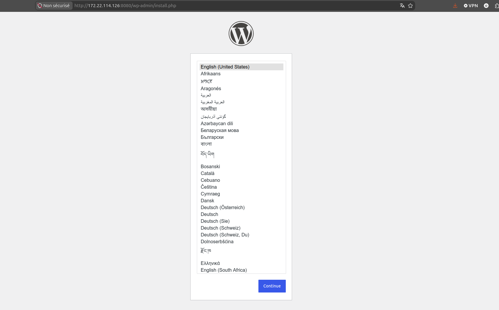
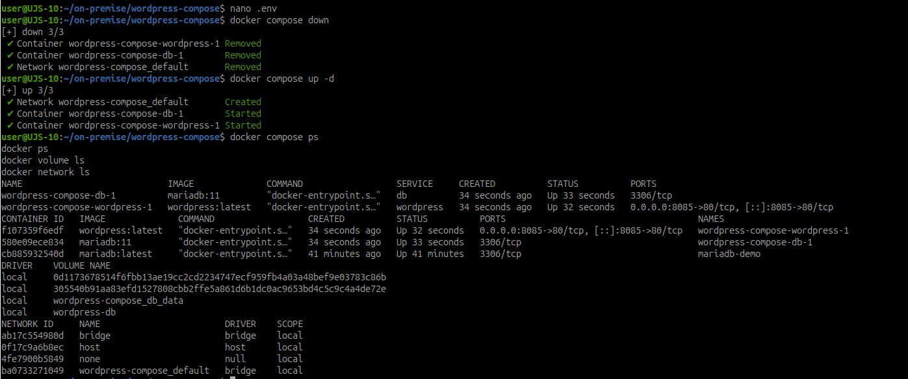

# Déployer WordPress et MariaDB avec Docker Compose

## Objectif

Déployer une application composée de plusieurs services avec Docker Compose, organiser les fichiers du projet et séparer les paramètres sensibles du fichier de déploiement.

L'application est composée de deux services : `db` pour MariaDB et `wordpress` pour le serveur Web et l'application WordPress.

## Spécifications

- Travail individuel.
- Les fichiers sont enregistrés dans `~/on-premise`.
- Les mots de passe ne sont pas écrits directement dans `compose.yaml`.
- Le fichier `.env` ne doit pas être ajouté à un dépôt Git.
- Les mots de passe utilisés sont réservés à l'environnement de travaux pratiques.

## 1. Préparer le répertoire de travail

~~~bash
mkdir -p ~/on-premise
cd ~/on-premise
mkdir wordpress-compose
cd wordpress-compose
~~~

À la fin de l'activité :

~~~text
wordpress-compose/
├── compose.yaml
├── .env
├── .env.example
├── .gitignore
└── README.md
~~~

## 2. Préparer le fichier `.env`

~~~bash
touch .env
~~~

Ajoutez les paramètres suivants :

~~~dotenv
MARIADB_ROOT_PASSWORD=ChangeMe-Root-2026
MARIADB_DATABASE=wordpress
MARIADB_USER=wordpress
MARIADB_PASSWORD=ChangeMe-WordPress-2026
WORDPRESS_PORT=8080
~~~

`WORDPRESS_PORT` est le port publié sur la machine hôte. Le serveur Web du conteneur écoute toujours sur le port `80` : Docker redirige `8080` vers `80`.

Docker Compose lit automatiquement `.env` lorsqu'il se trouve dans le même répertoire que `compose.yaml`. Les variables sont référencées avec `${NOM_VARIABLE}`.

!!! warning "Attention aux secrets"
    Le fichier `.env` ne chiffre pas les mots de passe. Toute personne pouvant lire ce fichier peut lire les valeurs. En production, utilisez un gestionnaire de secrets.

## 3. Préparer `.env.example`

~~~bash
touch .env.example
~~~

Ajoutez un modèle sans valeur sensible :

~~~dotenv
MARIADB_ROOT_PASSWORD=<mot-de-passe-administrateur>
MARIADB_DATABASE=wordpress
MARIADB_USER=wordpress
MARIADB_PASSWORD=<mot-de-passe-wordpress>
WORDPRESS_PORT=8080
~~~

`.env.example` indique les variables attendues sans publier les valeurs réellement utilisées.

## 4. Protéger `.env` avec `.gitignore`

~~~bash
printf '%s\n' '.env' > .gitignore
ls -la
~~~

Le fichier `.env` doit apparaître dans la liste, mais il est exclu des futurs ajouts Git.

## 5. Créer `compose.yaml`

~~~bash
touch compose.yaml
~~~

Ajoutez la définition des services :

~~~yaml
services:
  db:
    image: mariadb:11
    restart: unless-stopped
    environment:
      MARIADB_ROOT_PASSWORD: ${MARIADB_ROOT_PASSWORD}
      MARIADB_DATABASE: ${MARIADB_DATABASE}
      MARIADB_USER: ${MARIADB_USER}
      MARIADB_PASSWORD: ${MARIADB_PASSWORD}
    volumes:
      - db_data:/var/lib/mysql

  wordpress:
    image: wordpress:latest
    restart: unless-stopped
    depends_on:
      - db
    ports:
      - "${WORDPRESS_PORT}:80"
    environment:
      WORDPRESS_DB_HOST: db
      WORDPRESS_DB_USER: ${MARIADB_USER}
      WORDPRESS_DB_PASSWORD: ${MARIADB_PASSWORD}
      WORDPRESS_DB_NAME: ${MARIADB_DATABASE}

volumes:
  db_data:
~~~

Points importants :

| Élément | Rôle |
| --- | --- |
| `db` | Nom du service MariaDB et nom DNS utilisable par WordPress. |
| `depends_on` | Déclare la dépendance de WordPress envers MariaDB. |
| `db_data` | Volume nommé qui conserve les données MariaDB. |
| `${WORDPRESS_PORT}:80` | Publie le port de l'hôte vers le port Web interne. |

## 6. Vérifier la configuration résolue

~~~bash
docker compose config
~~~

Cette commande peut révéler les mots de passe contenus dans `.env`. Ne redirigez pas sa sortie vers un fichier public et ne la partagez pas sans vérification.

## 7. Démarrer les services

~~~bash
docker compose up -d
docker compose ps
~~~

Les services `db` et `wordpress` doivent être créés et démarrés.

Preuve de démarrage des deux services :

## 8. Consulter les journaux

~~~bash
docker compose logs
docker compose logs db
docker compose logs wordpress
docker compose logs -f
~~~

Quittez le suivi en temps réel avec `Ctrl+C`.

## 9. Ouvrir WordPress

Ouvrez :

~~~text
http://localhost:8080
~~~

Terminez l'installation initiale et créez une page de test. Elle servira à vérifier la persistance des données.

Depuis une autre machine du réseau, l'accès peut utiliser l'adresse IP de l'hôte Docker, par exemple `http://172.22.114.126:8080`.

Preuve de l'accès à l'assistant d'installation WordPress :

## 10. Modifier le port publié

Modifiez uniquement `.env` :

~~~dotenv
WORDPRESS_PORT=8085
~~~

Recréez les services :

~~~bash
docker compose down
docker compose up -d
~~~

Vérifiez l'accès :

~~~text
http://localhost:8085
~~~

L'image et `compose.yaml` n'ont pas changé : seul le port publié sur l'hôte a été modifié.

Preuve du changement de port publié vers `8085` :

## 11. Observer les ressources créées

~~~bash
docker compose ps
docker ps
docker volume ls
docker network ls
~~~

Identifiez le réseau créé automatiquement par Compose, puis inspectez-le :

~~~bash
docker network inspect <nom-du-reseau>
~~~

Repérez les deux conteneurs, leurs noms et adresses IP, le nom du réseau et le volume associé à MariaDB.

Depuis WordPress, vérifiez la résolution DNS du service `db` :

~~~bash
docker compose exec wordpress getent hosts db
~~~

Le nom du service est utilisable comme nom DNS sur le réseau Compose. Il n'est donc pas nécessaire de fixer l'adresse IP de MariaDB.

Preuve de la résolution DNS et des adresses IP attribuées aux conteneurs :

## 12. Vérifier la persistance

Supprimez les conteneurs et le réseau, sans supprimer les volumes :

~~~bash
docker compose down
docker compose ps
docker ps -a
docker volume ls
~~~

Le volume `db_data` doit toujours exister.

Relancez l'application :

~~~bash
docker compose up -d
~~~

Ouvrez `http://localhost:8085` et vérifiez que la configuration WordPress et la page de test sont toujours présentes.

Preuve de conservation du volume et de la recréation des services :

!!! warning "Ne pas supprimer le volume à ce stade"
    N'exécutez pas `docker compose down -v` avant cette vérification. L'option `-v` supprimerait aussi `db_data` et les données MariaDB.

## 13. Documenter le déploiement

~~~bash
touch README.md
~~~

Ajoutez :

~~~markdown
# WordPress avec Docker Compose

## Démarrage

`docker compose up -d`

## Vérification

`docker compose ps`

`docker compose logs`

## Arrêt

`docker compose down`

## Fichiers locaux

- `compose.yaml` décrit les services.
- `.env` contient les valeurs propres à l'environnement et ne doit pas être ajouté à Git.
- `.env.example` indique les variables attendues sans contenir les valeurs réelles.
~~~

Vérifiez l'arborescence :

~~~bash
find . -maxdepth 1 -type f -printf '%f\n' | sort
~~~

## Questions et réponses

### 1. Pourquoi les mots de passe ne sont-ils pas écrits directement dans `compose.yaml` ?

Pour séparer la description du déploiement des paramètres propres à un environnement et pouvoir partager le fichier Compose sans publier les valeurs sensibles.

### 2. Quelle différence existe-t-il entre `.env` et `.env.example` ?

`.env` contient les valeurs réellement utilisées localement. `.env.example` indique les variables attendues sans secret réel.

### 3. Pourquoi `.env` doit-il être ajouté à `.gitignore` ?

Pour éviter qu'un mot de passe soit ajouté par erreur à l'historique Git ou transmis à un dépôt distant.

### 4. Le fichier `.env` protège-t-il réellement les secrets contre une personne ayant accès à la machine ?

Non. Une personne pouvant lire le fichier peut lire les mots de passe. `.gitignore` évite surtout la publication accidentelle dans le dépôt.

### 5. Pourquoi WordPress utilise-t-il le nom `db` et non une adresse IP ?

Compose fournit une résolution DNS entre les services du même réseau. Le nom `db` reste stable même si l'adresse IP du conteneur change.

### 6. Quel est le rôle du volume `db_data` ?

Il conserve les fichiers MariaDB en dehors du cycle de vie des conteneurs. Les données restent disponibles après `docker compose down`.

### 7. Pourquoi Docker Compose est-il plus adapté que deux commandes `docker run` indépendantes ?

Compose décrit les services, variables, dépendances, ports, réseau et volumes dans un fichier reproductible et permet de gérer l'application avec les mêmes commandes.

### 8. Que se passerait-il avec les données après `docker compose down -v` ?

Les conteneurs et le réseau seraient supprimés, ainsi que le volume `db_data`. Les données MariaDB seraient perdues.

### 9. Quels fichiers doivent être conservés pour reconstruire le déploiement ?

Il faut conserver `compose.yaml`, `.env.example`, `.gitignore` et `README.md`. `.env` doit être conservé séparément et protégé, ou recréé avec de nouvelles valeurs.

### 10. Quelles données doivent être sauvegardées pour restaurer l'application dans son état actuel ?

Il faut sauvegarder le volume `db_data` ou un export MariaDB, le fichier `.env` et les éventuels fichiers WordPress ajoutés ou modifiés.

## État final vérifiable

- WordPress est accessible sur `http://localhost:8085`.
- Les services `db` et `wordpress` sont gérés par Compose.
- Le réseau Compose résout le nom DNS `db`.
- Le volume `db_data` conserve les données MariaDB.
- `.env` contient les paramètres locaux et est ignoré par Git.
- `.env.example`, `compose.yaml` et `README.md` permettent de reprendre le déploiement.

## Ressources

- [Variables et interpolation dans un fichier Compose](https://docs.docker.com/compose/how-tos/environment-variables/variable-interpolation/)
- [Variables d'environnement dans les conteneurs](https://docs.docker.com/compose/how-tos/environment-variables/set-environment-variables/)
- [Référence du fichier Compose](https://docs.docker.com/reference/compose-file/)

## Notions acquises

- Docker Compose
- Application multi-conteneurs
- Variables d'environnement
- Réseau DNS entre services
- Volume persistant
- Documentation d'un déploiement
