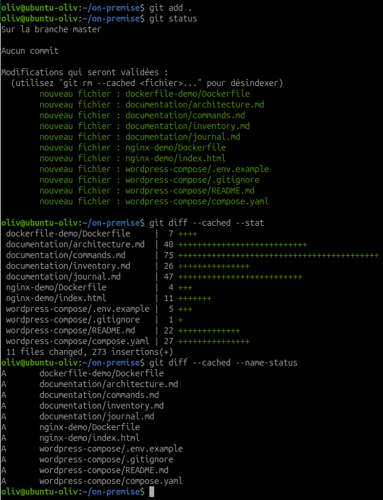
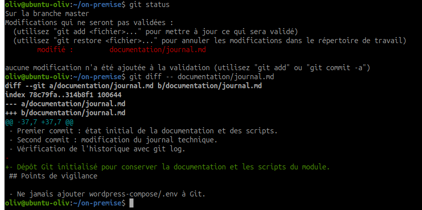

# Utiliser Git pour gérer la documentation et les scripts

## Objectif

Découvrir les bases de Git et utiliser un dépôt local pour gérer la documentation et les scripts du projet.

Git permet de conserver l'historique des modifications, de revenir à une version précédente et de partager un état de travail compréhensible avec les autres administrateurs.

## Spécifications

- Travail individuel.
- Suivre le [tutoriel Git et GitHub de W3Schools](https://www.w3schools.com/git/).
- Les sections avancées ne sont pas nécessaires pour cette activité.
- Les manipulations sont réalisées dans le répertoire `~/on-premise`.
- Le dépôt demandé est un dépôt Git local.

## 1. Vérifier l'installation de Git

Affichez la version installée :

~~~bash
git --version
~~~

Résultat attendu : une version Git est affichée, par exemple `git version 2.x`.

Si Git n'est pas installé sur Ubuntu :

~~~bash
sudo apt update
sudo apt install -y git
~~~

## 2. Configurer l'identité Git

Git associe chaque commit à un nom et une adresse électronique. Configurez ces valeurs une seule fois sur la machine :

~~~bash
git config --global user.name "Prénom Nom"
git config --global user.email "prenom.nom@example.com"
~~~

Vérifiez la configuration :

~~~bash
git config --global --list
~~~

Utilisez une adresse de formation ou une adresse autorisée par le formateur.

## 3. Se placer dans le répertoire du module

Revenez dans le répertoire de travail :

~~~bash
cd ~/on-premise
pwd
~~~

Le résultat de `pwd` doit confirmer que les commandes suivantes sont exécutées dans `~/on-premise`.

## 4. Initialiser le dépôt

Initialisez un dépôt Git local :

~~~bash
git init
~~~

Git crée un répertoire caché `.git` qui contient l'historique et les métadonnées du dépôt.

Vérifiez l'état initial :

~~~bash
git status
~~~

À ce stade, les fichiers existants apparaissent généralement comme non suivis.

## 5. Vérifier l'arborescence de documentation

Vérifiez que les travaux précédents sont présents :

~~~bash
find . -maxdepth 3 -type f | sort
~~~

L'arborescence doit notamment contenir :

~~~text
documentation/
├── architecture.md
├── inventory.md
├── journal.md
└── commands.md

dockerfile-demo/
nginx-demo/
wordpress-compose/
~~~

Les noms peuvent varier si certains fichiers ont été créés dans un autre répertoire du module.

## 6. Vérifier les fichiers à ne pas versionner

Avant le premier ajout, vérifiez que les secrets ne seront pas suivis :

~~~bash
find . -name ".env" -print
git status --short
~~~

Le fichier `wordpress-compose/.env` contient des mots de passe de travaux pratiques. Il ne doit pas être ajouté au dépôt. Le fichier `wordpress-compose/.env.example` peut être versionné.

Si nécessaire, ajoutez cette règle dans le fichier `.gitignore` situé à la racine de `~/on-premise` :

~~~text
wordpress-compose/.env
~~~

Puis vérifiez que Git ignore bien le fichier :

~~~bash
git check-ignore -v wordpress-compose/.env
~~~

!!! warning "Ne jamais versionner un secret"
    Vérifiez toujours `git status` avant `git add .`. Un fichier `.env`, une clé privée ou un mot de passe ne doit pas être ajouté à un dépôt.

## 7. Ajouter les fichiers au premier commit

Ajoutez les productions du module :

~~~bash
git add documentation/
git add dockerfile-demo/
git add nginx-demo/
git add wordpress-compose/compose.yaml
git add wordpress-compose/.env.example
git add wordpress-compose/.gitignore
git add wordpress-compose/README.md
~~~

Vous pouvez aussi ajouter les fichiers suivis du répertoire courant après avoir vérifié les exclusions :

~~~bash
git add .
~~~

Contrôlez la zone de préparation :

~~~bash
git status
git diff --cached --stat
git diff --cached --name-status
~~~

Les fichiers affichés sous `Changes to be committed` sont prêts pour le commit.

Preuve de la préparation du premier commit :

## 8. Réaliser le premier commit

Créez un commit décrivant l'état initial du projet :

~~~bash
git commit -m "Initialiser la documentation et les scripts du projet"
~~~

Vérifiez le commit créé :

~~~bash
git status
git log --oneline --decorate --max-count=5
~~~

Résultat attendu :

- le dépôt est propre ;
- un premier commit apparaît dans l'historique ;
- le message décrit l'état initial du projet.

## 9. Modifier un document

Modifiez un document de votre choix, par exemple :

~~~bash
nano documentation/journal.md
~~~

Ajoutez une ligne décrivant la mise en place du dépôt Git :

~~~text
Dépôt Git initialisé pour conserver la documentation et les scripts du module.
~~~

Enregistrez le fichier puis observez la modification :

~~~bash
git status
git diff -- documentation/journal.md
~~~

`git diff` affiche les changements qui ne sont pas encore dans la zone de préparation.

Preuve de la modification de `documentation/journal.md` avant le second commit :

## 10. Réaliser le second commit

Ajoutez la modification :

~~~bash
git add documentation/journal.md
~~~

Vérifiez ce qui sera commité :

~~~bash
git diff --cached -- documentation/journal.md
~~~

Créez le second commit :

~~~bash
git commit -m "Documenter la mise en place du dépôt Git"
~~~

Vérifiez l'état final :

~~~bash
git status
~~~

## 11. Consulter l'historique

Affichez les deux commits :

~~~bash
git log --oneline --decorate --graph
~~~

Affichez le détail du dernier commit :

~~~bash
git show --stat --oneline HEAD
~~~

Comparez les deux derniers commits :

~~~bash
git diff HEAD~1 HEAD
~~~

Le dépôt doit contenir au moins deux commits :

~~~text
<commit-2> Documenter la mise en place du dépôt Git
<commit-1> Initialiser la documentation et les scripts du projet
~~~

Les identifiants réels des commits seront différents.

## 12. Vérifier le livrable final

Exécutez les commandes suivantes :

~~~bash
git status
git log --oneline --decorate --graph --all
git ls-files
~~~

État attendu :

- l'arborescence de documentation est suivie ;
- les scripts et fichiers de configuration utiles sont suivis ;
- `wordpress-compose/.env` n'apparaît pas dans `git ls-files` ;
- au moins deux commits sont visibles ;
- l'historique permet de distinguer l'état initial et la modification du journal.

## Commandes Git de base

| Commande | Utilité |
| --- | --- |
| `git --version` | Afficher la version de Git. |
| `git config --global user.name "Nom"` | Configurer le nom associé aux commits. |
| `git config --global user.email "adresse"` | Configurer l'adresse associée aux commits. |
| `git config --global --list` | Afficher la configuration globale. |
| `git init` | Initialiser un dépôt dans le répertoire courant. |
| `git status` | Afficher l'état des fichiers. |
| `git add fichier` | Ajouter un fichier à la zone de préparation. |
| `git add .` | Ajouter les fichiers non exclus du répertoire courant. |
| `git restore --staged fichier` | Retirer un fichier de la zone de préparation sans supprimer ses modifications. |
| `git diff` | Afficher les modifications non préparées. |
| `git diff --cached` | Afficher les modifications préparées pour le commit. |
| `git commit -m "message"` | Enregistrer un état avec un message. |
| `git log --oneline` | Afficher l'historique résumé. |
| `git log --oneline --graph --all` | Afficher l'historique sous forme graphique. |
| `git show HEAD` | Afficher le dernier commit et son contenu. |
| `git diff HEAD~1 HEAD` | Comparer le dernier commit avec le précédent. |
| `git ls-files` | Lister les fichiers suivis par Git. |
| `git check-ignore -v fichier` | Vérifier pourquoi un fichier est ignoré. |
| `git restore fichier` | Restaurer la version du dernier commit, après vérification. |
| `git rm fichier` | Supprimer un fichier du projet et de l'index. |

!!! note "Commandes non nécessaires pour cette activité"
    Les branches, les fusions, les dépôts distants, les pull requests et les commandes GitHub seront étudiés plus tard si le module le demande.

## Livrables

Le dépôt Git local de `~/on-premise` doit contenir :

- l'arborescence de documentation créée lors des activités précédentes ;
- les scripts et fichiers de configuration utiles ;
- au moins deux commits ;
- l'historique des modifications ;
- aucune valeur secrète du fichier `.env`.

Preuves à conserver :

~~~bash
git status
git log --oneline --decorate --graph --all
git ls-files
~~~

## État final vérifiable

Le dépôt est prêt pour la suite du module lorsque :

- `git status` indique un répertoire propre ;
- le premier commit décrit l'état initial ;
- le second commit décrit une modification documentée ;
- `git log` affiche les deux commits ;
- `wordpress-compose/.env` est ignoré et absent de l'index ;
- la documentation et les scripts peuvent être retrouvés avec `git ls-files`.

## Ressources

- [Tutoriel Git et GitHub de W3Schools](https://www.w3schools.com/git/)
- [Git - documentation officielle](https://git-scm.com/docs)
