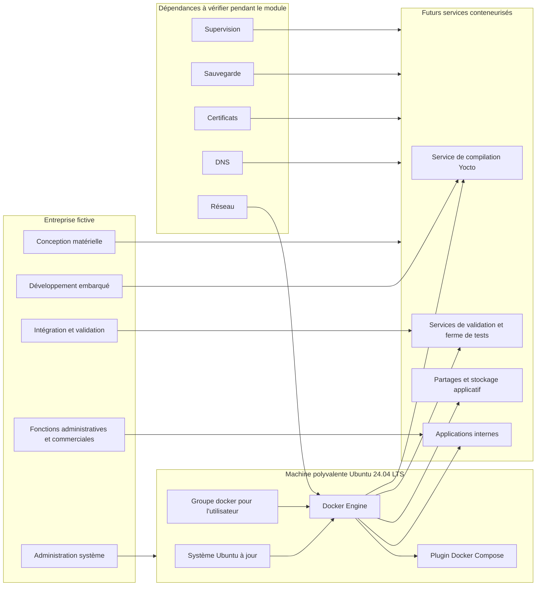

# Installer Docker Engine

## Objectif de la feuille

Cette feuille sert à installer **Docker Engine** sur Ubuntu 24.04 LTS et à vérifier que le moteur Docker fonctionne correctement.

L'installation doit utiliser le dépôt officiel Docker. Il ne faut pas installer Docker Desktop.

## Spécifications

| Élément | Attendu |
| --- | --- |
| Produit à installer | Docker Engine |
| Produit à éviter | Docker Desktop |
| Source des paquets | Dépôt officiel Docker |
| Système cible | Ubuntu 24.04 LTS |
| Mode d'exécution | Commandes lues avant exécution |

## Schéma de l'installation dans le contexte de l'entreprise

Le moteur Docker installé sur la machine Ubuntu sert de socle technique pour les futurs services internes de l'entreprise fictive : compilation, validation, outils partagés et services d'infrastructure.



À retenir : on n'installe pas Docker uniquement pour lancer un conteneur de test. On prépare une base d'exécution qui devra ensuite s'intégrer au réseau, aux noms DNS, aux certificats, aux sauvegardes et à la supervision.

!!! warning "Avant de lancer les commandes"
    Lisez chaque commande avant de l'exécuter. En cas d'erreur d'installation, ne continuez pas en aveugle : signalez l'erreur au formateur.

## Déroulement

### 1. Désinstaller les paquets incompatibles

Certains paquets fournis par la distribution ou par d'autres outils peuvent entrer en conflit avec Docker Engine.

Exécutez :

```bash
for pkg in docker.io docker-doc docker-compose docker-compose-v2 podman-docker containerd runc; do
  sudo apt-get remove -y "$pkg"
done
```

!!! note "Résultat possible"
    Si certains paquets ne sont pas installés, `apt` peut l'indiquer. Ce n'est pas forcément une erreur bloquante.

### 2. Ajouter la clé du dépôt officiel Docker

Installez les dépendances nécessaires, créez le dossier des clés APT, puis ajoutez la clé officielle Docker :

```bash
sudo apt-get update
sudo apt-get install -y ca-certificates curl
sudo install -m 0755 -d /etc/apt/keyrings
sudo curl -fsSL https://download.docker.com/linux/ubuntu/gpg \
  -o /etc/apt/keyrings/docker.asc
sudo chmod a+r /etc/apt/keyrings/docker.asc
```

### 3. Ajouter le dépôt Docker

Ajoutez le dépôt Docker aux sources APT :

```bash
echo \
  "deb [arch=$(dpkg --print-architecture) signed-by=/etc/apt/keyrings/docker.asc] \
  https://download.docker.com/linux/ubuntu \
  $(. /etc/os-release && echo "${UBUNTU_CODENAME:-$VERSION_CODENAME}") stable" \
  | sudo tee /etc/apt/sources.list.d/docker.list > /dev/null
```

### 4. Installer Docker Engine et le plugin Compose

Mettez à jour la liste des paquets puis installez Docker Engine, la CLI Docker, `containerd`, Buildx et le plugin Compose :

```bash
sudo apt-get update
sudo apt-get install -y \
  docker-ce \
  docker-ce-cli \
  containerd.io \
  docker-buildx-plugin \
  docker-compose-plugin
```

### 5. Vérifier que le service Docker fonctionne

Contrôlez l'état du service :

```bash
sudo systemctl status docker
```

Le service doit apparaître comme actif.

Si le service n'est pas démarré, signalez le problème au formateur avant de poursuivre.

### 6. Vérifier les versions installées

Vérifiez la version de Docker :

```bash
sudo docker --version
```

Vérifiez aussi la version du plugin Compose :

```bash
sudo docker compose version
```

### 7. Tester le lancement d'un conteneur

Lancez le conteneur de test officiel :

```bash
sudo docker run hello-world
```

Cette commande télécharge une petite image de test, démarre un conteneur, affiche un message de confirmation, puis s'arrête.

### 8. Autoriser l'utilisateur à utiliser Docker sans sudo

Ajoutez votre utilisateur au groupe `docker` :

```bash
sudo usermod -aG docker "$USER"
```

Fermez puis rouvrez votre session pour que l'appartenance au groupe soit prise en compte.

Vérifiez ensuite que Docker peut être exécuté sans `sudo` :

```bash
docker version
docker run hello-world
```

!!! warning "Sécurité du groupe docker"
    L'appartenance au groupe `docker` donne des privilèges élevés sur la machine. Elle doit être considérée comme un accès d'administration.

## Commandes récapitulatives

```bash
for pkg in docker.io docker-doc docker-compose docker-compose-v2 podman-docker containerd runc; do
  sudo apt-get remove -y "$pkg"
done

sudo apt-get update
sudo apt-get install -y ca-certificates curl
sudo install -m 0755 -d /etc/apt/keyrings
sudo curl -fsSL https://download.docker.com/linux/ubuntu/gpg \
  -o /etc/apt/keyrings/docker.asc
sudo chmod a+r /etc/apt/keyrings/docker.asc

echo \
  "deb [arch=$(dpkg --print-architecture) signed-by=/etc/apt/keyrings/docker.asc] \
  https://download.docker.com/linux/ubuntu \
  $(. /etc/os-release && echo "${UBUNTU_CODENAME:-$VERSION_CODENAME}") stable" \
  | sudo tee /etc/apt/sources.list.d/docker.list > /dev/null

sudo apt-get update
sudo apt-get install -y \
  docker-ce \
  docker-ce-cli \
  containerd.io \
  docker-buildx-plugin \
  docker-compose-plugin

sudo systemctl status docker
sudo docker --version
sudo docker compose version
sudo docker run hello-world
sudo usermod -aG docker "$USER"
```

Après reconnexion :

```bash
docker version
docker run hello-world
```

## Preuves attendues

À la fin de la feuille, conservez :

- la preuve que le service `docker` est actif ;
- la version de Docker Engine ;
- la version de Docker Compose ;
- le résultat du test `hello-world` avec `sudo` ;
- le résultat de `docker version` sans `sudo` après reconnexion ;
- le résultat du test `hello-world` sans `sudo` après reconnexion.

## Résultat attendu

Docker Engine est installé depuis le dépôt officiel Docker, le service est actif, le plugin Compose est disponible et l'utilisateur peut exécuter Docker sans `sudo` après reconnexion.

## Ressources

- [Install Docker Engine on Ubuntu](https://docs.docker.com/engine/install/ubuntu/)
- [Linux post-installation steps for Docker Engine](https://docs.docker.com/engine/install/linux-postinstall/)
- [Docker daemon attack surface](https://docs.docker.com/engine/security/#docker-daemon-attack-surface)
