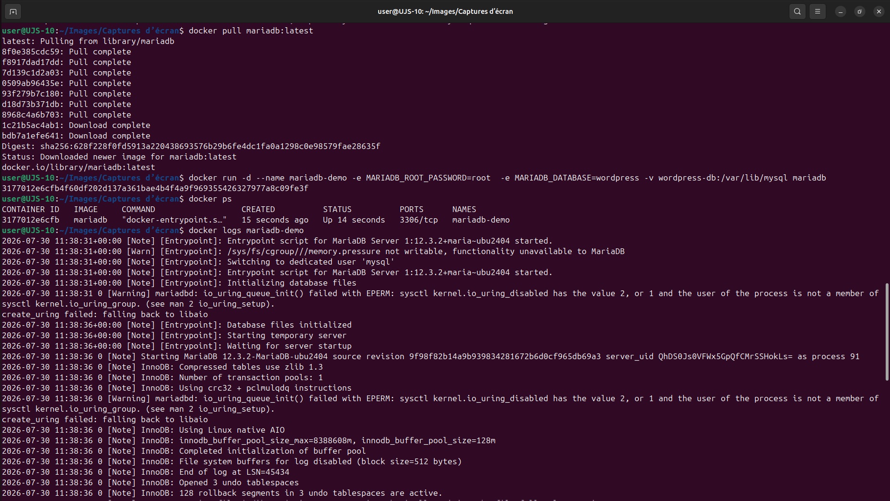
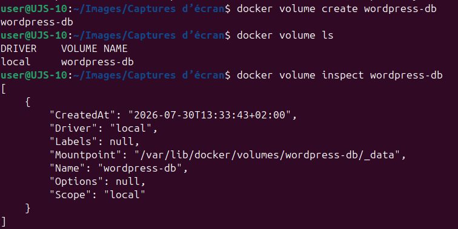

# Persistance des données avec un volume Docker

## Objectif

Créer un volume Docker nommé, l'utiliser avec un conteneur MariaDB, puis vérifier que les données sont conservées après la suppression du conteneur.

Cette activité permet de comprendre la différence entre le cycle de vie d'un conteneur et celui d'un volume.

## Spécifications

- Travail individuel.
- Toutes les manipulations sont réalisées depuis un terminal.
- Le volume utilisé est nommé `wordpress-db`.
- Le service de test est basé sur l'image officielle `mariadb:11`.
- Les commandes doivent être comprises avant d'être exécutées.

## Déroulement

### 1. Créer un volume nommé

Créez un volume Docker nommé `wordpress-db` :

```bash
docker volume create wordpress-db
```

Ce volume servira à stocker les fichiers de base de données MariaDB en dehors du conteneur.

### 2. Afficher les volumes disponibles

Listez les volumes Docker présents sur la machine :

```bash
docker volume ls
```

Le volume `wordpress-db` doit apparaître dans la liste.

### 3. Inspecter le volume

Affichez les informations détaillées du volume :

```bash
docker volume inspect wordpress-db
```

Points à observer :

| Champ | Signification |
| --- | --- |
| `Name` | Nom du volume. |
| `Driver` | Pilote de stockage utilisé par Docker. |
| `Mountpoint` | Emplacement réel du volume sur l'hôte Docker. |

### 4. Créer un conteneur MariaDB utilisant ce volume

Démarrez un conteneur MariaDB en montant le volume sur le dossier de données de MariaDB :

```bash
docker run -d \
    --name mariadb-demo \
    -e MARIADB_ROOT_PASSWORD=root \
    -e MARIADB_DATABASE=wordpress \
    -v wordpress-db:/var/lib/mysql \
    mariadb:11
```

Explication :

| Élément | Rôle |
| --- | --- |
| `--name mariadb-demo` | Donne un nom au conteneur. |
| `MARIADB_ROOT_PASSWORD=root` | Définit le mot de passe du compte administrateur MariaDB. |
| `MARIADB_DATABASE=wordpress` | Crée une base nommée `wordpress` au premier démarrage. |
| `-v wordpress-db:/var/lib/mysql` | Monte le volume Docker dans le dossier de données MariaDB. |
| `mariadb:11` | Utilise l'image officielle MariaDB en version 11. |

### 5. Vérifier le fonctionnement

Vérifiez que le conteneur est démarré :

```bash
docker ps
```

Consultez ensuite les journaux :

```bash
docker logs mariadb-demo
```

Les logs doivent montrer l'initialisation de MariaDB et le démarrage du service.



### 6. Arrêter puis supprimer le conteneur

Arrêtez le conteneur :

```bash
docker stop mariadb-demo
```

Supprimez-le :

```bash
docker rm mariadb-demo
```

À ce stade, le conteneur n'existe plus, mais le volume n'a pas été supprimé.

### 7. Vérifier que le volume existe toujours

Listez les volumes :

```bash
docker volume ls
```

Le volume `wordpress-db` doit toujours être présent.



### 8. Créer un nouveau conteneur avec le même volume

Démarrez un second conteneur MariaDB en réutilisant exactement le même volume :

```bash
docker run -d \
    --name mariadb-demo2 \
    -e MARIADB_ROOT_PASSWORD=root \
    -e MARIADB_DATABASE=wordpress \
    -v wordpress-db:/var/lib/mysql \
    mariadb:latest
```

Ce nouveau conteneur réutilise les fichiers déjà présents dans `wordpress-db`.

### 9. Afficher les volumes

Vérifiez à nouveau la présence du volume :

```bash
docker volume ls
```

Le volume `wordpress-db` doit toujours être visible.

### 10. Inspecter de nouveau le volume

Inspectez le volume :

```bash
docker volume inspect wordpress-db
```

Le nom et le point de montage doivent rester cohérents avec la première inspection.

### 11. Supprimer le second conteneur

Arrêtez le second conteneur :

```bash
docker stop mariadb-demo2
```

Supprimez-le :

```bash
docker rm mariadb-demo2
```

Le volume est toujours présent, car il a un cycle de vie indépendant des conteneurs.

### 12. Supprimer explicitement le volume

Supprimez le volume :

```bash
docker volume rm wordpress-db
```

Vérifiez qu'il n'apparaît plus :

```bash
docker volume ls
```

## Questions

Répondez aux questions suivantes :

- Pourquoi les données ne sont-elles pas supprimées avec le conteneur ?
- Quelle est la différence entre un conteneur et un volume ?
- Dans quels cas est-il souhaitable de conserver les données après la suppression d'un conteneur ?
- Citez trois exemples de services nécessitant une persistance des données.
- Citez trois exemples de services pouvant fonctionner sans données persistantes.

## Réponses synthétiques

### Pourquoi les données ne sont-elles pas supprimées avec le conteneur ?

Les données ne sont pas supprimées parce qu'elles sont stockées dans un volume Docker nommé. Le conteneur utilise ce volume, mais il n'en est pas propriétaire.

### Quelle est la différence entre un conteneur et un volume ?

Un conteneur exécute un service ou une application. Il peut être arrêté, supprimé et recréé.

Un volume stocke des données persistantes. Il peut être réutilisé par plusieurs conteneurs successifs.

### Quand conserver les données après suppression d'un conteneur ?

Il est souhaitable de conserver les données lorsqu'un service doit être mis à jour, déplacé, réparé ou recréé sans perdre son état.

### Exemples de services nécessitant une persistance

- base de données MariaDB, PostgreSQL ou MySQL ;
- site WordPress ;
- outil de supervision stockant un historique ;
- dépôt Git privé ;
- serveur de fichiers.

### Exemples de services pouvant fonctionner sans persistance

- reverse proxy Nginx servant uniquement une configuration reconstruite ;
- conteneur de test temporaire ;
- application stateless derrière une API ;
- worker de traitement sans stockage local durable ;
- conteneur lancé uniquement pour exécuter une commande ponctuelle.

## Commandes récapitulatives

```bash
docker volume create wordpress-db
docker volume ls
docker volume inspect wordpress-db
docker run -d --name mariadb-demo -e MARIADB_ROOT_PASSWORD=root -e MARIADB_DATABASE=wordpress -v wordpress-db:/var/lib/mysql mariadb:11
docker ps
docker logs mariadb-demo
docker stop mariadb-demo
docker rm mariadb-demo
docker volume ls
docker run -d --name mariadb-demo2 -e MARIADB_ROOT_PASSWORD=root -e MARIADB_DATABASE=wordpress -v wordpress-db:/var/lib/mysql mariadb:11
docker volume ls
docker volume inspect wordpress-db
docker stop mariadb-demo2
docker rm mariadb-demo2
docker volume rm wordpress-db
docker volume ls
```

## Ressources

- [Volumes](https://docs.docker.com/engine/storage/volumes/)
- [docker volume](https://docs.docker.com/reference/cli/docker/volume/)
- [mariadb: image officielle](https://hub.docker.com/_/mariadb)
