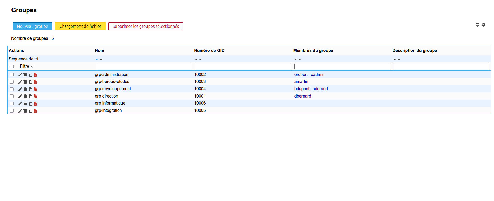
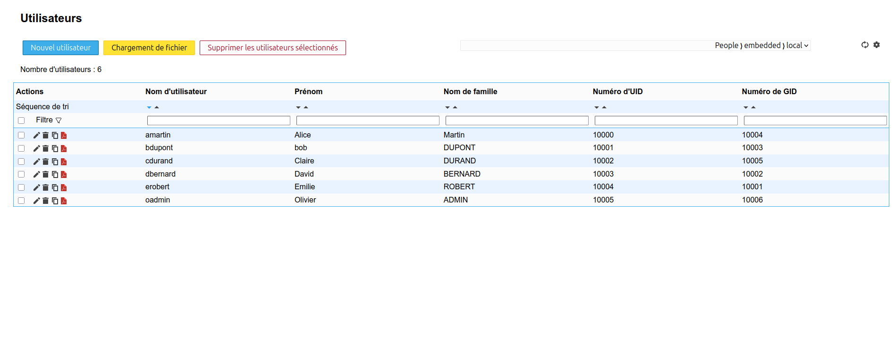

# Construire la structure LDAP de l'entreprise avec LAM

## Objectif

Représenter l'organisation d'Embedded Solutions dans l'annuaire LDAP à l'aide de LDAP Account Manager, puis vérifier les unités, groupes et utilisateurs avec LAM et les outils LDAP.

## Spécifications

- Travail individuel.
- Utiliser LDAP Account Manager.
- Respecter le suffixe LDAP dc=embedded,dc=local.
- Respecter les conventions définies dans la conception de l'annuaire.
- Ne pas utiliser de mots de passe personnels dans les captures ou la documentation.

## 1. Vérifier les prérequis

OpenLDAP et LAM doivent être démarrés :

~~~bash
cd ~/on-premise/openldap
docker compose ps

cd ~/on-premise/ldap-account-manager
docker compose ps
~~~

Ouvrir LAM :

~~~text
http://localhost:8081
~~~

Se connecter au profil LAM avec le mot de passe LAM, puis utiliser le compte administrateur LDAP :

~~~text
cn=admin,dc=embedded,dc=local
~~~

## 2. Arborescence cible

L'arborescence retenue est la suivante :

~~~text
dc=embedded,dc=local
├── ou=People
│   ├── ou=Direction
│   ├── ou=Administration
│   ├── ou=BureauEtudes
│   ├── ou=Developpement
│   ├── ou=Integration
│   └── ou=Informatique
├── ou=Groups
├── ou=Services
└── ou=Computers
~~~

Les unités People et Groups ont déjà été créées lors du premier accès à LAM. Les unités de service permettent de séparer les comptes techniques et les futurs ordinateurs.

## 3. Créer les unités organisationnelles

Dans LAM :

1. ouvrir l'arborescence LDAP ;
2. sélectionner dc=embedded,dc=local ;
3. ouvrir ou=People ;
4. créer les unités suivantes :
   - Direction ;
   - Administration ;
   - BureauEtudes ;
   - Developpement ;
   - Integration ;
   - Informatique ;
5. vérifier que chaque unité apparaît sous ou=People ;
6. vérifier ou=Services et ou=Computers ;
7. créer ces unités si elles n'existent pas encore.

Les noms techniques ne contiennent ni espace ni accent. Les libellés compréhensibles sont placés dans l'attribut description.

## 4. Créer les groupes

Dans LAM, ouvrir le **Navigateur LDAP**, sélectionner `ou=Groups,dc=embedded,dc=local`, puis créer les groupes suivants. N'utilise pas le menu **Groupes Unix** : il tente de créer des objets `posixGroup`, refusés comme classe structurelle par le schéma OpenLDAP de ce TP.

!!! warning "Classe structurelle OpenLDAP"
    Dans l'environnement utilisé pour ce TP, `posixGroup` ne peut pas être créé seul. Choisir `groupOfNames` comme classe structurelle, puis ajouter `posixGroup` comme classe auxiliaire afin que LAM puisse aussi utiliser le groupe dans le parcours Utilisateur Unix.

Le groupe doit donc comporter au minimum :

- la classe structurelle `groupOfNames` ;
- la classe auxiliaire `posixGroup` ;
- l'attribut `cn` ;
- l'attribut obligatoire `member`, contenant le DN d'au moins un membre ;
- l'attribut `gidNumber`, avec une valeur unique.

Si LAM affiche `No structural object class selected` ou `Object class violation - no structural object class provided`, cela signifie que `posixGroup` a été utilisé seul. Reviens au groupe existant, conserve `groupOfNames`, puis ajoute `posixGroup` en seconde valeur de `objectClass`.

| Nom du groupe | Service représenté | Description |
| --- | --- | --- |
| grp-direction | Direction | Direction de l'entreprise |
| grp-administration | Administration | Fonctions administratives |
| grp-bureau-etudes | Bureau d'études | Conception matérielle et électronique |
| grp-developpement | Développement logiciel | Développement embarqué et logiciel |
| grp-integration | Intégration | Intégration et validation |
| grp-informatique | Informatique | Administration des systèmes et réseaux |

Lors de la création, ajoute un premier membre dans `member`, par exemple `cn=admin,dc=embedded,dc=local` pour un groupe de test, ou le DN d'un utilisateur déjà créé. Les groupes de type `groupOfNames` ne peuvent pas être complètement vides.

Les groupes créés ici sont des `groupOfNames`. Les noms de groupes restent en minuscules avec le préfixe `grp-`.

## 5. Créer les utilisateurs

Créer plusieurs utilisateurs de laboratoire dans les unités correspondantes :

| Identifiant | Unité | Groupe principal | Groupes complémentaires |
| --- | --- | --- | --- |
| alice.martin | Developpement | grp-developpement | grp-bureau-etudes |
| bob.dupont | BureauEtudes | grp-bureau-etudes | grp-developpement |
| claire.durand | Integration | grp-integration | grp-developpement |
| david.bernard | Administration | grp-administration | grp-direction |
| emilie.robert | Direction | grp-direction | grp-administration |
| olivier.admin | Informatique | grp-informatique | grp-administration |

Pour chaque utilisateur :

1. ouvrir le type de compte utilisateur LDAP générique basé sur `inetOrgPerson`, et non le type **Utilisateur Unix** ;
2. renseigner le prénom et le nom ;
3. définir l'identifiant UID ;
4. sélectionner l'unité People appropriée ;
5. renseigner l'adresse électronique de laboratoire ;
6. définir un mot de passe de laboratoire ;
7. enregistrer l'utilisateur ;
8. relire sa fiche et vérifier les attributs enregistrés.

Le formulaire **Utilisateur Unix** affiche les groupes possédant `posixGroup` et `gidNumber`. Après avoir ajouté ces attributs aux groupes `groupOfNames`, il devient possible de sélectionner un groupe principal et des groupes supplémentaires. Pour un compte Unix, renseigner aussi un `uidNumber`, un `gidNumber`, un répertoire utilisateur et un shell.

Pour l'exemple Alice Martin, utiliser :

| Champ | Valeur |
| --- | --- |
| Nom d'utilisateur / UID | `alice.martin` |
| Nom d'usage | `Alice Martin` |
| Unité | `ou=Developpement,ou=People,dc=embedded,dc=local` |
| Mot de passe | Mot de passe de laboratoire |

Ne pas utiliser d'espace dans l'UID. Les champs `uidNumber`, `gidNumber`, répertoire utilisateur et shell sont réservés au parcours Unix et peuvent rester absents pour un compte `inetOrgPerson`.

Après création de l'utilisateur, revenir dans le groupe `groupOfNames` et ajouter son DN complet dans `member` :

~~~text
uid=alice.martin,ou=Developpement,ou=People,dc=embedded,dc=local
~~~

Les utilisateurs de laboratoire sont des identités de test. Leurs mots de passe ne doivent pas être réutilisés dans un environnement réel.

## 6. Vérifier dans LAM

Vérifier les points suivants :

- chaque OU est placée au bon endroit ;
- les six groupes existent sous ou=Groups ;
- chaque utilisateur possède un UID unique ;
- les utilisateurs sont dans la bonne unité ;
- les appartenances aux groupes sont visibles ;
- les descriptions correspondent aux services ;
- aucun compte personnel n'est utilisé comme compte technique.

Conserver des captures de :

- l'arborescence complète ;
- la liste des groupes ;
- la fiche d'un utilisateur ;
- les appartenances d'un utilisateur à ses groupes.

### Preuve : groupes créés

La liste LAM confirme la création de six groupes : `grp-administration`,
`grp-bureau-etudes`, `grp-developpement`, `grp-direction`,
`grp-informatique` et `grp-integration`. Les GID et les membres visibles
permettent de contrôler la cohérence des associations.

*La liste des groupes créée dans LAM constitue la preuve de la structure des groupes et de leurs GID.*

### Preuve : utilisateurs créés

La liste LAM confirme la création de six utilisateurs de laboratoire :
Alice Martin, Bob Dupont, Claire Durand, David Bernard, Emilie Robert et
Olivier ADMIN. Chaque compte possède un identifiant UID, un numéro UID et un
GID principal.

*La liste des utilisateurs créée dans LAM constitue la preuve des comptes et de leurs identifiants Unix associés.*

## 7. Vérifier avec les commandes LDAP

Depuis le conteneur OpenLDAP :

~~~bash
cd ~/on-premise/openldap

docker compose exec openldap ldapsearch \
  -x \
  -H ldap://localhost:3890 \
  -D "cn=admin,dc=embedded,dc=local" \
  -W \
  -b "dc=embedded,dc=local" \
  "(objectClass=organizationalUnit)"
~~~

Rechercher un utilisateur par son UID :

~~~bash
docker compose exec openldap ldapsearch \
  -x \
  -H ldap://localhost:3890 \
  -D "cn=admin,dc=embedded,dc=local" \
  -W \
  -b "dc=embedded,dc=local" \
  "(uid=alice.martin)"
~~~

Rechercher les groupes du projet :

~~~bash
docker compose exec openldap ldapsearch \
  -x \
  -H ldap://localhost:3890 \
  -D "cn=admin,dc=embedded,dc=local" \
  -W \
  -b "ou=Groups,dc=embedded,dc=local" \
  "(&(objectClass=groupOfNames)(cn=grp-*))"
~~~

Rechercher les utilisateurs d'un groupe :

~~~bash
docker compose exec openldap ldapsearch \
  -x \
  -H ldap://localhost:3890 \
  -D "cn=admin,dc=embedded,dc=local" \
  -W \
  -b "dc=embedded,dc=local" \
  "(&(objectClass=groupOfNames)(member=uid=alice.martin,ou=Developpement,ou=People,dc=embedded,dc=local))"
~~~

Les recherches doivent retourner les entrées créées et se terminer par un résultat réussi.

La recherche réalisée dans le conteneur OpenLDAP retourne les unités
organisationnelles attendues et se termine par `result: 0 Success`.

*La sortie confirme que l'arborescence LDAP est recherchable et que la commande s'est terminée sans erreur.*

!!! warning "Vérifier les captures avant remise"
    La capture de recherche peut laisser apparaître des attributs `userPassword::` encodés dans la sortie LDAP. Pour une remise au formateur ou une publication, masquer ces lignes si elles correspondent à un compte réel ou à un secret réutilisable.

## 8. Répondre aux questions

### Pourquoi les groupes sont-ils préférables à une gestion individuelle des droits ?

Les groupes permettent d'attribuer une autorisation à une fonction plutôt qu'à une personne. L'arrivée ou le départ d'un utilisateur ne nécessite alors que la modification de ses appartenances. Cela réduit les erreurs, facilite les audits et applique plus facilement le principe du moindre privilège.

### Pourquoi définir des conventions de nommage dès le début ?

Les conventions rendent les recherches prévisibles, évitent les doublons et permettent aux futurs services de réutiliser les mêmes identifiants. Elles facilitent aussi les scripts, les audits et la transmission de l'administration à une autre personne.

### Quelles difficultés apparaîtraient avec des conventions différentes ?

Les recherches deviendraient incomplètes, les doublons seraient plus fréquents et les scripts devraient gérer plusieurs formats. Les droits pourraient être attribués au mauvais groupe et les audits seraient plus difficiles à interpréter.

## 9. Livrables

Conserver :

- l'arborescence LDAP ;
- la liste des six groupes ;
- la liste des utilisateurs créés ;
- les groupes associés à chaque utilisateur ;
- les conventions de nommage mises à jour ;
- les captures LAM ;
- les sorties ldapsearch ;
- les réponses aux questions.

Après validation des créations, reporter les comptes et groupes réellement présents dans le journal technique ainsi que dans les mises à jour de suivi du PCA et du PRA.

## Notions acquises

- Unité organisationnelle LDAP ;
- groupe LDAP ;
- utilisateur LDAP ;
- UID ;
- groupe principal et groupes complémentaires ;
- filtre de recherche LDAP ;
- administration graphique et vérification en ligne de commande.
