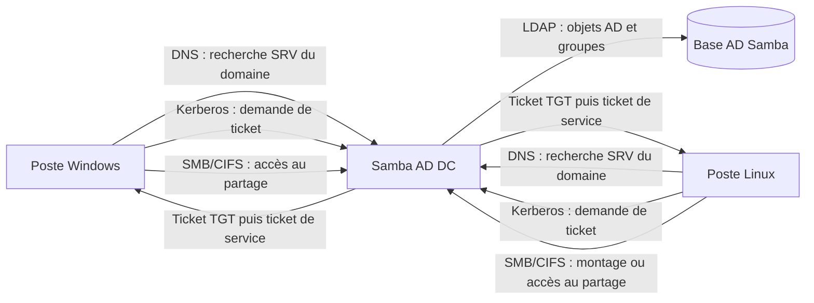

# Concevoir l'architecture Samba Active Directory et LDAP

## Objectif

Comprendre comment Samba Active Directory, LDAP, Kerberos, DNS et SMB
collaborent pour fournir une authentification centralisée et un partage de
fichiers accessible depuis Windows et Linux.

## 1. Situation de départ

L'entreprise possède déjà un annuaire OpenLDAP de laboratoire contenant les
unités, groupes et utilisateurs conçus lors de l'itération 2.

Point d'architecture important : un contrôleur Samba AD ne transforme pas
automatiquement OpenLDAP en Active Directory. En mode AD DC, Samba gère sa
propre base d'annuaire compatible AD. Une reprise des comptes OpenLDAP devra
donc être prévue comme une migration ou une synchronisation contrôlée, et non
comme un simple branchement direct.

Pour la conception, on distingue donc :

- l'annuaire OpenLDAP existant et ses données de laboratoire ;
- le futur domaine Samba AD et sa base AD ;
- les mécanismes de migration ou de coexistence à décider avant production.

## 2. Rôle des composants

| Composant | Rôle dans l'architecture |
| --- | --- |
| Samba Active Directory | Contrôleur de domaine, gestion du domaine, des comptes AD, des groupes, des postes et des partages SMB |
| LDAP | Protocole de consultation et de modification d'un annuaire. Dans Samba AD, l'interface LDAP expose les objets AD ; OpenLDAP reste un annuaire distinct tant qu'une migration n'est pas réalisée |
| Kerberos | Authentifie les utilisateurs, les postes et les services avec des tickets. Il évite de transmettre le mot de passe à chaque accès |
| DNS | Résout les noms et publie les enregistrements SRV permettant aux clients de trouver le contrôleur de domaine, LDAP et Kerberos |
| SMB/CIFS | Transporte l'accès aux partages de fichiers et aux imprimantes |
| Poste Windows | Rejoint le domaine, localise le DC avec DNS, obtient un ticket Kerberos et accède aux partages SMB |
| Poste Linux | Utilise un client Kerberos et un composant comme SSSD ou Winbind pour l'identité et l'accès aux ressources SMB |

Samba AD fournit généralement aussi les services DNS et Kerberos nécessaires au
domaine. Les rôles sont distincts même lorsqu'ils sont portés par le même
serveur.

## 3. Flux d'authentification

Le schéma représente le futur domaine Samba AD. OpenLDAP n'est pas présenté
comme une base directement utilisée par Samba AD : il devra être migré,
synchronisé ou conservé comme annuaire séparé selon la décision de conception.

## 4. Échanges détaillés depuis Windows

1. Le poste Windows utilise le DNS du domaine AD.
2. Il recherche les enregistrements SRV du contrôleur de domaine et de
   Kerberos.
3. Lors de l'ouverture de session, il demande un ticket Kerberos au KDC du
   contrôleur Samba.
4. Samba vérifie l'identité et les groupes dans sa base AD, accessible aussi
   par LDAP.
5. Le poste reçoit un ticket de session.
6. Pour ouvrir un partage, il présente son ticket au service SMB.
7. Samba applique les droits du partage et les permissions du système de
   fichiers.

## 5. Échanges détaillés depuis Linux

1. Le poste Linux utilise le DNS du domaine AD.
2. SSSD ou Winbind localise le contrôleur Samba.
3. Kerberos obtient un ticket pour l'utilisateur Linux.
4. Le composant d'intégration récupère l'identité et les groupes via LDAP ou
   les mécanismes AD pris en charge.
5. Le poste accède au partage avec SMB/CIFS, par exemple avec `mount.cifs`.
6. Samba vérifie le ticket et applique les droits associés aux groupes.

## 6. Protocoles et ports à prévoir

| Service | Port habituel | Utilisation |
| --- | ---: | --- |
| DNS | 53 TCP/UDP | résolution de noms et recherche des services AD |
| Kerberos | 88 TCP/UDP | authentification et tickets |
| Kerberos kpasswd | 464 TCP/UDP | changement de mot de passe Kerberos |
| LDAP | 389 TCP/UDP | accès à l'annuaire AD |
| LDAPS | 636 TCP | LDAP chiffré si activé |
| SMB | 445 TCP | partage de fichiers |
| RPC endpoint mapper | 135 TCP | certains services RPC d'AD |
| NTP | 123 UDP | synchronisation de l'heure, indispensable à Kerberos |
| Global Catalog | 3268/3269 TCP | recherche globale AD, selon le scénario |

La synchronisation horaire est une condition de fonctionnement de Kerberos.
Une dérive importante de l'heure peut provoquer un refus des tickets même si
le mot de passe est correct.

## 7. LDAP et Samba : coexistence ou migration

Trois choix doivent être discutés avant le déploiement :

| Choix | Avantage | Limite |
| --- | --- | --- |
| Conserver OpenLDAP seul | conserve l'annuaire existant | ne fournit pas nativement toutes les fonctions AD attendues par Windows |
| Déployer Samba AD seul | fournit domaine, Kerberos, DNS et SMB intégrés | nécessite de migrer les comptes et groupes OpenLDAP |
| Coexister temporairement | permet une transition progressive | implique une synchronisation, des règles de source de vérité et des tests plus complexes |

La proposition de travail est de traiter Samba AD comme la future source de
référence pour les postes Windows, Kerberos et les partages SMB. OpenLDAP peut
être conservé pendant la phase de migration, mais les doublons de comptes et
les divergences de mots de passe doivent être évités.

## 8. Questions à présenter au formateur

- Quel sera le nom DNS réel du domaine AD ?
- Le domaine utilisera-t-il le DNS interne Samba ou BIND9 ?
- Samba AD deviendra-t-il la source de référence des identités ?
- Les comptes OpenLDAP doivent-ils être migrés ou seulement documentés ?
- Les postes Linux utiliseront-ils SSSD ou Winbind ?
- Quels partages doivent être créés et quels groupes y auront accès ?
- Où seront stockées les permissions NTFS/ACL et les permissions de partage ?
- Quel serveur fournira la synchronisation NTP ?
- Quels certificats seront nécessaires pour LDAP sécurisé et SMB ?

## 9. Livrables

Conserver :

- le schéma des échanges ;
- le rôle de Samba Active Directory ;
- le rôle de LDAP ;
- le rôle de Kerberos ;
- le rôle de DNS ;
- le protocole utilisé pour les fichiers ;
- la décision de coexistence ou de migration OpenLDAP/Samba ;
- les questions soumises au formateur.

## Ressources

- [Documentation Samba AD DC](https://wiki.samba.org/index.php/Setting_up_Samba_as_an_Active_Directory_Domain_Controller)
- [Ports utilisés par Samba AD DC](https://wiki.samba.org/index.php/Samba_AD_DC_Port_Usage)
- [DNS interne Samba](https://wiki.samba.org/index.php/Samba_Internal_DNS_Back_End)
- [Documentation OpenLDAP](https://www.openldap.org/doc/)

## Notions acquises

- Samba Active Directory ;
- LDAP ;
- Kerberos ;
- DNS ;
- SMB/CIFS ;
- migration et coexistence d'annuaires.
