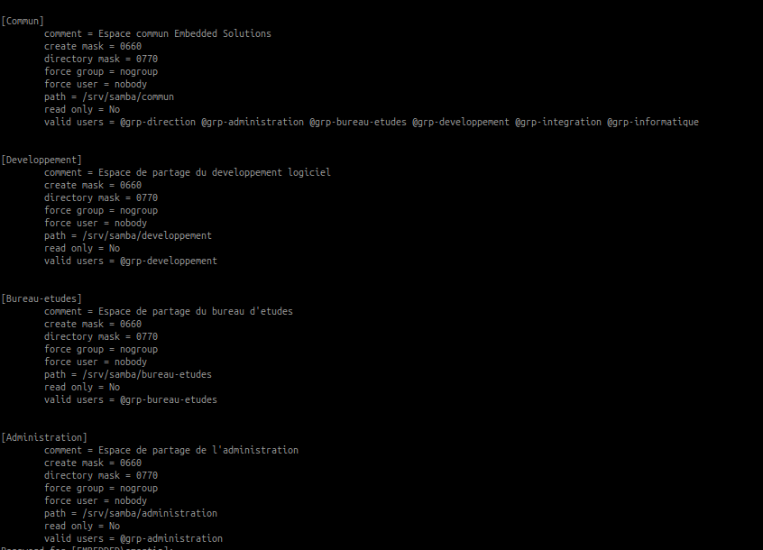
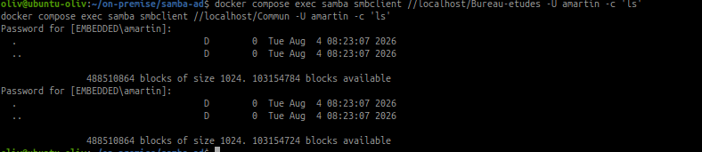
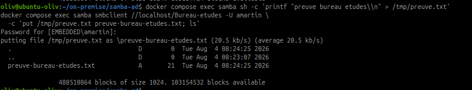

# Creer les espaces de partage Samba

## Objectif

Creer les espaces de partage de l'entreprise et associer les droits d'acces
aux groupes LDAP definis lors de l'iteration 2.

## Architecture retenue

Le serveur Samba autonome utilise OpenLDAP pour retrouver les utilisateurs et
les groupes. Les droits sont attribues aux groupes, et non directement aux
utilisateurs.

| Espace | Repertoire du serveur | Groupe LDAP autorise |
|---|---|---|
| `Commun` | `/srv/samba/commun` | Tous les groupes de service |
| `Developpement` | `/srv/samba/developpement` | `grp-developpement` |
| `Bureau-etudes` | `/srv/samba/bureau-etudes` | `grp-bureau-etudes` |
| `Administration` | `/srv/samba/administration` | `grp-administration` |

Le partage technique `partage` est conserve pour les tests realises lors de
l'integration Samba/OpenLDAP. Il n'est pas un espace metier supplementaire.

## 1. Verifier les groupes LDAP

Depuis le repertoire du projet Samba :

~~~bash
cd ~/on-premise/samba-ad
docker compose exec samba getent group | grep '^grp-'
~~~

Les groupes doivent etre resolus depuis OpenLDAP. Les membres sont geres dans
LDAP Account Manager ou avec les outils LDAP, puis reutilises par Samba.

## 2. Configurer les partages

Les partages sont declares dans `config/smb.conf` :

~~~ini
[Commun]
   path = /srv/samba/commun
   read only = no
   guest ok = no
   valid users = @grp-direction @grp-administration @grp-bureau-etudes @grp-developpement @grp-integration @grp-informatique

[Developpement]
   path = /srv/samba/developpement
   read only = no
   guest ok = no
   valid users = @grp-developpement

[Bureau-etudes]
   path = /srv/samba/bureau-etudes
   read only = no
   guest ok = no
   valid users = @grp-bureau-etudes

[Administration]
   path = /srv/samba/administration
   read only = no
   guest ok = no
   valid users = @grp-administration
~~~

La notation `@nom-du-groupe` signifie que Samba autorise les membres du
groupe Unix correspondant. Ces groupes sont fournis par NSS depuis OpenLDAP.
Les options `guest ok = no` et `read only = no` imposent une authentification
et autorisent l'ecriture aux utilisateurs autorises.

Le fichier versionne sert de modele. Au premier demarrage, il est copie dans
le volume persistant `samba_config`, puis l'entrypoint copie la version
persistante vers `/etc/samba/smb.conf`. Apres une modification du modele, la
synchronisation du volume doit donc etre realisee explicitement.

## 3. Creer les repertoires

L'entrypoint du conteneur cree automatiquement les quatre repertoires au
demarrage et applique les droits necessaires au service Samba :

~~~bash
docker compose up -d --build
docker compose exec samba find /srv/samba -maxdepth 2 -type d -print
~~~

Ne pas utiliser `docker compose down -v` : le volume `samba_share` contient
les donnees des partages et serait supprime.

## 4. Verifier la configuration

~~~bash
docker compose exec samba testparm -s
docker compose exec samba smbclient -L //localhost -U amartin
~~~

La commande `testparm` doit terminer sans erreur. La liste SMB doit afficher
`Commun`, `Developpement`, `Bureau-etudes` et `Administration`, ainsi que le
partage technique `partage`.

## 5. Tester les acces

Le compte `amartin`, membre de `grp-bureau-etudes`, sert de compte de test :

~~~bash
docker compose exec samba smbclient //localhost/Bureau-etudes -U amartin -c 'ls'
docker compose exec samba smbclient //localhost/Commun -U amartin -c 'ls'
~~~

Les deux commandes doivent fonctionner. Le compte peut acceder au partage
commun et au partage du bureau d'etudes.

Pour tester l'ecriture :

~~~bash
docker compose exec samba sh -c 'printf "preuve bureau etudes\\n" > /tmp/preuve.txt'
docker compose exec samba smbclient //localhost/Bureau-etudes -U amartin \
  -c 'put /tmp/preuve.txt preuve-bureau-etudes.txt; ls'
~~~

La presence de `preuve-bureau-etudes.txt` dans la sortie confirme que le
compte a pu deposer un fichier dans le partage autorise.

Pour verifier le moindre privilege, utiliser un compte qui n'appartient pas
au groupe concerne. Par exemple, un compte absent de `grp-administration` ne
doit pas pouvoir ouvrir `Administration`.

## 6. Persistance

Les repertoires sont stockes dans le volume Docker `samba_share` :

~~~bash
docker volume ls | grep samba
docker compose restart samba
docker compose exec samba find /srv/samba -maxdepth 2 -type f -print
~~~

Les fichiers restent presents apres le redemarrage du conteneur. Une
sauvegarde reguliere du volume est necessaire pour restaurer les documents.

## Bonnes pratiques retenues

- Utiliser les groupes LDAP pour attribuer les droits.
- Ne pas utiliser de compte invite ou d'acces anonyme.
- Conserver des droits d'ecriture limites aux membres autorises.
- Tester au moins un compte autorise et un compte refuse.
- Documenter toute modification de groupe dans le journal technique.
- Sauvegarder le volume contenant les donnees partagees.

## Livrables

Conserver :

- `~/on-premise/samba-ad/config/smb.conf` ;
- `~/on-premise/samba-ad/entrypoint.sh` ;
- la matrice groupes LDAP / espaces de partage ;
- les sorties de `testparm`, `smbclient` et `docker volume ls` ;
- les captures ou notes des tests d'acces.

## Notions acquises

- Partage SMB
- Groupe LDAP
- Autorisation par groupe
- Moindre privilege
- Volume Docker persistant
