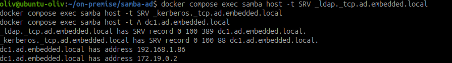
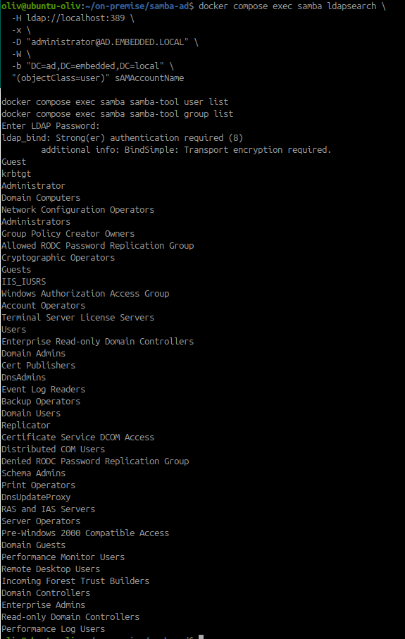
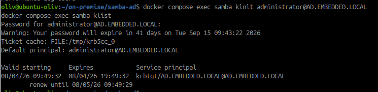
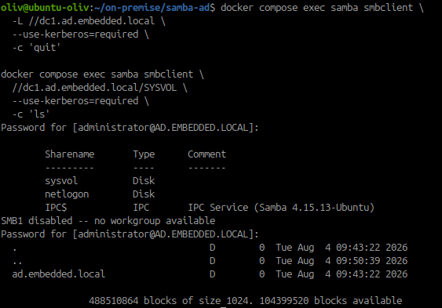

# Déployer un contrôleur de domaine Samba avec Docker Compose

!!! warning "Configuration remplacée"
    Cette fiche documente la première tentative en contrôleur Samba AD avec
    `nowsci/samba-domain`. Pour l'objectif actuel, le projet a été basculé vers
    Samba autonome avec backend `ldapsam` et OpenLDAP. La configuration active
    est documentée dans [Intégrer Samba à OpenLDAP](integrer-samba-openldap.md).

## Objectif

Déployer un contrôleur de domaine Samba Active Directory dans l'infrastructure
de laboratoire, conserver ses données dans des volumes persistants et vérifier
le fonctionnement du domaine, du DNS, de Kerberos et de LDAP.

## Spécifications

- Travail individuel.
- Utiliser Docker Compose.
- Conserver les données Samba dans des volumes persistants.
- Ne pas versionner le mot de passe administrateur.
- Réserver cette configuration à l'environnement de travaux pratiques.

!!! warning "Samba AD et OpenLDAP"
    Samba AD DC possède sa propre base Active Directory. Il ne faut pas monter
    directement les volumes OpenLDAP dans Samba ni présenter OpenLDAP comme le
    backend du domaine AD. Une migration ou une synchronisation des identités
    devra être étudiée séparément.

## 1. Choisir les paramètres du domaine

Pour le laboratoire, retenir les valeurs suivantes :

| Paramètre | Valeur |
| --- | --- |
| Nom DNS du domaine | `ad.embedded.local` |
| Realm Kerberos | `AD.EMBEDDED.LOCAL` |
| Nom court NetBIOS | `EMBEDDED` |
| Nom du contrôleur | `dc1` |
| Adresse annoncée | adresse IP du laptop ou de la VM |
| DNS | DNS interne Samba |
| Transfert DNS | DNS amont du réseau de formation |

Pour une infrastructure de production, utiliser un sous-domaine réel maîtrisé
par l'entreprise plutôt que `.local`.

## 2. Préparer le répertoire

~~~bash
mkdir -p ~/on-premise/samba-ad
cd ~/on-premise/samba-ad
touch compose.yaml .env .env.example .gitignore
printf '%s\n' '.env' > .gitignore
~~~

Créer `.env.example` sans mot de passe réel :

~~~dotenv
DOMAIN=AD.EMBEDDED.LOCAL
DOMAIN_DC=dc=ad,dc=embedded,dc=local
DOMAINPASS=<mot-de-passe-administrateur-temporaire>
HOSTIP=<adresse-ip-du-laptop>
DNSFORWARDER=1.1.1.1
~~~

Créer ensuite `.env` local à partir du modèle et remplacer `HOSTIP` par
l'adresse réellement utilisée par les clients. Le mot de passe est réservé au
TP et ne doit pas être ajouté à Git.

## 3. Créer le fichier Compose

Créer `compose.yaml` :

~~~yaml
services:
  samba:
    image: nowsci/samba-domain:20260801025201
    container_name: samba-ad-dc
    hostname: dc1
    privileged: true
    restart: unless-stopped
    environment:
      DOMAIN: ${DOMAIN}
      DOMAIN_DC: ${DOMAIN_DC}
      DOMAINPASS: ${DOMAINPASS}
      HOSTIP: ${HOSTIP}
      DNSFORWARDER: ${DNSFORWARDER}
      JOIN: "false"
    dns:
      - ${HOSTIP}
      - ${DNSFORWARDER}
    dns_search:
      - ad.embedded.local
    volumes:
      - samba_data:/var/lib/samba
      - samba_config:/etc/samba/external
      - /etc/localtime:/etc/localtime:ro
    ports:
      - "${HOSTIP}:53:53/tcp"
      - "${HOSTIP}:53:53/udp"
      - "${HOSTIP}:88:88/tcp"
      - "${HOSTIP}:88:88/udp"
      - "${HOSTIP}:135:135/tcp"
      - "${HOSTIP}:137-138:137-138/udp"
      - "${HOSTIP}:139:139/tcp"
      - "${HOSTIP}:389:389/tcp"
      - "${HOSTIP}:389:389/udp"
      - "${HOSTIP}:445:445/tcp"
      - "${HOSTIP}:464:464/tcp"
      - "${HOSTIP}:464:464/udp"
      - "${HOSTIP}:636:636/tcp"
      - "${HOSTIP}:3268:3268/tcp"
      - "${HOSTIP}:3269:3269/tcp"

volumes:
  samba_data:
  samba_config:
~~~

Le mode `privileged` est utilisé ici pour l'initialisation de laboratoire,
car le provisionnement AD doit créer des fichiers et appliquer des permissions.
Il doit être réévalué et réduit dans un environnement de production.

## 4. Vérifier la configuration

~~~bash
docker compose config
docker compose config --volumes
~~~

Vérifier notamment :

- `DOMAIN` et `HOSTIP` sont correctement remplacés ;
- `DOMAIN_DC` vaut `dc=ad,dc=embedded,dc=local` ;
- aucun mot de passe n'est copié dans une capture ;
- les volumes `samba_data` et `samba_config` sont déclarés ;
- les ports DNS, Kerberos, LDAP et SMB sont publiés.

## 5. Démarrer le contrôleur

!!! warning "Conflit avec OpenLDAP"
    Un contrôleur Samba AD ne peut pas partager les mêmes ports hôte que le
    conteneur OpenLDAP : LDAP utilise `389` et le DNS AD utilise `53`. Si
    OpenLDAP est encore démarré avec `389:3890`, Samba ne pourra pas publier
    son LDAP sur `389`. Pour un vrai test AD, utiliser une adresse IP dédiée,
    une VM dédiée ou arrêter OpenLDAP pendant le test. Remapper uniquement le
    port ne suffit pas pour un client Windows qui attend les ports AD
    standards.

~~~bash
docker compose up -d
docker compose ps
docker compose logs -f samba
~~~

Ne lance les commandes `docker compose exec` qu'après avoir vérifié que l'état
du service est `Up`.

En cas d'arrêt immédiat, conserver d'abord le diagnostic :

~~~bash
docker compose ps -a
docker compose logs --tail=200 samba
docker inspect samba-ad-dc --format '{{.State.Status}} - exit={{.State.ExitCode}}'
sudo ss -lntup | grep -E ':(53|88|135|139|389|445|464|636|3268|3269)\\b'
~~~

Une erreur `address already in use` confirme un conflit de ports. Une erreur
liée à `HOSTIP` indique que l'adresse annoncée n'est pas celle de l'interface
utilisée par les clients.

`DOMAIN_DC` est nécessaire à certains scripts de l'image pour construire les
DN du domaine. Sans cette variable, des DN incomplets se terminant par une
virgule peuvent apparaître dans les journaux. Les ports sont liés à
`HOSTIP` afin d'éviter les conflits avec les services qui écoutent déjà sur
les adresses de boucle locale ou sur les réseaux de virtualisation.

Le premier démarrage provisionne le domaine. Attendre la fin de cette étape
avant de lancer les contrôles. Arrêter l'affichage des logs avec `Ctrl+C`.

Vérifier le processus et la configuration :

~~~bash
docker compose exec samba ps -ef
docker compose exec samba testparm -s
docker compose exec samba samba-tool domain level show
~~~

## 6. Vérifier le DNS

Le client doit utiliser l'adresse IP du contrôleur Samba comme DNS du domaine.
Depuis le conteneur ou une machine cliente :

~~~bash
docker compose exec samba host -t SRV _ldap._tcp.ad.embedded.local
docker compose exec samba host -t SRV _kerberos._tcp.ad.embedded.local
docker compose exec samba host -t A dc1.ad.embedded.local
~~~

Les enregistrements SRV permettent aux clients de trouver LDAP et Kerberos.
Un client configuré avec un DNS externe qui ne connaît pas la zone AD ne pourra
pas localiser correctement le contrôleur.

Cette capture montre la résolution des enregistrements LDAP et Kerberos ainsi
que les adresses publiées pour `dc1.ad.embedded.local`.

## 7. Vérifier LDAP et les comptes AD

Le contrôleur Samba expose une interface LDAP pour les objets de l'annuaire AD.
Cela ne signifie pas que la base OpenLDAP de l'itération précédente est
réutilisée.

~~~bash
docker compose exec samba ldapsearch \
  -H ldap://localhost:389 \
  -x \
  -D "administrator@AD.EMBEDDED.LOCAL" \
  -W \
  -b "DC=ad,DC=embedded,DC=local" \
  "(objectClass=user)" sAMAccountName

docker compose exec samba samba-tool user list
docker compose exec samba samba-tool group list
~~~

Ne pas importer automatiquement les utilisateurs OpenLDAP à ce stade. La
correspondance des UIDs, groupes, mots de passe et attributs devra être définie
dans une activité de migration.

La commande `samba-tool group list` confirme la présence des groupes intégrés
du domaine. La tentative `ldapsearch` visible dans la capture est refusée par
la politique de chiffrement LDAP de Samba ; elle ne remet pas en cause la
vérification réalisée avec `samba-tool`.

## 8. Vérifier Kerberos

Depuis le conteneur :

~~~bash
docker compose exec samba kinit administrator@AD.EMBEDDED.LOCAL
docker compose exec samba klist
~~~

Le ticket Kerberos doit apparaître avec le principal du domaine. Kerberos
requiert une heure cohérente entre le client et le contrôleur. En cas d'échec,
contrôler en priorité le DNS, le realm, l'heure et le nom du contrôleur.

## 9. Vérifier SMB

Les partages système `SYSVOL` et `NETLOGON` sont créés par le provisionnement
du domaine. Vérifier leur visibilité :

~~~bash
docker compose exec samba smbclient -L //dc1.ad.embedded.local --use-kerberos=required -c 'quit'
docker compose exec samba smbclient //dc1.ad.embedded.local/SYSVOL --use-kerberos=required -c 'ls'
~~~

Ne pas utiliser `localhost` avec Kerberos : le nom demandé doit correspondre au
nom DNS et au principal de service du contrôleur. L'option courte `-k` reste
acceptée par l'image, mais `--use-kerberos=required` évite l'avertissement de
dépréciation de `smbclient`.

La capture confirme la visibilité de `sysvol`, `netlogon` et `IPC$`, puis la
lecture du contenu de `SYSVOL` avec Kerberos.

Les futurs espaces de fichiers devront être ajoutés après définition des
groupes, des ACL de partage et des permissions du système de fichiers.

## 10. Vérifier la persistance

~~~bash
docker compose restart samba
docker compose ps
docker compose exec samba samba-tool domain level show
docker compose exec samba samba-tool user list
docker volume ls
~~~

Pour vérifier la persistance du domaine, arrêter puis recréer le conteneur
sans supprimer les volumes :

~~~bash
docker compose down
docker compose up -d
docker compose exec samba samba-tool user list
~~~

!!! danger "Ne pas supprimer les volumes"
    `docker compose down -v` supprimerait les bases Samba et le domaine de
    laboratoire. Ne l'utiliser que si une réinitialisation complète a été
    décidée et qu'aucune donnée n'est à conserver.

## 11. Paramètres à documenter

Conserver dans la documentation :

- l'image et son tag ;
- le nom DNS du domaine ;
- le realm Kerberos ;
- le nom NetBIOS ;
- le nom et l'adresse du contrôleur ;
- le DNS interne et le DNS forwarder ;
- les volumes persistants ;
- les ports publiés ;
- le résultat des tests DNS, LDAP, Kerberos et SMB ;
- le lieu protégé où est conservé le mot de passe administrateur.

## Livrables

- `compose.yaml` ;
- `.env.example` sans secret ;
- configuration Samba générée et documentée ;
- paramètres du domaine, du realm et du DNS ;
- preuves de démarrage et de persistance ;
- résultats des vérifications DNS, LDAP, Kerberos et SMB.

## Ressources

- [Documentation Samba : contrôleur de domaine Active Directory](https://wiki.samba.org/index.php/Setting_up_Samba_as_an_Active_Directory_Domain_Controller)
- [Ports utilisés par Samba AD DC](https://wiki.samba.org/index.php/Samba_AD_DC_Port_Usage)
- [Image Docker nowsci/samba-domain](https://hub.docker.com/r/nowsci/samba-domain/)
- [Guide fourni sur l'intégration OpenLDAP/Samba](https://oneuptime.com/blog/post/2026-03-02-how-to-integrate-openldap-with-samba-on-ubuntu/view)

## Notions acquises

- Contrôleur de domaine Samba AD ;
- domaine DNS et realm Kerberos ;
- provisionnement AD ;
- persistance Docker ;
- vérification DNS, LDAP, Kerberos et SMB.
