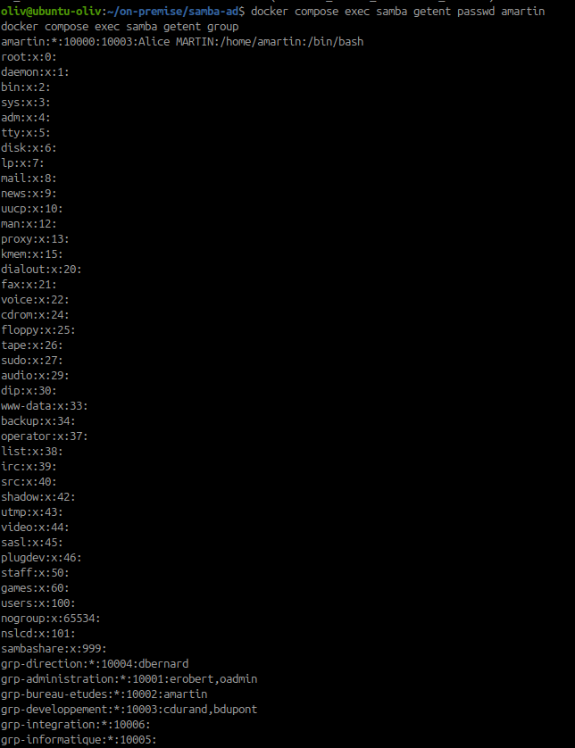
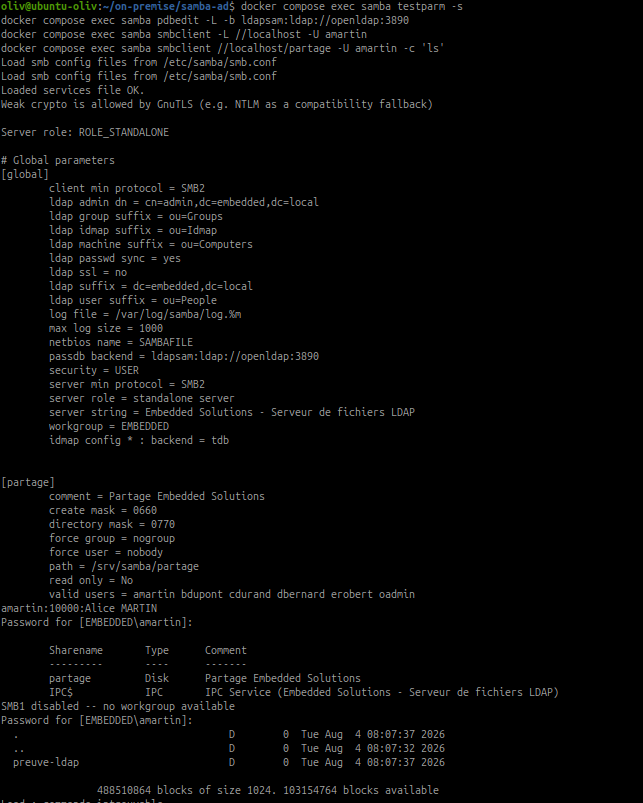

# Intégrer Samba à OpenLDAP

## Objectif

Comprendre comment un serveur Samba classique peut utiliser OpenLDAP pour
centraliser les comptes et les groupes, puis distinguer ce fonctionnement du
contrôleur de domaine Samba Active Directory déployé dans cette itération.

## Point d'architecture important

Deux modes Samba existent :

| Mode | Stockage des identités | Usage |
|---|---|---|
| Samba classique avec `ldapsam` | OpenLDAP, avec les attributs Samba | Serveur de fichiers autonome ou membre |
| Samba AD DC | Base AD interne de Samba | Domaine Windows, Kerberos, DNS et GPO |

Le conteneur `nowsci/samba-domain` utilisé précédemment fonctionne en mode
contrôleur de domaine AD. Il possède donc sa propre base AD. Il ne faut pas
modifier son `smb.conf` pour lui appliquer `passdb backend = ldapsam`, ni lui
monter directement les volumes OpenLDAP. Cette opération changerait de mode et
pourrait rendre le contrôleur AD inutilisable.

La ressource fournie décrit bien une intégration `ldapsam` pour un serveur
Samba classique, et précise qu'il ne s'agit pas du mode contrôleur de domaine
Active Directory.

## 1. Identifier l'architecture actuelle

Depuis le répertoire du projet Samba :

~~~bash
cd ~/on-premise/samba-ad
docker compose ps
docker compose exec samba samba-tool domain info 127.0.0.1
docker compose exec samba samba-tool user list
docker compose exec samba samba-tool group list
~~~

Les utilisateurs et groupes affichés par `samba-tool` proviennent de l'annuaire
AD du contrôleur Samba. Ils ne sont pas lus dans la base OpenLDAP créée pendant
l'itération précédente.

## 2. Vérifier séparément OpenLDAP

OpenLDAP reste un service indépendant :

~~~bash
cd ~/on-premise/openldap
docker compose ps
docker compose exec openldap ldapsearch \
  -x \
  -H ldap://localhost:3890 \
  -D "cn=admin,dc=embedded,dc=local" \
  -W \
  -b "dc=embedded,dc=local" \
  "(objectClass=*)" dn
~~~

Sur la même adresse IP, OpenLDAP et Samba AD ne peuvent pas publier
simultanément le port LDAP standard `389`. Pour les tester séparément, arrêter
un service avant de démarrer l'autre, sans supprimer ses volumes :

~~~bash
docker compose stop
~~~

Ne pas utiliser `docker compose down -v` : cette commande supprimerait les
données persistantes du service.

## 3. Configuration théorique `ldapsam`

Cette configuration est un exemple pour un serveur Samba classique séparé.
Elle ne doit pas être appliquée au conteneur `samba-ad-dc` de l'activité
précédente.

~~~ini
[global]
   workgroup = EMBEDDED
   server string = Serveur de fichiers Embedded Solutions
   server role = standalone server
   security = user
   passdb backend = ldapsam:ldap://ldap.embedded.local

   ldap admin dn = cn=admin,dc=embedded,dc=local
   ldap suffix = dc=embedded,dc=local
   ldap user suffix = ou=People
   ldap group suffix = ou=Groups
   ldap machine suffix = ou=Computers
   ldap idmap suffix = ou=Idmap
   ldap ssl = start tls
   ldap passwd sync = yes

[partage]
   path = /srv/samba/partage
   read only = no
   valid users = @grp-developpement
   create mask = 0660
   directory mask = 0770
~~~

Pour ce scénario, OpenLDAP doit posséder le schéma Samba et les entrées doivent
contenir les attributs adaptés, notamment `sambaSamAccount` en complément des
attributs POSIX. Le mot de passe du compte LDAP utilisé par Samba doit être
stocké dans le trousseau Samba avec une commande telle que `smbpasswd -w`, sans
écrire le secret dans un fichier public.

## 4. Vérifications d'une intégration classique

Sur un serveur Samba classique configuré avec `ldapsam` :

~~~bash
testparm
pdbedit -L
smbclient -L //localhost -U utilisateur
~~~

`pdbedit -L` doit afficher les comptes fournis par le backend LDAP. Le test
`smbclient` vérifie ensuite que le compte LDAP peut s'authentifier sur un
partage SMB.

## 5. Déploiement réalisé dans notre laboratoire

Le choix 1 a été appliqué : le contrôleur AD initial a été conservé sous
`compose.ad.yaml` comme archive de la première tentative, et `compose.yaml`
déploie maintenant un serveur Samba autonome avec le backend `ldapsam`.

Les fichiers principaux sont :

- `Dockerfile` : image Debian avec Samba, `smbclient`, LDAP et NSS LDAP ;
- `entrypoint.sh` : copie des configurations persistantes, initialisation du
  secret LDAP et démarrage du service NSS ;
- `config/smb.conf`, `config/nslcd.conf.template` et `config/nsswitch.conf` :
  modèles versionnés intégrés à l'image ;
- `schema/samba.ldif` : schéma `sambaSamAccount` chargé dans OpenLDAP ;
- volume `samba_config` : configurations persistantes initialisées au premier
  démarrage ;
- volumes `samba_state` et `samba_share` : état Samba et données partagées.

### Correction après revue de la formatrice

La première version construisait `nslcd.conf` avec plusieurs appels à `printf`
et modifiait `nsswitch.conf` avec `sed` dans l'entrypoint. Cette méthode rendait
les erreurs de syntaxe difficiles à repérer et recréait la configuration à
chaque démarrage.

La configuration corrigée suit ce cycle :

1. les modèles complets sont versionnés dans `samba-ad/config/` ;
2. le `Dockerfile` les intègre dans `/usr/local/share/samba-config/` ;
3. au premier démarrage, l'entrypoint les initialise dans le volume
   `samba_config` ;
4. à chaque démarrage, les fichiers persistants sont copiés vers `/etc` ;
5. `testparm` valide `smb.conf` avant le lancement de Samba.

Seule la variable `${LDAP_ADMIN_PASSWORD}` est substituée à l'exécution dans
`/etc/nslcd.conf`. Le secret ne figure donc ni dans Git, ni dans le modèle, ni
dans le volume persistant.

L'entrypoint exécute également `ldapwhoami` avant le démarrage de Samba. Si le
mot de passe de `samba-ad/.env` ne correspond plus à celui d'OpenLDAP, le
conteneur s'arrête avec un message explicite. Après correction, `smbpasswd -w`
met systématiquement à jour le secret conservé dans `secrets.tdb`.

Le test de migration a justement détecté ce cas : l'ancien volume contenait un
`smb.conf` de contrôleur AD et le mot de passe LDAP local n'était plus à jour.
L'ancien fichier a été conservé sous un nom `smb.conf.pre-ldapsam-<date>`, puis
le modèle autonome a été installé. `testparm` confirme désormais le rôle
`ROLE_STANDALONE`; l'authentification LDAP reste à rejouer après synchronisation
du mot de passe local.

Après une modification volontaire de `config/smb.conf`, la synchronisation est
explicite afin de ne pas écraser silencieusement le volume :

~~~bash
docker compose build samba
docker compose run --rm --entrypoint sh samba -c \
  'install -m 0644 /usr/local/share/samba-config/smb.conf /var/lib/samba-config/smb.conf'
docker compose up -d
docker compose exec samba testparm -s
~~~

Démarrer OpenLDAP puis Samba :

~~~bash
cd ~/on-premise/openldap
docker compose up -d

cd ~/on-premise/samba-ad
docker compose up -d --build
docker compose ps
~~~

Vérifier la résolution d'un utilisateur LDAP par NSS :

~~~bash
docker compose exec samba getent passwd amartin
docker compose exec samba getent group
~~~

Vérifier le backend Samba et l'authentification SMB :

~~~bash
docker compose exec samba testparm -s
docker compose exec samba pdbedit -L -b ldapsam:ldap://openldap:3890
docker compose exec samba smbclient -L //localhost -U amartin
docker compose exec samba smbclient //localhost/partage -U amartin -c 'ls'
~~~

Le compte de test `amartin` est stocké dans OpenLDAP avec les attributs
`posixAccount` et `sambaSamAccount`. Le partage `partage` est accessible après
authentification LDAP. Un mot de passe de laboratoire est demandé par les
commandes interactives et ne doit pas être écrit dans ce document.

Après redémarrage, la persistance est vérifiée avec :

~~~bash
docker compose restart samba
docker compose exec samba pdbedit -L -b ldapsam:ldap://openldap:3890
docker compose exec samba smbclient //localhost/partage -U amartin -c 'ls'
~~~

Ne pas utiliser `docker compose down -v`, qui supprimerait les données
persistantes de Samba. Le schéma Samba est conservé dans
`~/on-premise/samba-ldap/schema/samba.ldif` et déclaré dans le Compose
OpenLDAP pour permettre une reconstruction à partir d'une installation neuve.

## 6. Preuves réalisées dans notre laboratoire

Dans le déploiement actuellement utilisé, la preuve porte sur le mode Samba
classique avec backend `ldapsam` :

~~~bash
docker compose exec samba getent passwd amartin
docker compose exec samba getent group
docker compose exec samba pdbedit -L -b ldapsam:ldap://openldap:3890
docker compose exec samba smbclient //localhost/partage -U amartin -c 'ls'
~~~

La résolution de `amartin` et des groupes par NSS confirme que le serveur
Samba retrouve les identités dans OpenLDAP. La sortie de `pdbedit` confirme que
le backend `ldapsam` expose le compte à Samba, puis `smbclient` valide
l'authentification et l'accès au partage `partage`.

Le contrôleur AD initial reste uniquement conservé comme archive pédagogique
dans `compose.ad.yaml` ; il n'est pas démarré en même temps que le serveur
Samba LDAP.

## Réponses aux questions

### Quel composant authentifie les utilisateurs ?

Dans le scénario `ldapsam`, Samba reçoit la demande SMB et interroge OpenLDAP
pour vérifier l'identité et les attributs Samba de l'utilisateur. Dans notre
déploiement actuel, c'est donc Samba, avec le backend `ldapsam`, qui réalise
l'authentification SMB ; OpenLDAP conserve les identités et leurs attributs.

### Où les identités sont-elles stockées ?

Avec `ldapsam`, elles sont stockées dans OpenLDAP, avec les attributs POSIX et
Samba nécessaires. Avec Samba AD DC, elles sont stockées dans la base AD de
Samba, persistée dans le volume `/var/lib/samba`.

### Quel est l'intérêt de séparer ces deux fonctions ?

Le service de fichiers Samba gère les protocoles SMB et les sessions réseau,
tandis que l'annuaire conserve les identités et les groupes. Cette séparation
facilite la centralisation, la réutilisation des comptes par plusieurs
services et l'administration des droits. Elle impose toutefois de choisir un
mode compatible et de documenter clairement la source d'autorité.

## Livrables

Conserver :

- les paramètres de l'architecture retenue ;
- la configuration `ldapsam` étudiée, sans secret réel ;
- les commandes de vérification ;
- la distinction entre OpenLDAP et Samba AD ;
- la preuve de résolution NSS et d'accès au partage SMB ;
- les réponses aux questions.

## Ressources

- [How to Integrate OpenLDAP with Samba on Ubuntu](https://oneuptime.com/blog/post/2026-03-02-how-to-integrate-openldap-with-samba-on-ubuntu/view)
- [Documentation Samba](https://www.samba.org/samba/docs/)

## Notions acquises

- `ldapsam`
- `sambaSamAccount`
- Backend d'authentification
- Authentification centralisée
- Différence entre Samba classique et Samba AD DC
