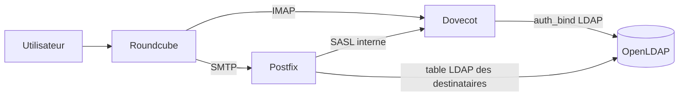

# Authentifier la messagerie avec LDAP

## Objectif

Configurer Postfix, Dovecot et Roundcube afin que les utilisateurs de la
messagerie correspondent aux comptes deja presents dans OpenLDAP.

Cette feuille s'appuie sur le deploiement realise dans
`~/on-premise/messaging-compose`.

## 1. Chemin d'authentification retenu



- OpenLDAP conserve les identites et les mots de passe.
- Dovecot interroge directement LDAP pour authentifier un utilisateur IMAP.
- Postfix delegue l'authentification SMTP a Dovecot avec SASL.
- Postfix consulte aussi LDAP pour verifier qu'un destinataire existe.
- Roundcube ne possede pas de copie locale des comptes : il utilise IMAP pour
  l'ouverture de session et SMTP pour l'envoi.

## 2. Configuration Dovecot

Dans `dovecot/dovecot.conf`, la section `passdb` utilise le pilote LDAP :

```conf
passdb {
  driver = ldap
  args = /etc/dovecot/dovecot-ldap.conf.ext
}
```

Le fichier `dovecot/dovecot-ldap.conf.ext` definit :

```conf
hosts = openldap:3890
base = ou=People,dc=embedded,dc=local
auth_bind = yes
auth_bind_userdn = uid=%n,ou=People,dc=embedded,dc=local
user_filter = (&(objectClass=posixAccount)(uid=%n))
pass_filter = (&(objectClass=posixAccount)(uid=%n))
```

`auth_bind = yes` signifie que Dovecot verifie le mot de passe en tentant un
bind LDAP avec le DN de l'utilisateur. `%n` correspond a l'identifiant saisi
avant le domaine eventuel, par exemple `amartin` dans
`amartin@embedded.local`.

Le `userdb static` fournit le repertoire de boite attendu par Dovecot sans
dupliquer les utilisateurs dans une base locale. L'option
`allow_all_users=yes` permet les recherches LMTP ; Postfix filtre cependant
les destinataires avec sa table LDAP avant la livraison.

## 3. Configuration Postfix

Postfix ne verifie pas lui-meme le mot de passe LDAP. Il delegue cette
operation a Dovecot :

```yaml
POSTFIX_smtpd_sasl_auth_enable: "yes"
POSTFIX_smtpd_sasl_type: dovecot
POSTFIX_smtpd_sasl_path: private/auth
```

Dovecot expose le service SASL dans le volume partage avec Postfix :

```conf
service auth {
  unix_listener /var/spool/postfix/private/auth {
    mode = 0666
  }
}
```

Postfix utilise egalement une table LDAP pour les destinataires locaux. Le
script `messaging-compose/postfix-init.sh` genere cette table au demarrage
sans versionner le mot de passe du compte technique :

```conf
query_filter = (&(objectClass=posixAccount)(uid=%u))
result_attribute = uid
```

La requete suivante a retrouve `amartin` dans LDAP :

```bash
docker compose exec postfix \
  postmap -q amartin@embedded.local ldap:/etc/postfix/ldap-users.cf
```

Resultat observe :

```text
amartin
```

Le compte technique `cn=mail-reader,ou=Services,dc=embedded,dc=local` dispose
uniquement d'un droit de lecture adapte a cette consultation.

## 4. Configuration Roundcube

Roundcube est configure pour utiliser les services internes :

```yaml
ROUNDCUBEMAIL_DEFAULT_HOST: imap://dovecot
ROUNDCUBEMAIL_DEFAULT_PORT: 143
ROUNDCUBEMAIL_SMTP_SERVER: postfix
ROUNDCUBEMAIL_SMTP_PORT: 587
```

Le port 143 est utilise ici pour le test fonctionnel de laboratoire. Le TLS
sera active dans la feuille consacree a la securisation de la messagerie.

Pour tester une session, utiliser un identifiant deja present dans LDAP et
son mot de passe LDAP. Aucun compte utilisateur ne doit etre cree dans
Roundcube.

## 5. Verifications realisees

Depuis `~/on-premise/messaging-compose` :

```bash
docker compose config --quiet
docker compose ps
docker compose exec dovecot doveconf -n
docker compose exec postfix postconf -n
curl -I http://localhost:8082
```

Resultats obtenus :

- `mail-postfix`, `mail-dovecot`, `mail-roundcube` et MariaDB sont demarres ;
- Dovecot expose le socket SASL Unix `private/auth` partage avec Postfix ;
- Postfix utilise `smtpd_sasl_type = dovecot` ;
- Postfix utilise `virtual_mailbox_maps = ldap:/etc/postfix/ldap-users.cf` ;
- Roundcube repond `HTTP/1.1 200 OK` sur `http://localhost:8082` ;
- la table LDAP Postfix retrouve l'utilisateur `amartin`.

Test LDAP du compte technique, realise sans afficher le mot de passe :

```bash
docker exec openldap ldapwhoami -x -H ldap://localhost:3890 \
  -D "cn=mail-reader,ou=Services,dc=embedded,dc=local" -W
```

Le resultat attendu est le DN du compte technique. Le mot de passe d'un
utilisateur doit etre teste avec `doveadm auth test` ou depuis Roundcube,
mais ne doit jamais etre ajoute a Git ni a cette documentation.

## 6. Reponses aux questions

### Quels services interrogent directement LDAP ?

Dovecot interroge directement LDAP pour l'authentification IMAP. Postfix
interroge directement LDAP pour sa table de destinataires, mais delegue la
verification du mot de passe a Dovecot via SASL. Roundcube n'interroge pas
LDAP : il utilise les protocoles IMAP et SMTP.

### Quels avantages presente une authentification centralisee ?

Elle evite la duplication des comptes, applique les changements depuis un
point unique, facilite la desactivation d'un utilisateur et garantit une
identite coherente entre les services.

### Pourquoi les utilisateurs ne doivent-ils pas etre crees separement dans chaque service ?

Des comptes separes provoqueraient des mots de passe et des etats differents.
Un depart pourrait alors laisser une boite encore active. Avec LDAP comme
referentiel central, les services reutilisent le meme compte et les memes
regles de cycle de vie.

## Termes a retenir

- `LDAP` : annuaire central des identites ;
- `Dovecot` : service IMAP et authentification des boites ;
- `Postfix` : service SMTP ;
- `SASL` : mecanisme permettant a Postfix de deleguer l'authentification ;
- `Roundcube` : interface Web utilisant IMAP et SMTP.

## Documents associes

- `~/on-premise/messaging-compose/docker-compose.yml`
- `~/on-premise/messaging-compose/dovecot/dovecot.conf`
- `~/on-premise/messaging-compose/dovecot/dovecot-ldap.conf.ext`
- `~/on-premise/messaging-compose/postfix-init.sh`
- `documentation/validation-mail.md`
- `documentation/securisation-messagerie.md`
