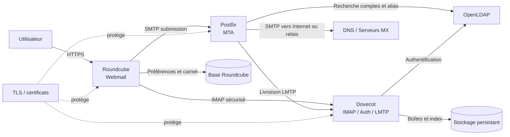

# Concevoir l'architecture de messagerie

## Objectif

Identifier les composants nécessaires au déploiement d'une messagerie interne
et comprendre les échanges entre Postfix, Dovecot, Roundcube et les services
supports.

Cette activité est une activité de conception. Aucun service de messagerie
n'est installé pendant cette étape.

## 1. Composants imposés

| Service | Rôle | État dans l'infrastructure | Prévision |
| --- | --- | --- | --- |
| Postfix | MTA : réception et émission des courriels via SMTP | Non disponible | Installation de cette itération |
| Dovecot | Accès aux boîtes via IMAP, authentification et livraison LMTP | Non disponible | Installation de cette itération |
| Roundcube | Webmail permettant de consulter et envoyer les messages | Non disponible | Installation de cette itération |

## 2. Services complémentaires nécessaires

| Service ou composant | Rôle | Déjà disponible ? | Décision |
| --- | --- | --- | --- |
| OpenLDAP | Source des comptes, groupes et attributs de messagerie | Oui, itération 2 | Réutiliser et compléter avec les attributs mail |
| DNS | Résolution du nom du serveur et des enregistrements MX, A et éventuellement SPF | Pas de DNS d'entreprise dédié vérifié | Installer ou intégrer lors du déploiement messagerie |
| TLS et certificats | Chiffrement des connexions SMTP, IMAP et Web | Non vérifié dans le projet | Préparer lors de l'installation, AC interne ultérieure |
| Stockage persistant | Conservation des boîtes et des index Dovecot | Volumes Docker disponibles | Créer un volume dédié à la messagerie |
| Base de données Roundcube | Conservation de la configuration, des préférences et du carnet d'adresses | MariaDB existe pour WordPress, mais pas de base Roundcube dédiée | Créer une base séparée lors du déploiement |
| Réseau Docker | Communication entre les conteneurs | Oui, réseaux Compose existants | Créer un réseau de messagerie dédié |
| Sauvegarde | Restauration des boîtes, de la base Roundcube et des configurations | Pas de sauvegarde opérationnelle vérifiée | Prévoir dans une itération ultérieure |
| NTP | Horloge cohérente pour les journaux, TLS et l'authentification | Non vérifié | Vérifier avant la mise en production |
| Antispam et antivirus | Filtrage des messages indésirables et pièces jointes malveillantes | Non disponible | Ajouter après le fonctionnement de base |

Les services Postfix, Dovecot et Roundcube constituent le socle imposé. DNS,
TLS, stockage, base de données et sauvegarde sont nécessaires pour obtenir une
infrastructure exploitable. Rspamd et ClamAV sont des compléments de sécurité
à ajouter après la validation du flux nominal.

## 3. Réutilisation d'OpenLDAP

L'annuaire existant devient la source des identités de messagerie. Les fiches
utilisateurs devront recevoir, selon le schéma retenu :

- `mail` : adresse principale ;
- `mailAlias` ou attribut équivalent : alias éventuels ;
- `mailHomeDirectory` : emplacement de la boîte si ce choix est retenu ;
- appartenance aux groupes autorisant l'usage de la messagerie ;
- attributs nécessaires à l'authentification Dovecot.

Le mot de passe ne doit pas être copié dans les fichiers Compose. Postfix et
Dovecot utiliseront une recherche LDAP documentée avec un compte technique aux
droits minimaux.

## 4. Schéma des échanges

## 5. Flux principaux

### Consultation d'un message

1. L'utilisateur ouvre Roundcube en HTTPS.
2. Roundcube transmet l'identification à Dovecot via IMAP.
3. Dovecot vérifie le compte dans OpenLDAP.
4. Dovecot lit la boîte sur le stockage persistant.
5. Roundcube affiche le message dans le navigateur.

### Envoi d'un message

1. L'utilisateur rédige le message dans Roundcube.
2. Roundcube le transmet à Postfix sur le port de soumission authentifié.
3. Postfix vérifie l'autorisation et recherche les informations LDAP utiles.
4. Postfix remet le message localement à Dovecot via LMTP ou l'envoie au
   serveur distant via SMTP.
5. Dovecot stocke une copie dans la boîte de l'expéditeur si nécessaire.

### Réception d'un message

1. Le serveur distant recherche l'enregistrement MX dans DNS.
2. Il transmet le message à Postfix sur SMTP.
3. Postfix identifie le domaine local et le destinataire dans OpenLDAP.
4. Postfix remet le message à Dovecot via LMTP.
5. Dovecot écrit le message dans la boîte persistante.

## 6. Ports à documenter

| Port | Service | Usage prévu |
| ---: | --- | --- |
| 25/TCP | Postfix | SMTP entre serveurs |
| 587/TCP | Postfix | Soumission authentifiée des clients |
| 993/TCP | Dovecot | IMAPS chiffré |
| 143/TCP | Dovecot | IMAP, uniquement avec STARTTLS si exposé |
| 443/TCP | Roundcube | Webmail HTTPS |
| 389/TCP ou 636/TCP | OpenLDAP | Recherche LDAP, idéalement LDAPS ou StartTLS |
| 53/TCP et UDP | DNS | Résolution du domaine et du MX |

Les ports ne seront publiés qu'après validation du modèle de sécurité et des
certificats. Le port 25 ne doit pas être ouvert plus largement que nécessaire.

## 7. Décisions à faire valider

- nom du domaine de messagerie, par exemple `embedded.local` en laboratoire ;
- adresse principale et convention de nommage des boîtes ;
- stockage Maildir ou mbox ;
- base Roundcube dédiée et moteur retenu ;
- autorité de certification et durée des certificats ;
- relais SMTP éventuel ;
- politique de conservation et de sauvegarde ;
- ajout de Rspamd et ClamAV ;
- exposition interne uniquement ou accès distant via VPN.

## Livrables

Conserver :

- le schéma des échanges ;
- le tableau des composants et de leur état ;
- les ports prévus ;
- les décisions à faire valider ;
- les attributs LDAP nécessaires à la messagerie.

## Notions acquises

- MTA et SMTP ;
- IMAP et livraison LMTP ;
- Webmail ;
- rôle de DNS dans la messagerie ;
- authentification LDAP ;
- stockage persistant des boîtes.
