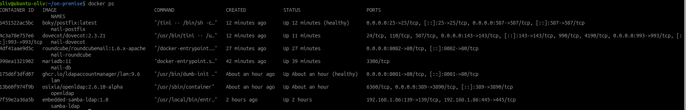
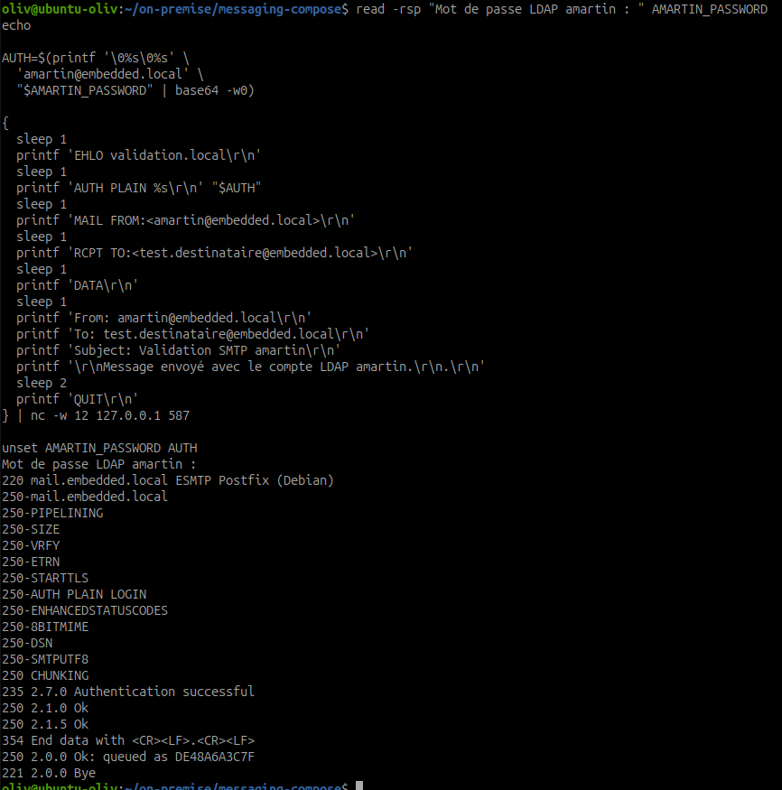
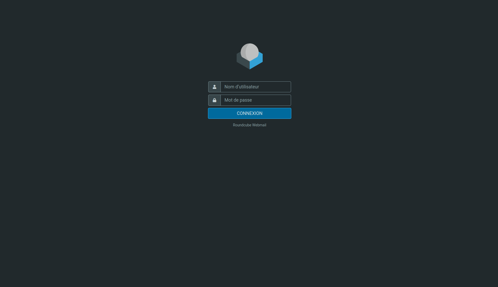
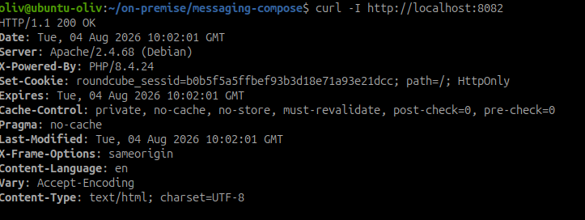
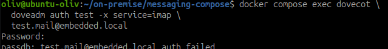
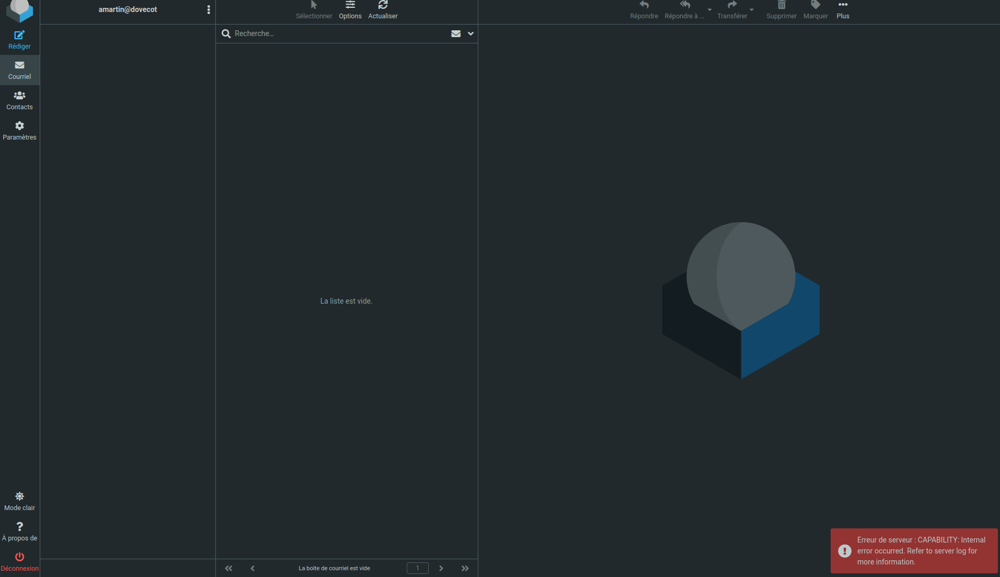
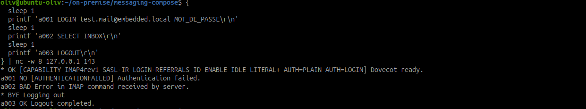
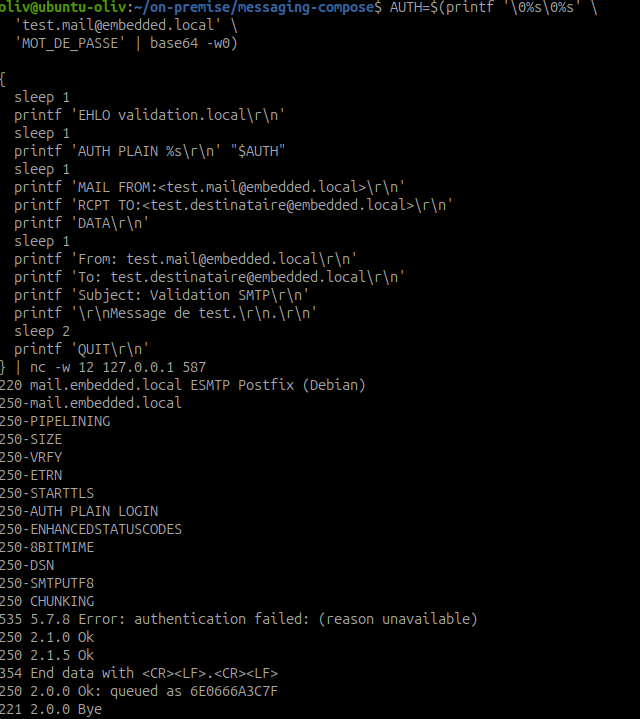

# Rapport de validation et corrections de la messagerie

## Objectif

Présenter les tests réalisés sur l'infrastructure de messagerie, les anomalies
rencontrées et les corrections appliquées jusqu'à l'obtention d'un état
fonctionnel.

Validation réalisée le 4 août 2026 dans
`~/on-premise/messaging-compose`.

## 1. État initial

Les services suivants étaient démarrés :

| Service | Conteneur | État initial |
|---|---|---|
| MariaDB | `mail-db` | Démarré |
| Postfix | `mail-postfix` | Démarré |
| Dovecot | `mail-dovecot` | Démarré |
| Roundcube | `mail-roundcube` | Démarré |

Deux comptes LDAP temporaires ont été utilisés :

- `test.mail@embedded.local` ;
- `test.destinataire@embedded.local`.

Le compte `absent.mail@embedded.local` a servi au test négatif.
Les mots de passe de TP ne sont pas enregistrés dans Git.


*Preuve : les conteneurs de messagerie, OpenLDAP, LAM et Samba sont visibles
dans l'environnement de TP.*

## 2. Tests réalisés

### Test 1 - Authentification LDAP avec Dovecot

Commande utilisée :

```bash
docker compose exec dovecot \
  doveadm auth test -x service=imap \
  test.mail@embedded.local '<mot-de-passe-de-TP>'
```

Résultat :

```text
passdb: test.mail@embedded.local auth succeeded
```

Conclusion : Dovecot vérifie bien le mot de passe dans OpenLDAP.

### Test 2 - Authentification IMAP

Connexion réalisée sur le port 143 avec le compte LDAP de test.

Résultat observé :

```text
OK Logged in
OK [READ-WRITE] Select completed
```

Conclusion : la boîte est accessible après authentification LDAP.

### Test 3 - Authentification SMTP

Postfix a été testé sur le port 587 avec SASL PLAIN.

Résultat observé :

```text
235 2.7.0 Authentication successful
sasl_username=test.mail@embedded.local
```

Conclusion : Postfix délègue correctement l'authentification à Dovecot.

Une seconde validation a été réalisée avec le compte LDAP `amartin` :

```text
235 2.7.0 Authentication successful
250 2.0.0 Ok: queued as DE48A6A3C7F
```


*Preuve : le compte `amartin` est authentifié par SMTP et le message est
accepté par Postfix.*

### Test 4 - Envoi et réception d'un message

Un message a été envoyé de
`test.mail@embedded.local` vers
`test.destinataire@embedded.local`.

Preuve Postfix :

```text
5E0BE6A3C7F: to=<test.destinataire@embedded.local> ... status=sent
```

Le message a été retrouvé dans le Maildir du destinataire et consulté avec
IMAP.

Conclusion : la chaîne SMTP, Postfix, LMTP, Dovecot et IMAP est fonctionnelle.

### Test 5 - Pièce jointe

Le fichier `piece-jointe-validation.txt` a été envoyé puis récupéré.

Empreinte du fichier original et du fichier reçu :

```text
965ec755826dffb000bd0b1139b13824e679cb16bf2fd4528b47bda77833e463
```

Conclusion : la pièce jointe est transmise sans corruption.

### Test 6 - Accès Roundcube

Commande utilisée :

```bash
curl -I http://localhost:8082
```

Résultat :

```text
HTTP/1.1 200 OK
```

L'interface est disponible sur :

```text
http://localhost:8082
```

Conclusion : Roundcube est accessible. Il utilise Dovecot pour IMAP et Postfix
pour SMTP.


*Preuve : l'interface Web Roundcube est disponible.*


*Preuve : le serveur Web répond avec `HTTP/1.1 200 OK`.*

### Test 7 - Utilisateur inexistant

Compte testé : `absent.mail@embedded.local`.

Résultats :

```text
passdb: absent.mail@embedded.local auth failed
535 5.7.8 Error: authentication failed
```

Conclusion : un utilisateur absent de LDAP ne peut pas ouvrir de session ni
envoyer de message.


*Preuve : le test d'authentification Dovecot échoue pour un mot de passe
incorrect ou un compte non valide.*

## 3. Anomalies rencontrées

### Anomalie A - Authentification SASL TCP instable

#### Symptôme

Postfix retournait :

```text
454 4.7.0 Temporary authentication failure:
Connection lost to authentication server
```

#### Cause

La communication SASL entre Postfix et Dovecot par le port TCP interne
`12345` était instable avec l'image Postfix utilisée.

#### Correction

Les deux conteneurs partagent désormais le volume `postfix_spool`. Dovecot
crée le socket :

```text
/var/spool/postfix/private/auth
```

Postfix utilise :

```yaml
POSTFIX_smtpd_sasl_path: private/auth
```

#### Vérification

L'authentification SMTP retourne désormais `235 Authentication successful`.

### Anomalie B - Échec d'initialisation IMAP

#### Symptôme

Après une authentification réussie, Dovecot retournait :

```text
OK Logged in, but initialization failed
```

#### Cause

L'UID utilisé par le conteneur Dovecot était inférieur à la limite par défaut
acceptée par Dovecot.

#### Correction

La configuration contient désormais :

```conf
first_valid_uid = 100
```

Les répertoires Maildir ont également été créés dans le volume persistant.

#### Vérification

La commande IMAP retourne :

```text
OK Logged in
OK [READ-WRITE] Select completed
```

### Anomalie C - Livraison LMTP refusée

#### Symptôme

Postfix recevait le message, mais Dovecot refusait le destinataire :

```text
550 5.1.1 User doesn't exist
```

#### Cause

Le userdb statique ne permettait pas à LMTP de vérifier l'existence d'un
utilisateur lors d'une livraison interne.

#### Correction

Le userdb statique utilise :

```conf
args = uid=dovecot gid=dovecot \
home=/var/mail/vhosts/%d/%n allow_all_users=yes
```

La vérification des destinataires reste assurée par la table LDAP de Postfix,
afin qu'un compte inexistant ne soit pas accepté.

Le transport LMTP utilise maintenant le socket partagé :

```text
private/dovecot-lmtp
```

#### Vérification

Postfix journalise :

```text
status=sent
```

### Anomalie D - TLS non disponible

#### Symptôme

Le test IMAPS sur le port 993 n'a pas pu être validé.

#### Cause

Dovecot contient encore :

```conf
ssl = no
```

Les certificats n'ont pas encore été installés.

#### Décision

Cette anomalie est conservée comme point restant de l'itération de
sécurisation. Les tests fonctionnels ont été réalisés sur IMAP 143 et SMTP
587 en environnement de TP.


*Preuve historique : Roundcube affichait une erreur IMAP avant la correction
de la chaîne Dovecot/IMAP.*

### Anomalie E - Échec SASL contourné par le réseau de confiance

#### Symptôme

Avec le mot de passe volontairement incorrect `MOT_DE_PASSE`, Postfix
retournait bien `535`, mais acceptait encore la commande `MAIL FROM` puis
mettait le message en file.

#### Cause

Le réseau Docker `172.16.0.0/12` figurait dans `mynetworks`. La règle globale
`permit_mynetworks` permettait donc à un client du réseau interne de contourner
l'authentification SMTP.

#### Correction

Le port 587 possède maintenant des restrictions spécifiques dans
`postfix-init.sh` :

```text
submission/inet/smtpd_client_restrictions = permit_sasl_authenticated,reject
submission/inet/smtpd_recipient_restrictions = permit_sasl_authenticated,reject
submission/inet/smtpd_relay_restrictions = permit_sasl_authenticated,reject
```

#### Vérification

- mot de passe incorrect : `535`, puis `554 Client host rejected` ;
- mot de passe correct : `235 Authentication successful`, puis message
  accepté et livré.


*Preuve : une authentification IMAP incorrecte est refusée.*


*Preuve historique : avant le durcissement du port 587, l'authentification
échouait mais le message pouvait encore être mis en file via le réseau de
confiance.*

## 4. État final validé

| Élément | Résultat |
|---|---|
| Comptes utilisateurs LDAP | Fonctionnels |
| Authentification Dovecot | Validée |
| Authentification SMTP Postfix | Validée |
| Connexion IMAP | Validée |
| Livraison LMTP | Validée |
| Réception du message | Validée |
| Pièce jointe | Validée |
| Roundcube | Accessible |
| Refus d'un compte inexistant | Validé |
| TLS IMAPS/SMTP/HTTPS | À réaliser |

## 5. Fichiers concernés

- `messaging-compose/docker-compose.yml` ;
- `messaging-compose/dovecot/dovecot.conf` ;
- `messaging-compose/postfix-init.sh` ;
- `documentation/validation-mail.md` ;
- `documentation/mail-ldap-auth.md`.

## 6. Conclusion

L'infrastructure de messagerie est fonctionnelle pour les flux de laboratoire.
Les comptes sont centralisés dans LDAP et réutilisés par Dovecot, Postfix et
Roundcube.

Le seul point bloquant restant est la sécurisation TLS. Elle doit être traitée
avant toute utilisation hors environnement de travaux pratiques.
