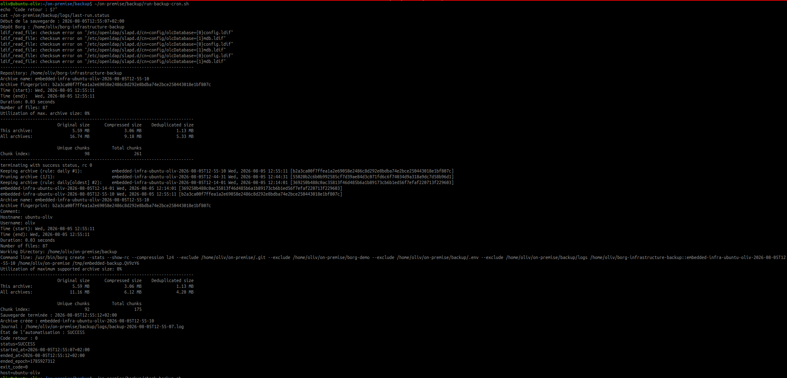
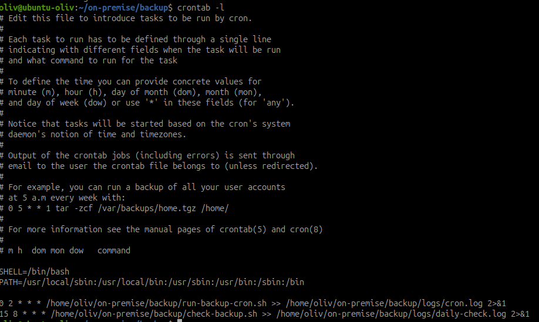

# Automatiser et contrôler les sauvegardes BorgBackup

## Objectif

Exécuter automatiquement la sauvegarde Borg chaque jour, conserver des
journaux exploitables et détecter rapidement une sauvegarde absente ou en
échec.

## 1. Solution retenue

| Élément | Solution retenue |
| --- | --- |
| Exécution | Cron utilisateur, tous les jours à 02 h 00 |
| Sauvegarde | `~/on-premise/backup/backup.sh` |
| Lanceur cron | `~/on-premise/backup/run-backup-cron.sh` |
| Chevauchement | Verrou `flock` |
| Journaux | `~/on-premise/backup/logs/` |
| État synthétique | `logs/last-run.status` |
| Vérification | Contrôle quotidien à 08 h 15 |
| Seuil d'alerte | Dernière sauvegarde âgée de plus de 36 heures |

Le script de sauvegarde déjà réalisé crée les exports applicatifs, sauvegarde
les volumes, applique la rétention 7/4/6, puis exécute `borg check`. La présente
activité automatise son lancement et son suivi sans dupliquer cette logique.

## 2. Fichiers ajoutés

```text
~/on-premise/backup/
├── backup.sh
├── check-backup.sh
├── crontab.example
├── run-backup-cron.sh
└── logs/
    ├── backup-<date>.log
    ├── cron.log
    ├── daily-check.log
    └── last-run.status
```

Le lanceur automatique :

- utilise `flock` pour éviter deux exécutions simultanées ;
- appelle le script `backup.sh` existant ;
- conserve le code retour ;
- écrit un état `SUCCESS`, `FAILURE` ou `SKIPPED`.

## 3. Préparer l'exécution non interactive

```bash
cd ~/on-premise/backup
chmod 700 backup.sh run-backup-cron.sh check-backup.sh
chmod 600 .env
nano .env
```

Le fichier local `.env` doit notamment fournir :

```env
BORG_REPO=/home/oliv/borg-infrastructure-backup
BORG_ARCHIVE_PREFIX=embedded-infra
BORG_PASSPHRASE=<phrase-secrete-borg>
MAX_BACKUP_AGE_SECONDS=129600
```

La phrase secrète ne doit apparaître ni dans Git, ni dans la crontab, ni dans
les captures. Le fichier `.env` reste exclu du dépôt.

## 4. Tester avant de planifier

Lancer une sauvegarde par le même chemin que cron :

```bash
~/on-premise/backup/run-backup-cron.sh
echo "Code retour : $?"
cat ~/on-premise/backup/logs/last-run.status
```

Contrôler ensuite le résultat :

```bash
~/on-premise/backup/check-backup.sh
echo "Code retour du contrôle : $?"
```

Le résultat attendu est `SUCCESS`, un code retour `0`, une archive récente et
le message `CONFORME`.

Résultat obtenu le 5 août 2026 :

| Vérification | Résultat |
| --- | --- |
| Archive créée | `embedded-infra-ubuntu-oliv-2026-08-05T12-55-10` |
| Nombre de fichiers | 87 |
| Taille originale | 5,59 MB |
| Taille compressée | 3,06 MB |
| Taille dédupliquée | 1,13 MB |
| État de l'automatisation | `SUCCESS` |
| Code retour | `0` |
| Journal | `backup-2026-08-05T12-55-07.log` |

La sauvegarde est terminée, la rétention est appliquée et le fichier
`last-run.status` contient l'heure de début, l'heure de fin, le code retour et
le nom de l'hôte.



## 5. Installer la planification

Sauvegarder d'abord l'éventuelle crontab existante :

```bash
crontab -l > /tmp/crontab.before 2>/dev/null || true
crontab -e
```

Ajouter :

```cron
SHELL=/bin/bash
PATH=/usr/local/sbin:/usr/local/bin:/usr/sbin:/usr/bin:/sbin:/bin

0 2 * * * /home/oliv/on-premise/backup/run-backup-cron.sh >> /home/oliv/on-premise/backup/logs/cron.log 2>&1
15 8 * * * /home/oliv/on-premise/backup/check-backup.sh >> /home/oliv/on-premise/backup/logs/daily-check.log 2>&1
```

Vérifier l'installation :

```bash
crontab -l
```

La crontab n'est pas installée automatiquement par la documentation : elle doit
être validée par l'administrateur sur la machine qui héberge les services. Dans
le laboratoire, les deux tâches ont été installées et vérifiées : sauvegarde à
02 h 00, puis contrôle à 08 h 15.



## 6. Contrôle quotidien de l'administrateur

Chaque matin :

```bash
cat ~/on-premise/backup/logs/last-run.status
tail -n 30 ~/on-premise/backup/logs/daily-check.log
borg list --last 1 /home/oliv/borg-infrastructure-backup
```

L'administrateur vérifie :

- `status=SUCCESS` et `exit_code=0` ;
- une date de fin correspondant à la dernière nuit ;
- la présence d'une archive récente ;
- la ligne `Sauvegarde terminée` dans le journal détaillé ;
- l'absence d'erreur Borg, Docker, LDAP ou MariaDB.

Le contrôle exécuté après la mise en place retourne :

```text
État : SUCCESS
Dernière archive : embedded-infra-ubuntu-oliv-2026-08-05T12-55-10
CONFORME : la dernière sauvegarde est récente et terminée avec succès.
```

Les avertissements de checksum OpenLDAP déjà identifiés restent visibles dans
le journal détaillé, mais ils n'ont pas empêché la création ni le contrôle de
l'archive. Leur correction demeure nécessaire avant une mise en production.

Le 6 août, la machine a démarré à 08 h 48 : les tâches prévues à 02 h 00 et
08 h 15 n'ont donc pas été exécutées. Cron ne rejoue pas les tâches manquées.
Le mécanisme et son lancement manuel sont validés, mais une exécution nocturne
sans intervention doit encore être observée sur un hôte laissé actif. Sur un
portable fréquemment arrêté, un timer systemd avec `Persistent=true` ou Anacron
serait plus adapté.

En cas d'échec, il consulte :

```bash
tail -n 100 ~/on-premise/backup/logs/cron.log
tail -n 100 "$(find ~/on-premise/backup/logs -name 'backup-*.log' \
  -printf '%T@ %p\n' | sort -nr | head -n 1 | cut -d' ' -f2-)"
```

Après correction, il relance `run-backup-cron.sh`, contrôle son code retour et
réalise une restauration de test selon le calendrier défini dans la stratégie.

## 7. Gestion des erreurs

| Situation | Comportement attendu |
| --- | --- |
| Une commande de sauvegarde échoue | `backup.sh` s'arrête, nettoie le répertoire temporaire et réactive les conteneurs mis en pause. |
| Une sauvegarde est déjà active | Le verrou refuse la seconde exécution et inscrit `SKIPPED`. |
| La dernière exécution a échoué | Le contrôle affiche `FAILURE` et retourne un code non nul. |
| La sauvegarde a plus de 36 heures | Le contrôle retourne une erreur même si le dernier état était `SUCCESS`. |
| Archive ou journal absent | Le contrôle est déclaré non conforme. |

## Livrables

- `backup/run-backup-cron.sh` ;
- `backup/check-backup.sh` ;
- `backup/crontab.example` ;
- `documentation/backup-automation.md` ;
- journaux créés dans `backup/logs/` après exécution ;
- procédure de contrôle quotidien documentée.
