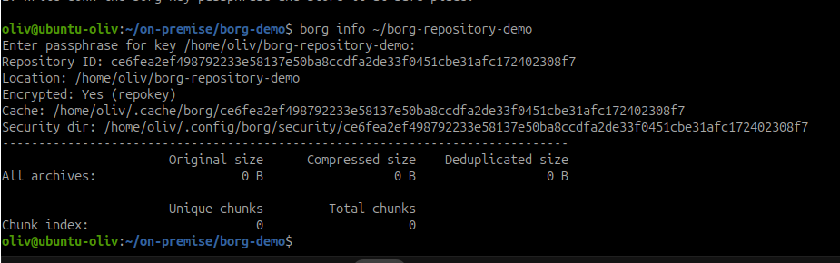
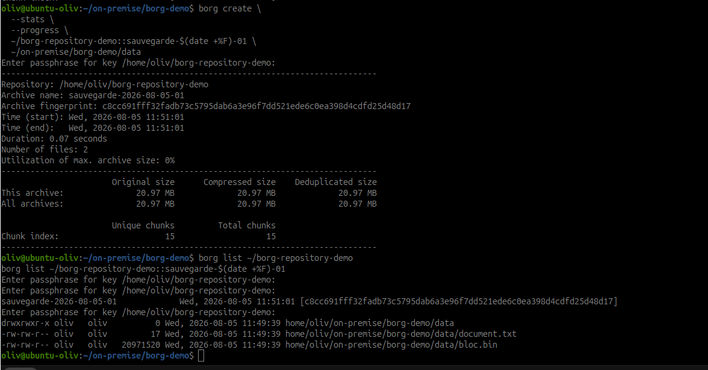
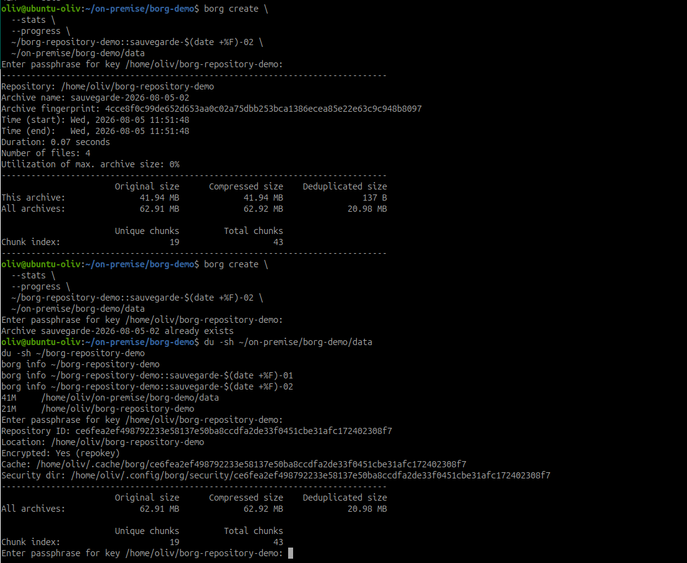

# Découvrir BorgBackup

## Objectif

Prendre en main BorgBackup, créer deux archives et observer la déduplication
sans sauvegarder immédiatement les données réelles de l'infrastructure.

Cette feuille est un guide : les commandes n'ont pas encore été exécutées.

## 1. Vérifier BorgBackup

```bash
borg --version
```

Si la commande n'existe pas sur Ubuntu :

```bash
sudo apt update
sudo apt install borgbackup
borg --version
```

Noter la version obtenue dans le compte rendu.

## 2. Préparer les données de démonstration

Le dépôt Borg est placé hors du dépôt Git `~/on-premise` afin de ne pas
versionner les archives.

```bash
mkdir -p ~/on-premise/borg-demo/data
cd ~/on-premise/borg-demo

printf 'Document initial\n' > data/document.txt
dd if=/dev/urandom of=data/bloc.bin bs=1M count=20 status=progress
du -sh data
```

Conserver la taille apparente affichée par `du`.

## 3. Initialiser le dépôt Borg

```bash
mkdir -p ~/borg-repository-demo
borg init --encryption=repokey ~/borg-repository-demo
```

Borg demande une phrase secrète. Elle ne doit pas être écrite dans Git ni
dans une capture visible. Sans la clé et cette phrase secrète, le dépôt
chiffré ne pourra pas être restauré.

Vérifier le dépôt :

```bash
borg info ~/borg-repository-demo
```


*Preuve : le dépôt utilise le mode `repokey` et ne contient encore aucune
archive.*

## 4. Créer la première archive

```bash
borg create \
  --stats \
  --progress \
  ~/borg-repository-demo::sauvegarde-$(date +%F)-01 \
  ~/on-premise/borg-demo/data
```

Dans les statistiques, relever :

- `Original size` : taille apparente des données ;
- `Compressed size` : taille après compression ;
- `Deduplicated size` : nouvelles données réellement ajoutées au dépôt.

Lister les archives et leur contenu :

```bash
borg list ~/borg-repository-demo
borg list ~/borg-repository-demo::sauvegarde-$(date +%F)-01
```


*Preuve : la première archive contient deux fichiers pour une taille originale
et dédupliquée de 20,97 MB.*

## 5. Modifier les données

Ajouter une petite modification et une copie d'un fichier déjà sauvegardé :

```bash
printf 'Deuxième version\n' >> data/document.txt
cp data/bloc.bin data/bloc-copie.bin
printf 'Nouveau fichier\n' > data/nouveau.txt
du -sh data
```

La taille apparente augmente fortement à cause de `bloc-copie.bin`, mais son
contenu est identique à `bloc.bin`. Borg devrait donc réutiliser les blocs
déjà présents dans le dépôt.

## 6. Créer la seconde archive

```bash
borg create \
  --stats \
  --progress \
  ~/borg-repository-demo::sauvegarde-$(date +%F)-02 \
  ~/on-premise/borg-demo/data
```

La valeur `Deduplicated size` de cette archive doit rester nettement plus
faible que sa taille apparente, car Borg ne stocke réellement que les blocs
nouveaux.


*Preuve : la seconde archive représente 41,94 MB mais ajoute seulement 137 B
de données uniques au dépôt.*

La capture montre également qu'un nom d'archive déjà présent ne peut pas être
réutilisé. Chaque nouvelle sauvegarde doit donc recevoir un nom unique.

Comparer les archives :

```bash
borg list ~/borg-repository-demo
borg diff \
  ~/borg-repository-demo::sauvegarde-$(date +%F)-01 \
  sauvegarde-$(date +%F)-02
```

## 7. Comparer les tailles

```bash
du -sh ~/on-premise/borg-demo/data
du -sh ~/borg-repository-demo
borg info ~/borg-repository-demo
borg info ~/borg-repository-demo::sauvegarde-$(date +%F)-01
borg info ~/borg-repository-demo::sauvegarde-$(date +%F)-02
```

Compléter le tableau avec les valeurs réellement affichées :

| Archive | Taille originale | Taille compressée | Taille dédupliquée |
| --- | ---: | ---: | ---: |
| `sauvegarde-2026-08-05-01` | 20,97 MB | 20,97 MB | 20,97 MB |
| `sauvegarde-2026-08-05-02` | 41,94 MB | 41,94 MB | 137 B |

Ajouter également :

| Mesure | Valeur |
| --- | ---: |
| Taille apparente du dossier `data` | 41 MB |
| Espace occupé par le dépôt Borg | 21 MB |

Ces valeurs ne sont pas strictement identiques aux statistiques d'une archive :
le dépôt contient les blocs partagés, les métadonnées, le manifeste et les
deux archives.

## 8. Vérifier l'intégrité

Vérification standard du dépôt et des archives :

```bash
borg check --progress ~/borg-repository-demo
```

Vérification approfondie des données :

```bash
borg check --verify-data --progress ~/borg-repository-demo
```

La seconde commande relit les données et peut être plus longue. Un code retour
égal à `0` indique que Borg n'a détecté aucune erreur.

```bash
echo $?
```

## 9. Observations attendues

- le dépôt contient deux archives indépendantes du point de vue de la
  restauration ;
- les blocs identiques ne sont stockés qu'une fois ;
- la copie de `bloc.bin` augmente la taille apparente, mais très peu la taille
  dédupliquée ;
- la compression et la déduplication sont deux mécanismes distincts ;
- `borg check` vérifie la cohérence du dépôt et `--verify-data` contrôle aussi
  les blocs de données.

## 10. Éléments à conserver

- le dépôt `~/borg-repository-demo` ;
- les deux archives ;
- la version de Borg utilisée ;
- les sorties `--stats`, `borg info` et `borg check` ;
- le tableau de comparaison complété ;
- une courte conclusion sur la déduplication observée.

Ne pas exécuter `borg delete`, `borg prune` ou supprimer le dépôt avant la
validation du formateur.

## Ressources

- [Documentation BorgBackup](https://borgbackup.readthedocs.io/en/stable/)
- [Guide officiel Quickstart](https://borgbackup.readthedocs.io/en/stable/quickstart.html)
