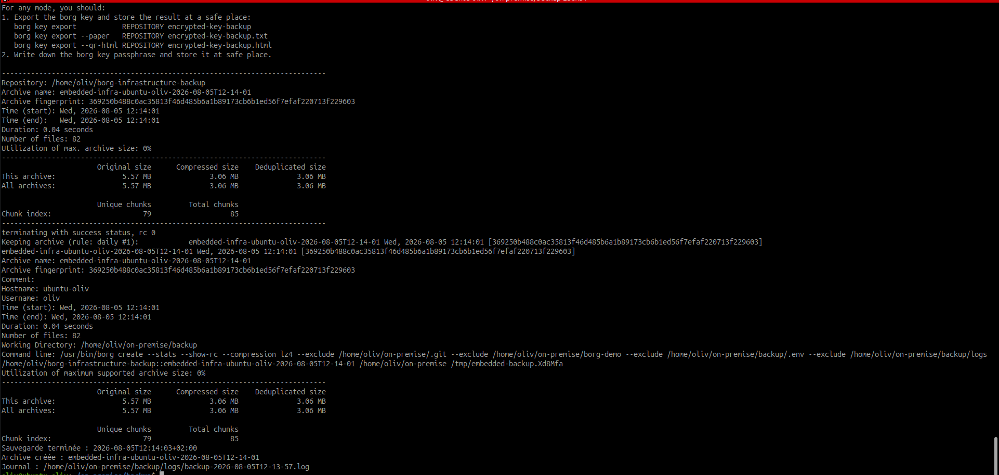

# Mettre en œuvre la sauvegarde avec BorgBackup

## Objectif

Mettre en œuvre la stratégie définie précédemment avec un script BorgBackup
réutilisable pour les services de l'infrastructure.

## 1. Configuration retenue

| Élément | Configuration |
|---|---|
| Dépôt Borg | `/home/oliv/borg-infrastructure-backup` |
| Chiffrement | `repokey` |
| Compression | `lz4` |
| Rétention | 7 quotidiennes, 4 hebdomadaires, 6 mensuelles |
| Script | `~/on-premise/backup/backup.sh` |
| Paramètres locaux | `~/on-premise/backup/.env` |
| Journaux | `~/on-premise/backup/logs/` |

Le dépôt de production est distinct du dépôt `~/borg-repository-demo` utilisé
pendant la découverte de BorgBackup.

## 2. Fichiers préparés

```text
~/on-premise/backup/
├── .env.example
├── .gitignore
├── README.md
└── backup.sh
```

Le fichier `.env` et les journaux sont exclus de Git.

## 3. Données sauvegardées

Le script prépare :

- un export LDIF des données et de la configuration OpenLDAP ;
- un export cohérent de la base MariaDB Roundcube ;
- une archive des volumes OpenLDAP ;
- une archive des volumes Samba `samba_share` et `samba_state` ;
- une archive du volume `dovecot_mail` ;
- une archive de la configuration Roundcube ;
- une archive du volume MariaDB WordPress s'il existe ;
- les configurations, scripts et documents de `~/on-premise`.

OpenLDAP, Samba et Dovecot sont brièvement mis en pause pendant la copie de
leurs volumes. Le script prévoit leur reprise automatique s'il est interrompu.

## 4. Exclusions

Sont exclus :

- la file Postfix, pour éviter de réinjecter des messages déjà délivrés ;
- les images, conteneurs et réseaux Docker reconstructibles ;
- `.git` et le dossier de démonstration `borg-demo` ;
- `backup/.env` et les journaux locaux ;
- les caches et données temporaires.

## 5. Préparer les paramètres

```bash
cd ~/on-premise/backup
cp .env.example .env
chmod 600 .env
nano .env
chmod 700 backup.sh
```

Renseigner une phrase secrète propre au dépôt :

```env
BORG_REPO=/home/oliv/borg-infrastructure-backup
BORG_ARCHIVE_PREFIX=embedded-infra
BORG_PASSPHRASE=<phrase-secrete-borg>
```

La vraie phrase secrète ne doit pas apparaître dans Git ni dans une capture.

## 6. Première sauvegarde complète

```bash
cd ~/on-premise/backup
./backup.sh
```

Lors de la première exécution, le script :

1. crée les exports applicatifs ;
2. sauvegarde les volumes persistants ;
3. initialise le dépôt en mode `repokey` ;
4. crée une archive `embedded-infra-<hôte>-<date>` ;
5. applique la rétention ;
6. compacte et vérifie le dépôt ;
7. affiche la liste et les statistiques ;
8. écrit un journal local.

## 7. Vérifications

```bash
borg list /home/oliv/borg-infrastructure-backup
borg info /home/oliv/borg-infrastructure-backup
borg check /home/oliv/borg-infrastructure-backup
ls -l ~/on-premise/backup/logs
```

Compléter après la première exécution :

| Vérification | Résultat |
|---|---|
| Archive complète créée | Oui, 82 fichiers |
| Dépôt chiffré en `repokey` | Conforme |
| Politique 7/4/6 appliquée | Première archive quotidienne conservée |
| Intégrité du dépôt | Conforme, code retour `0` |
| Journal sans erreur bloquante | Sauvegarde terminée avec succès |

Résultats de la première exécution :

| Élément | Valeur |
|---|---|
| Archive | `embedded-infra-ubuntu-oliv-2026-08-05T12-14-01` |
| Taille originale | 5,57 MB |
| Taille compressée | 3,06 MB |
| Taille dédupliquée | 3,06 MB |
| Journal | `backup-2026-08-05T12-13-57.log` |

Le contrôle du contenu confirme la présence des exports LDAP, de l'export SQL
Roundcube et des volumes Samba/Dovecot. `backup/.env` et `borg-demo` sont bien
exclus.


*Preuve : l'archive contient 82 fichiers, la rétention quotidienne est
appliquée et Borg termine avec le code retour `0`.*

## 8. Point technique LDAP

Les tests préparatoires confirment que les exports LDAP et MariaDB ainsi que
la lecture des volumes fonctionnent. OpenLDAP signale néanmoins des
avertissements de checksum sur deux fichiers `slapd.d`, liés à la précédente
réinitialisation hors ligne du mot de passe administrateur. Ils ne bloquent pas
l'export, mais devront être corrigés avant une utilisation en production.

## 9. Exporter la clé Borg

Le message d'initialisation rappelle que la clé et la phrase secrète sont
nécessaires pour restaurer le dépôt :

```bash
borg key export /home/oliv/borg-infrastructure-backup \
  /chemin/securise/borg-infrastructure-key
```

La clé exportée doit être conservée séparément du dépôt et hors de Git.

## Livrables

- `~/on-premise/backup/backup.sh` ;
- `~/on-premise/backup/.env.example` ;
- `~/on-premise/backup/README.md` ;
- `~/on-premise/documentation/backup-implementation.md` ;
- l'archive et le journal produits après la première exécution.
