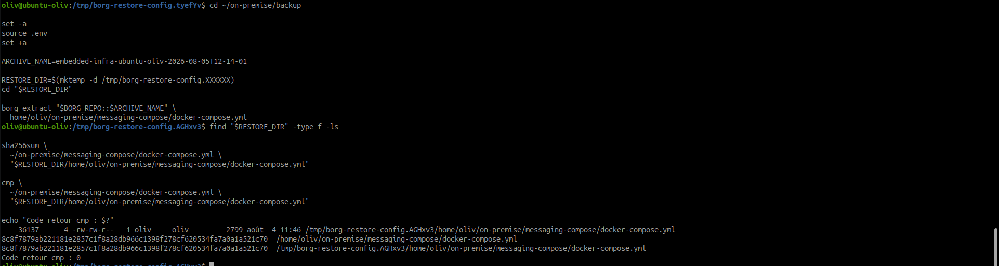
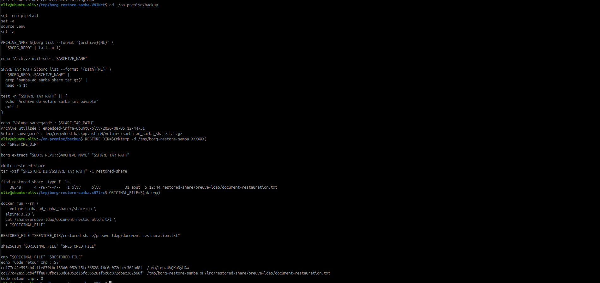
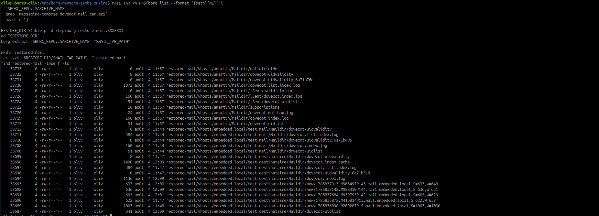
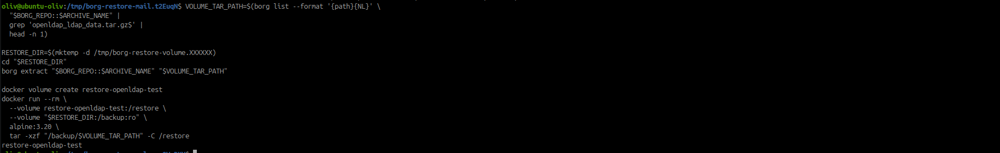

# Restaurer une sauvegarde BorgBackup

## Objectif

Restaurer un fichier, un document partagé, une boîte aux lettres ou un volume
Docker à partir des archives Borg, puis vérifier les données restaurées.

## 1. Sélectionner l'archive

```bash
cd ~/on-premise/backup
set -euo pipefail
set -a
source .env
set +a

borg check "$BORG_REPO"
borg list "$BORG_REPO"
```

Pour sélectionner la dernière archive encore présente dans le dépôt :

```bash
ARCHIVE_NAME=$(borg list --format '{archive}{NL}' "$BORG_REPO" | tail -n 1)
test -n "$ARCHIVE_NAME" || {
  echo "Aucune archive Borg disponible"
  exit 1
}

echo "Archive utilisée : $ARCHIVE_NAME"
borg list "$BORG_REPO::$ARCHIVE_NAME"
```

Les restaurations ont utilisé les archives `embedded-infra-ubuntu-oliv-2026-08-05T12-14-01`
et `embedded-infra-ubuntu-oliv-2026-08-05T12-44-31`.

## 2. Restaurer un fichier de configuration

Toujours restaurer dans un répertoire temporaire pour ne pas écraser la
production :

```bash
RESTORE_DIR=$(mktemp -d /tmp/borg-restore-config.XXXXXX)
cd "$RESTORE_DIR"

borg extract "$BORG_REPO::$ARCHIVE_NAME" \
  home/oliv/on-premise/messaging-compose/docker-compose.yml
```

Comparer le fichier restauré avec l'original :

```bash
sha256sum \
  /home/oliv/on-premise/messaging-compose/docker-compose.yml \
  "$RESTORE_DIR/home/oliv/on-premise/messaging-compose/docker-compose.yml"

cmp \
  /home/oliv/on-premise/messaging-compose/docker-compose.yml \
  "$RESTORE_DIR/home/oliv/on-premise/messaging-compose/docker-compose.yml"
echo "Code retour cmp : $?"
```

Résultat obtenu le 5 août 2026 : les empreintes SHA-256 sont identiques et
`cmp` retourne `0`. Le fichier restauré est conforme.



## 3. Restaurer un document Samba

```bash
SHARE_TAR_PATH=$(borg list --format '{path}{NL}' \
  "$BORG_REPO::$ARCHIVE_NAME" |
  grep 'samba-ad_samba_share.tar.gz$' |
  head -n 1 || true)

test -n "$SHARE_TAR_PATH" || {
  echo "Archive du volume Samba introuvable"
  exit 1
}

RESTORE_DIR=$(mktemp -d /tmp/borg-restore-samba.XXXXXX)
cd "$RESTORE_DIR"
borg extract "$BORG_REPO::$ARCHIVE_NAME" "$SHARE_TAR_PATH"

mkdir restored-share
tar -xzf "$RESTORE_DIR/$SHARE_TAR_PATH" -C restored-share
find restored-share -type f -ls
```

Le fichier de preuve est ensuite lu directement dans le volume actif, sans le
modifier, puis comparé au fichier restauré :

```bash
ORIGINAL_FILE=$(mktemp)

docker run --rm \
  --volume samba-ad_samba_share:/share:ro \
  alpine:3.20 \
  cat /share/preuve-ldap/document-restauration.txt \
  > "$ORIGINAL_FILE"

RESTORED_FILE="$RESTORE_DIR/restored-share/preuve-ldap/document-restauration.txt"

sha256sum "$ORIGINAL_FILE" "$RESTORED_FILE"
cmp "$ORIGINAL_FILE" "$RESTORED_FILE"
echo "Code retour cmp : $?"
```

Les deux empreintes sont identiques et `cmp` retourne `0` : le document Samba
est conforme à l'original.



## 4. Restaurer une boîte Dovecot

```bash
MAIL_TAR_PATH=$(borg list --format '{path}{NL}' \
  "$BORG_REPO::$ARCHIVE_NAME" |
  grep 'messaging-compose_dovecot_mail.tar.gz$' |
  head -n 1 || true)

test -n "$MAIL_TAR_PATH" || {
  echo "Archive du volume Dovecot introuvable"
  exit 1
}

RESTORE_DIR=$(mktemp -d /tmp/borg-restore-mail.XXXXXX)
cd "$RESTORE_DIR"
borg extract "$BORG_REPO::$ARCHIVE_NAME" "$MAIL_TAR_PATH"

mkdir restored-mail
tar -xzf "$RESTORE_DIR/$MAIL_TAR_PATH" -C restored-mail
find restored-mail -type f -ls
```

Après une restauration réelle, vérifier les propriétaires, exécuter
`doveadm force-resync` et tester la boîte par IMAP.

L'extraction a retrouvé les arborescences Maildir et les messages des comptes.
La réinjection dans le service et le test IMAP restent nécessaires avant une
remise en production.



## 5. Restaurer un volume Docker de test

```bash
VOLUME_TAR_PATH=$(borg list --format '{path}{NL}' \
  "$BORG_REPO::$ARCHIVE_NAME" |
  grep 'openldap_ldap_data.tar.gz$' |
  head -n 1 || true)

test -n "$VOLUME_TAR_PATH" || {
  echo "Archive du volume OpenLDAP introuvable"
  exit 1
}

RESTORE_DIR=$(mktemp -d /tmp/borg-restore-volume.XXXXXX)
cd "$RESTORE_DIR"
borg extract "$BORG_REPO::$ARCHIVE_NAME" "$VOLUME_TAR_PATH"

docker volume create restore-openldap-test
docker run --rm \
  --volume restore-openldap-test:/restore \
  --volume "$RESTORE_DIR:/backup:ro" \
  alpine:3.20 \
  tar -xzf "/backup/$VOLUME_TAR_PATH" -C /restore

docker run --rm \
  --volume restore-openldap-test:/restore:ro \
  alpine:3.20 \
  find /restore -maxdepth 2 -type f -ls
```

Le volume de test est isolé. Ne jamais extraire directement dans un volume de
production avant validation.



## 6. Problèmes rencontrés et corrections

| Problème observé | Cause | Correction appliquée |
|---|---|---|
| `Invalid location format: "/home/oliv/borg-infrastructure-backup::"` | `ARCHIVE_NAME` était vide et les variables de `.env` n'avaient pas été rechargées dans le terminal courant. | Revenir dans `~/on-premise/backup`, charger `.env`, définir ou détecter l'archive, puis afficher les deux valeurs avant l'extraction. |
| `Archive ...12-42-02 does not exist` | L'archive ciblée avait été supprimée par la politique de rétention après une nouvelle sauvegarde. | Consulter `borg list` et sélectionner dynamiquement la dernière archive encore présente. |
| `Empty strings are not accepted as paths` puis erreur `tar` | La recherche n'avait trouvé aucun fichier `.tar.gz`, mais les commandes suivantes avaient continué avec une variable vide. | Activer `set -euo pipefail` et contrôler chaque chemin avec `test -n ... || exit 1`. |
| Le premier volume Samba restauré ne contenait aucun fichier | Le volume actif ne contenait alors qu'un répertoire vide ; `diff=0` comparait donc deux états vides. | Ajouter un document de test, relancer la sauvegarde, restaurer la nouvelle archive et comparer le fichier avec SHA-256 et `cmp`. |

Ces erreurs n'ont pas modifié la production : toutes les extractions ont été
réalisées dans des répertoires temporaires ou des volumes Docker isolés.

## 7. Résultats

| Élément restauré | Archive utilisée | Résultat |
|---|---|---|
| `messaging-compose/docker-compose.yml` | `embedded-infra-ubuntu-oliv-2026-08-05T12-14-01` | Conforme, SHA-256 identiques et `cmp=0` |
| `preuve-ldap/document-restauration.txt` | `embedded-infra-ubuntu-oliv-2026-08-05T12-44-31` | Conforme, SHA-256 identiques et `cmp=0` |
| Volume Dovecot | `embedded-infra-ubuntu-oliv-2026-08-05T12-44-31` | Extraction Maildir réussie ; validation IMAP à réaliser avant réinjection |
| Volume OpenLDAP | `embedded-infra-ubuntu-oliv-2026-08-05T12-44-31` | Extraction réussie dans `restore-openldap-test` ; démarrage LDAP isolé à valider |

## Recommandations

- sélectionner une archive antérieure à la perte ;
- vérifier le dépôt avant extraction ;
- restaurer dans un emplacement isolé ;
- contrôler empreintes, propriétaires et permissions ;
- réaliser un test fonctionnel du service ;
- conserver les commandes et résultats dans le journal technique ;
- effectuer une nouvelle sauvegarde avant tout remplacement en production.
